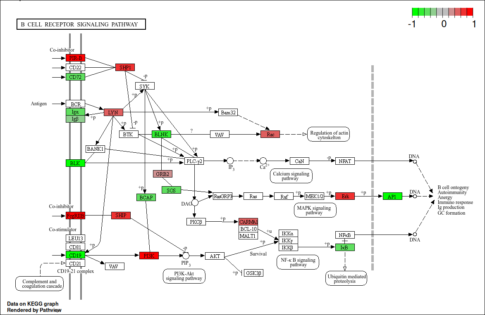
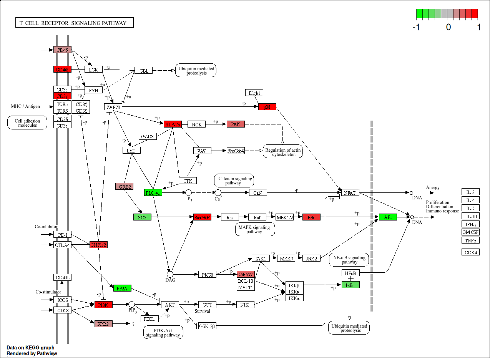
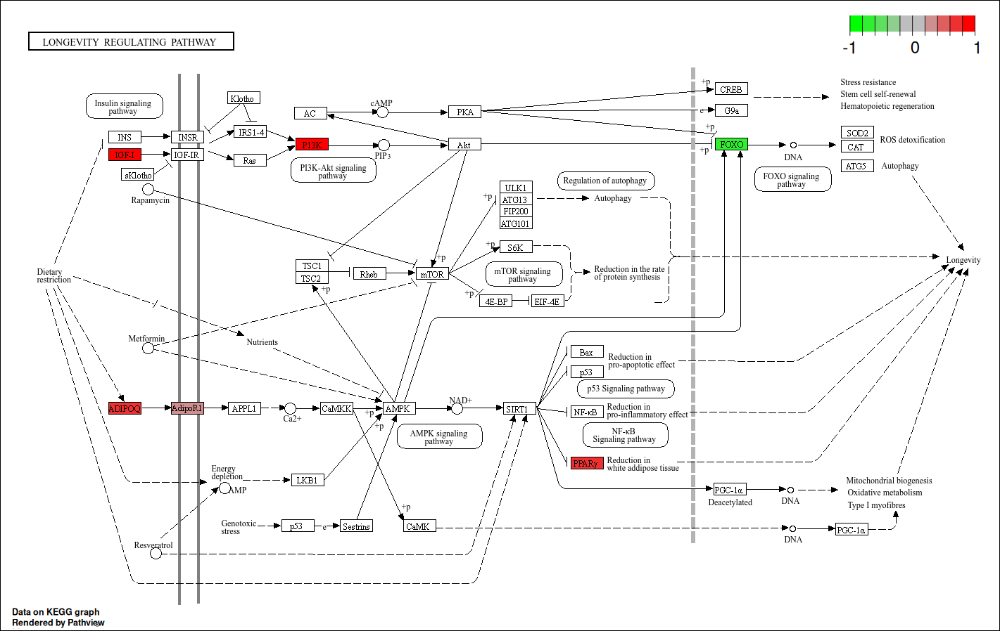
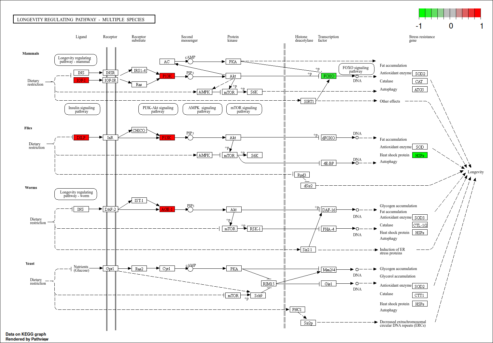
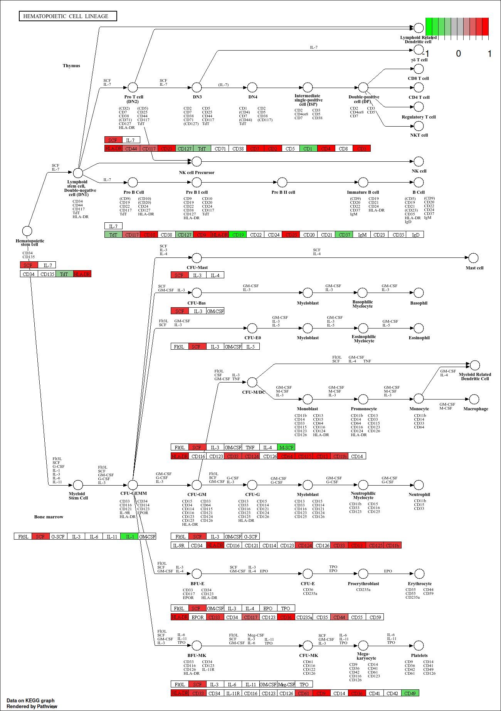

### **Workflow (Transcriptomics):** ###

Net zoals in het originele artikel beschreven was wordt read mapping uitgevoerd met het FASTQ bestand van elk van de samples.

Met het .SAM bestand dat verkregen is werd daarna met FeatureCounts en RSEM de gen expressie gekwantificeerd.
Deze read mapping was met STAR uitgevoerd maar wij gaan hier HISAT2 voor gebruiken omdat STAR verouderd is volgens het github repo.

FeatureCounts gebruikt namelijk het .SAM (of .BAM) bestand en telt hoeveel reads bij elke "feature" (gen/exon) horen.
RSEM kan hier ook voor gebruikt worden maar is complexer om te gebruiken dan FeatureCounts.

Dit kan daarna gevisualiseerd worden met R in een box-plot, viool-plot, heatmap, MA-plot etc.
Ook was er in het artikel gebruik gemaakt van "Cufflinks", deze gaan we vervangen door "StringTie".
Volgens de website van Cufflinks is StringTie accurater en veel efficiënter.

**De volgende R libraries en commandline tools zijn gebruikt voor de analyse:**
Alle geladen libraries zijn verkregen met het R commando: "(.packages())"

| Package | Version |
|---------|---------|
| PoiClaClu | 1.0.2.1 |
| conflicted | 1.2.0 |
| DEGreport | 1.40.1 |
| apeglm | 1.26.1 |
| pasilla | 1.32.0 |
| DEXSeq | 1.50.0 |
| RColorBrewer | 1.1.3 |
| AnnotationDbi | 1.66.0 |
| BiocParallel | 1.38.0 |
| pheatmap | 1.0.12 |
| scales | 1.3.0 |
| affy | 1.82.0 |
| gageData | 2.42.0 |
| gage | 2.54.0 |
| pathview | 1.44.0 |
| EnhancedVolcano | 1.22.0 |
| ggrepel | 0.9.6 |
| DESeq2 | 1.44.0 |
| SummarizedExperiment | 1.34.0 |
| MatrixGenerics | 1.16.0 |
| matrixStats | 1.4.1 |
| GenomicRanges | 1.56.2 |
| GenomeInfoDb | 1.40.1 |
| IRanges | 2.38.1 |
| S4Vectors | 0.42.1 |
| stats4 | 4.4.2 |
| GEOquery | 2.72.0 |
| Biobase | 2.64.0 |
| BiocGenerics | 0.50.0 |
| lubridate | 1.9.3 |
| forcats | 1.0.0 |
| stringr | 1.5.1 |
| dplyr | 1.1.4 |
| purrr | 1.0.2 |
| readr | 2.1.5 |
| tidyr | 1.3.1 |
| tibble | 3.2.1 |
| ggplot2 | 3.5.1 |
| tidyverse | 2.0.0 |
| stats | 4.4.2 |
| graphics | 4.4.2 |
| grDevices | 4.4.2 |
| utils | 4.4.2 |
| datasets | 4.4.2 |
| methods | 4.4.2 |
| base | 4.4.2 |

```{r, eval=T, warning=FALSE, message=FALSE , error=FALSE}

library(tidyverse)
library(GEOquery)
library(DESeq2)
library(EnhancedVolcano)

# Pathview:
library(pathview)
library(gage)
library(gageData)

library(affy)
library(scales)
library(pheatmap)

library(pasilla)
library(RColorBrewer)
library(apeglm)

library(DEGreport)
```

20-10-2024: 
### SRA's downloaden (Transcriptomics): ###

De SRA's van de RNA seq worden gedownload met het onderstaande stuk code.
De gebruikte accention list staat in de github repository.

De eerste stap is het downloaden van de genetische data die verkregen was door het sequencen van de samples.
Met behulp van de SRA run selector van NCBI is een selectie van SRA's gemaakt die gedownload moeten worden.

Een SRA (Sequence Read Archive) is een gecomprimeerd archief dat de sequencing reads bevat.
Om deze bestanden te downloaden wordt gebruikt gemaakt van "prefetch", deze commandline tool is onderdeel van de SRA toolkit.

In de volgende stap worden deze bestanden uitgepakt.

```{bash, eval=FALSE}

prefetch $(</students/2024-2025/Thema05/3dconformatieChromatine/transcriptomics/SRA/Acc_list_transcriptomics.txt) \
--output-directory "/students/2024-2025/Thema05/3dconformatieChromatine/transcriptomics/SRA/" --max-size 200G
```

### Gebruikte samples: ### 

Er zijn twee groepen, oude muizen van 100 tot 110 weken oud en jonge muizen van 8 tot 10 weken oud.
Deze twee groepen hebben allebei vier replicaten.

**Oude muizen: (Genotype: Rag2-/-)**\

SRR21754423\
SRR21754422\
SRR21754421\
SRR21754420\

**Jonge muizen: (Genotype: Rag2-/-)**\
SRR21754408\
SRR21754417\
SRR21754418\
SRR21754419\

Deze bovenstaande samples zijn allemaal verkregen met een Illumina NextSeq 500.

Test:

```{r, eval=FALSE}


gse <- getGEO(GEO = "GSE214438")
# Combine the condition with a sample number and replicate number
Condition = paste(rep(gse[[1]]@phenoData@data$`genotype/variation:ch1`, each = 2),
                  rep(1:3, each = 2),
                  paste0('r', rep(1:2, 9)), sep = '_')
run_info <- read.csv(file = "/home/floris/Documenten/git_repo/Genomics_transcriptomics_analysis/analysis/Floris/SraRunTable.csv")
setup <- cbind(run_info %>% dplyr::select(Run, Experiment), Condition)
pander(setup)

```

**.SRA bestanden naar .FASTQ omzetten:**\
De .SRA's zijn nu gedownload maar moeten nog omgezet worden naar een bestandstype waar de volgende tool wat mee kan, een FASTQ bestand.
Hier wordt fasterq-dump voor gebruikt: Met behulp van fasterq-dump worden de .SRA bestanden uitgepakt.

fasterq-dump maakt ook onderdeel uit van de SRA toolkit en haalt de data uit het .SRA archief naar het FASTQ format.

Een FASTQ bestand bevat tekst met de sequence data, de reads en ook een bijbehorende kwaliteitsscore terwijl een fasta bestand enkel de sequentie data met een header (of meerdere headers + bijbehorende sequenties) bevat.
Deze score wordt aangegeven met een ASCII karakter.

Een FASTQ bestand heeft de volgende indeling:

Een header die met "\@" begint gevolgd door een sequentie ID en optioneel een beschrijving wat het bestand bevat.
Daar onder zitten de sequentie letters.

En daar onder een regel met een "+" karakter.
Hier onder staat de kwaliteitsscore, deze gaat van ASCII 33 ("!" teken), laagste kwaliteit tot ASCII 126 ("\~" teken).

De kwaliteitsscore wordt ook wel Phred score genoemd.
Deze score is logaritmisch gerelateerd aan de waarschijnlijkheid dat de "base call" verkeerd is.
Q = -log(E) waarbij Q de phred score is en E de waarschijnlijkheid van verkeerde base call.

Phred-33 is het meest gebruikt maar Phred-64 bestaat ook.
Het verschil is dat Phred-33 ge-encodeerd is met met ASCII 33 (!) tot ASCII 126 (\~) terwijl Phred-64 van ASCII 64 (\@) tot ASCII 126 gaat.

Met de formule P = 10\^(-Q/10) kan de kans uitgerekend worden dat de base-call onjuist is. (P = probability, waarschijnlijkheid)

Met een phred score van 40 is dit: P = 10\^(-40/10) = 0.0001% In andere woorden: De kans is 100-0.0001 = 99.9999% dat het wel klopt.

Bron: <https://gatk.broadinstitute.org/hc/en-us/articles/360035531872-Phred-scaled-quality-scores>

Hier worden de bestanden uitgepakt op assemblix in onze gedeelde directory:
```{bash, eval=FALSE}
cat /students/2024-2025/Thema05/3dconformatieChromatine/transcriptomics/SRA/Acc_list_transcriptomics.txt | \
  parallel fasterq-dump -O /students/2024-2025/Thema05/3dconformatieChromatine/transcriptomics/SRA/FASTQ {}
```

### Kwaliteitscontrole met fastqc:

Voor het uitvoeren van verdere stappen moet de kwaliteit van de reads eerst bepaald worden.
Hiervoor is fastqc gebruikt, deze software leest de .fastq bestanden en maakt een .html webpagina met een samenvatting van enkele datapunten:

De per base sequentie kwaliteit is een grafiek met boxplots van de kwaliteit van de reads voor elke positie in het fastq bestand.
In deze grafiek worden drie verschillende kwaliteits "gebieden" aangegeven met de kleuren: groen (\>28), geel (20-28) en rood (\< 20).
De nummers verwijzen hier weer naar de phed score van de base-call.

De per base sequence content, een plot dat de proportie van nucleotiden weergeeft als percentage.

Per base GC content weergeeft het GC percentage voor elke positie.
Tussen guanine en cytosine zit een drievoudige binding in tegenstelling tot de tweevoudige binding tussen adenine en tymine.
En het kan vergeleken worden met het GC percentage dat bekend is van het referentiegenoom om dit te vergelijken met de zelf verkregen resultaten.
Vergelijkbaar hiermee is de per sequence GC content wat zoals de naam doet vermoeden het zelfde doet maar dan voor elke sequentie i.p.v. voor elke base.
Normaal gesproken hoort dit normaal verdeeld te zijn.

Per base N content laat zien hoevaak de sequence machine niet in staat was om met genoeg zekerheid een base te callen, er wordt dan een "N" opgegeven.
Fastqc geeft een waarschuwing voor deze module als het percentage N content boven de 5% is.

Voor het trimmen: Het volgende commando is uitgevoerd in de FASTQ/ directory.

```{bash, eval=FALSE}
cat /students/2024-2025/Thema05/3dconformatieChromatine/transcriptomics/SRA/Acc_list_transcriptomics.txt | parallel \
fastqc -o /students/2024-2025/Thema05/3dconformatieChromatine/transcriptomics/fastqc_output/voor_trimmen/ {}_1.fastq {}_2.fastq 
```

Vervolgens met "multiqc ." in de output directory een multiqc rapport gemaakt van de resultaten van fastqc.

### Trimmen met Trimmomatic:

De verkregen sequence reads, korte sequenties van, in ons geval 150 bp die corresponderen met een deel van een DNA sequentie.
Wat gesequenced wordt is nog steeds DNA ondanks dat het een expressie analyse is.
Het RNA moet namelijk eerst omgezet worden naar cDNA (copy-DNA).
Dit gebeurt omdat DNA veel stabieler is dan RNA en minder gevoelig is voor enzymatische degradatie door RNases, deze enzymen zijn bijna overal (de handen van mensen etc.)

Het genoom kan niet in zijn geheel gelezen worden door technische beperkingen van de gebruikte machines (Illumina).
Naarmate de read langer wordt is de kans dat er fouten gemaakt worden groter, daarom, mits er genoeg reads zijn die het laatste stuk bevatten, kan er een stuk afgeknipt worden.
Ook moeten de adapters verwijderd worden.

Adapters zijn korte stukken DNA (ongeveer 80bp) die aan DNA linkers die op het oppervlak van de flow cells vast zitten.
bron: <https://www.lubio.ch/blog/ngs-adapters>

Voor het trimmen maken we gebruik van Trimmomatic.
In het onderstaande code blok staan de commando's die uitgevoerd worden.
TrimmomaticPE is de paired-end versie van Trimmomatic.
Paired end betekend dat er twee reads zijn die in tegengestelde richting gelezen zijn.

Met -threads 16 worden het aantal treads gespecificeerd, hierdoor kunnen er meerdere bewerkingen parallel uitegevoerd worden.

**De argumenten die we gebruiken voor Trimmomatic zijn:**

**MINLIN:40** Dit betekend dat de minimale lengte van de reads 40 baseparen betreft.
**SLINDINGWINDOW:4:20** Het eerste nummer 4 specificeert de grootte van de sliding window en het tweede, 20 is de vereiste gemiddelde read kwaliteit binnen het window van 4 basen.

Een sliding window is dat er steeds, in dit geval 4 basen bekeken worden en dat dan een opgeschoven wordt enzovoort.

**ILLUMINACLIP** is het path naar een bestand dat adapter sequenties bevat voor Illumina adapters.
**De gebruikte adapter:** TruSeq3-SE.fa:2:30:10 De 2:30:10 betekenen het volgende: 2 is de "seed mismatch", het aantal mismatches dat toegestaan is in een sequentie die een adapter kan zijn.
30 is de "palindrome clip threshold en 10 is de "simple clip threshold", specificeert hoe accuraat de match tussen de adapter sequentie en de mogelijke adapter in de read.

Bron: <http://www.usadellab.org/cms/uploads/supplementary/Trimmomatic/TrimmomaticManual_V0.32.pdf>

```{bash, eval=FALSE}
cat /students/2024-2025/Thema05/3dconformatieChromatine/transcriptomics/SRA/Acc_list_transcriptomics.txt | parallel \
'TrimmomaticPE -threads 80 ' \
    '/students/2024-2025/Thema05/3dconformatieChromatine/transcriptomics/FASTQ/{}_1.fastq' \
    '/students/2024-2025/Thema05/3dconformatieChromatine/transcriptomics/FASTQ/{}_2.fastq' \
    '/students/2024-2025/Thema05/3dconformatieChromatine/transcriptomics/trimmomatic_output/paired/{}_forward_paired.fastq' \
    '/students/2024-2025/Thema05/3dconformatieChromatine/transcriptomics/trimmomatic_output/unpaired/{}_forward_unpaired.fastq' \
    '/students/2024-2025/Thema05/3dconformatieChromatine/transcriptomics/trimmomatic_output/paired/{}_rev_paired.fastq' \
    '/students/2024-2025/Thema05/3dconformatieChromatine/transcriptomics/trimmomatic_output/unpaired/{}_rev_unpaired.fastq' \
    'ILLUMINACLIP:/students/2024-2025/Thema05/3dconformatieChromatine/Trimmomatic/Trimmomatic-0.39/adapters/TruSeq3-SE.fa:2:30:10' \
    'MINLEN:40 ' \
    'SLIDINGWINDOW:4:20'
```

### Kwaliteitscontrole met fastqc / multiqc: ###

Na het trimmen: Het volgende commando is uitgevoerd in de trimmomatic_output/paired/ directory.

```{bash, eval=FALSE}
cat /students/2024-2025/Thema05/3dconformatieChromatine/transcriptomics/SRA/Acc_list_transcriptomics.txt | parallel \
fastqc -o /students/2024-2025/Thema05/3dconformatieChromatine/transcriptomics/fastqc_output/na_trimmen/ {}_forward_paired.fastq {}_rev_paired.fastq 
```

Vervolgens weer met "multiqc ." in de output directory een multiqc rapport gemaakt van de resultaten van fastqc.


De kwaliteit van de data lijkt voldoende te zijn, voor meer informatie zie logboek Ivar, Storm en Jarno.

### Indexeren van referentiegenoom:

Met enkel een fastq bestand met reads is nog niet duidelijk waar in het genoom van het organisme deze reads kwamen.
Met read mapping worden de reads vergeleken met een bekend genoom, in dit geval het mm39 muis referentiegenoom en worden de reads er tegen aan gelegd zodat hun locatie in het genoom bekend wordt.

Omdat het programma dat gebruikt gaat worden voor het alignen, HIsat2, een geïndexeerde versie van het referentiegenoom nodig heeft moet deze eerst gemaakt worden.
Dit kan gedaan worden met Hisat2 build.

Het gebruikte referentie genoom is mm39 (GCF_000001635.27).
In het bestand met het referentiegenoom dat gedownload is (<https://www.ncbi.nlm.nih.gov/datasets/genome/GCF_000001635.27/>) Zijn twee referentiegenomen aanwezig: GCF_000001635.27 en GCA_000001635.9/.
Het verschil is dat GCF van Refseq is en GCA van GeneBank.

<https://www.ebi.ac.uk/training/online/courses/functional-genomics-ii-common-technologies-and-data-analysis-methods/rna-sequencing/performing-a-rna-seq-experiment/data-analysis/read-mapping-or-alignment/>

bron: <https://www.ncbi.nlm.nih.gov/pmc/articles/PMC3375638/>

In de onderstaande code chunk wordt het geïndexeerde muisgenoom "hisat2_index" genoemd.
Daarna worden twee samples (forward read en reverse read) ge-aligned met het zojuist verkregen geïndexeerde referentiegenoom.
Deze twee bewerkingen worden beiden met HIsat2 uitgevoerd.

```{bash, eval=FALSE}
hisat2-build -p 60 /students/2024-2025/Thema05/3dconformatieChromatine/Mapping_ref/ncbi_dataset/ncbi_dataset/data/GCF_000001635.27/GCF_000001635.27_GRCm39_genomic.fna hisat2_index

```

Read mapping:

```{bash, eval=FALSE}
cat /students/2024-2025/Thema05/3dconformatieChromatine/transcriptomics/SRA/Acc_list_transcriptomics.txt | parallel \
hisat2 -p 80 -x hisat2_index -1 /students/2024-2025/Thema05/3dconformatieChromatine/transcriptomics/trimmomatic_output/paired/{}_forward_paired.fastq -2 /students/2024-2025/Thema05/3dconformatieChromatine/transcriptomics/trimmomatic_output/paired/{}_rev_paired.fastq -S /students/2024-2025/Thema05/3dconformatieChromatine/transcriptomics/hisat2_mapped/{}.sam &
```

### Sorteren en indexeren van .sam

De volgende serie bewerkingen maakt gebruik van Samtools over verschillende handelingen uit te voeren zoals: omzetten naar .bam, sorteren, duplicaten verwijderen en indexeren en zal hieronder uitgelegd worden:

Na de vorige readmapping stap zijn er .SAM (Sequence alignment map) bestanden verkregen, dit is een tekst gebaseerde manier om sequenties die aligned zijn tegen een referentie sequentie op te slaan.
Een .sam bestand bestaat uit een header en een alignment deel.

bron: <https://gatk.broadinstitute.org/hc/en-us/articles/360035890791-SAM-or-BAM-or-CRAM-Mapped-sequence-data-formats>

Om al deze bewerkingen uit te voeren wordt gebruik gemaakt van samtools (versie 1.16.1).
Dit is een collectie tools om met high-throughput sequence data te werken.

Omzetten van .sam naar .bam met behulp van samtools view:

```{bash, eval=FALSE}

cat /students/2024-2025/Thema05/3dconformatieChromatine/transcriptomics/SRA/Acc_list_transcriptomics.txt | parallel \
'samtools view -@40 -b /students/2024-2025/Thema05/3dconformatieChromatine/transcriptomics/hisat2_mapped/{}.sam > /students/2024-2025/Thema05/3dconformatieChromatine/transcriptomics/samtools_output/{}.bam' &

```

Index maken: Na de index stap uit gevoerd te hebben is er ook een .bai bestand, dit is een index voor het .bam bestand waardoor andere tools sneller met het .bam bestand kunnen werken.

```{bash, eval=FALSE}
cat /students/2024-2025/Thema05/3dconformatieChromatine/transcriptomics/SRA/Acc_list_transcriptomics.txt | parallel \
'samtools index -@80 /students/2024-2025/Thema05/3dconformatieChromatine/transcriptomics/samtools_output/sorted_{}.bam'
  
```

Sorteren op queryname voor fixmate: Met samtools sort -n worden de .bam bestanden gesorteerd op read naam (De QNAME kolom in het bestand).

```{bash, eval=FALSE}
cat /students/2024-2025/Thema05/3dconformatieChromatine/transcriptomics/SRA/Acc_list_transcriptomics.txt | parallel \
'samtools sort -@80 -O BAM -n  /students/2024-2025/Thema05/3dconformatieChromatine/transcriptomics/samtools_output/{}.bam -o /students/2024-2025/Thema05/3dconformatieChromatine/transcriptomics/samtools_output/sorted_{}.bam'

```

Samtools fixmate: "fixmate -m" voegt mate score tags toe die gebruikt worden door markdup om de beste reads te selecteren om te houden.
De reden dat fixmate nodig is, is dat reads verkregen met paraired-end sequencing niet altijd een "mate" ofterwijl een read in de tegengestelde richting hebben.
In het geval dat een een read geen mate of een mate die niet voldoet aan de eisen, moet deze verwijderd worden.
En verwijderen is hier gemarkeerd worden als secondaire alignement (niet gemapte reads).

Met "-\@" wordt het aantal threads gespecificeerd dat de computer moet gebruiken voor dit commando.

Bron: <http://www.htslib.org/doc/samtools-markdup.html>

```{bash, eval=FALSE}
cat /students/2024-2025/Thema05/3dconformatieChromatine/transcriptomics/SRA/Acc_list_transcriptomics.txt | parallel \
'samtools fixmate -m -@80 /students/2024-2025/Thema05/3dconformatieChromatine/transcriptomics/samtools_output/sorted_{}.bam /students/2024-2025/Thema05/3dconformatieChromatine/transcriptomics/samtools_output/fixed_mates_sorted_{}.bam'
```

Sorteren op coördinaten, dit is de standaard dus hoeft er geen argument voor meegegeven worden.
Dit betekend dat de reads gesorteerd worden op basis van waar ze voorkomen op het referentiegenoom.
Bij samtools sort moet het aantal treads met -@n aangegeven worden.
Deze stap moet uitgevoerd worden voordat samtools markdup kan werken.

```{bash, eval=FALSE}
cat /students/2024-2025/Thema05/3dconformatieChromatine/transcriptomics/SRA/Acc_list_transcriptomics.txt | parallel \
'samtools sort -@80 /students/2024-2025/Thema05/3dconformatieChromatine/transcriptomics/samtools_output/fixed_mates_sorted_{}.bam -o /students/2024-2025/Thema05/3dconformatieChromatine/transcriptomics/samtools_output/fixed_mates_sorted_coords_{}.bam'
```

Duplicaten verwijderen: Met samtools markdup worden duplicaten gemarkeerd.
Met het "-r" argument worden deze verwijderd en met "-s" worden statistieken over de data en uitgevoerde handelingen.
Na het -s argument moet nog wel een bestandspad opgegeven worden waar het rapport opgeslagen moet worden, het genereren van dit raport is optioneel.

```{bash, eval=FALSE}
cat /students/2024-2025/Thema05/3dconformatieChromatine/transcriptomics/SRA/Acc_list_transcriptomics.txt | parallel \
'samtools markdup -@80 -r -s /students/2024-2025/Thema05/3dconformatieChromatine/transcriptomics/samtools_output/fixed_mates_sorted_coords_{}.bam /students/2024-2025/Thema05/3dconformatieChromatine/transcriptomics/samtools_output/dedup_{}.bam'
```

13 oktober 2024 **FeatureCounts:**

Om te tellen hoeveel reads er voor elke "feature" is, deze features kunnen bijvoorbeeld genen of exonen zijn.
Het doel van deze analyse is om de gen expressie te kwantificeren.
Er kan nu tussen de samples een vergelijking gemaakt worden in welk organisme de expressie het hoogst is.

bron: <https://subread.sourceforge.net/featureCounts.html> Er zijn een aantal argumenten meegegeven aan featureCounts: -T 64 was het maximale aantal threads dat het programma kan gebruiken.
-p betekend dat de input data paired-end reads zijn.
--countReadPairs -B hoort is optie voor paired-end reads en specificeert dat enkel reads waar een forward en een reverse read van is meegeteld mogen worden.
-g gene_id is het attribuut type waarop de features in groepen op worden ingedeeld.
-a is het annotatiebestand.

```{bash, eval=FALSE}

cat /students/2024-2025/Thema05/3dconformatieChromatine/transcriptomics/SRA/Acc_list_transcriptomics.txt | parallel \
'featureCounts -T 64 -p --countReadPairs -B -t exon -g gene_id -a /students/2024-2025/Thema05/3dconformatieChromatine/snpEff/snpEff/data/mm39/genes.gtf -o /students/2024-2025/Thema05/3dconformatieChromatine/transcriptomics/featurecounts_output/{}_counts.txt /students/2024-2025/Thema05/3dconformatieChromatine/transcriptomics/samtools_output/dedup_{}.bam'

# Test:
featureCounts -T 64 -p --countReadPairs -a /students/2024-2025/Thema05/3dconformatieChromatine/snpEff/snpEff/data/mm39/genes.gtf -o /students/2024-2025/Thema05/3dconformatieChromatine/transcriptomics/featurecounts_output/count.out /students/2024-2025/Thema05/3dconformatieChromatine/transcriptomics/samtools_output/dedup_*

```

**Resultaten van FeatureCounts:**

| Assigned | 7,478,275 | 11,519,033 | 401,919 | 1,798,783 | 1,034,206 | 1,815,685 | 2,123,117 | 1,559,965 |
|-------:|-------:|-------:|-------:|-------:|-------:|-------:|-------:|-------:|
| Unassigned_Unmapped | 101,569 | 91,957 | 303,147 | 501,918 | 1,900,765 | 2,006,366 | 2,305,552 | 3,153,700 |
| Unassigned_Read_Type | 0 | 0 | 0 | 0 | 0 | 0 | 0 | 0 |
| Unassigned_Singleton | 0 | 0 | 0 | 0 | 0 | 0 | 0 | 0 |
| Unassigned_MappingQuality | 0 | 0 | 0 | 0 | 0 | 0 | 0 | 0 |
| Unassigned_Chimera | 0 | 0 | 0 | 0 | 0 | 0 | 0 | 0 |
| Unassigned_FragmentLength | 0 | 0 | 0 | 0 | 0 | 0 | 0 | 0 |
| Unassigned_Duplicate | 0 | 0 | 0 | 0 | 0 | 0 | 0 | 0 |
| Unassigned_MultiMapping | 1,278,184 | 1,278,667 | 1,423,585 | 2,444,342 | 1,728,738 | 1,718,869 | 1,868,849 | 1,973,576 |
| Unassigned_Secondary | 0 | 0 | 0 | 0 | 0 | 0 | 0 | 0 |
| Unassigned_NonSplit | 0 | 0 | 0 | 0 | 0 | 0 | 0 | 0 |
| Unassigned_NoFeatures | 723,982 | 999,001 | 586,719 | 1,284,576 | 424,925 | 574,504 | 569,811 | 744,298 |
| Unassigned_Overlapping_Length | 0 | 0 | 0 | 0 | 0 | 0 | 0 | 0 |
| Unassigned_Ambiguity | 30,575 | 32,598 | 31,923 | 17,598 | 12,406 | 15,276 | 18,939 | 14,783 |

### Visualisatie van featurecounts

Het van FeatureCounts verkregen .csv bestand kan nu als tabel in R geladen worden.
De namen van de samples zijn erg lang en bevatten het gehele pad naar de bestanden, daarom worden de kolomen van de samples met de onderstaande code hernoemd naar de SSR namen.

```{r, eval=TRUE, warning=FALSE}

#counts <- read.delim(file = "/home/floris/Documenten/Data_set/PRJNA885415/Transcriptomics/featurecounts/featurecounts_output.csv", header = F)

counts = read.csv( "/home/floris/Documenten/Data_set/PRJNA885415/Transcriptomics/featurecounts/featurecounts_output.csv", row.names = "Geneid", sep="", head=T, skip=1,)

# Geef namen aan de kolomen
names(counts) <- c("Chr","Start","End","Strand","Length","SRR21754408","SRR21754417","SRR21754418","SRR21754419","SRR21754420","SRR21754421","SRR21754422","SRR21754423")

# conflict_prefer("select", "dplyr") is nodig omdat er blijkbaar twee libraries zijn die de functie "select" aanbieden.
library(conflicted)
conflict_prefer("select", "dplyr")

counts_df <- counts %>% 
  select(-c(Chr, Start, End, Strand, Length))


#counts <- subset(counts, row)
#counts <- counts[-c(1,2), ]

head(counts_df)
```

**Dataframe voor DESeq2** Om later DESeq2 uit te voeren moet de data in een beplaald formaat staan.
Het dataframe coldata bevat voor alle samples wat hun "treatment" is, in het geval van dit ondezoek zijn er twee groepen: Jonge muizen en oude muizen.
Hiertussen moet dus een expressie verschil aangetoond worden, of juist afwezigheid van verschil als er geen verschil in expressie tussen de twee groepen is.

```{r, eval=T}
colnames <- c("Groep")

coldata <- data.frame(c("SRR21754408","SRR21754417","SRR21754418","SRR21754419","SRR21754420","SRR21754421","SRR21754422","SRR21754423"), c("Jong","Jong","Jong","Jong","Oud","Oud","Oud","Oud"), row.names = 1)
colnames(coldata) <- colnames

coldata$Groep <- factor(coldata$Groep)

```

### **Readcount:**\*

Op de serie onderstaande boxplots zijn aantallen reads afgebeeld per sample.
Om met ggplot hier een mooie grafiek van te maken moest pivot_longer gebruikt worden om een kolom te maken met samples en een kolom met read aantallen.

```{r reads per sample boxplot, eval=T}

counts_long <- counts_df %>%
  pivot_longer(cols = everything(), 
               names_to = "sample_naam", 
               values_to = "reads")

ggplot(data = counts_long, aes(x = sample_naam, y = reads)) +
  geom_boxplot() + 
  xlab(" ") +
  ylab("Aantal reads:") +
  theme(axis.text.x = element_text(angle = 90, vjust = 0.5, hjust=1))

```

Op het bovenstaande readcount-plot lijkt er een uitschieter te zijn in sample SRR21754419.

In het volgende codeblok worden de kolommen geselecteerd waarin de jonge en oude muizen staan.
Deze indices worden vervolgens gebruikt om te achterhalen hoeveel rijen (genen) er zijn met een readcount boven de 0.

```{r, eval=T}

oude_muizen <- counts_df[,c(5:8)]

jonge_muizen <- counts_df[,c(1:4)]

```

Maak dataframes met coverage \> 0 voor beide jonge en oude muizen.
Deze twee df's worden straks gebruikt om twee grafieken mee te maken.

```{r, eval=T}

conflicts_prefer(dplyr::count) # Omdat er twee libraries waren die "count" aanbieden. Die van dplyr moet gebruikt worden. 

# DF met alle rijen waarbij de jonge muizen een coverage hoger dan 0 hebben voor alle samples:
jonge_muizen_df <- counts[which(counts$SRR21754408 > 0 & counts$SRR21754418 > 0 & counts$SRR21754419 & counts$SRR21754417), ]

# DF met alle rijen waarbij de oude muizen een coverage hoger dan 0 hebben voor alle samples:
oude_muizen_df <- counts[which(counts$SRR21754420 > 0 & counts$SRR21754421 > 0 & counts$SRR21754422 & counts$SRR21754423 > 0), ]

```

In het volgende stuk code is een grafiek weergegeven van alle genen met een hogere expressie dan 0 voor alle jonge muizen.

```{r lengte van genen jong , eval=T}


ggplot(data = jonge_muizen_df, mapping = aes(x = row.names(jonge_muizen_df) , y = Length)) +
  geom_bar(stat = "identity") + 
  xlab(" ") + 
  ylab("Gene length: (bp)") +
  theme(axis.text.x = element_blank())

```

In het volgende stuk code is een grafiek weergegeven van alle genen met een hogere expressie dan 0 voor alle oude muizen.

```{r lengte van genen oud, eval=T}


ggplot(data = oude_muizen_df, mapping = aes(x = row.names(oude_muizen_df) , y = Length)) +
  geom_bar(stat = "identity") + 
  xlab(" ") + 
  ylab("Gene length: (bp)") +
  theme(axis.text.x = element_blank())

```

De gennamen passen niet op de x-as omdat het er te veel zijn, deze plots zijn enkel om een globaal overzicht te geven van de gen lengtes.

```{r, eval=T}

myColors <- hue_pal()(4)

## Plot the log2-transformed data with a 0.1 pseudocount
plotDensity(log2(counts_df + 0.1), col=rep(myColors, each=3),
            lty=c(1:ncol(counts_df)), xlab='Log2(count)',
            main='Expression Distribution')

## Add a legend and vertical line
legend('topright', names(counts_df), lty=c(1:ncol(counts_df)),
       col=rep(myColors, each=3))
abline(v=-1.5, lwd=1, col='red', lty=2)
```

Op het bovenstaande dichtheidsplot is een grote piek te zien bij \~3.3 omdat het logaritme log2(0.1) van alle nulwaarden genomen wordt.
De piek bestaat dus uit inactieve genen.
Verder lijkt SRR211754418 op het oog meer inactieve genen te hebben dan de overige samples omdat de lijn van dit sample hoog boven de anderen uitstijgt.

Het aantal genen met een coverage van meer dan 0 van de jonge muizen: 14315

```{r, eval=T}
length(which(counts$SRR21754408 > 0 & counts$SRR21754418 > 0 & counts$SRR21754419 > 0 & counts$SRR21754417 > 0))

```

Het aantal genen met een coverage van meer dan 0 van de oude muizen: 15247

```{r, eval=T}
length(which(counts$SRR21754420 > 0 & counts$SRR21754421 > 0 & counts$SRR21754422 & counts$SRR21754423 > 0))
```

### Differential expression met DESeq2

Nu het aantal reads voor alle genen tussen alle samples bekend is gemaakt door FeatureCounts moet deze data verwerkt worden om te achterhalen of er een statistisch significant verschil in genexpressie tussen de jonge en oude muizen.
Om dit te doen maken we gebruik van DESeq2, dit is library voor R die onderdeel uitmaakt van Bioconductor, een grote repository van bio-informatica gerelateerde software.
DESeq2 voert een differentiële analyse van hogeredimentionele count data.
Vervolgens wordt empirische bayes methodes toegepast.

### DESeq2

**Statistische bewerkingen die door DESeq2 uitgevoerd worden:**\

Een van de tests zorgt er voor dat er rekening gehouden wordt met de false discovery rate (FDR).
Hiervoor is de Benjamini Hockberg compensatie uitgevoerd om hier rekening mee te houden.
De false discovery rate is het aantal genen in dit geval die ondanks dat ze niet echt differentialy expressed zijn toch zo lijken.
Dit zijn dus false positieven.
Wanneer de p-waarde bijvoorbeeld 0.01 is en er 4000 genen zijn, zijn er 40 false positieven bij.
De kans is namelijk 1% met een p-waarde van 0.01 of lager.
Als er geen rekening gehouden zou worden met de false discovery rate zou het betekenen dat wanneer er veel individuele tests uitgevoerd worden (bijvoorbeeld t-tests), er ook veel false positieven bij zitten omdat de kas daarop groter wordt hoe meer tests uitgevoerd worden.

levels(coldata\$Groep) geeft "Jong" als eerste factor, dat betekend dat up- en downregulatie tenopzichte van de jonge groep bepaald zal worden.
Dit is belangrijk voor de interpretatie van onderandere de pathway analyse later.

```{r deseq2 test, eval=T, warning=F, message=FALSE}

dds <- DESeqDataSetFromMatrix(countData = counts_df,
                              colData = coldata,
                              design= ~ Groep)

dds <- DESeq(dds)

resultsNames(dds) # De naam is: Groep_Oud_vs_Jong

res <- results(dds, name="Groep_Oud_vs_Jong")

# Gebruikt lfcschrink om de data met Log2 te transformeren:
res <- lfcShrink(dds, coef="Groep_Oud_vs_Jong", type="apeglm")

summary(res)
```

De output van de DESeq(dds) geeft als "intercept" Groep_Oud_vs_Jong wat betekend dat de twee leeftijdsgroepen met elkaar vergeleken worden.
Dit was ook opgegeven bij het maken van het DESeqDataSet object, design als functie van groep.
LFC is Log fold change dit is op een logaritmische schaal gemeten en laat het expressie verschil zien tussen de groepen.
LFC \> 0 (up) zijn de genen die in de oude muizengroep hoger tot expressie kwamen dat in de jonge muizen groep en LFC \< 0 (down) is het tegenovergestelde, de genen met een lagere expressie dan in de jonge groep.

De betekenis van de kolommen van het resultaat van DESeq2:

```{r, eval=T}
mcols(res)$description
```

### Visualisatie van Differentially expressed genes:

**MA-Plot** Een MA-plot visualiseert de relatie tussen de log ratio en de gemiddelde expressie waarden.
Op de x-as wordt het gemiddelde expressie level voor alle samples (van beide groepen) weergeven.
deze counts zijn eerst genormaliseerd.
Een van de redenen dat normalisatie nodig is, is omdat grote genen meer kans hebben dat er meer reads binnen vallen.
Het MA-plot geeft dus de globale verdeling weer van genexpressie.
Het onderstaande MA-plot werkt met data die met lfcSchrink() getransformeerd is.

```{r, eval=T}
plotMA(res, ylim=c(-2,2))
```

**Visualisatie van het gen met de kleinste p-waarde:**

Het gen met de kleinste p-waarde is Gpnmb, dit is een transmembraan glycoproteïne die betrokken is bij reguleren van lysosomale integriteit en de levensduur van senecent cells, dit zijn cellen die niet meer actief delen maar niet dood zijn.
Deze functie kan het expressieverschil tussen de jonge en oude muizen verklaren.

bron: <https://pubmed.ncbi.nlm.nih.gov/35444208/>

Daarnaast wordt de Gpnmb concentratie in mensen gebruikt als biomarker voor ouderdom, net als in het onderstaande plot is de concentratie in oudere mensen significant hoger dan die van jonge mensen.
Ondanks dat het onderstaande onderzoek over mensen gaat is het gen een ortholoog van die van muizen, de functies zijn ook overeenkomend dus zou het mogelijk aangenomen kunnen worden dat een hogere expressie van dit gen in muizen ook als biomarker voor ouderdom gebruikt kan worden zoals dat ook in mensen gedaan wordt.
Bron: <https://www.sciencedirect.com/science/article/pii/S2405844024126059>

```{r, eval=T}
plotCounts(dds, gene=which.min(res$padj), intgroup="Groep")
```

Readcount voor Gpnmb:

```{r min p waarde gene, eval=T}
counts_df[which.min(res$padj),]
```

### Plot van relevante genen:

Naast het gen met de laagste p-waarde zijn er nog enkele genen die intersant zijn door hun functie en omdat ze het onderzoek gebruikt waren waar dit onderzoek op gebaseerd is.
De volgende genen zijn afgebeeld: Efb1, pax5 en wapl

Het gen Ebf1 (Early B-cell factor 1) is een gen dat bijdraagt aan de differentiatie van voorloper b cellen.

De verandering van Ebf1 tussen jonge en oude muizen komt overeen met de verandering die waargenomen was het originele onderzoek (@chromatine_conf Figuur 3h)

```{r Ebf1 counts, eval=T}
d <- plotCounts(dds, gene="Ebf1", intgroup="Groep", 
                returnData=TRUE)
ggplot(d, aes(x=Groep, y=count)) + 
  geom_point(position=position_jitter(w=0.1,h=0)) + 
  scale_y_log10(breaks=c(25,100,400))
```

**Pax5:** Pax5 is een transcriptiefactor die enkel in B-cellen tot expressie komt.
In vroege stadia van B-cellen, zoals de pro-b cellen die gesequenced zijn voor dit onderzoek is Pax5 upregulated, wanneer de b-cel uitgerijpt is tot een plasma cel is dit expressie level weer verlaagd.
Dit is geen verklaring voor het expressieverschil tussen jonge en oude muizen omdat er in elk levensstadium proliferatie van B-cellen plaats vindt.
Bron: <https://www.sciencedirect.com/science/article/abs/pii/B978141605766600025X>

Functieverlies van PAX5 leidt tot accumulatie van snel proliferende lymfoblasten die niet meer normale differentiatie kunnen ondergaan.
Ook is PAX5 een tumorsuppressor gen maar dat is niet van invloed op dit onderzoek.
(@PAX5) Net als in het originele onderzoek is Pax5 expressie upregulated in jonge muizen.

```{r Pax5 counts, eval=T}
d <- plotCounts(dds, gene="Pax5", intgroup="Groep", 
                returnData=TRUE)
ggplot(d, aes(x=Groep, y=count)) + 
  geom_point(position=position_jitter(w=0.1,h=0)) + 
  scale_y_log10(breaks=c(25,100,400))
```

**Wapl** Wings apart-like protein homolog (WAPL) is een gen dat resulteert in een eiwit dat betrokken is bij loslaten van Cohesine van chromatine.
De mate van expresse van Wapl heeft dus ook invloed op de conformatie van chomatine, dit was een centraal concept bij het originele onderzoek.
Naarmate de muizen verouderen verhoogt de expressie van Wapl en veranderd de 3d conformatie van het chromatine hier door.
Mijn vermoeden is dat het chromatine dat Wapl bevat van cel compartiment B naar A migreert.
In compartiment A vindt actieve transcriptie plaats en in B niet of in mindere mate.
Van Ebf1 is wel bekend dat het met leeftijd van compartiment A naar B gaat, dit komt ook overeen met de verlaagde expressie in de oude muizen (Ebf1) en dat het bij Wapl het omgekeerde is.

Ook hier komen de onderstaande resultaten overeen met die van het originele onderzoek.
De oude muizen hebben upregulated Wapl expressie tegenover de jonge groep.

Bron: <https://www.ncbi.nlm.nih.gov/gene?Db=gene&Cmd=DetailsSearch&Term=218914>

```{r Wapl counts, eval=T}
d <- plotCounts(dds, gene="Wapl", intgroup="Groep", 
                returnData=TRUE)
ggplot(d, aes(x=Groep, y=count)) + 
  geom_point(position=position_jitter(w=0.1,h=0)) + 
  scale_y_log10(breaks=c(25,100,400))
```

### Clustering

De onderstaande heatmap bevat DEGs (differentially expressed genes) De kleur weergeeft de fold change.

```{r, eval=T}
# Plot gevonden op de website: https://introtogenomics.readthedocs.io/en/latest/2021.11.11.DeseqTutorial.html

vsd <- vst(dds)

#head(assay(vsd), 30)

select <- order(rowMeans(counts(dds,normalized=TRUE)),
                decreasing=TRUE)[1:10]
df <- as.data.frame(colData(dds))
pheatmap(assay(vsd)[select,], annotation_col=df)
```

### Euclidean sample distance

De onderstaande heatmap weergeeft het verschil tussen de samples.
De twee groepen, jong en oud zouden idealiter verdeeld zijn zodat onderscheid te maken is tussen de twee.
Zoals te zien is dat ook het geval, er zijn twee "blokken" die schuin tegenover elkaar staan van de twee groepen.
De blauwe diagonale lijn is waar de samples met zichzelf vergeleken worden, daar is dus geen verschil tussen.

```{r Euclidean sample distance, eval=T}
sampledists <- dist(t(assay(vsd)))

# Convert the 'dist' object into a matrix for creating a heatmap
sampleDistMatrix <- as.matrix(sampledists)
                         
pheatmap(sampleDistMatrix, show_colnames = FALSE,
         annotation_col = coldata, # Gebruikt dezelfde coldata die ook voor DESeq2 gebruikt is.
         clustering_distance_rows = sampledists,
         clustering_distance_cols = sampledists,
         main = "Euclidean Sample Distances")
```

**Niet werkende test:**

```{r, eval=T}
library('PoiClaClu')
# Note: uses the raw-count data, PoissonDistance performs normalization
# set by the 'type' parameter (uses DESeq)
pd <- assay(dds)
poisd <- PoissonDistance( t(pd), type = "deseq")
# Extract the matrix with distances
samplePoisDistMatrix <- as.matrix(poisd$dd)
# Calculate the MDS and get the X- and Y-coordinates
mdsPoisData <- data.frame( cmdscale(samplePoisDistMatrix) )

# And set some better readable names for the columns
names(mdsPoisData) <- c('x_coord', 'y_coord')
```

```{r, eval=F}
# Separate the annotation factor (as the variable name is used as label)
groups <- factor(rep(1:2, each=3), 
                 labels = c("di_NEUR", "tri_NEUR"))
coldata <- names(counts_df)
# Create the plot using ggplot
ggplot(mdsPoisData, aes(x_coord, y_coord, color = counts_df, label = coldata)) + 
  geom_text(size = 4) +
  ggtitle('Multi Dimensional Scaling') +
  labs(x = "Poisson Distance", y = "Poisson Distance") +
  theme_bw()
```

### Principal component analysis:

In plaats van de bovenstaande Poisson Distance visualisatie wordt het verschil, hoeveel de samples met elkaar overeenkomen laten zien met behulp van een Principle component analysis (PCA).
Dit is een dimentiereductie methode waarmee alle count data die bij de samples hoort op een 2d vlak geprojecteerd kan worden.
Anders is het voor een mens niet mogelijk om \~41000 dimensies te vergelijken.
Zoals verwacht is er wel duidelijk onderscheid te maken tussen de jonge en de oude muis samples maar tussen de jonge muizen zit wel meer variatie dan tussen de oude muizen.

```{r PCA, eval=T}
plotPCA(vsd, intgroup=c("Groep"))
```

De degPlot() function weergeeft volgens de documentatie enkele "top genen"
```{r, eval=T}
degPlot(dds = dds, res = res, n = 6, xs = "Groep")
```
### Volcano plot ###
Een volcano plot weergeeft alle genen maar enkel de genen die statistisch significant zijn en een hoge fold change hebben worden rood gekleurd. De genen die wel statistisch significant zijn maar geen significante fold change hebben zijn blauw gekleurd. Daarnaast zijn alle genen die geen statistisch significante p-waarde hebben en ook geen significante fold change hebben grijs gekleurd. De -log10(p-waarde) is op de y-as weergeven en op de x-as staat de log2(fold change). 

```{r, eval=T}


deseq.volcano <- function(res, datasetName) {
  return(EnhancedVolcano(res, x = 'log2FoldChange', y = 'padj',
                         lab=rownames(res),
                         title = paste(datasetName, "Jonge vs Oude muizen"),
                         subtitle = bquote(italic('FDR <= 0.05 and absolute FC >= 2')),
                         # Change text and icon sizes
                         labSize = 3, pointSize = 1.5, axisLabSize=10, titleLabSize=12,
                         subtitleLabSize=8, captionLabSize=10,
                         # Disable legend
                         legendPosition = "none",
                         # Set cutoffs
                         pCutoff = 0.05, FCcutoff = 2))
}

deseq.volcano(res = res, datasetName = "Volcano plot:")

```

### Venn diagram:

De volgende test werkt nog niet...

```{r, eval=FALSE}
library(ggVennDiagram)
pval_threshold <- 0.05
#ipsc.degs <- row.names(res.ipsc.lfc[which(res.ipsc.lfc$padj <= pval_threshold), ])
overlap_list <- list(res[which(res$padj <= 0.05), ], res[which(res$padj <= 0.05), ])

ggVennDiagram(overlap_list, set_color = c("darkgreen","forestgreen"),
              category.names = c("SRR26980549","SRR26980550"),
              label_alpha=0.7) +
              scale_fill_gradient(low = "gray", high = "red")
```

### Pathview: ###

Wanneer er veel DEGs zijn is het moeilijk om dit te visualiseren en nuttige informatie uit de verkregen plots te halen. Vaak hebben de genen invloed op elkaar, dit is zichtbaar te maken met een pathway analyse. Hier wordt gebruik gemaakt van pathview. 
Een pathway is een serie moleculaire interacties die van elkaar afhankelijk zijn. Dit betekend ook dat als er aan het begin van een pathway iets verkeerd gaat alle stappen er achter niet meer uitgevoerd kunnen worden. 
Er zijn een aantal pathways uitgekozen die mogelijk invloed hebben factoren die onderzocht zijn in het orginele onderzoek. 

Van een aantal relevante pathways zijn afbeeldingen gemaakt, de Kegg pathway codes zijn afkomstig van de volgende website: <https://www.genome.jp/kegg-bin/show_organism?menu_type=pathway_maps&org=mmu>

```{r test, eval=T}
pval_threshold <- 0.05
data(gene.idtype.list)

deseq.degs.logfc <- subset(res, padj < pval_threshold, select = log2FoldChange)
```

In de DESeq2 analyse, de groep met jongen muizen is als referentiegroep genomen, dit betekend dat wanneer op een van de onderstaande pathview plots er een gen rood is gekleurd, dit gen in de oude groep muizen upregulated is ten opzichte van de jonge muizen.
Dit zelfde geld voor groen gekleurde genen, deze zijn downregulated in de oude muizen vergeleken met de jonge muizen.

**B cell receptor signaling pathway:**
Omdat de sequence dat afkomstig is van B-cellen is het 
B cell receptor pathway extreem relevant, enkele surface receptors zoals de CDs worden gebruikt als marker om achter het ontwikkelstadium van de b-cel te komen. Wanneer er grote expressie verschillen zijn tussen de jonge en oude groep er er meer voorloper-b-cellen aanwezig zijn bij een van de groepen kan dit verklaard worden door expressie verschillen van de genen die verantwoordelijk zijn voor het maken van de receptoreiwitten die als marker gebruikt worden. 

```{r, eval=T, fig.width=10, fig.height=8}
# 04662  B cell receptor signaling pathway

pathview(gene.data=deseq.degs.logfc,
        cpd.data=res,
        ,gene.idtype = "SYMBOL",
        pathway.id="04662",
        species="mmu")

# Om de afbeelding te weergeven in R:

```

**T cell receptor signaling pathway:**
Er is overlap tussen de surface eiwitten van B- en T-lymfocyten. Dus ondanks dat de gesequencede cellen B-cellen zijn en geen T-cellen is het volgende pathway ook interesant.
```{r, eval=T, fig.width=10, fig.height=8}
# 04660  T cell receptor signaling pathway

pathview(gene.data=deseq.degs.logfc,
        cpd.data=res, 
        ,gene.idtype = "SYMBOL",
        pathway.id="04660",
        species="mmu")

# Om de afbeelding te weergeven in R:

```
**Longevity regulating pathway**
De twee groepen die vergeleken worden zijn jonge en oude muizen, daarom is het longevity pathway dat enkele genen weergeeft die betrokken zijn bij het verouderingsproces ook belangrijk. Niet alle genen die betrokken zijn bij dit proces zijn hierop afgebeeld omdat het niet bekend is welke genen verantwoordelijk zijn. 
Foxo is downregulated in de oude muizengroep tegenover de jonge groep. Van dit gen is bekend dat het levensduur gerelateerd is. 
Bron: https://cellandbioscience.biomedcentral.com/articles/10.1186/s13578-021-00700-7

```{r, eval=T, fig.width=10, fig.height=8}
# 04211

pathview(gene.data=deseq.degs.logfc,
        cpd.data=res,
        ,gene.idtype = "SYMBOL",
        pathway.id="04211",
        species="mmu")

# Om de afbeelding te weergeven in R:

```

Longevity regulating pathway - multiple species:
Een vergelijkbaar pathway die een overzicht geeft tussen longegevity pathways tussen verschillende organismes.

```{r, eval=T, fig.width=10, fig.height=8}
# 04213

pathview(gene.data=deseq.degs.logfc,
        cpd.data=res,
        ,gene.idtype = "SYMBOL",
        pathway.id="04213",
        species="mmu")

# Om de afbeelding te weergeven in R:

```


**Hematopoietic cell lineage**
Omdat B-cellen uit hematopoëtische cellen voortkwamen, en de voorloper B-cellen die hiervoor gebruikt zijn nog dichter in de buurt van deze hematopoëtische stamcellen zijn is het volgende pathway ook interessant: 
```{r, eval=T, fig.width=10, fig.height=8}
# 04640

pathview(gene.data=deseq.degs.logfc,
        cpd.data=res,
        ,gene.idtype = "SYMBOL",
        pathway.id="04640",
        species="mmu")

# Om de afbeelding te weergeven in R:

```

### Conclusie / Discussie:

Van de genen die ook in het originele artikel gebruikt waren kwamen de resultaten van differentiële expressie tussen de oude en jonge muizen overeen met de bovenstaande resultaten.
Veel andere analyses die voor het artikel uitgevoerd waren, waren niet van toepassing voor dit onderzoek omdat het analyses betrok die hier niet gedaan zijn zoals: HI-C, VDJ-seq en HiChIP.
Maar voor zover het vergeleken kon worden kwam alles overeen met het originele onderzoek ondanks dat er wel verschillen waren zoals het gebruiken van een nieuwer referentiegenoom van de muis.

Er is weinig nieuwe informatie verkregen maar voor een van de genen, Wapl is mijn vermoeden dat het chromatine dat Wapl bevat van cel compartiment B naar A migreert.
In compartiment A vindt actieve transcriptie plaats en in B niet of in mindere mate.
Van Ebf1 is wel bekend dat het met leeftijd van compartiment A naar B gaat, dit komt ook overeen met de verlaagde expressie in de oude muizen (Ebf1) en dat het bij Wapl het omgekeerde is.

In het originele onderzoek was er weinig gespeculeerd over conformatieveranderingen van het DNA dat de onderzochte genen bevat.
Wel was experimenteel vastgesteld dat Ebf1 van compartiment A naar B veranderd, op basis daarvan heb ik het bovenstaande vermoeden geconstrueerd.
