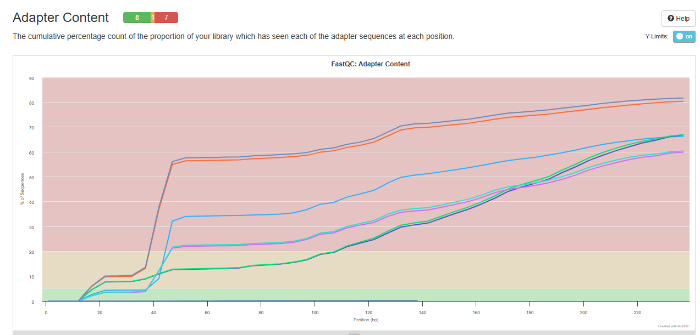
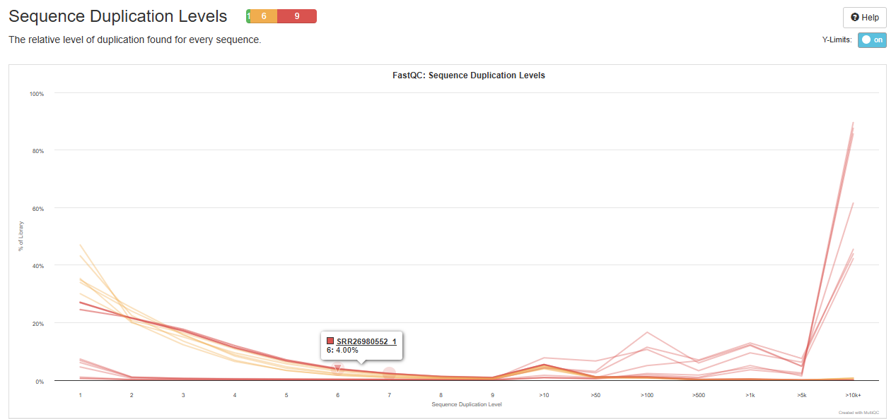
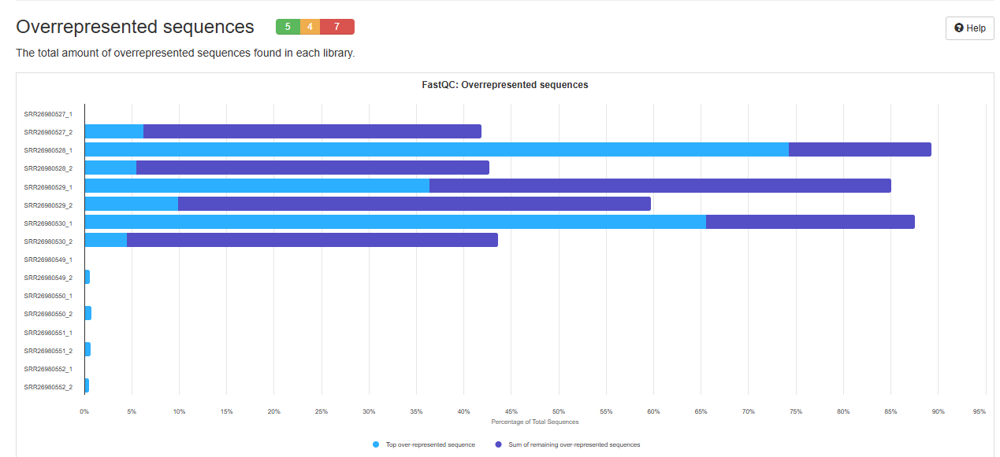

```{r setup, include=FALSE}
knitr::opts_chunk$set(echo = TRUE)
```

# project introductie
Dit logboek is voor het project genomics en transcriptomics in het thema aging. Hiervoor hebben wij het onderzoek Three-dimensional chromatin reorganization regulates B cell development during ageing gebruikt. Hiervan nemen wij de genomische en transcriptomische onderdelen voor onze onderzoeksvraag "Zijn er genetische varianten te vinden in het embf1 en pax5 gen te vinden dat het vorige onderzoek kan beinvloeden"

#opzet

doel van de dag, wat en hoe heb je gedaan, commando's, resultaten


# Library chunk
```{r}
library(fastqcr)
```


# Week 1
# doel project genomics and aging
## Wat en waarom
In de eerste 2 lessen hebben we als groep gezocht naar potentieel onderzoek dat wij kunnen gebruiken voor het project. Het thema dat wij hiervoor hebben gekozen is aging omdat dit ons een interessant lijkt. 
Om een gepast onderzoek te kiezen hebben wij allemaal in de GEO-Datasets van NCBI geken en voor ons interessante onderzoek door te lezen en in onze teams omgeving te posten. daarna hebben wij elkaars alle abstracten van iedereens onderzoek gelezen en een onderzoek uitgekozen om voor te leggen aan marcel.
het onderzoek dat we hebben gekozen na overleg met Marcel is "Three-dimensional chromatin 
reorganization regulates B cell development 
during ageing".
De links hiervoor staan bij resultaten.
hierna hebben wij een taakverdeling gemaakt om het werk eerlijk te verdelen. Mijn taak voor de voorbereiden van de plan van aanpak presentatie is het ontleden en uitleggen van de onderzoeksvraag en het maken van een Gant chart gemaakt.

### Uitleg Onderzoeksvraag
Onderzoeksvraag van het orinele onderzoek
Wat is invloed van chromatine vormverandering op prognater b cellen?
De verwachting is dat doormiddel van veroudering verandering in de TAD (topologically 
associated domains) genen die belangrijk zijn voor de regulatie van B cellen verschuiven van het hoog actieve A compartiment naar het onderdrukte B compartiment verschuiven. Dit kan een belangrijke verklaring kunnen zijn waarom er minder is transcriptie op dit gebied in oudere dieren.

### Notitie's
https://www.youtube.com/watch?v=uakxc0_Dec4 uitleg TAD A/B compartments. de HI-c methode heeft ontdekt dat in het chromatine zich in meer domeinen vormt dan verwacht. op het moment is de er een lopende theorie dat het chromatine zich scheidt in a en b compartementen. 
A compartement
het A compertement is het hoogactieve compartiment waar vaak genen zitten die vaak getranscribeerd worden. hieren in veel interactie tussen promoters en de genen in dit compartiment zonder dat dit een ander compartiment beinvloed.
B compartement.
het B compartement is het laagactieve compartiment. Hierin zitten vaak de onderdrukte genen en/of unieke/"junk" genen.

## Vrijdag 
gezamenlijk de genomics data van ons onderzoek gedownload als SRA files en onze project map neergezet om volgende week uit te pakken zodat we dit kunnen gebruiken in ons onderzoek.
De SRA[1] files staan in de SRA map "/students/2024-2025/Thema05/3Dchromatine/SRA"

## resultaten
onderzoek links
https://www.ncbi.nlm.nih.gov/pmc/articles/PMC11178499/pdf/41556_2024_Article_1424.pdf
https://www.ncbi.nlm.nih.gov/geo/query/acc.cgi?acc=GSE214438
Gant chart staat in teams map school.
Uitleg onderzoeksvraag staat hierboven vermeld en in teams map onderzoek.
SRA files in de map "/students/2024-2025/Thema05/3Dchromatine/SRA"


# Week 2

## Maandag 
Na de groepenpresentaties hebben wij we gezamenlijk de genomics data uitgepakt met de tool fasterqdump via floris zijn laptop.
# floris zijn code

### seqtk test dataset 
Met floris zijn code een fastq data set gemaakt met 10 000 lines 
deze hoeveelhijd lines hebben wij gedaan op advies van ronald 

# floris zijn code

### fastqc en trimmomatic edit uitleg fastqc en trimmotic wat gedaan
ik en storm hebben wij de taken fastqc en trimmomatic pipeline gekregen omdat wij vorig jaar in een eerder project hiermee hebben gewerkt. Fastqc[2] gebruiken wij om de kwaliteit van de sequentie's te analyseren en Trimmomatic[3] gebruiken wij om de sequenties de van te lage kwaliteit zijn te verwijderen.

### Resultaten
Taakverdeling gemaakt
Begin gemaakt aan het Fastqc commando
Geholpen met test dataset in map fastq/test_data

## Dinsdag
fastqc en multiqc vandaag verder uitgewerkt en het commando uitgevoerd zodat wij kunnen kijken wat de kwaliteit van de samples is. Hiervoor hebben wij de R library fastqcr gebruikt, omdat dit de R versie is van fastqc. Nadat dit programma klaar was hebben we multiqc gerund voor een overzicht van al onze data 

Hieronder het automation script voor fastqc run in de fastq map
```{bash, EVAL=FALSE, ECHO=FALSE}
# getwd
setwd("/students/2024-2025/Thema05/3dconformatieChromatine/fastq")
(x = getwd())
fastqc(fq.dir = x, qc.dir = "/students/2024-2025/Thema05/3dconformatieChromatine/fastqc_output/", fastqc.path = "/usr/bin/fastqc", threads = 100)
```

MultiQC command

```{bash, EVAL=FALSE, ECHO=FALSE}
pwd
cd ../
cd fastqc_output
pwd
multiqc .
```

### multiqc resultaten


Uit de general statistics plot kan ik halen dat de download van de eerste sample mislukt is. Ook bevatten de eerste 4 samples en hun reverse componenten ruim 90% duplicaten wat dramatisch slecht is.









hieruit kun je zien dat de sample's 527,528,529,530 van zeer slechte kwaliteit zijn. Het meest bijzondere aan deze samples 
blast seq 4 datasets blasten
Core nucleotide database
Nucleotide collections
refseq genome databse
refseq Reference genomes

### Resultaten

## Woensdag
Samen met storm en Jarno aan het automatische bwa mem commando gewerkt dit duurde lang vanwege problemen in het automatiseren deze staat in repo 

## Vrijdag

Trimmomatic
settings
minlen 40 standaard
slidingwindow 4 : 20 standaard
headcrop error

Results
niet veel getrimd
mischien werkt trimmomatic niet goed bij crop lengt zijn er reads van 10 

Trimmomatic command

```{bash, EVAL=FALSE}
 
```

# Week 3 

## Maandag
Trimmomatic 2 pogingen  + fastqc en multiqc
besluit 527,528,529,530 te verwijderen uit verdere pipeline vanwege slechte kwaliteit en type sample VDJ
## Dinsdag
overleg met ronald over onderzoeksvraag en commentaar op fastq data en logboek

via floris bwa gerund en via jarno freebayes zie hun logboek

multiqc overrepresentive kan echt stuk genoom zijn of pcr artifact
blast gggggggggggggggg overreppentive sequince in alle reverse reads
Core nucleotide database
Nucleotide collections geen match

# woensdag

# bibliografie 
[1]SRA 

[2]Fastqc
Versie ?
FastQC is een kwaliteits controle programma voor sequentie data gegeneerd uit next generation sequencing apparaten. dit programma kan je een indruk geven van de kwaliteit van jouw data en waar eventuele problemen liggen. 

https://www.bioinformatics.babraham.ac.uk/projects/fastqc/
[3]Trimmomatic
Versie 0.39
Trimmomatic 