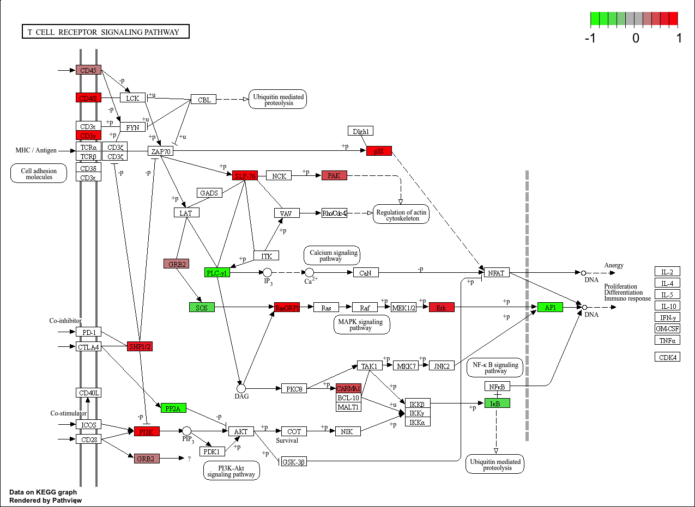
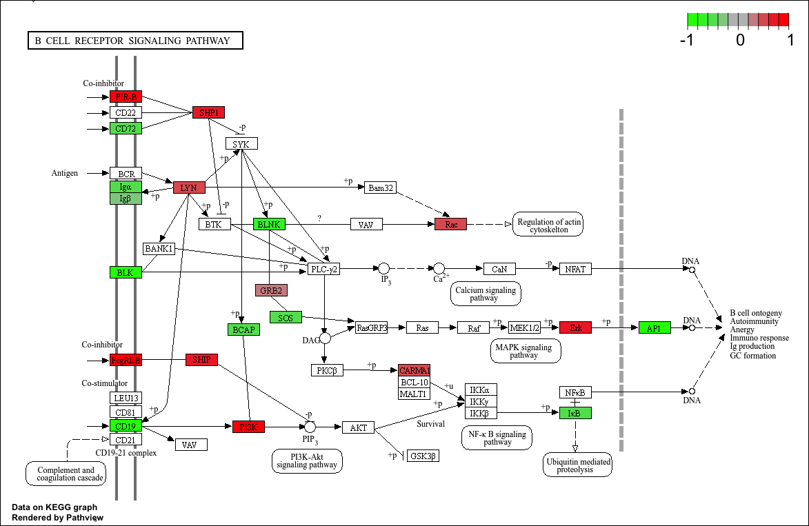

```{r setup, include=FALSE}
knitr::opts_chunk$set(echo = TRUE)
```

# Intro
Dit logboek is een vervolg op mijn genomics logboek "Logboek ivar 2024 jaar2 p1" die in dezelfde directory staat als deze map. 
Het doel van dit logboek is het analyseren van het transcriptie gedeelte van ons onderzoek. In het kort: Het originele onderzoek gaat over de chormatine verandering van locatie van ebf1 en pax5 genen van het hoog actieve compartiment naar het laag actieve compartiment op basis van leeftijd. En ons doel is kijken of er genetische factoren zijn die het onderzoek konden beinvloeden in het genomische deel en in het geval van transcriptomics of de expressies ook daadwerkelijk verschillen tussen de leeftijdsgroepen.

Omdat een deel van de stappen herhaalt worden vanuit het genomics gedeelte zal ik hier vooral naar terug refereren voor effecientie.

## library's
```{r results='hide',warning=FALSE, error=FALSE, message=FALSE}
# voor de Deseq analyse en PCA analyse
library("DESeq2")
# deseq normalisatie algoritme
library("apeglm")
# voor de visualisatie van de volcano plot
library("EnhancedVolcano")
# Functies voor in de biocondocter modules
library("Biobase")
library("BiocGenerics")
library("S4Vectors")
```
Versie's
DESeq2 1.44.0
EnhancedVolcano 1.22.0
Biobase v2.64.0
BiocGenerics 0.50
S4vectors 0.42.1

# Week 6 
Ditmaal is door floris het downloaden van de data en de opvolgende stappen tot en met feature counts uitgevoerd. waarvan de stappen tot en met mapping uitgevoerd met de code van ons genomics onderzoek. Als er vragen zijn bij deze stappen staan deze uitgebreider uitgelegt in het genomics logboek.
## Downloaden Data
Downloaden is gedaan met prefetch met een andere accesion lijst aangezien dit andere samples zijn. 
De samples zijn:
Groep Jonge muizen
SRR21754423
SRR21754422
SRR21754421
SRR21754420
Groep Oude muizen
SRR21754408
SRR21754417
SRR21754418
SRR21754419

Code voor downloaden
```{bash eval=FALSE}
prefetch $(</students/2024-2025/Thema05/3dconformatieChromatine/transcriptomics/SRA/Acc_list_transcriptomics.txt) \
--output-directory "/students/2024-2025/Thema05/3dconformatieChromatine/transcriptomics/SRA/" --max-size 200G
```
Code voor uitpakken
```{bash eval=FALSE}
cat /students/2024-2025/Thema05/3dconformatieChromatine/transcriptomics/SRA/Acc_list_transcriptomics.txt | \
  parallel fasterq-dump -O /students/2024-2025/Thema05/3dconformatieChromatine/transcriptomics/SRA/FASTQ {}
```

## fastqc trimmomatic
### Fastqc Code
Dit keer is fastqc via de linux commanline gerunt met een parralel commando uitgevoerd op de accesion list. Dit commando werkt op dezelfde manier als die van de R library.

```{bash eval=FALSE}
cat /students/2024-2025/Thema05/3dconformatieChromatine/transcriptomics/SRA/Acc_list_transcriptomics.txt | parallel \
fastqc -o /students/2024-2025/Thema05/3dconformatieChromatine/transcriptomics/fastqc_output/voor_trimmen/ {}_1.fastq {}_2.fastq 
```

### Trimmomatic code
De argumenten die wij voor het genetische gedeelte hebben gebruikt worden hier ook herhaalt. met dezelfde beredenering als daarvan.

```{bash eval=FALSE }
cat /students/2024-2025/Thema05/3dconformatieChromatine/transcriptomics/SRA/Acc_list_transcriptomics.txt | parallel \
'TrimmomaticPE -threads 80 ' \
    '/students/2024-2025/Thema05/3dconformatieChromatine/transcriptomics/FASTQ/{}_1.fastq' \
    '/students/2024-2025/Thema05/3dconformatieChromatine/transcriptomics/FASTQ/{}_2.fastq' \
    '/students/2024-2025/Thema05/3dconformatieChromatine/transcriptomics/trimmomatic_output/paired/{}_forward_paired.fastq' \
    '/students/2024-2025/Thema05/3dconformatieChromatine/transcriptomics/trimmomatic_output/unpaired/{}_forward_unpaired.fastq' \
    '/students/2024-2025/Thema05/3dconformatieChromatine/transcriptomics/trimmomatic_output/paired/{}_rev_paired.fastq' \
    '/students/2024-2025/Thema05/3dconformatieChromatine/transcriptomics/trimmomatic_output/unpaired/{}_rev_unpaired.fastq' \
    'ILLUMINACLIP:/students/2024-2025/Thema05/3dconformatieChromatine/Trimmomatic/Trimmomatic-0.39/adapters/TruSeq3-SE.fa:2:30:10' \
    'MINLEN:40 ' \
    'SLIDINGWINDOW:4:20'
```

### MultiQC resultaten naar trimmen
```{bash eval=FALSE}
# pwd working directory
multiqc .
```

#### MultiQC resultaten
Na het trimmen is een MultiQC uitgevoerd. en hieronder staan de algemene resultaten voorzien van commentaar.


Wat opvalt aan dit plotje is dat de hoeveelheid duplicaten over de samplen helemaal gelijkt blijft en per sampel omhoog gaat wat ik opzich een bijzondere ontwikkeling vind aangezien ik verwacht dat de 2 groepen met ongeveer dezelfde hoeveelheid duplicaten zitten en niet met een oplopende factor. Voor de rest vind ik de CG% consistent en ligt gelijk aan die van de genomics resultaten.


Ookal is de kwaliteit hier erg goed valt het mij op dat de eerste 5 sequenties van stuk lagere kwaliteit zijn als de rest van de sequentie. nou komt dit doordat de sequencer de eerste paar sequenties gebruikt voor calibratie en is een zeker verschil te verwachten vindt ik dit verschil groter dan verwacht. maar omdat de kwaliteit algemeen hoog is vindt ik dit verder geen probleem.


Dit vindt ik het meest opvallende plot omdat er pieken zijn in de 50%+ en 60%+ regios zijn dit wijst over het algemeen naar een gecontamineerd sample. dit plot hoort een consistente verdeling te hebben rond het cg percentage van het onderzochte organisme in ons geval verwachten wij een algemeen cg percentage van 42(algemeen cg% muis) tot 44(chomosoom 11 cg% muis) dit mag een paar procent afwijken zoals wij dit ook zien bij genomics.
De pieken die in dit plot te zien zijn moeten onthouden worden bij de opkomende analyses maar omdat de cg percentages verder wel consistent zijn met die van genomics gaan wij wel verder met het gebruiken van deze data.

## mapping Hisat2
Conceptueel is mappen hetzelfde als genomics alleen dan met een transcriptoom inplaats van een genoom.
In dit geval hebben voor het mappen gekozen voor Hisat2[1] omdat bwa-mem2 niet geschikt is voor het mappen van een transcriptoom, dit komt omdat bwa-mem2 een "non splicing aware" mapper is.(https://www.biostars.org/p/481282/)
Hiset2 gebruikt wel dezelfde burrow-wheelers transformatie en staat ook bekend om de snelheid van het mappen van RNA samples. (https://cloud.wikis.utexas.edu/wiki/spaces/bioiteam/pages/47715715/Mapping+with+HISAT2) 

### Referentie genoom
https://www.ncbi.nlm.nih.gov/datasets/genome/GCF_000001635.27/ in deze link staat het gebruikte referentie genoom wij gebruiken hier de refseq GCF variant van voor het mappen.

### Mapping
Code indexering referentie genoom
```{bash eval=FALSE}
hisat2-build -p 60 /students/2024-2025/Thema05/3dconformatieChromatine/Mapping_ref/ncbi_dataset/ncbi_dataset/data/GCF_000001635.27/GCF_000001635.27_GRCm39_genomic.fna hisat2_index
```

Code uitvoering mapping.
hieronder word mapping parralel uitgevoerd op de accesion list met de forward en reverse reads.

```{bash eval=FALSE}
cat /students/2024-2025/Thema05/3dconformatieChromatine/transcriptomics/SRA/Acc_list_transcriptomics.txt | parallel \
hisat2 -p 80 -x hisat2_index -1 /students/2024-2025/Thema05/3dconformatieChromatine/transcriptomics/trimmomatic_output/paired/{}_forward_paired.fastq -2 /students/2024-2025/Thema05/3dconformatieChromatine/transcriptomics/trimmomatic_output/paired/{}_rev_paired.fastq -S /students/2024-2025/Thema05/3dconformatieChromatine/transcriptomics/hisat2_mapped/{}.sam &
```

### Samtool data transformatie's
Hierna worden dezelfde data transformatie's toegepast als bij genomics met samtools.

.sam naar .bam transformatie
```{bash eval=FALSE}
cat /students/2024-2025/Thema05/3dconformatieChromatine/transcriptomics/SRA/Acc_list_transcriptomics.txt | parallel \
'samtools view -@40 -b /students/2024-2025/Thema05/3dconformatieChromatine/transcriptomics/hisat2_mapped/{}.sam > /students/2024-2025/Thema05/3dconformatieChromatine/transcriptomics/samtools_output/{}.bam' &
```

index .bai bestand aanmaak
```{bash eval=FALSE}
cat /students/2024-2025/Thema05/3dconformatieChromatine/transcriptomics/SRA/Acc_list_transcriptomics.txt | parallel \
'samtools index -@80 /students/2024-2025/Thema05/3dconformatieChromatine/transcriptomics/samtools_output/sorted_{}.bam'
```

Soorteren bam bestanden voor fixmate
```{bash eval=FALSE}
cat /students/2024-2025/Thema05/3dconformatieChromatine/transcriptomics/SRA/Acc_list_transcriptomics.txt | parallel \
'samtools sort -@80 -O BAM -n  /students/2024-2025/Thema05/3dconformatieChromatine/transcriptomics/samtools_output/{}.bam -o /students/2024-2025/Thema05/3dconformatieChromatine/transcriptomics/samtools_output/sorted_{}.bam'
```

fixmate markering 
```{bash eval=FALSE}
cat /students/2024-2025/Thema05/3dconformatieChromatine/transcriptomics/SRA/Acc_list_transcriptomics.txt | parallel \
'samtools fixmate -m -@80 /students/2024-2025/Thema05/3dconformatieChromatine/transcriptomics/samtools_output/sorted_{}.bam /students/2024-2025/Thema05/3dconformatieChromatine/transcriptomics/samtools_output/fixed_mates_sorted_{}.bam'
```

Soortering op coardinaten
```{bash eval=FALSE}
cat /students/2024-2025/Thema05/3dconformatieChromatine/transcriptomics/SRA/Acc_list_transcriptomics.txt | parallel \
'samtools sort -@80 /students/2024-2025/Thema05/3dconformatieChromatine/transcriptomics/samtools_output/fixed_mates_sorted_{}.bam -o /students/2024-2025/Thema05/3dconformatieChromatine/transcriptomics/samtools_output/fixed_mates_sorted_coords_{}.bam'
```

markduplicate verwijdering
```{bash eval=FALSE}
cat /students/2024-2025/Thema05/3dconformatieChromatine/transcriptomics/SRA/Acc_list_transcriptomics.txt | parallel \
'samtools markdup -@80 -r -s /students/2024-2025/Thema05/3dconformatieChromatine/transcriptomics/samtools_output/fixed_mates_sorted_coords_{}.bam /students/2024-2025/Thema05/3dconformatieChromatine/transcriptomics/samtools_output/dedup_{}.bam'
```


## Feature counts 
Voor het kwantificeren van van de transcriptomics data gebruiken wij feature counts[2]. dit doen wij omdat het een snelle tool is voor het kwantificeren van de RNA sequenties.  (https://academic.oup.com/bioinformatics/article/30/7/923/232889?login=false)

code Feature counts
argument -T voor threads
argument -p voor paired end (gebruikte input bestanden)
argument --countReadPairs, -B hoort bij paired end reads en zorgt ervoor dat alleen als een read forward en reverse gematch is dat hij word meegetelt.
argument -g gene_id is voor de soortering van van de features
argument -a is het anotatie bestand
argument -o is output bestand
```{bash eval=FALSE}
cat /students/2024-2025/Thema05/3dconformatieChromatine/transcriptomics/SRA/Acc_list_transcriptomics.txt | parallel \
'featureCounts -T 64 -p --countReadPairs -B -t exon -g gene_id -a /students/2024-2025/Thema05/3dconformatieChromatine/snpEff/snpEff/data/mm39/genes.gtf -o /students/2024-2025/Thema05/3dconformatieChromatine/transcriptomics/featurecounts_output/{}_counts.txt /students/2024-2025/Thema05/3dconformatieChromatine/transcriptomics/samtools_output/dedup_{}.bam'
```
Voor herhaling de bovenstaande codes en stappen zijn uitgevoerd door floris en de mapping en feature counts zijn ook gemaakt door hem. 

# Week 7

## Deseq2
Deseq2 is een RNA Analyse tool van het Bioconducter R pakket voor het analyseren van DEG's (Diffrently Expressed Genes). Wij hebben voor deze tool gekozen omdat deze uitgaat van de null hypothese (https://www.biostars.org/p/284775/). Dit is relevant voor ons omdat het in lijn is met onze onderzoeksvraag of er een verschil is in gen expressie.

Voor deze analyse hebben we vooral de standaard handleiding en analyse gevolgt die bij deze tool komt (https://bioconductor.org/packages/devel/bioc/vignettes/DESeq2/inst/doc/DESeq2.html#quick-start).

De volgende analyse is gemaakt met een incomplete dataset vanwege een error in het downloaden in 1 van de bestanden. Dit word later gecorrigeerd maar in het geval van deze analyse zal de groep jong een iets ongebalanceerdere waardes hebben vanwege een missend sample.

De input voor deze tool is ruwe niet genormaliseerde count data die in ons geval gegeneerd is door feature counts in de form van een .out bestand. 

### Inlezen feature counts
Inlezen van de feature counts data inclusief de metadata collomen
```{r}
# inlezen
# skip 2 lines met import data
transcrip_table <- read.delim("/Users/ivarl/Desktop/count.out",header = FALSE,skip = 2)
# names vector van floris
names(transcrip_table) <- c("Gene_id","Chr","Start","End","Strand","Length","SRR21754408","SRR21754418","SRR21754419","SRR21754420","SRR21754421","SRR21754422","SRR21754423")
#print
head(transcrip_table)
```

De import data veranderen naar een count matrix voor de deseq functie. Hierbij bewaar je de alleen de gene ID's en de samples.
```{r}
# filtering colloms
count_matrix <- data.frame(transcrip_table$Gene_id, transcrip_table$SRR21754408,transcrip_table$SRR21754418,transcrip_table$SRR21754419,transcrip_table$SRR21754420,transcrip_table$SRR21754421,transcrip_table$SRR21754422,transcrip_table$SRR21754423)
# name collums
names(count_matrix) <- c("Gene_ID","SRR21754408","SRR21754418","SRR21754419","SRR21754420","SRR21754421","SRR21754422","SRR21754423")
head(count_matrix)
```

Hieronder staat de conditie data frame voor de factoren van de deseq functie. Dit is om het model te maken van het onderzoek stelling in de deseq functie.
De Sample collom moet op dezelfde volgorde staan zoals ze in de rijen van de count matrix staan.
De group collom is voor het onderzoeks model om de groepen oud en jong te vergelijken
De type collom is voor het Paired End of Single End sequincing is, deze collom heb ik toegevoegt omdat dit in de standaard workflow van deseq en dacht dat het later belangrijk kon zijn. Dit bleek niet het geval te zijn. (https://bioconductor.org/packages/devel/bioc/vignettes/DESeq2/inst/doc/DESeq2.html#quick-start)

```{r}
# condition data frame
conditie_matrix <- data.frame(
                              c("SRR21754408","young","PE"),
                              c("SRR21754418","young","PE"),
                              c("SRR21754419","young","PE"),
                              c("SRR21754420","old","PE"),
                              c("SRR21754421","old","PE"),
                              c("SRR21754422","old","PE"),
                              c("SRR21754423","old","PE")
                              )
# corigeer frame voor input functie deseq2
transpose <- data.frame(t(conditie_matrix))
# condities moeten factoren zijn voor input functie
conditie_matrix <- data.frame(as.factor(transpose$X1),as.factor(transpose$X2),as.factor(transpose$X3))
# collom namen                              
names(conditie_matrix) <- c("sample","group","type")
head(conditie_matrix)
```
Rownames transformatie voor het dataframe. Dit had in de orinele count matrix gekunt voor effecientie maar dit is tijdens het debuggen voor de input van de deseq functie zo gegaan.

```{r}
# samples in een nieuw dataframe 
cts <- data.frame(count_matrix$SRR21754408, count_matrix$SRR21754418, count_matrix$SRR21754419, count_matrix$SRR21754420, count_matrix$SRR21754421, count_matrix$SRR21754422, count_matrix$SRR21754423)
# verander colnames en rownames
# colnames moet gelijk zijn aan rownames conditie matrix
colnames(cts) <- c("SRR21754408","SRR21754418","SRR21754419","SRR21754420","SRR21754421","SRR21754422","SRR21754423")
# rownames voor de gene names
row.names(cts) <- count_matrix$Gene_ID
head(cts)
```

### Aanmaak Deseq data object
Hieronder word het deseq data object aangemaakt.
```{r}
# Cts de verwerkte feature counts matrix
# conditie matrix is de metadata matrix voor de vergelijking
# design is de colom (datatype=factor) van de conditie matrix.
dds <- DESeqDataSetFromMatrix(countData = cts,
                              colData = conditie_matrix,
                              design = ~ group)
dds
```

Hieronder word het deseq analyse object aangemaakt met het deseq data object.
Dit word gedaan door een Walt T test uit te voeren over de gemiddelde expressie in de verschillende groepen.(https://en.wikipedia.org/wiki/Wald_test)
In dit resultaat object wordt per gen weergegeven of er significante verschillen zijn in de experiment groepen.
De collomen waarin we geintreseerd in zijn zijn de pvalue, padj, en log2foldchange.
De pvalue en padj(adjusted p value) vinden wij belangrijk omdat dit verteld of er een statistisch significant verschil is tussen de 2 groepen per gen.
en de log2fold colom vinden we belangrijk omdat dit de verandering expressie waarde weergeeft. 
```{r}
deseq <- DESeq(dds)
results(deseq)
```

result deseq object met contrast. Dit object word niet gebruikt. de reden om dit object te maken is dat de contrast optie de verwachte log fold change op 0 zetten in het geval dit gewenst is. Deseq zelf raad dit aan als je een experiment hebt met bijvoorbeeld 3 groepen omdat met dit agrument je zo de verschillen tussen de groepen kan analyseren.
Dit kan handig zijn voor een vervolg onderzoek om dat het interessant kan zijn om te weten in welke levensfase of fases bepaalde verandering in gen expressie statistisch significant is en je op deze manier dit kan weergeven.
```{r}
# vergelijk groep
resultaat_deseq <- results(deseq, contrast = c("group", "young","old"))
resultaat_deseq
```

### Deseq normalisatie
Hieronder wordt het LogFoldCange shrinkage object aangemaakt het nut van dit object is het normaliseren van de LFC waardes. de reden om dit te doen is dat genen enorm kunnen verschillen in expressie niveau, dit kan er voor zorgen dat genen met een natuurlijke lage expressie waarde minder naar voren 
Verder is het het object hetzelfde als het deseq object.
Wij gebruiken hiervoor het apeglm argument als algoritme voor de normalisatie. De reden hiervoor komt ook van het geadviseerde biocondocter workflow en heeft als reden dat apeglm in tegenstelling tot de normale instelling de grote LFC's preserveerd en dit kan voor ons interessant zijn om de grote uitschieters in expressie te analyseren mogen die er zijn.
```{r}
deseq_shrink <- lfcShrink(deseq, coef = "group_young_vs_old", type = "apeglm")
deseq_shrink
```

### Analyse algemene Deseq resultaten
Hieronder word berekent hoeveel genen een p waarde hebben onder de 0.05 van de 41079 genen.

#### Note 
omdat de rchuck geknit een andere output geeft dan de Rchunk in Rmarkdown zet ik de resultaten buiten de chunk neer dit komt waarschijnlijk door een bug met de variable namen.
in totaal zijn er 1524 genen met een statistisch significante waarde
wat lijdt tot een percentage van 3,71% van de totale hoeveelheid genen die statischtisch significant zijn met een genormaliseerde P waarde.
```{r}
resultaat_p_01<- sum(resultaat_deseq$padj < 0.05, na.rm=TRUE)
#cat(resultaat_p_01,"genen")
#cat("\n")
max_genen <- 41079
percentage <- resultaat_p_01/max_genen*100
#cat(percentage,"% genen met een statische signifcantie van 0.05")
```

Hieronder staat het resultaat van de analyse in de form van de gevonden DEG's in totaal zijn er p waardes onder de 0.05 en een veranderde expressie waarde(LFC). in totaal is 5,6% van de genen DEG, waarvan 2.5% upgereguleert is in vergelijking en 3.1% downgereguleert. Persoonlijk had ik de gedachte dat het percentage downgereguleerde genen hoger zou zijn in verhouding tot upgereguleerde genen vanwege de gedachte dat je lichaam voornamenlijk achteruit gaat als je ouder wort.
Uit dit resultaat kun je ook concluderen dat er genoeg basis is om te zeggen dat een significant verschil is in genexpressie tussen jong en oud.
Wat wij hier nog uit willen halen is het verschil in genexpressie in die invloed hebben op B cellen voornamenlijk de genen pax5 en ebf1.

```{r}
deseq_05 <- results(deseq, alpha=0.05)
summary(deseq_05)
```

### MA plots
In de onderstaande MA plots word de gemiddelde spreiding van de LFC's weergegeven voor en na de de apeglm normalisatie. Dit weergeeft goed het effect van de normalisatie en waarom dit voor overzicht zorgt.
Wat mij hier wel aan opvalt is het dat ook na de normalisatie toch nog een goed aantal punten zich buiten de log fold limieten zitten.

#### Pre normalisatie
ma plot pre shrinkage
```{r}
plotMA(resultaat_deseq, ylim=c(-3,3))
```
#### Post normalisatie
ma plot met shrinkage
```{r}
plotMA(deseq_shrink, ylim=c(-3,3))
```

### Volcano plot
De volcano plot weergeeft de distributie van alle genen of statistisch significant zijn en LFC significant zijn.
Als argumenten voor dit plot gebruiken we de padj(gecorigeerde P waardes) voor de statistische significantie en de genormaliseerde LFC's van het deseq_shrink object.
de cut of waardes in de verticale as is het logaritme van de p waardes waarvan de cutoff op 0.05 staat omdat dit de standaard waarde is als iets statistisch significant is. en hetzelfde geld voor de genormaliseerde LFC waardes op de verticale ass met een cutoff van -2/2.
De bolletjes in het rood weergeven de genen die zowel statistisch als LFC significant zijn. wat hieraan opvalt is dat de ge downreguleerde genen verder versprijd zijn dan de upgereguleerde.

```{r}
EnhancedVolcano(deseq_shrink, x="log2FoldChange", y = "padj",lab = rownames(deseq_shrink), title = "young versus old", pCutoff = 0.05,FCcutoff = 2, ylim = c(0,50),legendPosition = "none",subtitle = "FDR <= 0.05 and absolute FC >= 2")
```

### Pax5 en Ebf1 plotcounts
Een belangrijk deel van het onderzoek is uitzoeken of de genen die veel betrokken zijn bij de expressie van B cellen ook verschillen.
De genen die uitgelicht zijn bij het onderzoek dat wij repliceren zijn de genen Pax5 en Ebf1 omdat deze veel invloed hebben over de regulatie van B cellen.

#### Uitleg Pax5 en Ebf1 plots code
De volgende plots zijn gemaakt met het deseq data object voor de deseq analyse en bevat aleen de count data plus de metadata. Beide plots zijn gebaseerd dus gebaseerd op de count data van de respectieve genen op basis van de metadata groep.

#### Resulaat Pax5 en Ebf1 plots
In dit geval is bij beide genen goed te zien dat er een gemiddeld een groot verschil is in expressie, waaruit je kan concluderen dat de expressie van b cellen hoger light in jonge muizen.

#### Pax5
```{r}
plotCounts(dds, "Pax5", intgroup = "group")
```
#### Ebf1
```{r}
plotCounts(dds, "Ebf1", intgroup = "group")
```

### PCA analyse
We hebben gekozen voor een PCA analyse om te kunnen zien of er een duidelijk verschil is in variantie in de verschillende groepen.

#### Getransformeerde deseq 

Exctracting transformd value voor pca. Dit is nodig als input voor de ingebouwde pca test die in de deseq library zit. het vts argument normaliseerd de count waardes gebaseerd op de gemiddelde expressie per gen.

```{r}
vsd <- vst(dds, blind = FALSE)
head(assay(vsd))
```

#### PCA plot

#### PCA resultaat
PCA plot waarbij je kunt zien dat de groepen verschillen van elkaar en dat bij jong 1 outlyer is, dit is het sample SSR21754408 (gevonden met het gecommente PCA plot hieronder) dit sample verspringt aan de hand van de hoeveelheid genen die je gebruikt in het PCA plot. In dit geval heeft het weinig invloed op de conclusie die je uit dit plot kan trekken omdat het sample nog steeds ver van de andere groep afligt.

#### PCA Code en beredenering
Dit plot gebruikt de getransformeerde count data voor de varratie die hierin zit.
Bij het gebruik van deze functie kwam origineel een consol melding dat het de top 500 features bij variantie worden gebruikt in dit plot.
Dit vond ik in principe raar omdat wij veel meer DEG's hebben dan word gebruikt in de data. Na met deze ntop argument geëxperimenteerd te hebben viel mij dat 1 sample nogal verticaal versprong.
Voor de beredenering van hoeveelheid genen die in het pca plot heb ik gekozen om de nul, lage expresie en de outlire waardes weg te laten. Totaal zijn er 27233 genen die een waarde hoger dan 0 hebben, 13874 die volgens het deseq resultaat een lage waarde hebben, en 4 outlire's.
uiteindelijk blijven er 13355 genen over waarin volgens mij de meeste waarde in ligt.

```{r}
# standaard pca
# ntop hoeveelheid genen hoger dan 0 - de low counts
ntop_v <- 27233-13874-4
plotPCA(vsd, intgroup="group", ntop = ntop_v)
# sample identificatie
#plotPCA(vsd, intgroup=c("group","sample"))
```

#### PCA Controle aan de hand van de bovenstaande vraagstelling
Samen met Tjerk een handmatige controle voor de PCR plot gemaakt op basis van de vraag over de hoeveelheid genen er geadviseerd zijn omdat er 1 sample significant verspringt afhankelijk of je de top 500 genen gebruikt of 20000 

De orginele gedachte was dat er mischien iets fout was gegaan met de Deseq PCA methode en daarom heb ik met tjerk een handmatige PCA gemaakt die hieronder weergeven word.

De Resultaat lijnen van de groepen zijn gelijk maar de normalisering van deseq is anders vanwege de vts extract normalisering methode. Dit zorgt voor de draaing in het plot
```{r}
#head(cts)
vars <- apply(assay(vsd), 1, var)
nonzero <- vars != 0
#length(which(nonzero == FALSE)) 13846
# filter alle 0 expressie
X <- assay(vsd)[nonzero, ]

means <- rowMeans(X)
# expressie - gemiddelde
scaled <- t(X - means) #/ sqrt(vars[nonzero])
# coeficient matrix
covmat <- scaled %*% t(scaled) / (nrow(scaled) - 1)

#Eigen value's
eig <- eigen(covmat)
#plot(eig$values)
#print(100 * eig$values / sum(eig$values))

# bereking scores
loadings <- t(scaled) %*% eig$vectors
loadings <- loadings / sqrt(colSums(loadings^2))
scores <- scaled %*% loadings

plot(scores[, 1], scores[, 2], col=vsd$group, asp=1)
```


#### Pathview
Met de R bioconducter library pathview heeft Jarno een paar pathviews gemaakt die voor het onderzoek relevant zijn. voor het repliceren van deze pathways zie zijn logboek. pathview is gebaseerd op de kegg pathways die biologische systemen visualiseren.

##### T en B cellen
T en B cellen zijn zogeheten Natural Killer cells met als doel pathogene en tumercellen te vernietigen. Waarbij B cellen antilichamen aanmaken en T cellen een rol spelen in het actief vernietigen van de cellen en varianten van T cellen regulatie beïnvloeden waar het nodig. (Openstax boek biologie2e)

##### T receptor pathway
In de onderste pathway is de T receptor pathway (https://www.kegg.jp/entry/map04660) kun je zien dat op meerdere plekken een up regulatie is van cd28 wat een histocopatebilty complex is wat samen met counter receptors zorgt voor een cascade effect, wat uiteindelijk resulteert in een ge downreguleerde expressie bij de oudere groep.


##### B receptor pathway 
Het B receptor pathway (https://www.kegg.jp/entry/map04662) is verantwoordelijk voor het produceren van antigenen zodat het immuum systeem hier op kan reageren. hieronder is te zien dat de algemene regulatie van downgereguleert is wat zorgt voor een langzamere imuum reactie.


## Concluderen
De eindconclusie van dit transcriptomics onderzoek aan de hand van de deseq analyse en de gevisualiseerde pathview afbeelding kunt stellen dat het orginele onderzoek ondersteund word in hun stelling dat door de verandering van chromatine compartiment de expressie significant omlaag gaat in B en T cellen relevante genetische pathways.

# Bibliografie
Bibliografie voor de toegevoegde tools die niet in het genomics logboek voorkwamen

[1]Hiset2
https://daehwankimlab.github.io/hisat2/
versie 2.2.1

[2]Feature counts 
https://subread.sourceforge.net/featureCounts.html
versie 2.0.7


