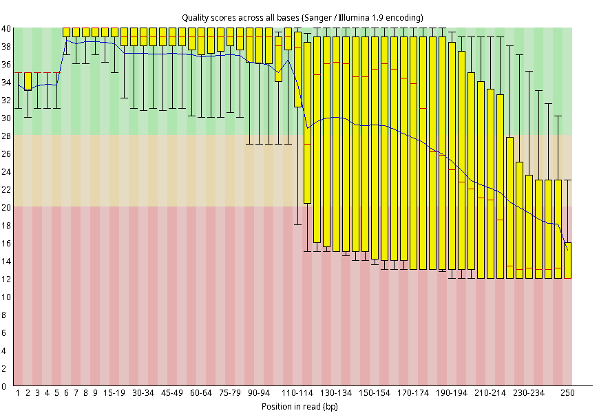

```{r setup, include=FALSE}
knitr::opts_chunk$set(echo = TRUE)
```

## Introductie:

Dit logboek gaat over Genomics en Transcriptomics, De eerste 5 weken focussen wij op het Genomics gedeelte. In de Genomics kant van dit onderzoek gaan wij kijken naar het volgende: **Zijn er varianten aanwezig van PAX5 en Ebf1 in het genoom van de rag2 knockout muizen die gebruikt zijn?** Dit omdat: De reden dat gekozen is voor PAX5 en Ebf1 is dat deze betrokken zijn bij de ontwikkeling van voorloper B cellen. In het transcriptomics gedeelte wordt hier ook gebruik van gemaakt dus is het goed om te weten of er varianten aanwezig zijn in het genoom van de muizen die voor transcriptomics gebruikt worden (Rag2 knockout).

Hier onder is een overzicht te zien van de Tools die wij gaan gebruiken in ons onderzoek.

+---------------+----------------------------------------------------------------------------------+---------------+------------------------------------------------------------------------------------------------------------------------------------------------------------------------------------------------------------------------------------------------------------------------------------------------------------+
| Tool          | Referentie                                                                       | Versie        | Waarom                                                                                                                                                                                                                                                                                                     |
+===============+==================================================================================+===============+============================================================================================================================================================================================================================================================================================================+
| Featurecounts | <https://academic.oup.com/bioinformatics/article/30/7/923/232889?searchresult=1> |               | Featurecounts is een zeer efficiënt algemeen "read" samenvattingsprogramma dat mapped reads telt voor genomische kenmerken zoals genen, exonen, promotor, genlichamen, genomische bins en chromosomale locaties. het kan worden gebruikt om zowel RNA-seq als genomische DNA-seq leesbewerkingen te tellen |
+---------------+----------------------------------------------------------------------------------+---------------+------------------------------------------------------------------------------------------------------------------------------------------------------------------------------------------------------------------------------------------------------------------------------------------------------------+
| HISAT2        | <https://daehwankimlab.github.io/hisat2/>                                        |               | HISAT2 is een snelle en gevoelige alligner voor mapping NGS reads voor zowel DNA als RNA naar een enkele referentie genoom.                                                                                                                                                                                |
+---------------+----------------------------------------------------------------------------------+---------------+------------------------------------------------------------------------------------------------------------------------------------------------------------------------------------------------------------------------------------------------------------------------------------------------------------+
| FastQC        | <https://www.bioinformatics.babraham.ac.uk/projects/fastqc/>                     | 0.11.9        | FastQC wordt gebruikt om de kwaliteit te checken van de rauwe data, hier uit is te zien of de data gelijk te gebruiken is of dat deze moet worden getrimmed. De trimmer kan ook afgesteld worden op basis van de fastqc.                                                                                   |
+---------------+----------------------------------------------------------------------------------+---------------+------------------------------------------------------------------------------------------------------------------------------------------------------------------------------------------------------------------------------------------------------------------------------------------------------------+
| Fastqcr       | <https://rpkgs.datanovia.com/fastqcr/index.html>                                 | 0.11.9        |                                                                                                                                                                                                                                                                                                            |
+---------------+----------------------------------------------------------------------------------+---------------+------------------------------------------------------------------------------------------------------------------------------------------------------------------------------------------------------------------------------------------------------------------------------------------------------------+
| freebayes     | <https://github.com/freebayes/freebayes>                                         |               | freebayes is een haplotype gebaseerde gen variant detector, ontworpen om kleine polymorfismes te detecteren, SNP's, inserties en deleties in het bijzonder. Dit programma gebruikt .BAM bestanden met een Phred+33 encoding.                                                                               |
+---------------+----------------------------------------------------------------------------------+---------------+------------------------------------------------------------------------------------------------------------------------------------------------------------------------------------------------------------------------------------------------------------------------------------------------------------+
|               |                                                                                  |               |                                                                                                                                                                                                                                                                                                            |
+---------------+----------------------------------------------------------------------------------+---------------+------------------------------------------------------------------------------------------------------------------------------------------------------------------------------------------------------------------------------------------------------------------------------------------------------------+
| seqtk         | <https://github.com/lh3/seqtk>                                                   |               | seqtk wordt gebruikt voor het proceseren van sequences in het FASTA of FASTQ formaat. het "seamlessly parses" beide FASTA en FASTQ welke dan ook optimaal compressed wordt door gzip                                                                                                                       |
+---------------+----------------------------------------------------------------------------------+---------------+------------------------------------------------------------------------------------------------------------------------------------------------------------------------------------------------------------------------------------------------------------------------------------------------------------+
| Trimmomatic   | <https://github.com/usadellab/Trimmomatic>                                       | 0.39          | Trimmomatic wordt gebruikt om de data op te schonen nadat dez uit FastQC komt. Deze haalt de slechte kwaliteit paren af van de streng waardoor een hoge kwaliteit RNA- of DNA-streng overblijft die gebruikt kan worden.                                                                                   |
+---------------+----------------------------------------------------------------------------------+---------------+------------------------------------------------------------------------------------------------------------------------------------------------------------------------------------------------------------------------------------------------------------------------------------------------------------+
| bwa mem2      | <https://github.com/bwa-mem2/bwa-mem2?tab=readme-ov-file>                        |               | Bwa mem2 wordt gebruikt om DNA en RNA reads te alignen tegen een gekozen referentie genoom.                                                                                                                                                                                                                |
+---------------+----------------------------------------------------------------------------------+---------------+------------------------------------------------------------------------------------------------------------------------------------------------------------------------------------------------------------------------------------------------------------------------------------------------------------+
| samtools      | <https://www.htslib.org>                                                         |               | samtools is een set van "utilities" dat alignments in de SAM, Bam en CRAM formatten kan manipuleren. het kan veranderen tussen de formats, sorteren, samenvoegen en indexen, ook kan het "reads" snel vinden in elke regio                                                                                 |
+---------------+----------------------------------------------------------------------------------+---------------+------------------------------------------------------------------------------------------------------------------------------------------------------------------------------------------------------------------------------------------------------------------------------------------------------------+
| R             | <https://www.r-project.org>                                                      |               | R is de code taal die gebruikt wordt om alle statistieken testen te doen en tevens de visualisatie van de data die komt uit het onderzoek                                                                                                                                                                  |
+---------------+----------------------------------------------------------------------------------+---------------+------------------------------------------------------------------------------------------------------------------------------------------------------------------------------------------------------------------------------------------------------------------------------------------------------------+
| R-studio      | <https://posit.co>                                                               |               | R studio is het programma wat wordt gebruikt als IDE voor R                                                                                                                                                                                                                                                |
+---------------+----------------------------------------------------------------------------------+---------------+------------------------------------------------------------------------------------------------------------------------------------------------------------------------------------------------------------------------------------------------------------------------------------------------------------+
| NCBI-GEO      | <https://www.ncbi.nlm.nih.gov/geo/>                                              |               | NCBI-GEO is gebruikt om het originele onderzoek te vinden waar dit onderzoek inspiratie vanaf neemt                                                                                                                                                                                                        |
+---------------+----------------------------------------------------------------------------------+---------------+------------------------------------------------------------------------------------------------------------------------------------------------------------------------------------------------------------------------------------------------------------------------------------------------------------+

{width="681"}

## 09-09-2024

### Doel van de dag

**Het maken van een team & Onderzoeken zoeken met potentie**

### Taken lijst

-   Team maken
-   Literatuur + data set zoeken
-   Week planning maken

In de klas is er een groep gemaakt samen met Floris, Storm en Ivar. Wij vieren hebben als doelstelling een goed en een interessant onderzoek te presenteren. De motivatie in deze groep is dus een goede basis om op te bouwen.

De Data set zoeken word gedaan via NCBI in de GEO datasets catagorie met de volgende zoek opdracht die als standaard is gesteld door de opdracht gevers: "("expression profiling by high throughput sequencing"[DataSet Type]) AND "genome variation profiling by high throughput sequencing"[DataSet Type]"

Aan deze query kan aan het einde nog een woord of onderwerp toegevoegd worden. In onze groep is besproken naar wat onze interesses waren en het hoofd idee was "aging" ook wel veroudering. Dit komt omdat gen expressie veranderd naarmate een organisme ouder word. Dit is anders in elk organisme en daardoor word er veel onderzoek naar gedaan. Wij zijn gekomen op 3 onderzoeken die uit eindelijk interessant waren

#### Onderzoeken

-   <https://www.ncbi.nlm.nih.gov/pmc/articles/pmid/33751124/> : MiniCAFE, a CRISPR/Cas9-based compact and potent transcriptional activator, elicits gene expression in vivo. Dit onderzoek gaat over CRISPR-bemiddelde gen activatie. Dit is een belovende gen veranderingstrategie die DNA kan veranderen zonder dat de dubbele helix breekt. Deze is laten controleren door de opdrachtgever en die zei het volgende "Interessant onderzoek en leuk artikel, maar volgens mij zijn er voor het RNA-Seq gedeelte voor de meeste groepen maar 2 replicaten beschikbaar terwijl we daar minimaal 3 willen hebben. Mochten jullie niet iets anders kunnen vinden dan kunnen we dit experiment alsnog gebruiken, maar daar zitten wel wat risico's aan." Hierdoor zijn we gaan kijken naar andere opties.

-   <https://www.ncbi.nlm.nih.gov/pmc/articles/PMC10415134/> : Gene expressions associated with longer lifespan and aging exhibit similarity in mammals. Dit onderzoek hadden wij als tweede optie gevonden, het onderzoek gaat over gen expressie geassocieerd met langere levensspan en veroudering laten gelijkenis zien in zoogdieren. Dit onderzoek is niet gekozen door de onbeschikbaarheid van de DATA.\

#### Gekozen onderzoek

-   <https://www.nature.com/articles/s41556-024-01424-9> : Three-dimensional chromatin reorganization regulates B cell development during ageing. Dit is de keuze geworden door de aanwezigheid van veel data. Dit zijn in totaal 76 samples die genomen zijn van de jonge en oudere muizen. Deze samples zijn van meerdere catagorien maar voor ons belangrijk zijn de verschillende RNA samples. Het doel van dit onderzoek is ook erg interresant en wij hebben na het lezen gelijk al nieuwe dingen geleerd. Wat er uit sprong was de A/B compartenment in de nucleus. Dit is een recente ontdekking en zegt dat er een A compartement is waar de genen worden expressed maar in het B compartement worden de genen niet expressed. Deze twee compartementen zitten nouw bij elkaar en laat dus zien dat er wel structuur zit in waar een gen zit en waar het niet zit in de cel.

#### Week planning

Doormiddel van het programma trello is er een week planning gemaakt. Hier worden ook de taken verdeeld dit is te zien aan de foto's bij de tickets. De foto laat een gebruiker zien, dit gecombineerd met de datum waar voor het af moet zijn geeft ons een duidelijke verdeling. De datum toevoeging geeft de gebruiker die de ticket heeft ook een herinering.

Hier een voorbeeld foto.


Hier zetten wij tickets in die aan bepaalde personen met verschillende urgenties

-   MUST - Moet gedaan worden voor een bepaalde datum of het einde van het project.

-   SHOULD - zou gedaan moeten worden want je wil het project liever niet opleveren zonder.

-   COULD - kan gedaan worden maar is zeker niet essentieel voor het project.

De planning van de week voor mij was dat ik de Methoden moest bekijken en samenvatten voor zover mogelijk zodat de belangerijkste delen hiervan in het PVA en de Powerpoint werden gezet.

De methoden zijn belangrijk omdat hierin de benodigdheden staan voor replicatie van het onderzoek. In de gekozen paper waren verschillende methoden die voor ons niet belangrijk zijn. Dit zijn bijvoorbeeld waar de muizen zijn gekocht of de Hi-C methoden dit omdat onze onderzoeks vraag als volgt gaat "Heeft leeftijd invloed op de expressie van genen" de Hi-C kijkt naar de chromosoomconfiguratie dit is te extreem voor ons in de tijds periode die wij hebben gekregen.

<https://trello.com>

## 10-09-2024

### Doel van de dag

**Het afmaken van de samenvatting van de Methoden**

### Taken lijst

-   Afmaken Methoden
-   Herlezen document
-   Checken Methoden

Het weten van de methoden is belangrijk omdat wij moeten weten wat wij kunnen repliceren en wat te ver gegerepen is voor ons onderzoek en dit zou onze onderzoeksvraag kunnen beinvloeden. Als we Hi-C als voorbeeld nemen dit is een hoge doorvoer technique die chromatine conformatie vastlegt. Dit zouden wij niet in onze 5 weken kunnen doen op een goede manier. Dit is waarom wij kiezen voor de genoom analyze voor afwijkingen met het algemene referentie genoom.

In de les heb ik de methoden afgemaakt er waren uit eindelijk 24 methoden waar de materialen een beetje in gemixt stonden dit waren de volgende. Hier zijn er een paar die wel interessant zijn voor ons eigen onderzoek. Alle 24 methoden staan samen gevat in een extern document die te vinden is in de git.

-   Mice - Waar de muizen vandaan kwamen, de leeftijd en welke type met welke aanpassingen dit waren in ons geval C57BL/6J muizen van 8-12 weken oud voor de jongen en 100-110 weken oud voor de oudere muizen

-   Cell lines - De D345 cell line een "Wild-type D345" van yale zijn gecultureerd in RPMI1640 met 10% FBS en 1x penicillin streptomycin oplossing. Een variatie van de Rag2 cell, Ebf1 cell en de Pax5+ zijn gekweekt. verder ook 293T menselijke embronische nier cellen gekocht van ATCC gebruikt voor lentiviral expressie. Plat-E cell line gebruikt voor "retroviral" expressie. Alle cellen waren gekweekt in een 37 graden bevochtigde atmosfeer met 5% CO2

-   Antibodies - antilichamen zijn in dit onderzoek gebruik voor "immunoprecipitation" ook wel immunoprecipitatie en het "stainen" van H3K27ac voor de "staining" worden IgG isotype control antilichamen gebruikt.

-   Chip-seq en HiChIP- Chromatine immunoprecipitatie-sequencing of ChIP-seq genoemd, een nieuwe moleculaire laboratoriumtechniek die de DNA-bindingslocaties van een bepaald eiwit identificeerd. De DNA-fragmenten die aan het specifieke eiwit zijn verbonden, worden opgevangen met behulp van gesynthetiseerde immunoglobulinen, waarna de DNA-fragmenten worden gesequenced. De verzamelde DNA-sequenties worden daarna met behulp van softwaretools geanalyseerd om de kwaliteit van de ChIP-seq en mogelijke DNA-bindingslocaties te evalueren. HiChIP is een recent ontwikkelde methode voor het onderzoeken van de conformatie van chromatine, waarbij een in situ Hi-C-bibliotheek wordt voorbereid, gevolgd door een chromatine-immunoprecipitatiestap (ChIP). Dit proces is in het algemeen gericht op de histonmodificatie H3K27ac of cohesie.

-   Pro-B cell purification - hier zuiveren ze de Pro-B cellen doormiddel van positieve selectie van CD19+ en B220 markers.

-   In situ Hi-C - In situ HiC maakt gebruik van de relatieve frequentie van DNA-DNA-ligatiegebeurtenissen om de driedimensionale structuur van een genoom te heropbouwen. Op deze manier worden restrictie-enzymverteerde uiteinden van genomisch DNA in vaste kernen aangegeven met gebiotinyleerde dNTP's. DNA-DNA-ligatiegebeurtenissen die ontstaan door nabijheidsligatie worden daarna vastgelegd, versterkt en in de volgende generatie gesequenced om hun lineaire genomische positie vast te stellen, en hun driedimensionale relatie.

-   RNA-seq, De RNA-seq is niet heel belangrijk voor ons genomics deel echter is het wel belangrijk voor het transcriptomics deel. Dit wijst op hoe de RNA is gesequenced. Er zijn verschillende basis paren lengten gebruikt: 2x75, 1x100 , 2x100bp deze zijn allemaal gesequenced op een Illumina NovaSeq sequencer. De mapping is gedaan naar het mm10 genoom doormiddel van STAR. STAR is een aligner gemaakt om specifiek de vele uitdaging aan te pakken van RNA-seq data mapping. Het gebruikt een strategie om rekening te houden voor de "spliced" alignments.

Na alle methoden samengevat te hebben gingen wij als groepje kijken naar de materialen en methoden om te beslissen wat wij nodig hadden, wat outdated was en wat wij nog extra of anders wilden doen.

Onze onderzoeks vraag is : **Zijn er varianten aanwezig van PAX5 en Ebf1 in het genoom van de rag2 knockout muizen die gebruikt zijn?**

Dus wij gaan niet de RNA gebruiken voor deze vraag. De RNA-seq resultaten en alle bijbehorende stappen die met de RNA zijn gedaan vallen gelijk weg. Dit is omdat het transcriptomics is en niet genomics waar onze onderzoeks vraag op is afgestemd.

Wij gaan Hi-C niet gebruiken omdat dit ook niet past bij onze onderzoeks vraag en Hi-C is ook redelijk complex wat dus ook niet in ons tijd schema past.

### Vragen of ronald dit er in moet ja of nee

## 13-09-2024

### Doel van de dag

**Het downloaden van de data doormiddel van SRA**

### Taken lijst

-   Bash script schrijven voor de download
-   De SRA unpacken en data controleren

Eerst werd ons gevraagd om naar de juiste map te gaan. Dit kan door de terminal te openen naar onze home te gaan en cd naar /students/2024-2025/Thema05/ en hier de map voor ons project aan te maken.\
Of het kan geworden met de GUI waar je ook begint met het openen van de home folder en dan in de zoekbalk het volgende typen "/students/2024-2025/Thema05/" Hier hebben wij de map aangemaakt genaamd "3dconformatieChomatine" een verkorte benaming van de paper. Hier in moest nog een map gemaakt worden die SRA moest worden genoemd. De data moesten wij van de ncbi geo website afhalen door een SraAccList te downloaden. Deze bevatte de naam-codes die wij dan in het systeem kunnen oproepen om ze vervolgens daar te downloaden en unpacken.

Hieronder is het script te zien die gebruikt is om de SraAccList aan te roepen deze te lezen en daarna wordt —output gebruikt om hem in de goede map te zetten "\\" geeft een new line aan en de - -max-size 200g geeft aan dat de packed files niet meer mogen zijn dan 200 gigabytes

```{bash}
prefetch $(</students/2024-2025/Thema05/3dconformatieChromatine/SRA/SraAccList.csv) --output-directory \
/students/2024-2025/Thema05/3dconformatieChromatine/SRA/ --max-size 200G

```

SRA Toolkit Release 3.1.1 is gebruikt. in deze toolkit zitten verschillende tools die gebruikt worden. De reden dat wij deze toolkit gebruiken is omdat deze van NCBI komt dit is ook het platform waarvandaan wij onze data halen dit zou dus het makkelijkste moeten werken.

## 16-09-2024

### Doel van de dag

**De SRA data uitpakken en de FastQ bekijken**

### Taken lijst

-   Bash script schrijven voor het uitpakken
-   Fastq quality checken

Om de SRA data naar fastq om te zetten gebruiken we fasterq-dump. fasterq-dump is een programma in de SRA toolkit, wij gebruiken Release 3.1.1, De reden voor het gebruik van fasterq-dump is op advies van onze leraar. Fasterq-dump zit ook in de SRA toolkit die dus al op het systeem staat ook is fasterq-dump goed gedocumenteerd en snel.

Fasterq-dump neemt de SRA files en extract de data hiervan naar fastq- of fasta files. in ons geval fasta files.

De code hieronder zoekt eerst in de SRA map naar files met een filenaam die eindigt op .sra

deze runt hij parallel wat betekent dat hij meerdere processen doet over verschillende cores. Hij zet de files in een nieuwe map de fastq map en door de {} behoud het de naam waarmee het werd gedownload.

```{bash, extract_fastq_subset, eval=FALSE}
find /students/2024-2025/Thema05/3dconformatieChromatine/SRA/ -name "*.sra" | \
  parallel fasterq-dump -O /students/2024-2025/Thema05/3dconformatieChromatine/fastq/ {}
```

### Fasta eerste check

FastQC wordt gebruikt om de kwaliteit te checken van de rauwe data, hier uit is te zien of de data gelijk te gebruiken is of dat deze moet worden getrimmed. De trimmer kan ook afgesteld worden op basis van de fastqc. <https://www.bioinformatics.babraham.ac.uk/projects/fastqc/>

Waarom wij FastQC gebruiken is omdat voor wij gaan werken met onze data willen wij zien of de data wel geschikt is om mee te werken. Als de kwaliteit heel slecht is dan kunnen er niet betrouwbare resultaten uit worden gehaald, en het is niet goed repliceerbaar.

Er zijn meerdere resultaten die uit een FastQC check komen

+------------------------------+--------------------------------------------------------------------------------------------------------------------------------------------------------------------------------------+---------------------------------------------------------------------------------------------------------------------------------------------------------------------------------------------------------------------------------------------------------------------------------------------------------------------------------------------------------------------------------------------+
| Catagorie                    | Uitslag                                                                                                                                                                              | Hoe lees je dit                                                                                                                                                                                                                                                                                                                                                                             |
+==============================+======================================================================================================================================================================================+=============================================================================================================================================================================================================================================================================================================================================================================================+
| Basic statistics             | Hier krijg je een tabel met verschillende dingen zoals de Filename, file type, sequence length, %GC, Total sequences, Encoding en de sequences flagged as poor quality               | Het aflezen van deze tabel is lezen en checken of er geen fouten in zitten.                                                                                                                                                                                                                                                                                                                 |
+------------------------------+--------------------------------------------------------------------------------------------------------------------------------------------------------------------------------------+---------------------------------------------------------------------------------------------------------------------------------------------------------------------------------------------------------------------------------------------------------------------------------------------------------------------------------------------------------------------------------------------+
| Per base sequence quality    | Een grafiek zoals te zien is in figuur 1                                                                                                                                             | De grafiek heeft 3 vlakken die van verschillende grote en kleuren. De kwaliteit ranged van 0-40, 28-40 is goed and gekleurd groen, 20-28 is gekleurd geel/oranje, 0-20 gekleurd rood.                                                                                                                                                                                                       |
|                              |                                                                                                                                                                                      |                                                                                                                                                                                                                                                                                                                                                                                             |
|                              |                                                                                                                                                                                      | Verder representeert de gele box de 25th to 75th percentile. De zwarte lijnen geven de 10th en 90th percentile weer. De blauwe lijn geeft de gemiddelde scores voor kwaliteits controle score voor de nucleotide. gebaseerd op deze dingen is te zien dat de base van 1 tot 100 goede kwaliteit hierna gaat de kwaliteit sterk naar beneden. wat al aan geeft dat er getrimmed moet worden. |
+------------------------------+--------------------------------------------------------------------------------------------------------------------------------------------------------------------------------------+---------------------------------------------------------------------------------------------------------------------------------------------------------------------------------------------------------------------------------------------------------------------------------------------------------------------------------------------------------------------------------------------+
| Per tile sequence quality    |                                                                                                                                                                                      |                                                                                                                                                                                                                                                                                                                                                                                             |
+------------------------------+--------------------------------------------------------------------------------------------------------------------------------------------------------------------------------------+---------------------------------------------------------------------------------------------------------------------------------------------------------------------------------------------------------------------------------------------------------------------------------------------------------------------------------------------------------------------------------------------+
| Per sequence quality score   | Een grafiek die je de gemiddelde kwaliteit op de \                                                                                                                                   |                                                                                                                                                                                                                                                                                                                                                                                             |
|                              | x-as en de nummer van sequences met gemiddelde op de y-as. Het beste is wanneer de meeste reads een hoge gemiddelde kwaliteits score hebben en er geen grote piek in lage kwaliteit. |                                                                                                                                                                                                                                                                                                                                                                                             |
+------------------------------+--------------------------------------------------------------------------------------------------------------------------------------------------------------------------------------+---------------------------------------------------------------------------------------------------------------------------------------------------------------------------------------------------------------------------------------------------------------------------------------------------------------------------------------------------------------------------------------------+
| Per base sequence content    | Deze plot geeft altijd een FAIL voor                                                                                                                                                 |                                                                                                                                                                                                                                                                                                                                                                                             |
+------------------------------+--------------------------------------------------------------------------------------------------------------------------------------------------------------------------------------+---------------------------------------------------------------------------------------------------------------------------------------------------------------------------------------------------------------------------------------------------------------------------------------------------------------------------------------------------------------------------------------------+
| Per sequence GC content      |                                                                                                                                                                                      |                                                                                                                                                                                                                                                                                                                                                                                             |
+------------------------------+--------------------------------------------------------------------------------------------------------------------------------------------------------------------------------------+---------------------------------------------------------------------------------------------------------------------------------------------------------------------------------------------------------------------------------------------------------------------------------------------------------------------------------------------------------------------------------------------+
| Per base N content           |                                                                                                                                                                                      |                                                                                                                                                                                                                                                                                                                                                                                             |
+------------------------------+--------------------------------------------------------------------------------------------------------------------------------------------------------------------------------------+---------------------------------------------------------------------------------------------------------------------------------------------------------------------------------------------------------------------------------------------------------------------------------------------------------------------------------------------------------------------------------------------+
| Sequence length distribution |                                                                                                                                                                                      |                                                                                                                                                                                                                                                                                                                                                                                             |
+------------------------------+--------------------------------------------------------------------------------------------------------------------------------------------------------------------------------------+---------------------------------------------------------------------------------------------------------------------------------------------------------------------------------------------------------------------------------------------------------------------------------------------------------------------------------------------------------------------------------------------+
| Sequence duplication levels  |                                                                                                                                                                                      |                                                                                                                                                                                                                                                                                                                                                                                             |
+------------------------------+--------------------------------------------------------------------------------------------------------------------------------------------------------------------------------------+---------------------------------------------------------------------------------------------------------------------------------------------------------------------------------------------------------------------------------------------------------------------------------------------------------------------------------------------------------------------------------------------+
| Overrepresented sequences    |                                                                                                                                                                                      |                                                                                                                                                                                                                                                                                                                                                                                             |
+------------------------------+--------------------------------------------------------------------------------------------------------------------------------------------------------------------------------------+---------------------------------------------------------------------------------------------------------------------------------------------------------------------------------------------------------------------------------------------------------------------------------------------------------------------------------------------------------------------------------------------+
| Adapter content              |                                                                                                                                                                                      |                                                                                                                                                                                                                                                                                                                                                                                             |
+------------------------------+--------------------------------------------------------------------------------------------------------------------------------------------------------------------------------------+---------------------------------------------------------------------------------------------------------------------------------------------------------------------------------------------------------------------------------------------------------------------------------------------------------------------------------------------------------------------------------------------+
| Kmer content                 |                                                                                                                                                                                      |                                                                                                                                                                                                                                                                                                                                                                                             |
+------------------------------+--------------------------------------------------------------------------------------------------------------------------------------------------------------------------------------+---------------------------------------------------------------------------------------------------------------------------------------------------------------------------------------------------------------------------------------------------------------------------------------------------------------------------------------------------------------------------------------------+

: FastQC results

Uit onze fastQC resultaten kwamen wat bijzondere resultaten. Er waren reads van verschillende lengten de grootste was 300 base paren wat boven de algemene norm is.



## 17-09-2024

### Doel van de dag

**Test data maken**

### Taken lijst

-   Test data maken

Om test data te maken is er seqkit gebruikt, seqkit kan van fasta files test data maken. test data is crucieel om te zorgen dat de tests zo realitisch mogelijk zijn.

De volgende code is gebruikt hiervoor

Deze code is geschreven door Floris, ik heb op de bin pc echter ook om het zelf te oefenen ook een test-data set gemaakt. alle code is hieronder te zien.

```{bash, eval=FALSE}

cd /run/media/floris/FLORIS_3/DATA_SETS/3D_Chromatine_Conformatie/DNA/SRA

seqkit head -n 10000 SRR26980527_1.fastq > subset_SRR26980527_1.fastq
seqkit head -n 10000 SRR26980527_2.fastq > subset_SRR26980527_2.fastq

#Code voor op de bin PC
cd /students/2024-2025/Thema05/3D_Chromatine_Conformatie/DNA/SRA

# Eerst hebben we geprobeerd om "sample" te gebruiken in plaats van head
seqkit sample -p SRR26980527_1.fastq > subset_SRR26980527_1.fastq

# Dit werkte echter niet heel goed dus hebben we uiteindelijk head gevonden en gebruikt

seqkit head -n 10000 SRR26980527_1.fastq > subset_SRR26980527_1.fastq


```

**Seqkit -** Is een veelzijdige tool voor het verwerken en analyseren van sequentiebestanden de inputs welke hij accepteert zijn FASTA en FASTQ. Het kan grote datasets efficient doorlopen en biedt meerdere functies zoals filtering, slitsen van sequenties, statistieken genereren, test data sets maken etc.

## 18-09-2024

### Doel van de dag

**Test data maken**

### Taken lijst

-   Test data maken

```{bash, eval=FALSE}
cd /students/2024-2025/Thema05/3dconformatieChromatine
cat /students/2024-2025/Thema05/3dconformatieChromatine/SRA/SraAccList.csv | \
parallel /students/2024-2025/Thema05/3dconformatieChromatine/bwa_mem2/bwa-mem2-2.2.1_x64-linux/bwa-mem2 mem  testnaam \
/students/2024-2025/Thema05/3dconformatieChromatine/fastq/{}_1.fastq \
/students/2024-2025/Thema05/3dconformatieChromatine/fastq/{}_2.fastq > /students/2024-2025/Thema05/3dconformatieChromatine/test_mapping/{}.sam 

```

## 22-09-2024

achtergrond info A/B compartment en pro-B cell

## 23-09-2024

Het uitzoeken en script schrijven van freebayes

## 24-09-2024

```{bash, eval=FALSE}
/students/2024-2025/Thema05/3dconformatieChromatine/freebayes/freebayes-1.3.6-linux-amd64-static -f \
/students/2024-2025/Thema05/3dconformatieChromatine/Mapping_ref/ncbi_dataset/ncbi_dataset/data/GCF_000001635.27/GCF_000001635.27_GRCm39_genomic.fna \
/fasta_generate_regions.py /students/2024-2025/Thema05/3dconformatieChromatine/aligned_sorted_SRR26980549.bam > /students/2024-2025/Thema05/3dconformatieChromatine/variant_calling/SRR26980549.vcf &
```
