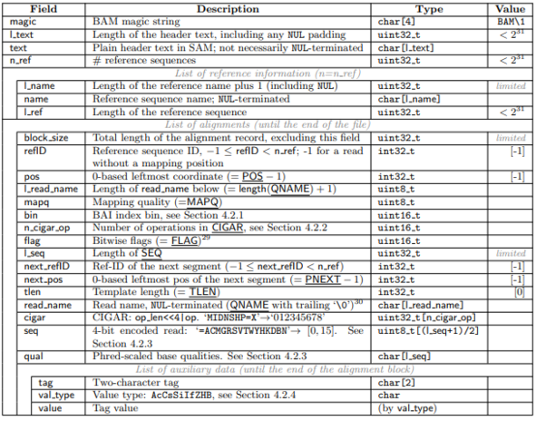
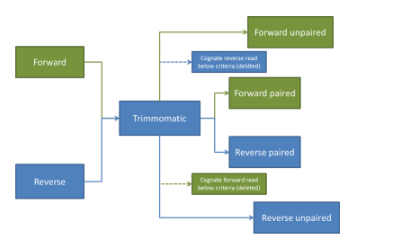

```{r setup, message=FALSE, warning=FALSE, include=FALSE}
knitr::opts_chunk$set(out.width = '100%', dpi=500) # configuratie voor figuur grootte en resolutie
library(ggplot2)
```

## Introductie:

Dit logboek gaat over Genomics en Transcriptomics, De eerste 5 weken focussen we op het Genomics gedeelte. In de Genomics kant van dit onderzoek gaan we kijken naar het volgende: **Zijn er varianten aanwezig van PAX5 en Ebf1 in het genoom van de rag2 knockout muizen die gebruikt zijn?** De reden dat gekozen is voor PAX5 en Ebf1 is omdat deze betrokken zijn bij de ontwikkeling van voorloper B cellen. Wanneer er variatie zit in onze DNA-seq kan dat erop wijzen dat de Ebf1 en PAX5 niet goed kunnen ontwikkelen wat er voor zorgt dat de voorloper B cellen nooit goed naar B cellen kunnen transformeren. Dit kan dus zorgen voor fouten in de ontwikkeling van de muis.

In het transcriptomics gedeelte wordt hier ook gebruik van gemaakt dus is het goed om te weten of er varianten aanwezig zijn in het genoom van de muizen die voor transcriptomics gebruikt worden (Rag2 knockout).

#### Onderzoeksvraag

**Zijn er varianten aanwezig van PAX5 en Ebf1 in het genoom van de rag2(-/-) muizen die gebruikt zijn?**

### Workflow

DNA was wel een deel van onze dataset echter is er in het referentie onderzoek ( @Ma2024 ) niet wat er mee gedaan is. Dit is de reden dat we hebben besloten om een variant analyse te doen op de data. Hier gaan we het referentiegenoom van de muis vergelijken met DNA seq data. In het onderzoek is het mm10 genoom gebruikt, dit genoom komt uit 2012 wat dus redelijk oud is en om deze reden vervangen wij dit oude genoom met het nieuwe muis genoom de GRCm39 deze komt uit 2020. De eerste stap is om de .SRA files te downloaden van de archieven, deze bevatten fastq bestamden, prefetch wordt gebruikt hiervoor. Dan worden de .SRA files uitgepakt door het gebruiken van fasterq-dump. Deze fastq files worden door FastQC gehaald om de kwaliteit te checken. De files worden geanalyseerd op kwaliteit en worden hierna getrimmed zo nodig. Duplicaten en adapters worden uit de DNA-seq gehaald en de data wordt gealiëneerd. Daarna wordt freebayes gebruikt om de DNA-seq te vergelijken met het referentie genoom wat dus de variant analyse is. Uit deze variant analyse resultaten wordt een visualisatie gemaakt en een conclusie of er wat gevonden is.

### Het onderzoek

Dit onderzoek focust op variant analyse, hierom is de **onderzoeksvraag** ook: **Zijn er varianten aanwezig van PAX5 en Ebf1 in het genoom van de rag2(-/-) muizen die gebruikt zijn?**

Deze onderzoeksvraag is relevant omdat er in het transcriptomics van het originele onderzoek @Ma2024 gekeken wort naar verschillen in expressie van de genoemde genen. Als er varianten aanwezig blijken te zijn in deze genen kan het verschil in de expressie tussen de muizen die gebruikt zijn in het onderzoek niet alleen aan de geteste factoren toegewezen worden. De invloed van veroudering op expressie is dan niet zeker want de mutaties kunnen ook voor andere werking zorgen van de genen.

Er is alleen DNA sequentie data beschikbaar van de rag(-/-) muizen. Om deze reden kan er niet gekeken worden naar mutaties in het rag2 gen, Deze is dus niet meer aanwezig.

Het Ebf1-gen, ook bekend als Early B-cell factor 1, speelt een cruciale rol in de differentiatie van voorlopercellen van B-lymfocyten. Een verminderde expressie van het Ebf1-gen kan resulteren in functieverlies van B-cellen. In samenwerking met PAX5 zijn deze genen betrokken bij de rijping van hematopoetische stamcellen. Een verlies van functie van PAX5 leidt tot de ophoping van snel delende lymfoblasten die niet in staat zijn tot normale differentiatie.

**Relevantie voor ons onderzoek**, De onderzoekers van het artikel hebben, in tegenstelling tot de analyses die het transcriptomicsgedeelte van de analyse berteffen, geen gebruikgemaakt van deze DNA data en andere gegevens, waardoor er geen vergelijkbare gegevens zijn. Hoewel ze een verouderd muis referentiegenoom (mm10) hebben toegepast, vervangen we dit door mm39.

Hieronder is een overzicht te zien van de Tools die wij gaan gebruiken in ons onderzoek.

+---------------+----------------------------------------------------------------------------------+----------------------+------------------------------------------------------------------------------------------------------------------------------------------------------------------------------------------------------------------------------------------------------------------------------------------------------------+
| Tool          | Referentie                                                                       | Versie               | Waarom                                                                                                                                                                                                                                                                                                     |
+===============+==================================================================================+======================+============================================================================================================================================================================================================================================================================================================+
| Featurecounts | <https://academic.oup.com/bioinformatics/article/30/7/923/232889?searchresult=1> |                      | Featurecounts is een zeer efficiënt algemeen "read" samenvattingsprogramma dat mapped reads telt voor genomische kenmerken zoals genen, exonen, promotor, genlichamen, genomische bins en chromosomale locaties. het kan worden gebruikt om zowel RNA-seq als genomische DNA-seq leesbewerkingen te tellen |
+---------------+----------------------------------------------------------------------------------+----------------------+------------------------------------------------------------------------------------------------------------------------------------------------------------------------------------------------------------------------------------------------------------------------------------------------------------+
| FastQC        | <https://www.bioinformatics.babraham.ac.uk/projects/fastqc/>                     | 0.11.9               | FastQC wordt gebruikt om de kwaliteit te checken van de rauwe data, hier uit is te zien of de data gelijk te gebruiken is of dat deze moet worden getrimmed. De trimmer kan ook afgesteld worden op basis van de fastqc.                                                                                   |
+---------------+----------------------------------------------------------------------------------+----------------------+------------------------------------------------------------------------------------------------------------------------------------------------------------------------------------------------------------------------------------------------------------------------------------------------------------+
| freebayes     | <https://github.com/freebayes/freebayes>                                         | 1.3.6 - linux versie | freebayes is een haplotype gebaseerde gen variant detector, ontworpen om kleine polymorfismes te detecteren, SNP's, inserties en deleties in het bijzonder. Dit programma gebruikt .BAM bestanden met een Phred+33 encoding.                                                                               |
+---------------+----------------------------------------------------------------------------------+----------------------+------------------------------------------------------------------------------------------------------------------------------------------------------------------------------------------------------------------------------------------------------------------------------------------------------------+
| seqtk         | <https://github.com/lh3/seqtk>                                                   |                      | seqtk wordt gebruikt voor het proceseren van sequences in het FASTA of FASTQ formaat. het "seamlessly parses" beide FASTA en FASTQ welke dan ook optimaal compressed wordt door gzip                                                                                                                       |
+---------------+----------------------------------------------------------------------------------+----------------------+------------------------------------------------------------------------------------------------------------------------------------------------------------------------------------------------------------------------------------------------------------------------------------------------------------+
| Trimmomatic   | <https://github.com/usadellab/Trimmomatic>                                       | 0.39                 | Trimmomatic wordt gebruikt om de data op te schonen nadat dez uit FastQC komt. Deze haalt de slechte kwaliteit paren af van de streng waardoor een hoge kwaliteit RNA- of DNA-streng overblijft die gebruikt kan worden.                                                                                   |
+---------------+----------------------------------------------------------------------------------+----------------------+------------------------------------------------------------------------------------------------------------------------------------------------------------------------------------------------------------------------------------------------------------------------------------------------------------+
| bwa mem2      | <https://github.com/bwa-mem2/bwa-mem2?tab=readme-ov-file>                        | 2.2.1                | Bwa mem2 wordt gebruikt om DNA en RNA reads te alignen tegen een gekozen referentie genoom.                                                                                                                                                                                                                |
+---------------+----------------------------------------------------------------------------------+----------------------+------------------------------------------------------------------------------------------------------------------------------------------------------------------------------------------------------------------------------------------------------------------------------------------------------------+
| Samtools      | <https://www.htslib.org>                                                         | 1.16.1               | samtools is een set van "utilities" dat alignments in de SAM, Bam en CRAM formatten kan manipuleren. het kan veranderen tussen de formats, sorteren, samenvoegen en indexen, ook kan het "reads" snel vinden in elke regio                                                                                 |
+---------------+----------------------------------------------------------------------------------+----------------------+------------------------------------------------------------------------------------------------------------------------------------------------------------------------------------------------------------------------------------------------------------------------------------------------------------+
| R             | <https://www.r-project.org>                                                      | 4.4.1                | R is de code taal die gebruikt wordt om alle statistieken testen te doen en tevens de visualisatie van de data die komt uit het onderzoek                                                                                                                                                                  |
+---------------+----------------------------------------------------------------------------------+----------------------+------------------------------------------------------------------------------------------------------------------------------------------------------------------------------------------------------------------------------------------------------------------------------------------------------------+
| R-studio      | <https://posit.co>                                                               | 2023.12.1+402        | R studio is het programma wat wordt gebruikt als IDE voor R                                                                                                                                                                                                                                                |
+---------------+----------------------------------------------------------------------------------+----------------------+------------------------------------------------------------------------------------------------------------------------------------------------------------------------------------------------------------------------------------------------------------------------------------------------------------+
| NCBI-GEO      | <https://www.ncbi.nlm.nih.gov/geo/>                                              |                      | NCBI-GEO is gebruikt om het originele onderzoek te vinden waar dit onderzoek inspiratie vanaf neemt                                                                                                                                                                                                        |
+---------------+----------------------------------------------------------------------------------+----------------------+------------------------------------------------------------------------------------------------------------------------------------------------------------------------------------------------------------------------------------------------------------------------------------------------------------+

{width="681"}

# Genomics

# Project Opzet

## Week 1

### Doelen van de week

**Het maken van een team & Onderzoeken zoeken met potentie**

**Het maken van een samenvatting van de Methoden**

**Het downloaden van de data doormiddel van SRA**

### Taken lijst - Week 1

-   Team maken
-   Literatuur + data set zoeken
-   Week planning maken
-   Afmaken Methoden
-   Herlezen document
-   Checken Methoden
-   Bash script schrijven voor de download
-   De SRA unpacken en data controleren

In de klas is er een groep gemaakt samen met Floris, Storm en Ivar. Wij vieren hebben als doelstelling een goed en interessant onderzoek te presenteren. De motivatie in deze groep is dus een goede basis om op te bouwen.

De Data set zoeken word gedaan via NCBI in de GEO datasets catagorie met de volgende zoek opdracht die als standaard is gesteld door de opdracht gevers: "("expression profiling by high throughput sequencing"[DataSet Type]) AND "genome variation profiling by high throughput sequencing"[DataSet Type]"

Aan deze query kan aan het einde nog een woord of onderwerp toegevoegd worden. In onze groep is besproken naar wat onze interesses waren en het hoofd idee was "aging" ook wel veroudering. Dit komt omdat gen expressie veranderd naarmate een organisme ouder word. Dit is anders in elk organisme en daardoor word er veel onderzoek naar gedaan. Wij zijn gekomen op 3 onderzoeken die uit eindelijk interessant waren

#### Niet gekozen Onderzoeken

-   @Zhang2021 : MiniCAFE, a CRISPR/Cas9-based compact and potent transcriptional activator, elicits gene expression in vivo. Dit onderzoek gaat over CRISPR-bemiddelde gen activatie. Dit is een belovende gen veranderingstrategie die DNA kan veranderen zonder dat de dubbele helix breekt. Deze is laten controleren door de opdrachtgever en die zei het volgende "Interessant onderzoek en leuk artikel, maar volgens mij zijn er voor het RNA-Seq gedeelte voor de meeste groepen maar 2 replicaten beschikbaar terwijl we daar minimaal 3 willen hebben. Mochten jullie niet iets anders kunnen vinden dan kunnen we dit experiment alsnog gebruiken, maar daar zitten wel wat risico's aan." Hierdoor zijn we gaan kijken naar andere opties.

-   @Takasugi2023 : Gene expressions associated with longer lifespan and aging exhibit similarity in mammals. Dit onderzoek hadden wij als tweede optie gevonden, het onderzoek gaat over gen expressie geassocieerd met langere levensspan en veroudering laten gelijkenis zien in zoogdieren. Dit onderzoek is niet gekozen door de onbeschikbaarheid van de DATA.\

#### Gekozen onderzoek

-   @Ma2024 : Three-dimensional chromatin reorganization regulates B cell development during ageing. Dit is de keuze geworden door de aanwezigheid van veel data. Dit zijn in totaal 76 samples die genomen zijn van de jonge en oudere muizen. Deze samples zijn van meerdere catagorien maar voor ons belangrijk zijn de verschillende RNA samples. Het doel van dit onderzoek is ook erg interresant en wij hebben na het lezen gelijk al nieuwe dingen geleerd. Wat er uit sprong was de A/B compartenment in de nucleus. Dit is een recente ontdekking en zegt dat er een A compartement is waar de genen worden expressed maar in het B compartement worden de genen niet expressed. Deze twee compartementen zitten nouw bij elkaar en laat dus zien dat er wel structuur zit in waar een gen zit en waar het niet zit in de cel.

#### Week planning

Door middel van het programma Trello is er een week planning gemaakt. Hier worden ook de taken verdeeld dit is te zien aan de foto's bij de tickets. De foto laat een gebruiker zien, dit gecombineerd met de datum waar voor het af moet zijn geeft ons een duidelijke verdeling. De datum toevoeging geeft de gebruiker die de ticket heeft ook een herinnering.

Hier een voorbeeld foto.


Hier zetten wij tickets in die aan bepaalde personen met verschillende urgenties

-   MUST - Moet gedaan worden voor een bepaalde datum of het einde van het project.

-   SHOULD - zou gedaan moeten worden want je wil het project liever niet opleveren zonder.

-   COULD - kan gedaan worden maar is zeker niet essentieel voor het project.

De planning van de week voor mij was dat ik de Methoden moest bekijken en samenvatten voor zover mogelijk zodat de belangrijkste delen hiervan in het PVA en de Powerpoint werden gezet.

De methoden zijn belangrijk omdat hierin de benodigdheden staan voor replicatie van het onderzoek. In de gekozen paper waren verschillende methoden die voor ons niet belangrijk zijn. Dit zijn bijvoorbeeld waar de muizen zijn gekocht of de Hi-C methoden, voor ons onderzoek is dit niet belangrijk omdat wij alleen naar de DNA-seq gaan kijken in vergelijking met het Referentie genoom (GRCm39)

<https://trello.com>

#### Methoden

Het weten van de methoden is belangrijk omdat wij moeten weten wat wij kunnen repliceren en wat te ver gegrepen is voor ons onderzoek en dit zou onze onderzoeksvraag kunnen beïnvloeden. Als we Hi-C als voorbeeld nemen dit is een hoge doorvoer techniek die chromatine conformatie vastlegt. Dit zouden wij niet in onze 5 weken kunnen doen op een goede manier. Dit is waarom wij kiezen voor de genoom analyse voor afwijkingen met het algemene referentie genoom.

In de les heb ik de methoden afgemaakt er waren uit eindelijk 24 methoden waar de materialen een beetje in gemixt stonden dit waren de volgende. Hier zijn er een paar die wel interessant zijn voor ons eigen onderzoek. Alle 24 methoden staan samen gevat in een extern document die te vinden is in de git.

-   Mice - Waar de muizen vandaan kwamen, de leeftijd en welke type met welke aanpassingen dit waren in ons geval C57BL/6J muizen van 8-12 weken oud voor de jongen en 100-110 weken oud voor de oudere muizen

-   Cell lines - De D345 cell line een "Wild-type D345" van yale zijn gecultureerd in RPMI1640 met 10% FBS en 1x penicillin streptomycin oplossing. Een variatie van de Rag2 cell, Ebf1 cell en de Pax5+ zijn gekweekt. verder ook 293T menselijke embronische nier cellen gekocht van ATCC gebruikt voor lentiviral expressie. Plat-E cell line gebruikt voor "retroviral" expressie. Alle cellen waren gekweekt in een 37 graden bevochtigde atmosfeer met 5% CO2

-   Antibodies - antilichamen zijn in dit onderzoek gebruik voor "immunoprecipitation" ook wel immunoprecipitatie en het "stainen" van H3K27ac voor de "staining" worden IgG isotype control antilichamen gebruikt.

-   Chip-seq en HiChIP- Chromatine immunoprecipitatie-sequencing of ChIP-seq genoemd, een nieuwe moleculaire laboratoriumtechniek die de DNA-bindingslocaties van een bepaald eiwit identificeerd. De DNA-fragmenten die aan het specifieke eiwit zijn verbonden, worden opgevangen met behulp van gesynthetiseerde immunoglobulinen, waarna de DNA-fragmenten worden gesequenced. De verzamelde DNA-sequenties worden daarna met behulp van softwaretools geanalyseerd om de kwaliteit van de ChIP-seq en mogelijke DNA-bindingslocaties te evalueren. HiChIP is een recent ontwikkelde methode voor het onderzoeken van de conformatie van chromatine, waarbij een in situ Hi-C-bibliotheek wordt voorbereid, gevolgd door een chromatine-immunoprecipitatiestap (ChIP). Dit proces is in het algemeen gericht op de histonmodificatie H3K27ac of cohesie.

-   Pro-B cell purification - hier zuiveren ze de Pro-B cellen door middel van positieve selectie van CD19+ en B220 markers.

-   In situ Hi-C - In situ HiC maakt gebruik van de relatieve frequentie van DNA-DNA-ligatiegebeurtenissen om de driedimensionale structuur van een genoom te heropbouwen. Op deze manier worden restrictie-enzymverteerde uiteinden van genomisch DNA in vaste kernen aangegeven met gebiotinyleerde dNTP's. DNA-DNA-ligatiegebeurtenissen die ontstaan door nabijheidsligatie worden daarna vastgelegd, versterkt en in de volgende generatie gesequenced om hun lineaire genomische positie vast te stellen, en hun driedimensionale relatie.

-   RNA-seq, De RNA-seq is niet heel belangrijk voor ons genomics deel echter is het wel belangrijk voor het transcriptomics deel. Dit wijst op hoe de RNA is gesequenced. Er zijn verschillende basis paren lengten gebruikt: 2x75, 1x100 , 2x100bp deze zijn allemaal gesequenced op een Illumina NovaSeq sequencer. De mapping is gedaan naar het mm10 genoom door middel van STAR. STAR is een aligner gemaakt om specifiek de vele uitdaging aan te pakken van RNA-seq data mapping. Het gebruikt een strategie om rekening te houden voor de "spliced" alignments.

Na alle methoden samengevat te hebben gingen wij als groepje kijken naar de materialen en methoden om te beslissen wat wij nodig hadden, wat outdated was en wat wij nog extra of anders wilden doen.

**Onze gekozen methoden & materialen**

-   **Muis-Gen:** Wij hebben in ons onderzoek een ander muis-gen dan het gen dat gebruikt is in het referentie onderzoek @Ma2024 , dit is omdat het referentie onderzoek een redelijk oud muis-gen gebruikt dit is het mm10 gen deze komt uit 2012. Wij gebruiken de GRCm39 ook wel het mm39 gen. Wij gaan dit gen gebruiken om te kijken of er variatie in zit tussen onze muizen en dit nieuwere referentie gen, dit nieuwere gen kan ons dus nieuw inzicht geven op mogelijke variaties / mutaties. De reden voor gebruik is dus dat dit nieuwere genoom van betere kwaliteit moet zijn dan de mm10.

-   **FastQC**: Dit programma hebben we gebruikt om de kwaliteit van de data te bekijken, FastQC is een programma wat fasta en fastq files kan inlezen dit kan via commandline, via galaxy (een website met bio informatica tool) en een FastQC programma met GUI. FastQC beoordeeld de files via verschillende tests en analyzen. Deze tests en analyzen zijn wat dieper uitgelegt in het FastQC hoofdstuk in tabel 1. De reden voor gebruik van fastQC is dus omdat het een zeer betrouwbaar programma (door het gebruik in vele wetenschappelijke artikelen) is en makkelijk te gebruiken is.

-   **Trimmomatic**: Dit programma hebben we gebruikt om de data na FastQC hogere kwaliteit te maken. Dit programma gebruikt verschillende parameters om de DNA-seq aan te passen zodat de kwaliteit goed genoeg wordt om dit te kunnen gebruiken. De reden dat de data wel met goeie kwaliteit kan worden gebruikt is omdat het dan betrouwbaar is. De reden dat wij trimmomatic gebruiken is omdat Storm en Ivar al veel ervaring hebben met trimmomatic en deze tool is gemaakt door illumina een bedrijf wat goed bekend staat om zijn sequencers dus een gevestigt bedrijf, waardoor het een betrouwbare tool is.

-   **Bwa-mem2**: Gebruikt om DNA-seq te aligneren met ons referentiegenoom. Het kan korte en middellange DNA- of RNA-reads alignen. Voor ons is Whole genome sequencing interresant dit is omdat hierbij de genomen worden gescand en dan vergeleken met het gekozen referentie genoom (in ons geval mm39 - GCF_000001635.27) dit om genetische variaties te identificeren. De reden waarom wij bwa-mem2 gebruiken en niet STAR is omdat Bwa-mem2 beter is voor DNA dit is omdat STAR gespecialiseerd is in RNA-seq ook is bwa-mem2 heel accuraat voor DNA sequences allignment, het gaat goed om met mismatches, kleine indels en langere reads. Het voordeel van bwa-mem2 is ook dat het minder zwaar is op de memory van de pc's. @Musich2021

-   **Freebayes**: Dit programma kijkt naar de alignement voor afwijkingen met het referentie genoom en geeft deze aan. De reden dat wij freebayes gebruiken is de goede documententatie en het makkelijke installatie proces. De bash scripts voor freebayes zijn makkelijk gemaakt en problemen kunnen snel worden verholpen met de documentatie die op de git staat.

#### Download - SRA script met prefetch

Eerst werd ons gevraagd om naar de juiste map te gaan. Dit kan door de terminal te openen naar onze home te gaan en cd naar /students/2024-2025/Thema05/ en hier de map voor ons project aan te maken.\
Of het kan geworden met de GUI waar je ook begint met het openen van de home folder en dan in de zoekbalk het volgende typen "/students/2024-2025/Thema05/" Hier hebben wij de map aangemaakt genaamd "3dconformatieChomatine" een verkorte benaming van de paper. Hier in moest nog een map gemaakt worden die SRA moest worden genoemd. De data moesten wij van de ncbi geo website afhalen door een SraAccList te downloaden. Deze bevatte de naam-codes die wij dan in het systeem kunnen oproepen om ze vervolgens daar te downloaden en unpacken.

Hieronder is het script te zien die gebruikt is om de SraAccList aan te roepen deze te lezen en daarna wordt —output gebruikt om hem in de goede map te zetten "\\" geeft een new line aan en de - -max-size 200g geeft aan dat de packed files niet meer mogen zijn dan 200 gigabytes

```{bash, eval=FALSE}
# Hier wil ik dat prefetch in de map te kijken SRA voor de gedownloade SraAccList deze wordt gebruikt om de files die ik wil te zoeken in de NCBI database
prefetch $(</students/2024-2025/Thema05/3dconformatieChromatine/SRA/SraAccList.csv) --output-directory \
/students/2024-2025/Thema05/3dconformatieChromatine/SRA/ --max-size 200G

```

Prefetch is deel van de SRA toolkit, dit programma downloads Runs (sequence files in het gecompresserde SRA format) en alle bijbehorende data benodigd om de Run van het SRA format naar een meer bruikbare file format om te zetten. Deze file formats kunnen fasta of fastq zijn bijvoorbeeld. Prefetch kan ook worden gebruikt om incomplete Run downloads af temaken en te corrigeren.

SRA Toolkit Release 3.1.1 is gebruikt. in deze toolkit zitten verschillende tools die gebruikt worden. De reden dat wij deze toolkit gebruiken is omdat deze van NCBI komt dit is ook het platform waarvandaan wij onze data halen dit zou dus het makkelijkste moeten werken.

Het SRA file ziet er heel simpel uit

SRR26980549\
SRR26980550\
SRR26980551\
SRR26980552

Het zijn de namen van de samples netjes onder elkaar.

## Week 2

### Doelen van de week

**De SRA data uitpakken en de FastQ bekijken**

**Test data maken**

**Reads alignenen aan refentie genoom**

### Taken lijst

-   Bash script schrijven voor het uitpakken
-   Fastq quality checken
-   Test data maken
-   Reads alignenen

#### Data uitpakken - fasterq-dump

Om de SRA data naar fastq om te zetten gebruiken we fasterq-dump. fasterq-dump is een programma in de SRA toolkit, wij gebruiken Release 3.1.1, De reden voor het gebruik van fasterq-dump is de goede documentatie en de link met NCBI waar wij onze files vandaan halen. Fasterq-dump zit ook in de SRA toolkit deze staat geïnstalleerd op het systeem dit is makkelijk te doen door naar de git te kijken van Fasterq-dump ook wel de SRA toolkit git.

Fasterq-dump neemt de SRA files en extract de data hiervan naar fastq- of fasta files. in ons geval fastq files.

Het fastQ format is een text gebaseerde format voor het opslaan van biologische sequenties (meestal nucleotiden sequenties) als de corresponderende kwaliteit's scoren.

De code hieronder zoekt eerst in de SRA map naar files met een filenaam die eindigt op .sra

deze runt hij parallel wat betekent dat hij meerdere processen doet over verschillende cores. Hij zet de files in een nieuwe map de fastq map en door de {} behoud het de naam waarmee het werd gedownload.

```{bash, extract_fastq_subset, eval=FALSE}
find /students/2024-2025/Thema05/3dconformatieChromatine/SRA/ -name "*.sra" | \
  parallel fasterq-dump -O /students/2024-2025/Thema05/3dconformatieChromatine/fastq/ {}
```

**Een fastQ bestand heeft een bepaalde indeling:**

Een header, deze header beginst met een \@ teken wat gevolgd wordt door een sequentie ID en soms een bescrhijving van wat het bestand bevat. Na deze header komen de sequeneties deze hebben een score die worden aangegeven met een + als start. De score wordt weergegeven in ASCII characters, Het "!" teken geeft de

Hier is een voorbeeld van hoe de fasta file er uit kan zien:

\@SEQ_ID - sequentie ID\
GATTTGGGGTTCAAAGCAGTATCGATCAAATAGTAAATCCATTTGTTCAACTCACAGTTT - DNAseq\
+ !''*((((***+))%%%++)(%%%%).1***-+*''))\*\*55CCF\>\>\>\>\>\>CCCCCCC65 - kwaliteit in ASCII

#### FastaQC - Raw data run

FastQC wordt gebruikt om de kwaliteit te checken van de rauwe data, hier uit is te zien of de data gelijk te gebruiken is of dat deze moet worden getrimmed. De trimmer kan ook afgesteld worden op basis van de Fastqc. @BabrahamBioinformatics

Waarom wij FastQC gebruiken is omdat voor wij gaan werken met onze data willen wij zien of de data wel geschikt is om mee te werken. Als de kwaliteit heel slecht is dan kunnen er niet betrouwbare resultaten uit worden gehaald, en het is niet goed repliceerbaar.

Er zijn meerdere resultaten die uit een FastQC check komen hier is een uitleg wat er uit komt en hoe dit gelezen moet worden.

+------------------------------+-----------------------------------------------------------------------------------------------------------------------------------------------------------------------------------------------------------------------------------------------------------------------------------------------------------------------------------------------------------------------------+-------------------------------------------------------------------------------------------------------------------------------------------------------------------------------------------------------------------------------------------------------------------------------------------------------------------------------------------------------------------------------------------------------------------------------------------------------------------------------------------------------------------------------------------------------------------------+
| Catagorie                    | Uitslag                                                                                                                                                                                                                                                                                                                                                                     | Hoe lees je dit                                                                                                                                                                                                                                                                                                                                                                                                                                                                                                                                                         |
+==============================+=============================================================================================================================================================================================================================================================================================================================================================================+=========================================================================================================================================================================================================================================================================================================================================================================================================================================================================================================================================================================+
| Basic statistics             | Hier krijg je een tabel met verschillende dingen zoals de Filename, file type, sequence length, %GC, Total sequences, Encoding en de sequences flagged as poor quality                                                                                                                                                                                                      | Het aflezen van deze tabel is lezen en checken of er geen fouten in zitten.                                                                                                                                                                                                                                                                                                                                                                                                                                                                                             |
+------------------------------+-----------------------------------------------------------------------------------------------------------------------------------------------------------------------------------------------------------------------------------------------------------------------------------------------------------------------------------------------------------------------------+-------------------------------------------------------------------------------------------------------------------------------------------------------------------------------------------------------------------------------------------------------------------------------------------------------------------------------------------------------------------------------------------------------------------------------------------------------------------------------------------------------------------------------------------------------------------------+
| Per base sequence quality    | Een grafiek zoals te zien is in figuur 1                                                                                                                                                                                                                                                                                                                                    | De grafiek heeft 3 vlakken die van verschillende grote en kleuren. De kwaliteit ranged van 0-40, 28-40 is goed and gekleurd groen, 20-28 is gekleurd geel/oranje, 0-20 gekleurd rood.                                                                                                                                                                                                                                                                                                                                                                                   |
|                              |                                                                                                                                                                                                                                                                                                                                                                             |                                                                                                                                                                                                                                                                                                                                                                                                                                                                                                                                                                         |
|                              |                                                                                                                                                                                                                                                                                                                                                                             | Verder representeert de gele box de 25th to 75th percentile. De zwarte lijnen geven de 10th en 90th percentile weer. De blauwe lijn geeft de gemiddelde scores voor kwaliteits controle score voor de nucleotide. gebaseerd op deze dingen is te zien dat de base van 1 tot 100 goede kwaliteit hierna gaat de kwaliteit sterk naar beneden. wat al aan geeft dat er getrimmed moet worden.                                                                                                                                                                             |
+------------------------------+-----------------------------------------------------------------------------------------------------------------------------------------------------------------------------------------------------------------------------------------------------------------------------------------------------------------------------------------------------------------------------+-------------------------------------------------------------------------------------------------------------------------------------------------------------------------------------------------------------------------------------------------------------------------------------------------------------------------------------------------------------------------------------------------------------------------------------------------------------------------------------------------------------------------------------------------------------------------+
| Per tile sequence quality    | Hier is een plot te zien waar de reads worden weergegeven als een soort heatmap. waarbij elke tegel 1 een read weergeeft op een bepaalde positie deze kwaliteit van de reads worden vergeleken met elkaar.                                                                                                                                                                  | Het aflezen van deze grafiek is door te kijken naar de kleur per tegel per positie. een donkerblauwe tegel betekent goede kwaliteit en hoe lichter de tegel word hoe slechter de kwaliteit dus lichtblauw betekent een slechte kwaliteit. Op de Y-as staat dan in welke tile het is en de X-as welke positie.                                                                                                                                                                                                                                                           |
+------------------------------+-----------------------------------------------------------------------------------------------------------------------------------------------------------------------------------------------------------------------------------------------------------------------------------------------------------------------------------------------------------------------------+-------------------------------------------------------------------------------------------------------------------------------------------------------------------------------------------------------------------------------------------------------------------------------------------------------------------------------------------------------------------------------------------------------------------------------------------------------------------------------------------------------------------------------------------------------------------------+
| Per sequence quality score   | Een grafiek die je de gemiddelde kwaliteit op de\                                                                                                                                                                                                                                                                                                                           | Het beste is wanneer de meeste reads een hoge gemiddelde kwaliteits score hebben en er geen grote dip in de grafiek is, dit betekent een lage kwaliteit.                                                                                                                                                                                                                                                                                                                                                                                                                |
|                              | x-as en de nummer van sequences met gemiddelde op de y-as.                                                                                                                                                                                                                                                                                                                  |                                                                                                                                                                                                                                                                                                                                                                                                                                                                                                                                                                         |
+------------------------------+-----------------------------------------------------------------------------------------------------------------------------------------------------------------------------------------------------------------------------------------------------------------------------------------------------------------------------------------------------------------------------+-------------------------------------------------------------------------------------------------------------------------------------------------------------------------------------------------------------------------------------------------------------------------------------------------------------------------------------------------------------------------------------------------------------------------------------------------------------------------------------------------------------------------------------------------------------------------+
| Per base sequence content    | Hier is een plot te zien met een y-as waar 0-100 aangegeven wordt en een x-as met de "positie in read (bp)" in de grafiek staan 4 lijnen met het percentage per base                                                                                                                                                                                                        | In figuur 2 is het volgende uit de grafiek te halen er is significante variatie in de nucleotide distributie aan het bein van de reads positie 1-10. Dit zou kunnen zijn door de voorbereiding of de vooroordelen in het sequencen. A, T, C en G zijn niet gelijk gerepresenteerd. na de 10de positioe zijn de base wat gestabilizeerd wat aan geeft dat de sequence kwaliteit in de rest van de reads hoger zijn. Het afgekeurde kruis komt dus door de choas van 1-10.                                                                                                |
+------------------------------+-----------------------------------------------------------------------------------------------------------------------------------------------------------------------------------------------------------------------------------------------------------------------------------------------------------------------------------------------------------------------------+-------------------------------------------------------------------------------------------------------------------------------------------------------------------------------------------------------------------------------------------------------------------------------------------------------------------------------------------------------------------------------------------------------------------------------------------------------------------------------------------------------------------------------------------------------------------------+
| Per sequence GC content      | Per sequence GC content geeft weer een plot weer met 2 lijnen. Een blauwe lijn die de theoretische distrubutie aangeeft wat dus een richtlijn is, en de GC count per read wat dus de gelezen data is.                                                                                                                                                                       | Het aflezen wordt door de twee lijnen vergelijken. het is ideaal als de twee lijnen overlappen of dichtbij elkaar liggen. Wanneer er meerdere pieken zijn die afwijken van de blauwe theoretische lijn kan dat betekenen dat er misschien sprake is van besmetting of sequencing errors. Er komt dus een rood kruis wanneer de GC abnormaal is vergeleken met de theoretische verwachting wat dus zegt da de algemene kwaliteit niet goed is.                                                                                                                           |
+------------------------------+-----------------------------------------------------------------------------------------------------------------------------------------------------------------------------------------------------------------------------------------------------------------------------------------------------------------------------------------------------------------------------+-------------------------------------------------------------------------------------------------------------------------------------------------------------------------------------------------------------------------------------------------------------------------------------------------------------------------------------------------------------------------------------------------------------------------------------------------------------------------------------------------------------------------------------------------------------------------+
| Per base N content           | De per base N content grafiek geeft de frequentie weer van "N" basecalls op elke positie in de reads. De "N" staat voor een onzekere of onbekende nucleotide, deze kon de sequencer niet identificeren als 1 van de base (A, T, C, G)                                                                                                                                       | X-as geeft de positie weer in de reads, Y-as geeft het percentage van reads met een "N" base op elke positie. Een hoge waarde betekent dat de sequencer op die positie vaak onzeker was over welke nucleotide er aanwezig was. De verwachting is dat er een zeer laag percentage N's in de sequence zit, de standaard hiervoor is \<1%. afwijkende resultaten kan wijzen op problemen zoals slechte kwaliteit van de sequentie. Ze komen vaak voor aan het begin of eind van de reads.                                                                                  |
+------------------------------+-----------------------------------------------------------------------------------------------------------------------------------------------------------------------------------------------------------------------------------------------------------------------------------------------------------------------------------------------------------------------------+-------------------------------------------------------------------------------------------------------------------------------------------------------------------------------------------------------------------------------------------------------------------------------------------------------------------------------------------------------------------------------------------------------------------------------------------------------------------------------------------------------------------------------------------------------------------------+
| Sequence length distribution | De sequence length distribution grafiek laat de verdeling van de lengtes van de reads zien. X-as geeft de lengte van de sequenties (in basenparen) en de Y-as toont aantal reads van die specifieke lengte.                                                                                                                                                                 | Deze grafiek is belangrijk bij NGS omdat afwijkingen in de sequentie lengte kunnen wijzen op fragmentatie of technische fouten tijdens sequencering . Een ideaal resultaat is een scherpe piek op 1 specifieke lengte wanneer je 150 bp doelreadlengte hebt zou de meeste sequencing output op precies 150 bp moeten vallen wat een piek bij die lengte zou moeten opleveren. Als er meerdere pieken zijn of een vrede spreiding van lengtes kan dit beteken dat er sequencing fouten, slechte adaptertrimming of degradatie van het DNA-monster.                       |
+------------------------------+-----------------------------------------------------------------------------------------------------------------------------------------------------------------------------------------------------------------------------------------------------------------------------------------------------------------------------------------------------------------------------+-------------------------------------------------------------------------------------------------------------------------------------------------------------------------------------------------------------------------------------------------------------------------------------------------------------------------------------------------------------------------------------------------------------------------------------------------------------------------------------------------------------------------------------------------------------------------+
| Sequence duplication levels  | De Sequence duplication levels grafiek laat het percentage van sequences zien die meer dan 1x voorkomen. Duplicaties kunnen voorkomen door technische "artifacts" tijdens de sequencing en andere factoreren zoals PCR-amplificatie, en kunnen de diversititeit van de dataset verminderen. Dit heeft invloed op downstream analyses zoals genexpressie of variantdetectie. | Het aflezen van de grafiek is door te kijken naar de twee lijnen in de grafiek de Duplicated sequences (meestal een rode lijn) geeft het percentage met unieke sequenties weer zonder correctie voor natuurlijke duplicaties. Het geeft een beeld van hoeveel van de reads in de dataset meerdere keren voorkomen zonder te differentiëren tussen technische en biologische duplicates. in de grafiek wil je graag een scherpe daling zien waarbij de meeste reads een duplicatie niveau van 1 hebben en het percentage gedupliceerede sequenties daarna snel afneemt.\ |
|                              |                                                                                                                                                                                                                                                                                                                                                                             | De total sequences lijn (meestal een blauwe lijn) corrigeert voor verwachte natuurlijke duplicates deze laat zien hoe de duplicatie eruit zou zien zonder technische artefacten en biedt een eerlijker beeld van hoeveel sequenties overgedupliceerd zijn de de sequencering zelf.\                                                                                                                                                                                                                                                                                     |
|                              | X-as laat het aantal keren zien dat de specifieke sequentie wordt gedupliceerd\                                                                                                                                                                                                                                                                                             | Als er een groot verschil is tussen de lijnen betekent dit dat er duplicatie is onstaan door technische factoren zoals PCR duplicatie in plaats van biologische oorzaak. Te hoge aantal dupolactie kan probleem zijn voor downstream analyses en je wil dus dat de lijnen dichtbij elkaar liggen.                                                                                                                                                                                                                                                                       |
|                              |                                                                                                                                                                                                                                                                                                                                                                             |                                                                                                                                                                                                                                                                                                                                                                                                                                                                                                                                                                         |
|                              | Y-as laat het percentage van reads dat voorkomt met duplicatie niveau zien                                                                                                                                                                                                                                                                                                  |                                                                                                                                                                                                                                                                                                                                                                                                                                                                                                                                                                         |
+------------------------------+-----------------------------------------------------------------------------------------------------------------------------------------------------------------------------------------------------------------------------------------------------------------------------------------------------------------------------------------------------------------------------+-------------------------------------------------------------------------------------------------------------------------------------------------------------------------------------------------------------------------------------------------------------------------------------------------------------------------------------------------------------------------------------------------------------------------------------------------------------------------------------------------------------------------------------------------------------------------+
| Overrepresented sequences    | Dit is een tabel die sequenties van op zijn minst 20bp die vaker voorkomen dan 0.1% van de totale nummer van sequenties. In de tabel staat de sequenties uitgeschreven, de count, het percentage en de waarschijnlijke bron                                                                                                                                                 | Wanneer er een abnormaliteit te zien was in de Per sequence GC content grafiek kan er in deze tabel worden gekeken om de bron te vinden. als het niet staat als een bekende adapter of "vector", kan het helpen om de data te blasten o te identiteit te vinden in de tabel.                                                                                                                                                                                                                                                                                            |
+------------------------------+-----------------------------------------------------------------------------------------------------------------------------------------------------------------------------------------------------------------------------------------------------------------------------------------------------------------------------------------------------------------------------+-------------------------------------------------------------------------------------------------------------------------------------------------------------------------------------------------------------------------------------------------------------------------------------------------------------------------------------------------------------------------------------------------------------------------------------------------------------------------------------------------------------------------------------------------------------------------+
| Adapter content              | Een grafiek waar verschillende adapters staan                                                                                                                                                                                                                                                                                                                               | Het geeft aan of de sequenties adapterfragmenten bevatten en van verschillende apparaten. als deze aanwezig zijn is het te zien door af te lezen in de grafiek welke positie er zijn om ze vervolgens weg te trimmen. deze "adaptercontent" is er voor identificatie van de DNA                                                                                                                                                                                                                                                                                         |
+------------------------------+-----------------------------------------------------------------------------------------------------------------------------------------------------------------------------------------------------------------------------------------------------------------------------------------------------------------------------------------------------------------------------+-------------------------------------------------------------------------------------------------------------------------------------------------------------------------------------------------------------------------------------------------------------------------------------------------------------------------------------------------------------------------------------------------------------------------------------------------------------------------------------------------------------------------------------------------------------------------+

: Table - 1

**Gebruikte bronnen voor uitleg**

@FastQCManual

@Khetani2018

Uit onze fastQC resultaten kwamen wat bijzondere resultaten. Er waren reads van verschillende lengten de grootste was 300 base paren wat boven de algemene norm is.

[](https://hbctraining.github.io/Intro-to-rnaseq-hpc-salmon/img/FastQC_seq_qual.png)

[](https://hbctraining.github.io/Intro-to-rnaseq-hpc-salmon/img/fastqc_per_base_sequence_content.png)

De conclusie uit de analyse van de FastQC resultaten is, Dat de generale statistieken 7 van de bestanden enorm veel duplicates wat een redelijk probleem vormt. Wat ook opvalt is dat alle bestanden met hoge duplicates een gem read lengte van 250 bp wat opmerkelijk lang is + de resultaten met enigszins goede kwaliteit hebben een gem lengte van 150 bp. Verder alle bestanden met veel duplicates bevatten veel minder reads dan de bestanden zonder of met weinig duplicates. Alle bestanden met 250 bp lengte eindigen aan het eind in het rode vlak in de sequentie kwaliteit en er is een dip bij de 110-120 waarna alles dus afzakt, voor de sequenties met 250bp is de kwaliteit goed van 0-110 bp. De sequence duplication levels zijn ook opmerkelijk door veel pieken en een hoog begin van de lijn. Overrepresented sequences vallen ook op want weer de 250bp bestanden hebben erg veel duplicates waar van sommige in de 50% zitten. Er zit ook heel veel adapter content bij 2 files is het zelfs \>50%. Kortom deze files moeten getrimmed of verwijderd worden.

Deze code komt uit het logboek van Ivar

```{bash, eval=FALSE}

#Hier wordt de working directory gezet, dit wordt gedaan met setwd
setwd("/students/2024-2025/Thema05/3dconformatieChromatine/fastq")
(x = getwd())
#Hier wordt fastqc uitgevoerd op fq.dir = x, x is de eerder gezette wd. 
fastqc(fq.dir = x, qc.dir = "/students/2024-2025/Thema05/3dconformatieChromatine/fastqc_output/", fastqc.path = "/usr/bin/fastqc", threads = 100)
#ook wordt de output gezet via het qc.dir commando, waar fastqc staat word ook aangegeven met fastqc.path. Als laatste word de threads command gebruikt om aan te geven hoeveel threads gebruikt mogen worden.

```

Hier is de code voor multiqc - geschreven door Ivar & Storm

```{bash, eval=FALSE}
#hier staat print working directory
pwd
# hier wordt met cd../ gezorgt dat bash 1 directory terug gaat
cd ../
# deze cd lijd bash naar fastqc_output
cd fastqc_output
# hier wordt de working directory weer geprint
pwd
# hier wordt multiqc uitgevoerd op alle bestanden in de fastqc_output
multiqc .
```

MultiQC wordt hier gebruikt om naar alle fastqc output files te kijken. Multiqc zoekt een directory voor FastQC output en compileert deze files zodat de algemene resultaten over meerdere files beter te begrijpen is.


Hier is MultiQC te zien, het overlapt alle grafieken en maakt hier 1 grote grafiek van waar wanneer deze wordt aangeklikt het allemaal dingen laat zien. Deze dingen zijn de naam van de sample, welke base positie het is en de kwaliteit. 1 ding wat ook nog anders is, is de score naast de titel. De score naast de titel laat zien dat 8 samples wel een goede kwaliteit hebben en 7 niet.

Om een gehele analyse te zien van de FastQC resultaten moet er gekeken worden naar de logboeken van Storm en Ivar

#### Test data maken

**Seqkit -** Is een veelzijdige tool voor het verwerken en analyseren van sequentiebestanden de inputs welke hij accepteert zijn FASTA en FASTQ. Het kan grote datasets efficiënt doorlopen en biedt meerdere functies zoals filtering, splitsen van sequenties, statistieken genereren, test data sets maken etc. De gebruikte versie op de bio inf assemblix server (waar de Rstudio commands op gerund worden) is op dit moment seqkit V2.3.0

**Testdata -** Test data is een essentieel deel van een onderzoek dit is om verschillende redenen, test data kan helpen om tools te valideren. Als de test data dezelfde resultaten geeft als de twee of meer echte data sets dan kan dit aangeven dat de tool niet goed werkt. Testdata kan ook worden gebruikt om de code in de bashscripts proef te runnen, dit omdat niet altijd alles goed gaat met de commando's en inplaats van de echte data te beschadigen kan dit beter met test data.

Dit is dus ook de reden dat wij test data hebben gemaakt om te kijken of de resultaten verschillen met de test data of dat deze hetzelfde zijn met onze echte data.

De volgende code is gebruikt hiervoor

Deze code is geschreven door Floris, ik heb op de bin pc echter ook om het zelf te oefenen ook een test-data set gemaakt. alle code is hieronder te zien.

```{bash, eval=FALSE}

cd /run/media/floris/FLORIS_3/DATA_SETS/3D_Chromatine_Conformatie/DNA/SRA

seqkit head -n 10000 SRR26980527_1.fastq > subset_SRR26980527_1.fastq
seqkit head -n 10000 SRR26980527_2.fastq > subset_SRR26980527_2.fastq

#Code voor op de bin PC
cd /students/2024-2025/Thema05/3D_Chromatine_Conformatie/DNA/SRA

# Eerst hebben we geprobeerd om "sample" te gebruiken in plaats van head
seqkit sample -p SRR26980527_1.fastq > subset_SRR26980527_1.fastq

# Dit werkte echter niet heel goed dus hebben we uiteindelijk head gevonden en gebruikt

seqkit head -n 10000 SRR26980527_1.fastq > subset_SRR26980527_1.fastq


```

Seqkit is het aanroepen van het programma wat de testdata maakt, de reden om seqkit te gebruiken is omdat het een super snel programma is. Sneller dan een programma zoals pigz wat multi-threaded is.

head selecteert het deel van de originele data waarop de test-data moet worden gebaseerd, het gebruiken van head inplaats van sample is voor repliceerbaarheid en reproductie omdat het heel erg lijkt op de originele data.

-n geeft de lengte aan van hoeveel reads in de test data moet zitten.

#### Achtergrond Info verzameling

De reden om achtergrond informatie te verzamelen is om het onderzoek beter te kunnen uitleggen. Het referentie onderzoek gaat over verschillende dingen die niet vaak worden behandeld. 2 van die dingen zijn de A/B compartimenten. Deze hebben invloed op de activatie van het genooom. Pro-b cellen zijn ook een belangrijk onderwerp in het referentie onderzoek en ze zijn ook belangrijk voor ons onderzoek, dit is omdat wij kijken naar de EBF1 want de Pro-B cellen hebben dit nodig om te differentiëren van hematopoetische stamcellen naar volwassen B cellen. Wanneer dit gen dus minder voorkomt (ook wel tot expressie komt) kunnen de B cellen van de voorloper B cellen hebben.

**A/B compartimenten**

@Harris2023\
@Oji2024

De nucleus van het humane genoom is verdeeld in verschillende ruimtelijke compartimenten. Actief chromatine bevindt zich doorgaans in het A-compartiment, terwijl inactief chromatine eerder geassocieerd is met het B-compartiment. Deze compartimentalisatie is geïdentificeerd met behulp van de Hi-C-methode, een techniek die de chromosomale organisatie in kaart brengt door op nabijheid gebaseerde interacties te combineren met hogedoorvoer sequencing. Het belang van de A- en B-compartimenten in ons onderzoek ligt in het feit dat *Ebf1* (Early B-Cell Factor 1), een cruciale factor voor pro-B-cellen, van positie verandert tussen deze compartimenten naarmate het organisme (de muis) ouder wordt.

Het A compartiment is dus het compartiment waar de expressie actief is en hoge gen transcriptie plaats vindt. Voor zo ver wij weten ligt het A compartiment dicht bij het centrum echter is dit nog wel speculatie. Gen rijk, hoge GC-content, hebben histone markeringen voor actieve transcriptie.

Het B compartiment is de plek waar de expressie non actief is ook wel "silenced", in het B compartimenten zitten niet veel genen, compact, hebben histone markeringen voor silencing en bestaan het meeste uit LADs en bevatten late replication origins.

TADs - Er wordt gesugereerd dat deze een grote invloed hebben op gen regulatie en dat ze belangrijk zijn voor embryonaal ontwikkeling. Ook werd gezien dat lange afstand regulatie van gen expressie niet allen leunt op TADs en hun grenzen.

Sub compartimenten - Er wordt gesuggereerd dat er binnen de twee compartimenten nog kleinere subcompartimenten zitten. Elk compartiment werd geobserveerd met verschillend histone modificatie patronen en RT. wat suggereert dat elke chromatine met gelijke karakteristieken in elkaar wordt gezet om verschillende interactie eenheden binnen de A en B compartimenten. Er is op het moment nog niet gevonden of er een link tussen de subcompartimenten ligt en het feitelijke nucleare oriëntatiepunten.

**Pro B-cell**

Pro-B cellen ontstaan in het beenmerg van progenitor cellen naar de B-cell lineage. elke pro-B cell ondergaat onafhankelijke herordening en op bouwing van diverse variabelen, diversiteit en "joining" gen segmenten van de immunoglobuline zware (H)- keten locus.

Kritisch voor de generatie van het verschillend repertoire van b cellen capabel in het herkennen van een wijde varia aan pathogene. De pro-B cell veranderd naar de pre-B cell dit gebeurd wanneer de zware immunoglobuline keten her georganiseerd is.

@Nemazee2017

#### Indexeren referentie genoom

Hier wordt ons gekozen referentie genoom ge indexeert. De reden voor het alignen van het referentie genoom is voor het gebruik van BWA-mem2. een geïndexeerde versie van het refentiegenoom moet dus gemaakt worden, dit kan met bwa-mem2 index. indexeren maakt het align proces veel sneller. De samples SRR26980528_1 en \_2 zijn gebruikt na het referentiegenoom te indexeren met BWA_MEM2. Het gebruikte referentie genoom is mm39 (GCF_000001635.27).

In de onderstaande code chunk wordt het geïndexeerde muisgenoom "testnaam" genoemd. Daarna worden twee samples (forward read en reverse read) ge-aligned met het zojuist verkregen geïndexeerde referentiegenoom.

**Wat hier uit komt is een SAM file deze ziet er als volgt uit:\
**\
\@HD VN:1.6 SO:coordinate - De header met de specifieke versie van het SAM format 1.6 dus \@SQ SN:ref LN:45 - Nog een header met de SN ook wel sequentie naam en de LN ook wel lengthe ***Hier onder zijn de alignment records te zien***\
r001 99 ref 7 30 8M2I4M1D3M = 37 39 TTAGATAAAGGATACTG \* r002 0 ref 9 30 3S6M1P1I4M \* 0 0 AAAAGATAAGGATA \* r003 0 ref 9 30 5S6M \* 0 0 GCCTAAGCTAA \* SA:Z:ref,29,-,6H5M,17,0; r004 0 ref 16 30 6M14N5M \* 0 0 ATAGCTTCAGC \* r003 2064 ref 29 17 6H5M \* 0 0 TAGGC \* SA:Z:ref,9,+,5S6M,30,1; r001 147 ref 37 30 9M = 7 -39 CAGCGGCAT \* NM:i:1

r001, r002 zijn de read names, de nummers er achter zijn de bitwise flag values welke informatie over de reads geeft zoals of het paired is of unmapped. 30 is de kwaliteit score voor de alignment. De letter en cijfer mix zoals "8M2I4M1D3M" zijn de CIGAR string die beschrijven hoe de read alignen naar de ref `M` = match, `I` = insertion, `D` = deletion, `S` = soft clipping, `P` = padding. Daarna zijn de reads te zien en het andere optionele veld voor allignment scores of alternatieve alignments.

<https://samtools.github.io/hts-specs/SAMv1.pdf>

*Deze code is geschreven door floris.*

```{bash, eval=FALSE}


cd /run/media/floris/FLORIS_3/DATA_SETS/3D_Chromatine_Conformatie/DNA/SRA


# Het indexeren van het referentiegenoom met bwa-mem2. 
bwa-mem2 index -p testnaam referentiegenoom

# Voorbeeld aligning:
bwa-mem2 mem ref.fa read1.fq read2.fq > aln-pe.sam

# Align sample SRR26980549_1.fastq (deel 1 en 2) met het referentiegenoom mm39 muis. 
./bwa_mem2/bwa-mem2-2.2.1_x64-linux/bwa-mem2 mem -p 60 testnaam fastq/SRR26980549_1.fastq fastq/SRR26980549_2.fastq > aligned_SRR26980549.sam &

# find /run/media/floris/FLORIS_3/DATA_SETS/3D_Chromatine_Conformatie/DNA/SRA -name "*.sra" | \
#   parallel fasterq-dump -O /run/media/floris/FLORIS_3/DATA_SETS/3D_Chromatine_Conformatie/DNA/SRA/FASTQ {}

```

Bij deze indexering is een aligned bestand verkegen wat een .sam file is, dit bestand is tekst met een header en een alignment deel. Deze file heeft de sequenties die aligned zijn tegen het refentie sequentie opgeslagen. Omdat de .SAM niet georderd zijn op positie in het genoom moeten ze eerst met samtools sort omgezet worden naar een .BAM bestand (kijk naar het logboek van floris voor een diepere uitleg) de reden om dit te doen is dat het opvragen van data sneller gemaakt word als het geïndexeerd is.

Samtools versie 1.16.1 is gebruikt dit is een collectie van tools om high-throughpout sequence data te werken. Het kan verschillende dingen zoals WGS/WES mapping naar variant calls en het filteren van .vcf bestanden. @samtools_markdup

-O BAM geeft het format aan, samtools sort -n zorgt dat de .sam gesorteerd worden op read naam (De QNAME kolom in het bestand)

BAM files zijn niet humaan leesbaar dus om te begrijpen wat er in staat is hier een foto voor uitleg.

[](https://samtools.github.io/hts-specs/SAMv1.pdf)

*Deze code is geschreven door floris*

```{bash, eval=FALSE}
# Voor een enkel sample:
samtools sort -n -O BAM -o aligned_sorted_SRR26980549.bam aligned_SRR26980549.sam

# Met parallel:
cat /students/2024-2025/Thema05/3dconformatieChromatine/SRA/SraAccList.csv | parallel 'samtools sort -n -O BAM -o aligned_sorted_{}.bam aligned_{}.sam ' &

```

"fixmate -m" voegt score tags toe die gebruikt worden door markdup om de beste reads te selecteren om te behouden.

Met "—Threads" wordt het aantal threads gespecificeerd dat de computer moet gebruiken voor dit commando. @samtools_markdup

De reden waarom je de mate-informatie wil corrigeren en mogelijke duplicaten wil weten is omdat je wil dat de paired-end reads goed worden geïnterpreteerd. Dit betekent dat je geen valse positieve of valse mutaties wil dit zou namelijk het onderzoek comprimeren. Het er uit halen van duplicaten en het corrigeren van de mate-info zorgt dus voor meer nauwkeurigheid en betrouwbaarheid van de "downstream" analyses zoals variant detectie in ons geval.

*Deze code is geschreven door floris*

```{bash, eval=FALSE}
# Voor een enkel sample:
samtools fixmate -m --threads 16 aligned_sorted_SRR26980549.bam \ fixed_mates_aligned_sorted_SRR26980549.bam

# Met parallel:
cat /students/2024-2025/Thema05/3dconformatieChromatine/SRA/SraAccList.csv | parallel 'samtools fixmate -m --threads 16 aligned_sorted_{}.bam fixed_mates_aligned_sorted_{}.bam' &


```

Met samtools markdup worden duplicaten gemarkeerd. Met het "-r" argument worden deze verwijderd en met "-s" worden statistieken over de data en uitgevoerde handelingen.

Bron: @samtools_markdup

*Deze code is geschreven door floris*

markdup, is het commando in samtools om markdup aan te roepen, markdup zoekt naar duplicaten in BAM-bestanden

-r, deze optie zorgt voor dat duplicaten worden "removed" ook wel verwijderd uit het bestand. Zonder deze optie zouden de duplicaten alleen worden gemarkeerd.

-s, deze optie zorgt dat informatie over de duplicaten naar STDERR (foutuitvoer) geschreven worden, dit is handig voor loggen en trouble shooten.

sorted_coordinates_SRR26980549.bam, dit is het input BAM bestand waarin de reads op hun genoomcoördinaten zijn gesorteerd. Zonder dit bestand werkt markdup niet

dedup_SRR26980549.bam, dit is het output BAM bestand waarin de dupicaten zijn gemarkeerd en in ons geval ook verwijderd.

De reden om markdup te gebruiken en dus de duplicaten te markeren en verwijderen is, voor meer nauwkeurigheid in de data, ook de betrouwbaarheid van de downstream analyse wordt hoger.

```{bash, eval=FALSE}
# Voor een enkel sample:
samtools markdup -r -s sorted_coordinates_SRR26980549.bam dedup_SRR26980549.bam

# Met parallel:
cat /students/2024-2025/Thema05/3dconformatieChromatine/SRA/SraAccList.csv | parallel  'samtools markdup -r -s sorted_coordinates_{}.bam dedup_{}.bam' &

```

Met samtools index wordt er een index bestand gemaakt bij elke sample

index, dit is het commando om indexing aan te roepen in de samtools toolkit.

verder zijn de input en ouput sample te zien dedup_SRR26980549.bam en dedup_SRR26980549.bai er is wel iets veranderd aan de extensie. Het is van .bam naar .bai gegaan, de afkorting .bai staat voor BAM index

Als laatste is de & te zien, dit zorgt ervoor dat het bash script op de achtergrond wordt uitgevoerd.

De reden om de samples te indexen is omdat geïndexeerde bestanden sneller zijn, dit in de zin van zoeken naar specifieke regios. In een geïndexeerd bestand is het mogelijk om direct specifieke delen te bezoeken, voor sommige programa's is het ook een vereiste om geïndexeerde data te hebben. Dit zijn programmas zoals IGV (Integrative Genomics Viewer) waar visueel naar data gekeken word. Kortom efficiëntie

Een BAI ook wel BAM index file is een binair file, hier is een voorbeeld van hoe een bai file er uit kan zien

*Deze code is geschreven door floris*

```{bash, eval=FALSE}
# Voor een enkel sample:
samtools index dedup_SRR26980549.bam dedup_SRR26980549.bai  &

# Met parallel:
cat /students/2024-2025/Thema05/3dconformatieChromatine/SRA/SraAccList.csv | parallel 'samtools index dedup_{}.bam dedup_{}.bai' &

```

Bron: <https://github.com/freebayes/freebayes> Met behulp van het onderstaande stuk code worden de resulaten van de freebayes variant calling direct gefilterd op kwaliteit met vcffilter. Met "QUAL = 20" worden enkel de variants geselecteerd die 99% kans hebben dat er een variant zit op die plaats.

**Freebayes** - is de tool die gebruikt wordt om genetische varianten te detecteren ook wel "variant calling" de gebruikte versie is 1.3.6 op linux

-f, deze optie geeft het referentie genoom aan dat gebruikt wordt bij het vergelijken van de sequentie-reads. Freebayes gebruikt dit referentiegenoom (referentie genoom is GRCm39) om genetische varianten te detecteren.

Het dedup_SRR26980549.bam bestand is het bestand wat als input wordt gebruikt, freebayes kijkt in deit bestand de uitgelijnde reads om genetische varianten te detecteren

Het "\|" symbool is een pipe, waarmee de uitvoer van freebayes gelijk doorgegeven wordt aan vcffilter zonder een tussenbestand te maken.

vcffilter, dit is een tool die wordt gebruikt om VCF-bestanden te filteren op basis van bepaalde criteria. In ons geval gebruiken wij vcffilter-assembly-0.2 jar. de criteria die wij hebben gezet is een minimale kwaliteit hoger dan 20 dit wordt gedaan met "QUAL \> 20"

De reden om een VCF-bestand ook wel Variant Call Format te maken is het opslaan van genetische varianten. Het VCF bestand is essentieel voor de visualisatie die wij later gaan doen.

Hier is een voorbeeld van hoe een VCF-bestand er uit kan zien:

 ##fileformat=VCFv4.3 - Hier staat het Format en de versie\
 ##fileDate=20090805 - De datum van generatie van deze file\
 ##source=myImputationProgramV3.1 - source tool waarmee de VCF is genmaakt\
 ##reference=<file:///seq/references/1000GenomesPilot-NCBI36.fasta> - referentie genoom gebruikt voor variant zoeken\
 ##contig\<ID=20,length=62435964,assembly=B36,md5=f126cdf8a6e0c7f379d618ff66beb2da,species="Homo sapiens",taxonomy=x\> - ID van chromosoom of scaffold + lengthe in base paren.\
 ##phasing=partial - het proces van toewijzen van allelen aan de chromosomen\
 ##INFO=\<ID=NS,Number=1,Type=Integer,Description="Number of Samples With Data"\> \
 ##INFO=\<ID=DP,Number=1,Type=Integer,Description="Total Depth"\> \
 ##INFO=\<ID=AF,Number=A,Type=Float,Description="Allele Frequency"\> \
 ##INFO=\<ID=AA,Number=1,Type=String,Description="Ancestral Allele"\> \
 ##INFO=\<ID=DB,Number=0,Type=Flag,Description="dbSNP membership, build 129"\> \
 ##INFO=\<ID=H2,Number=0,Type=Flag,Description="HapMap2 membership"\> \
 ##FILTER=\<ID=q10,Description="Quality below 10"\> \
 ##FILTER=\<ID=s50,Description="Less than 50% of samples have data"\> \
 ##FORMAT=\<ID=GT,Number=1,Type=String,Description="Genotype"\> \
 ##FORMAT=\<ID=GQ,Number=1,Type=Integer,Description="Genotype Quality"\> \
 ##FORMAT=\<ID=DP,Number=1,Type=Integer,Description="Read Depth"\> \
 ##FORMAT=\<ID=HQ,Number=2,Type=Integer,Description="Haplotype Quality"\> \
 #CHROM POS      ID         REF   ALT    QUAL  FILTER   INFO                             FORMAT       NA00001         NA00002          NA00003 \
20     14370    rs6054257  G     A      29    PASS    NS=3;DP=14;AF=0.5;DB;H2           GT:GQ:DP:HQ  0\|0:48:1:51,51  1\|0:48:8:51,51   1/1:43:5:.,. \
20     17330    .          T     A      3     q10     NS=3;DP=11;AF=0.017               GT:GQ:DP:HQ  0\|0:49:3:58,50  0\|1:3:5:65,3     0/0:41:3 \
20     1110696  rs6040355  A     G,T    67    PASS    NS=2;DP=10;AF=0.333,0.667;AA=T;DB GT:GQ:DP:HQ  1\|2:21:6:23,27  2\|1:2:0:18,2     2/2:35:4 \
20     1230237  .          T     .      47    PASS    NS=3;DP=13;AA=T                   GT:GQ:DP:HQ  0\|0:54:7:56,60  0\|0:48:4:51,51   0/0:61:2 \
20     1234567  microsat1  GTC   G,GTCT 50    PASS    NS=3;DP=9;AA=G                    GT:GQ:DP     0/1:35:4        0/2:17:2         1/1:40:3 

```{bash, eval=FALSE}
# Voor een bestand:
/students/2024-2025/Thema05/3dconformatieChromatine/freebayes/freebayes-1.3.6-linux-amd64-static \
 -f /students/2024-2025/Thema05/3dconformatieChromatine/Mapping_ref/ncbi_dataset/ncbi_dataset/data/GCA_000001635.9/GCA_000001635.9_GRCm39_genomic.fna dedup_SRR26980549.bam | /students/2024-2025/Thema05/3dconformatieChromatine/vcffilter/vcffilter-assembly-0.2.jar -f "QUAL > 20" > filtered_SRR26980549.vcf
 
 
# Met parallel: 
cat /students/2024-2025/Thema05/3dconformatieChromatine/SRA/SraAccList.csv | parallel '/students/2024-2025/Thema05/3dconformatieChromatine/freebayes/freebayes-1.3.6-linux-amd64-static \
 -f /students/2024-2025/Thema05/3dconformatieChromatine/Mapping_ref/ncbi_dataset/ncbi_dataset/data/GCA_000001635.9/GCA_000001635.9_GRCm39_genomic.fna dedup_{}.bam | /students/2024-2025/Thema05/3dconformatieChromatine/vcffilter/vcffilter-assembly-0.2.jar -f "QUAL > 20" > filtered_{}.vcf' &
```

Om alle paired read samples te mappen is het onderstaande bash script gebruikt. Hier is weer het parallel commando voor gebruikt. De lijst met sample namen wordt aan bwa-mem2 gegeven zodat het programma naar input bestanden met deze namen kan kijken en de gegenereerde .sam bestanden ook deze naam te geven.

```{bash, eval=FALSE}
#cat concatinate de sraacclist en geeft het mee aan parallel
cat /students/2024-2025/Thema05/3dconformatieChromatine/SRA/SraAccList.csv |
#parallel zorgt dat de tool tegelijkertijd uit gevoerd wordt. hier voert het voor elk sample in de lijst het bw-mem2 commando uit
parallel '/students/2024-2025/Thema05/3dconformatieChromatine/bwa_mem2/bwa-mem2-2.2.1_x64-linux/bwa-mem2 mem -t 60 testnaam /students/2024-2025/Thema05/3dconformatieChromatine/fastq/{}_1.fastq /students/2024-2025/Thema05/3dconformatieChromatine/fastq/{}_2.fastq > /students/2024-2025/Thema05/3dconformatieChromatine/mapping/{}.sam' &

```

bwa-mem2 mem roept het programma bwa-mem2 aan dit wordt gebruikt om de illumina sequenties te mappen

-t 60 geeft aan dat het proces 60 threads moet gebruiken om de snelheid te verhogen. Dit is handig om te doen voor uitlijning van grote hoeveelheden data omdat het dan sneller verwerkt wordt.

/students/2024-2025/Thema05/3dconformatieChromatine/fastq/{}\_1.fastq en /students/2024-2025/Thema05/3dconformatieChromatine/fastq/{}\_2.fastq geeft de paths naar de fastq input bestanden weer.

/students/2024-2025/Thema05/3dconformatieChromatine/mapping/{}.sam geeft de path waar de output bestanden heen moeten

& dit zet het hele parallel-proces op de achtergrond zodat de shell beschikbaar is tijdens het proces.

# Data Trimming

## Week 3

### Doelen van de week

**Data trimmen**

**Quality herchecken**

**Variantie detectie**

### Taken lijst

-   Fastq quality checken en kijken hoe de data moet worden getrimd
-   Data trimmen
-   Freebayes script schrijven

#### Trimmomatic

Trimmomatic is een flexibel trimsoftware voor illumina sequence data, het kan zowel paired-end als dsingle ended data aan. Er zijn verschillende stappen in het trimmen en verschillende parameters. Trimmomatic is een command line gerunde tool. De voordelen van trimmomatic zijn dat het goed omgaat met het "collapsing" en "trimming" van paired-end en sequencing van fragmenten die korten zijn dan de leeslengte, waarbij de leeslengte zich aan het einde van elke leeslengte uitstrekt tot in de adapters. Het zorgt ook dat terwijl het de data schoonmaakt zijn intergriteit behoud.

Het trimmen van de data is nodig omdat zoals te zien in het logboek van Storm en Ivar de kwaliteit van onze data niet hoog is. Om dit te verbeteren moeten wij trimmen, de reden dat wij hogere kwaliteit data willen is omdat er geen conclusie kan worden getrokken uit slechte kwaliteit data omdat het fout kan zijn. De Trimmomatic is goed aan te passen en kan adapters weghalen deze twee dingen zijn essentieel dit omdat onze data is gesequenced uit ilumina apparatuur wat dus kan betekenen dat het ilumina adapters heeft, en omdat wij specifieke aanpassingen willen maken die met trimmomatic goed kunnen worden gedaan.

```{bash, eval=FALSE}

cat data/GSE149995_Sra_RunInfo.csv | \
  parallel 'TrimmomaticPE -threads 16 ' \
                  '/students/2024-2025/Thema05/3dconformatieChromatine/fastq/{}.fastq.gz ' \
                  '/students/2024-2025/Thema05/3dconformatieChromatine/fastq-trimmed/{}.trimmed.fastq.gz ' \
                  'ILLUMINACLIP:/homes/marcelk/Development/2.1.2-Transcriptomics/TruSeq3-SE.fa:2:30:10 ' \
                  'MINLEN:40 ' \
                  'SLIDINGWINDOW:4:20'

```

Hier is het bash script te zien dat wij hebben gebruikt om onze data te trimmen. Eerst is de cat command te zien dit is ook wel concatenate dit read de file en print zijn content. Het leest de GSE149995_Sra_RunInfo deze file is belangrijk omdat het metadata bevat over de sequenceing runs die gedowload zijn uit de SRA database, er kunen dingen instaan zoals Sample names, Sequencing platform, Run accesion numbers en nog andere data.

parallel is een command dat trimomatic meerdere cores tegelijk moet gebruiken, dit doen wij omdat het programma dan sneller de data kan verwerken.

Met -threads 16 word aangegeven dat het 16 threads mag gebruiken.

Met TrimmomaticPE wordt trimmomatic aangeroepen, verder zijn 2 andere belangerijke dingen de { } is om de trimmomatic te automatiseren dit doet hij door alle files in de map fastq te nemen die eindigen met .fastq.gz en de output van trimmomatic naar de fastq-trimmed map te zetten.

Het andere belangrijke is de MINLEN en Slidingwindow commando's. Minlen laat de reads vallen wanneer het onder een bepaalde lengte is.

Slidingwindow het zorgt ervoor dat trimmomatic snijdt zodra de gemiddelde kwaliteit binnen het venster onder een drempelwaarde komt.

Er zijn ook een paar samples niet gebruikt. Dit zijn de: B220+CD43+IgM- sorted primary pro-B cells. Deze samples zijn verkregen met een illumina MiSeq.

SSR26980527\
SSR26980528\
SSR26980529\
SSR26980530

De reden dat we deze niet gebruiken is omdat het samples van WT muizen zijn, We gaan hier het referentiegenoom voor gebruiken. De kwaliteit van deze sequenties was volgens fastQC veel slechter dan de onderstaande samples. Dit kan mogelijk komen omdat de reads te lang waren waardoor de kwaliteit snel daalde.

De volgende samples zijn wel gebruikt. Dat zijn: Primary pro-B cells by CD19+ selection (RAg2-/-) Deze sa,ples zijn verkregen met een illumina NovaSeq 6000

SRR26980549.sam\
SRR26980550.sam\
SRR26980551.sam\
SRR26980552.sam

De samples die onnodig waren zijn ook verwijderd uit de SraAccList.csv omdat deze met de pipe operator interveren, dit kan voor problemen zorgen of overbodige belasting.

Voor diepere analyse check het logboek van Storm en Ivar

**Flow chart voor Paired End mode.**

[](http://www.usadellab.org/cms/uploads/supplementary/Trimmomatic/TrimmomaticManual_V0.32.pdf)

Deze flowchart toont hoe Trimmomatic paired-end reads verwerkt. Het programma neemt beide reads als input en beoordeelt hun kwaliteit. Als zowel de forward als reverse reads voldoen aan de gekozen settings, blijven ze "paired" voor verdere analyse. Als één van de twee niet aan de kwaliteitsnormen voldoet wordt de slechte read verwijderd en de goede read als "unpaired" opgeslagen. Hierdoor onstaan vier mogelijkheden voor outputs: forward paired, reverse paired, forward unpaired en reverse unpaired. Allemaal afhankelijk van de kwaliteit van elke read.

# Quality control - 2

#### Fastqc run 2

Deze tweede FastQC run is gedaan na het mappen van de data.


Hier is de data te zien nadat deze getrimmed is, er zijn een paar dingen veranderd: We hebben nog maar 8 files van ongeveer 150 bp lang.

**Conclusie FastQC run 2**

De conclusie van de fastqc rapport is dat de samples 549, 550, 551, 551 goed zijn op het gebied van de algemene sequentie kwaliteit. Alleen deze samples laten een aantal bijzonderheden zien die we niet helemaal kunnen verklaren, maar hoogstwaarschijnlijk niet ernstig genoeg zijn om de verdere stappen te kunnen beinvloeden.

Voor verdere analyse zie logboek van Ivar of Storm

# Align data

**Sorteren .sam bestanden**

#### Bwa-mem2

BWA-MEM2 wordt gebruikt om zowel DNA- als RNA-reads te aligneren met een referentiegenoom. Het kan korte en middellange DNA- of RNA-reads alignen. Er zijn verschillende manieren waar dit voor gebruikt kan worden zoals, Whole genome sequencing, Exoomsequencing en RNA-seq. Voor ons is Whole genome sequencing interresant dit is omdat hierbij de genomen worden gescand en dan vergeleken met het gekozen referentie genoom (in ons geval mm39 - GCF_000001635.27) dit om genetische variaties te identificeren.

BWA-MEM2 heeft een geïndexeerde versie nodig van ons referentie genoom, deze moet dus eerst gemaakt worden. Dit kan gedaan worden met bwa-mem2 index, nog een plus punt is het indexeren maakt het align proces veel sneller. De samples SRR26980528_1 en \_2 zijn gebruikt na het referentiegenoom te indexeren. Het gebruikte referentie genoom is mm39 - GCF_000001635.27 in ons geval heet deze file "testnaam"

*Deze code is geschreven door Floris deze is te vinden in zijn logboek - Deze code is voor de aligning van de data.*

Eerst is cat te zien ook wel concatenate dit read de file en print zijn content, dan is parallel te zien deze runt de workload over meerdere cores. Dan is te zien dat we een path aangeven specifiek naar bwa-mem2 omdat deze is geinstalleerd in deze speicifieke map, met mem roepen we de allignment modus aan welke bwa moet gebruiken deze modus is goed voor reads die door illumina machines zijn gesequenced. Het volgende wat te zien is is een -t 50 dit geeft aan hoeveel threads bwa moet gebruiken, testnaam refereent naar het geindexeerde referentie genoom. Dan zijn weer 2 paths te zien, deze referen naar de forward en reverse strands en de {} is om te zorgen dat het alle files in de map kan lezen zodat het eigenlijk de gehele map automatisch doet. De laatst path is voor de output en de laatste character "&" is zodat dit op de achtergrond gebeurd.

```{bash, eval=FALSE}
cat /students/2024-2025/Thema05/3dconformatieChromatine/SRA/SraAccList.csv | parallel /students/2024-2025/Thema05/3dconformatieChromatine/bwa_mem2/bwa-mem2-2.2.1_x64-linux/bwa-mem2 mem -t 50 testnaam /students/2024-2025/Thema05/3dconformatieChromatine/Trimmomatic_output/paired/{}_forward_paired.fastq /students/2024-2025/Thema05/3dconformatieChromatine/Trimmomatic_output/paired/{}_rev_paired.fastq > /students/2024-2025/Thema05/3dconformatieChromatine/mapping/{}.sam &

```

De reden waarom wij bwa-mem2 gebruiken en niet STAR is omdat bwa-mem2 beter is voor DNA dit is omdat STAR gespecialiseerd is in RNA-seq ook is bwa-mem2 heel accuraat voor DNA sequences allignment, het gaat goed om met mismatches, kleine indels en langere reads. Het voordeel van bwa-mem2 is ook dat het minder zwaar is op de memory van de pc's.

#### Converteer SAM naar BAM

```{bash, eval=FALSE}
samtools sort -n -O BAM -o aligned_sorted_SRR26980549.bam aligned_SRR26980549.sam

# Met parallel:
cat /students/2024-2025/Thema05/3dconformatieChromatine/SRA/SraAccList.csv | parallel samtools sort -n -O BAM -o aligned_sorted_{}.bam aligned_{}.sam  &

```

Ondanks dat de .bam eerst staat en dan de .sam worden de sam files naar bam omgezet.

cat /students/2024-2025/Thema05/3dconformatieChromatine/SRA/SraAccList.csv, leest de lijst van sample-namen uit het SraAccList CSV bestand, dit bestand bevat de accessienummers bijvoorbeeld SRR26980550.

samtools sort -n -O BAM -o aligned_sorted\_{}.bam aligned\_{}.sam: dit is het sorteer commando wat uitgevoerd wordt, id de parallel staan inplaats van de bestand namen alleen de {} en de file type in dit geval .bam & .sam. Dit zorgt dat samtools kijkt in de map waar het uitgevoerd wordt er gezocht naar alleen bestanden die voldoen aan de filter eisen dus iets waar "aligned_sorted\_" in staat, dan de {} dus de sample naam waarschijnlijk en dan de .bam afkorting.

&, dit zorgt ervoor dat het script op de achtergrond gerund word waardoor er verder gewerkt kan worden terwijl dit script runt.

De reden om de aligned files om te zetten van .sam naar .bam is omdat deze worden gebruikt om een bed file te maken. Ook zijn er voordelen aan bam bestanden tegenover sam bestanden dit zijn: minder opslagruimte, meer compatibiliteit en sneller lees baar door verschillende tools.

#### Freebayes - variant calling

@BioinformaticsWorkbook

Freebayes is een "Bayesian" genetische variant detector gemaakt om kleine "poylmorphisms" (de aanwezigheid van twee of meer varianten van een specifieke DNA-sequentie), in het specifiek SNPs (single-nucleotide polymorphisms), indels (insersties en verwijderingen), MNPs (multi-nucleotide polymorphisms), en complexe evenementen (composite insertion and substitution events) kleiner dan de lenghte van een short-red sequencing alignment.

freebayes is haplotype-gebaseerd, in de manier waarop het varianten called gebaseerd op de leterlijke sequenties van reads ge aligned naar een specifieke target, niet hun exacte alignment. Dit model is een eenvoudige generalisatie van eerdere modellen (bijv. PolyBayes, samtools, GATK) die varianten detecteren of rapporteren op basis van alignments. Deze methode vermijdt een van de kernproblemen met alignment-based variant detection--- dat identieke sequenties meerdere mogelijke alignments kunnen hebben.

Voordat de freebayes echt bezig kan moeten er nog wel een paar bestanden aangepast worden.

```{bash, eval=FALSE}
/students/2024-2025/Thema05/3dconformatieChromatine/freebayes/freebayes-1.3.6-linux-amd64-static -f GCA_000001635.9_GRCm39_genomic.fna \ /students/2024-2025/Thema05/3dconformatieChromatine/aligned_sorted_SRR26980549.bam > \ 
/students/2024-2025/Thema05/3dconformatieChromatine/variant_calling/SRR26980549_test.vcf
```

De code hier activeert eerst de freebayes door naar het path te gaan waar freebayes is geinstalleerd en deze aan te roepen, -f geeft aan welk referentie genoom freebayes moet gebruiken wij linken hier naar het GCA_000001635.9_GRCm39_genomic.fna ref genoom wat de m39 versie is van het muis genoom. Daarna gaan we naar het aligned_sorted_SRR26980549.bam file, deze file is de ge aligneerde sequence file.

```{bash, eval=FALSE}
samtools faidx GCA_000001635.9_GRCm39_genomic.fna 
```

Faidx, dit is een commando van samtools dat gebruikt wordt om een FASTA-index te generen voor het referentiegenoom in FASTA-formaat

GCA_000001635.9_GRCm39_genomic.fna is het referentie genoom in fasta formaat waar de indexering op wordt toegepast.

Een .fai bestand bevat info over de volgorde van de sequenties in het FASTA-bestand, zoals de namen van de chromosomen, de lengte van de sequenties en waar deze zich bevinden in het bestand. dit maakt snelle toegang to specifieke chromosomen of sequenties mogelijk zonder het hele fasta bestand in het geheugen te hoeven laden.

hier een voorbeeld van hoe het er uit zou kunnen zien.

chr1 195471974 52 60 61

chr1 195471971 52 60 61

De reden om dit bestand te maken is voor noodzaak bij bepaalde tools down stream.

## Week 4

### Annotatie

**Gen annotatie** Eerst is er een .bed bestand van het niet door mensen leesbare .bam bestand gemaakt, daarna zijn de genen geannoteerd zodat ze geen namen hebben zoals: SRR26980549.46263152/2 maar .... Met behulp van bamToBed wordt het .bam bestand omgezet naar een .bed (Browser extensible data). De eerste kolom van een .bed bevat de naam van het chromosoom, de tweede kolom het start coördinaat van de feature, de derde kolom het eind coördinaat van de feature, 4e kolom de naam, daarna optioneel een score en dan de streng (-/+). bron: <https://genome.ucsc.edu/FAQ/FAQformat.html>

```{bash, eval=FALSE}

bamToBed -i aligned_sorted_SRR26980549.bam > aligned_sorted_SRR26980549.bed

```

#### 

### Visualisatie

verschillende soorten visualisatie proberen

```{r}
#hier vraag ik of Biocmananger al is geinstaleerd en of het nodig is zo ja dan wordt het geinstalleerd met de quitly=TRUE wordt dit op de achtergrond gedaan.
if (!require("BiocManager", quietly = TRUE))
    install.packages("BiocManager")
#hier gebruik ik BiocManager om Variantannotation te instaleren
BiocManager::install("VariantAnnotation")
```

VariantAnnotation is een library die kijkt naar VCF files en er bepaalde dingen uit kan lezen die te maken hebben met Varianten. Dit wordt gehost door Biocoductor <https://bioconductor.org/packages/release/bioc/html/VariantAnnotation.html> er staat een kort maar krachtige uitleg van wat het kan: Annotatering van varianten, computeert amino zuur codering veranderiongen, voorspelling uitkomst van codering.


```{r, }
#hier wordt de eerder geinstaleerde Variannotatie library aangeroepen
library(VariantAnnotation)

#hier worden de 4 files in een variabele gezet met de sample code
vcf_file_552 <- "/Users/Gebruiker/Desktop/data_genomics_SRR/annotated_SRR26980552.vcf"
vcf_file_551 <- "/Users/Gebruiker/Desktop/data_genomics_SRR/annotated_SRR26980551.vcf"
vcf_file_550 <- "/Users/Gebruiker/Desktop/data_genomics_SRR/annotated_SRR26980550.vcf"
vcf_file_549 <- "/Users/Gebruiker/Desktop/data_genomics_SRR/annotated_SRR26980549.vcf"

#hier worden de 4 files met readVCF gelezen met het bijbehorende refrence genoom ook wel de GRCm39 muis het nieuwste muisgenoom en deze worden in een nieuwe varaible gezet.
vcf_data_file_552 <- readVcf(vcf_file_552, genome="GRCm39")
vcf_data_file_551 <- readVcf(vcf_file_551, genome="GRCm39")
vcf_data_file_550 <- readVcf(vcf_file_550, genome="GRCm39")
vcf_data_file_549 <- readVcf(vcf_file_549, genome="GRCm39")


```


```{r, fig1}
#Dit zorgt ervoor dat de 4 barplots in 1 plaatje weergegeven worden
par(mfrow=c(2,2))

#Hier kijk ik met de INFO commando naar wat de data file bevat en met de $TYPE alleen naar wat voor type variant dit is. onder is te zien hoe dit er uit ziet. Daarna wordt het in een variabele gezet wat dan weer omgezet wordt in een tabel zodat het in een barplot gezet kan worden.
variant_type <- info(vcf_data_file_552)$TYPE
variant_type_counts552 <- table(variant_type)

#Hier wordt een barplot gemaakt met de varianten types, xlab geeft weer wat er de x as staat, col geeft de barplot zijn kleur (echter werkt het soms niet) en ylab is wat er op de y as staat.
bp_v_552 <- barplot(variant_type_counts552, 
        main = "Telling Variant Types - sample 552",
        xlab = "Variant Soort",
        ylab = "Telling",
        col = "lightblue")

variant_type <- info(vcf_data_file_551)$TYPE
variant_type_counts551 <- table(variant_type)

bp_v_551 <- barplot(variant_type_counts551, 
        main = "Telling Variant Types - sample 551",
        xlab = "Variant Soort",
        ylab = "Telling",
        col = "lightblue")

variant_type <- info(vcf_data_file_550)$TYPE
variant_type_counts550 <- table(variant_type)

bp_v_550 <- barplot(variant_type_counts550, 
        main = "Telling Variant Types - sample 550",
        xlab = "Variant Soort",
        ylab = "Telling",
        col = "lightblue")

variant_type <- info(vcf_data_file_549)$TYPE
variant_type_counts549 <- table(variant_type)

bp_v_549 <- barplot(variant_type_counts549, 
        main = "Telling Variant Types - sample 549",
        xlab = "Variant Soort",
        ylab = "Telling",
        col = "lightblue")
```
Uit deze komen 4 barplots die naast elkaar worden gezet. De barplots geven per type variant weer hoeveel er zijn. er is in deze barplots te zien dat de meeste type varianten insertie varianten zijn en op 2de plaats 1 nucleotide veranderingen bij elke sample. Het verschil tussen de samples is wel dat sample 550 rond 8000 insertie varianten heeft en sample 549 rond de 5000 heeft. Het is niet te zien uit deze grafieken of deze varianten ook op het exon zitten.

Het is belangrijk om dit te weten omdat sommige varianten meer impact hebben dan anderen. SNP varianten kunnen voor geen enkele veranderingen zorgen downstream, of ook juist wel door bijvoobeeld van een normale codon een stop codon te maken waardoor downstream de aminozuren niet goed worden getranscripteerd. De locatie is belangrijk om te weten omdat dit kan zeggen of het te maken heeft met onze onderzoeksvraag. Om terug te komen over waarom deze grafieken belangrijk zijn is om te laten zien dat er degelijk mutaties in de varianten zijn en dat sommige samples veel hebben.


Wat voor info zit er in info(vcf_data_file_552)$TYPE
CharacterList of length 225071
[[1]] snp
[[2]] snp
[[3]] ins
[[4]] snp
[[5]] snp
[[6]] snp
[[7]] del
[[8]] ins
[[9]] snp
[[10]] snp
...
<225061 more elements>

Hier is een afkorting te lezen, deze afkorting geeft aan wat voor type variant dit is. Hier onder is een tabel te zien met welke afkorting wat doet.


+-----------------+----------------------------------+--------------------------------------+
| Soort mutatie:  | Betekenis:                       | Voorbeeld:                           |
+=================+==================================+======================================+
| SNP             | Single-Nucleotide Polymorphism   | Reference = 'A', Sample = 'C'        |
+-----------------+----------------------------------+--------------------------------------+
| Ins             | Insertion                        | Reference = 'A', Sample = 'AGT'      |
+-----------------+----------------------------------+--------------------------------------+
| Del             | Deletion                         | Reference = 'AC', Sample = 'C'       |
+-----------------+----------------------------------+--------------------------------------+
| MNP             | Multiple-nucleotide polymorphism | Reference = 'ATA', Sample = 'GTC'    |
+-----------------+----------------------------------+--------------------------------------+
| MIXED           | Multiple-nucleotide and an InDel | Reference = 'ATA', Sample = 'GTCAGT' |
+-----------------+----------------------------------+--------------------------------------+
Deze tabel is gemaakt door floris en kan terug gevonden worden in zijn logboek.

```{r, fig2}
library(ggplot2)

#hier gebruik ik rowranges om de positie van de varianten uit de vcf data te krijgen en dan start() om de start positie er uit te halen.
variable_poisitions <- start(rowRanges(vcf_data_file_552))

#ggplot gebruik ik hier opmerkelijk is de binwidth deze is 1000000 Dit betekent dat elk bin (balkje) een breedte heeft van 1 miljoen (1,000,000) posities
ggplot(data.frame(variable_poisitions), aes(x = variable_poisitions)) +
  geom_histogram(binwidth = 1000000, fill = "skyblue", color = "black") +
  labs(title = "Distriebutie van Variant Positions",
       x = "Position op het chromosoom",
       y = "tellingvan Varianten") +
  theme_minimal()
```
Hier is een grafiek te zien waar de variant positie wordt weergegeven op het chromosoom. Deze grafiek is echter niet goed, dit is omdat alle chromosomen worden weergegeven en niet iets specifiek waardoor je eigenlijk alle varianten ziet op elk chromosoom door elkaar. Er is wel een piek wat opmerkelijk is.

```{r, fig3}

#hier lees ik de data op een andere manier in met read.delim dit is een tab-delimeneted wat betekent dat het door tabs gescheiden is, ook lees ik hem im vanaf lijn 129 omdat ik de header wil skippen dit is omdat hier geen info staat die ik nodig heb voor visualisatie ook wel een header. stringsafactors false zodat R de strings als characters laat en niet in factors om zet. 
vcf_data_549 <- read.delim("/Users/Gebruiker/Desktop/data_genomics_SRR/annotated_SRR26980549.vcf", skip=129 ,stringsAsFactors = FALSE)
vcf_data_550 <- read.delim("/Users/Gebruiker/Desktop/data_genomics_SRR/annotated_SRR26980550.vcf", skip=129 ,stringsAsFactors = FALSE)
vcf_data_551 <- read.delim("/Users/Gebruiker/Desktop/data_genomics_SRR/annotated_SRR26980551.vcf", skip=129 ,stringsAsFactors = FALSE)
vcf_data_552 <- read.delim("/Users/Gebruiker/Desktop/data_genomics_SRR/annotated_SRR26980552.vcf", skip=129 ,stringsAsFactors = FALSE)

head(vcf_data_549)
```

```{r, fig4}
#hier gebruik ik head om de eerste 6 lijnen te bekijken en de $X.chromosoom om te zien of ze allemaal met dezelfde chromosoom beginnen
head(vcf_data_549$X.CHROM)
head(vcf_data_550$X.CHROM)
head(vcf_data_551$X.CHROM)
head(vcf_data_552$X.CHROM)

```
Ik voer deze head uit voor alle 4 samples omdat ik wil zien of ze allemaal dezelfde chr bevatten waardoor ik weet of ik die kan gebruiken voor de filter stap in de volgende code. 

```{r, fig5}
library(dplyr)
library(ggplot2)

#Hier gebruik ik grepl niet grep omdat grepl kijkt in de kollomen of NC_000067.7 voorkomt en dan specifiek de vcf_data_549$X.CHROM kolom als deze true is word de hele row die deze bevat meegegeven aan de nieuwe variable.
vcf_data_549 <- vcf_data_549[grepl("NC_000067.7", vcf_data_549$X.CHROM),] 
variable_poisitions_549 <- vcf_data_549$POS

#hier wordt een plot gemaakt waar ik van variable_poisitions_549 een dataframe maak zodat het werkt met ggplot dan zet ik de x ook naar het data frame en ik wil dat het een geom_histogram is weer met de binwidth deze is 1000000 Dit betekent dat elk bin (balkje) een breedte heeft van 1 miljoen (1,000,000) posities. daarna zet ik de x en y labels met labs en het thema van de grafiek
p_549 <- ggplot(data.frame(variable_poisitions_549), aes(x = variable_poisitions_549)) +
  geom_histogram(binwidth = 1000000, fill = "blue", color = "blue") +
  labs(x = "Positie (coördinaten) op NC_000067.7",
       y = "Aantal varianten")  +
    theme_minimal()

#Hier gebruik ik grepl niet grep omdat grepl kijkt in de kollomen of NC_000067.7 voorkomt en dan specifiek de vcf_data_550$X.CHROM kolom als deze true is word de hele row die deze bevat meegegeven aan de nieuwe variable.
vcf_data_550 <- vcf_data_550[grepl("NC_000067.7", vcf_data_550$X.CHROM),] 
variable_poisitions_550 <- vcf_data_550$POS

#hier wordt een plot gemaakt waar ik van variable_poisitions_550 een dataframe maak zodat het werkt met ggplot dan zet ik de x ook naar het data frame en ik wil dat het een geom_histogram is weer met de binwidth deze is 1000000 Dit betekent dat elk bin (balkje) een breedte heeft van 1 miljoen (1,000,000) posities. daarna zet ik de x en y labels met labs en het thema van de grafiek
p_550 <- ggplot(data.frame(variable_poisitions_550), aes(x = variable_poisitions_550)) +
  geom_histogram(binwidth = 1000000, fill = "blue", color = "blue") +
  labs(x = "Positie (coördinaten) op NC_000067.7",
       y = "Aantal varianten")  +
    theme_minimal()

#Hier gebruik ik grepl niet grep omdat grepl kijkt in de kollomen of NC_000067.7 voorkomt en dan specifiek de vcf_data_551$X.CHROM kolom als deze true is word de hele row die deze bevat meegegeven aan de nieuwe variable.
vcf_data_551 <- vcf_data_551[grepl("NC_000067.7", vcf_data_551$X.CHROM),] 
variable_poisitions_551 <- vcf_data_551$POS

#hier wordt een plot gemaakt waar ik van variable_poisitions_551 een dataframe maak zodat het werkt met ggplot dan zet ik de x ook naar het data frame en ik wil dat het een geom_histogram is weer met de binwidth deze is 1000000 Dit betekent dat elk bin (balkje) een breedte heeft van 1 miljoen (1,000,000) posities. daarna zet ik de x en y labels met labs en het thema van de grafiek
p_551 <- ggplot(data.frame(variable_poisitions_551), aes(x = variable_poisitions_551)) +
  geom_histogram(binwidth = 1000000, fill = "blue", color = "blue") +
  labs(x = "Positie (coördinaten) op NC_000067.7",
       y = "Aantal varianten")  +
    theme_minimal()

#Hier gebruik ik grepl niet grep omdat grepl kijkt in de kollomen of NC_000067.7 voorkomt en dan specifiek de vcf_data_552$X.CHROM kolom als deze true is word de hele row die deze bevat meegegeven aan de nieuwe variable.
vcf_data_552 <- vcf_data_552[grepl("NC_000067.7", vcf_data_552$X.CHROM),] 
variable_poisitions_552 <- vcf_data_552$POS

#hier wordt een plot gemaakt waar ik van variable_poisitions_552 een dataframe maak zodat het werkt met ggplot dan zet ik de x ook naar het data frame en ik wil dat het een geom_histogram is weer met de binwidth deze is 1000000 Dit betekent dat elk bin (balkje) een breedte heeft van 1 miljoen (1,000,000) posities. daarna zet ik de x en y labels met labs en het thema van de grafiek
p_552 <- ggplot(data.frame(variable_poisitions_552), aes(x = variable_poisitions_552)) +
  geom_histogram(binwidth = 1000000, fill = "blue", color = "blue") +
  labs(x = "Positie (coördinaten) op NC_000067.7 ",
       y = "Aantal varianten") +
    theme_minimal()
p_552
```
Hier is de plot van sample 552 te zien, het is niet super duidelijk te zien waar de waar de exacte positie is. Maar er is te zien dat er op 1 plek heel veel varianten zitten, het is handig om nu de andere grafieken te bekijken om te zien of deze ook een zelfde spike hebben waardoor we kunnen zien of dit een belangrijke variant is. 

ggplot2 is een library in R die gebruikt kan worden om uitgebreidere plots te maken dan dat base R dat kan. Dit houd in dat alles aan te passen is, van kleuren tot labels tot titels en nog veel meer andere stijl aanpassingen.

```{r, fig6}
library(ggpubr)

#hier wordt ggarrange gebruikt om de verschillende plots samen in 1 frame te zetten waardoor het makkelijker te vergelijken is in 1 opzicht. labels en de rows zorgen voor verduidelijking van wat de samples zijn en hoe de plots geordend zijn
multi_pos_plot <- ggarrange(p_549, p_550, p_551, p_552,
          labels = c("Sample: 549", "Sample: 550", "Sample: 551", "Sample: 552"),
          ncol = 2, nrow = 2)

#hier wordt de plot titel weergegeven 1 algemene titel inplaats van 4 dezelfde
annotate_figure(multi_pos_plot, top = text_grob("Distributie van Variant posities", 
               color = "black", size = 14))
```
Er is in alle barplots 1 grote piek te zien die lijkt te zitten opdezelfde positie wat dus betekent dat op die positie veel varianten zitten. Deze positie zullen we moeten achterhalen om te zien wat voor varianten er hier zitten met wat voor mutaties. Dit zou ons dichter bij het antwoorden van onze onderzoekds vraag kunnen brengen.


## Week 5

**Het omzetten van vcf naar een vcf.gz doormiddel van bgzip**


```{bash, eval=FALSE}
#bgzip is een compressie programma wat vcf en andere genoische bestanden coprimeren het zorgt dat het compatible is met ons volgende programma tabix, -c zegt dat de output naar de standaard uitvoer moet sturen,in plaats van het bestand in te schrijven. Hierdoor kunnen we de output omleiden naar een nieuw bestand.
bgzip -c /students/2024-2025/Thema05/3dconformatieChromatine/annotated_variants.vcf > /students/2024-2025/Thema05/3dconformatieChromatine/annotated_variants.vcf.gz

```

**Indexering met tabix**

```{bash, eval=FALSE}
#tabixwordt gebruikt om indexen te maken voor gecomprimeerde bestanden, zoals VCF-bestanden.dit zorgt dat het mogelijk is om snel gegevens uit het bestand te extraheren op basis van chromosoom en positie, zonder dat het hele bestand gedecodeerd hoeft te worden. -p vcf geeft het type bestand aan dat je aan het indexeren bent. In dit geval is het een VCF-bestand. Dit helpt tabix om de juiste indeling en structuur voor indexering toe te passen
tabix -p vcf /students/2024-2025/Thema05/3dconformatieChromatine/annotated_variants.vcf.gz

```

**Hernaam chromosomen**

Eerst names.txt aanmaken

```{bash, eval=FALSE}
#zcat opend de zipped file .gz en leest de output
zcat /students/2024-2025/Thema05/3dconformatieChromatine/annotated_variants.vcf.gz | grep -v '^#' | cut -f1 | sort | uniq > old_chr_names.txt
# grep -v filterd op lines die met # beginnen, cut -f1 extract de eerste colom van de overgebleven data, sort sorteed de chromosoom namen, uniq verwijderd dubbelen zodat alleen unieke overlblijven

awk '{print $1, "x"}' old_chr_names.txt > names.txt
# awk proceeerd elke line in old_chr_names.txt, print $1 print de chr naam en de X print een x

cat names.txt

```

n deze names.text hebben we handmatig de goede chr positie uitgezocht voor de bijbehorende oudenamen waardoor de volgende structuur is ontstaan

CM000994.3 Chr 1\
CM000995.3 Chr 2\
CM000996.3 Chr 3\
CM000997.3 Chr 4

Dit is gedaan doormiddel van <https://www.ncbi.nlm.nih.gov/datasets/genome/GCF_000001635.27/>

```{bash, eval=FALSE}
# bcftools annotate is een subcommando van bcftools dat vcf bestanden manipuleert, de --rename-chrs betekent dat ik de chromosomen wil hernomen.
bcftools annotate --rename-chrs /homes/jjduiker/Desktop/Genomics_transcriptomics_analysis/analysis/Jarno/names.txt /students/2024-2025/Thema05/3dconformatieChromatine/annotated_variants.vcf.gz > /students/2024-2025/Thema05/3dconformatieChromatine/hernoemd_variant_calling.vcf
```
De chromosomen moeten hernoemd worden omdat de downstream tools een andere benaming nodig hebben dan dat er nu in het bestand staat.

```{bash, eval=FALSE}
#hier wordt een java programma uitgevoerd -Xmx8g zegt dat er max 8gb mag worden gebruikt, daarna wordt het bestand aangeroepen -v betekent verbose wat zegt dat de uitvoer gedetailleerd is.-stats zegt dat er op het volgende aangegeven path een html bestand moet aangemaakt worden. GRCh38.p14 is het ref genoom. daarna het pad naar het vcf file wat er moet worden hernoemd en dan de > waarna het pad komt waar het nieuwe bestand word opgeslagen
java -Xmx8g -jar /students/2024-2025/Thema05/3dconformatieChromatine/snpEff/snpEff/snpEff.jar -v -stats /students/2024-2025/Thema05/3dconformatieChromatine/annotation/annotated_SRR26980552.html GRCm39 /students/2024-2025/Thema05/3dconformatieChromatine/varscan/hernoemd_variant_calling.vcf > /students/2024-2025/Thema05/3dconformatieChromatine/annotation/annotated_SRR26980552.vcf
```
Dit anotatie bestand is nodig voor verdere analyse downstream.

## Relfectie - discussie resultaten
Ik heb bevonden dat er niet vroeg genoeg is begonnen met de analyse van de visualisatie, dit is omdat ik nog niet de positie heb kunnen vinden van de spikes uit de grafieken in figuur 6. Daarnaast voor de onderzoeks vraag er zijn wel varianten aanwezig maar ik heb niet kunnen achterhalen of deze nou goed of slechte varianten zijn. Dus ik denk dat het belangrijk is om sneller bezig te gaan met de visualisatie en de visualisatie te analyseren en daarmee weer een nieuwe visualisatie doen voor de interesante dingen die daar uitkomen.

# Referenties
