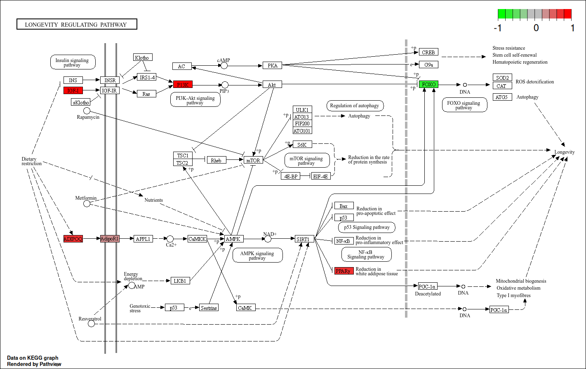

```{r setup, include=FALSE}
knitr::opts_chunk$set(echo = TRUE)
```

# intro

# Transcriptomics

Transcriptomics is de analyse van de RNA transcriptie's geproduceerd
door het genotypen op een bepaald moment wat een link geeft tussen het
genoom, het proteoom en het cellulaire phentype. Het is een stap in de
Omics pipeline waar dingen zoals ziekten en genetische afwijkingen en
het effect er van word onderzocht. Transcriptomics in ons onderzoek word
gedaan door de RNA transcripties te vergelijken van 2 groepen muizen.
Een jonge groep muizen van 8-10 weken en een oudere groep muizen van
100-120. In ons onderzoek kijken naar de expressie in een paar gen
pathways: 04662, 04660, 04213, 04211, 04640.

De 04662 is de B cell receptor signaling pathway deze laat zien "".

De 04660 is de T cell receptor signaling pathway deze laat zien "".

De 04211 is de Longevity regulating pathway deze laat zien "".

De 04640 is de Hematopoietic cell lineage deze laat zien "".

In de gene pathways kan er worden gekeken naar de verandering in
expressie, hier is dus te zien of de gevonden variant mutatie effect
heeft op de expressie van het gen. Een gen pathway ziet er uit als
volgt.



Hier is een door ons met KEGG + pathview library gemaakte gene pathway
te zien. Rechts boven is een kleuren schaal te zien met -1, 0 en 1. De
kleuren schaal en cijfers betekenen ook wat, wanneer de gen een
witte/grijze kleur heeft is de verandering in de expressie 0 wat dus
betekent dat de expressie van dit gen normaal is. Wanneer een gen block
een groene kleur heeft en dus richting de -1 gaat zegt dit dat de
expressie is minder is dan de norm. Wanneer een gen een rode kleur heeft
en dus richting de 1 gaat zegt dit dat het een overexpressie heeft meer
dan het normaal.

De verschillen in deze expressies hebben veel invloed op de werking van
de pathway.

Hier is een flowchart te zien die laat zien hoe wij dit project gaan
doen. We beginnen dus met de data downloaden, controleren de kwaliteit
en trimmen. Wanneer de kwaliteit goed is gaan we readmappen met HISAT2
daarna data met samtools sorteren en indexeren. De Data wordt dan
verwerkt met Feature Counts om de gen expressie vast te stellen. Dan
word de data geanalyseerd op 2 manieren. Met de wilcoxon rank sum test,
deze test **beoordeelt niet alleen het teken van de verschillen, maar
bepaalt ook de grootte van de waargenomen verschillen in de gegevens.**
De andere test is DEseq2, **Deseq gebruikt een statistisch model om
uitterekenen wat de verschillen in gen expressie zijn tussen 2 of meer
groupen samples (RNA).** Aan de hand van de feature count data en de
DEseq2 uitkomt worden visualisaties gemaakt.

KEGG - is een knowledge base voor systematische anlyse van gen functies,
waar genomics informatie gelinked kan worden met functionele info. Er
zijn ook visualisatie die hier uit kunnen komen zoals pathways waar over
en onder expressie van genen word laten zien in een gen pathway

Volcano plot - is een plot gemaakt door het plotten van de negatieve
logartime van de p value op de y axis meestal met een base van 10. Met
de log fold change op x axis. Een volcano plot laat de statistische
significantie zien met P value tegen de groote van de fold change.


Hier zijn alle library's die wij gebruiken in dit project.

```{r echo=FALSE}
library("DESeq2")
library("EnhancedVolcano")
library(data.table)
library("tidyr")
library(conflicted)
library("dplyr")
library("scales")
library("affy")
library("pheatmap")
library("DEGreport")
```

### Code - path melding

Wanneer er **geen** input path staat bij het **BASH** script ga er dan
vanuit dat de code in de map is uitgevoerd waar de input bestanden
staan.\*

## SRA download

De SRA's van de RNA seq worden gedownload met het onderstaande stuk
code. De gebruikte accention list staat in de github repository.

De eerste stap is het downloaden van de genetische data die verkregen
was door het sequencen van de samples. Met behulp van de SRA run
selector van NCBI is een selectie van SRA's gemaakt die gedownload
moeten worden.

Een SRA (Sequence Read Archive) is een gecomprimeerd archief dat de
sequencing reads bevat.

Om deze bestanden te downloaden wordt gebruikt gemaakt van "prefetch",
deze commandline tool is onderdeel van de SRA toolkit.

In de volgende stap worden deze bestanden uitgepakt.

```{bash, eval=FALSE}

prefetch $(</students/2024-2025/Thema05/3dconformatieChromatine/transcriptomics/SRA/Acc_list_transcriptomics.txt) \
--output-directory "/students/2024-2025/Thema05/3dconformatieChromatine/transcriptomics/SRA/" --max-size 200G
```

### Gebruikte samples:

In ons onderzoek gebruiken we de 2 muizen groepen, de oude en jonge
muizen. De oude muizen zijn 100-120 weken oud en de jonge muizen zijn
8-10 weken oud. Deze twee groepen hebben allebei vier replicaten. De
samples van alle muizen zijn verkregen met een Illumina NextSeq 500.

**Oude muizen: (Genotype: Rag2-/-)**\

SRR21754423\
SRR21754422\
SRR21754421\
SRR21754420\

**Jonge muizen: (Genotype: Rag2-/-)**\
SRR21754408\
SRR21754417\
SRR21754418\
SRR21754419\

## Kwaliteits check

De gedownloade bestanden zitten nog in hun SRA format en dit is niet de
filetype die wij gebruiken voor onze tools.

Als eerste moet de kwaliteit van de data gecheckt worden en dit wordt
gedaan met het programma FastQC dit programma leest de ASCII characters
uit de file die bij elke sequentie staan waardoor het weet wat de
kwaliteit is van de data. De voledige werking van FastQC word later nog
wat dieper uitgelegt.

Om de bestanden van .SRA om te zetten naar .fastq word fasterq-dump
gebruikt. Deze kijkt in de SRA files en pakt ze uit naar hun fastq
format. Fasterq-dump is deel van de SRA toolkit (onze gebruikte versie
is 3.1.1)

Een FastQ file ziet er als volgt uit.

De file heeft een title waar de sample naam word weergegeven + de
lengte. Daarna is de sequentie te zien, Dan is de titel te zien van de
bijbehoorende kwaliteit sequentie. De laatste regel is dus de kwaliteits
score sequenties deze is in ASCII

De kwaliteit word dus gescoord in ASCII characters, in het figuur hier
onder is de score te zien van een voorbeeld sequentie, ook is te zien
dat de score van het ! teken de laagst mogelijk kwaliteit is. De K is de
hoogste kwaliteit mogelijk.

De formule die hier wordt gebruikt is de Phred kwaliteits score, deze
score is logaritmisch gerelateerd aan de waarschijnlijkheid dat de "base
call" verkeerd is.

Q = -log(E) waarbij Q de phred score is en E de waarschijnlijkheid van
verkeerde base call.

De illumina gesequencenste sequenties hebben een afwijking van 33 hier
word dus altijd -33 gedaan voordat de score wordt berekent.

 Bron:
<https://gencoded.com/index.php/2020/05/20/fastq-format-an-overview/>

Bron:
<https://gatk.broadinstitute.org/hc/en-us/articles/360035531872-Phred-scaled-quality-scores>

```{bash, eval=FALSE}
# Cat leest elke File-parameter in volgorde van Acc_list_transcriptomics.txt  en daarmee kijkt fasterq-dump welke files het moet uitpakken. Met parallel worden meerder files tegelijk verwerkt

cat /students/2024-2025/Thema05/3dconformatieChromatine/transcriptomics/SRA/Acc_list_transcriptomics.txt | \
  parallel fasterq-dump -O /students/2024-2025/Thema05/3dconformatieChromatine/transcriptomics/SRA/FASTQ {}
  # hierboven wordt de map output neergezet
```

### Kwaliteitscontrole met fastqc

Voor het trimmen: FastQC wordt gebruikt voor het trimmen. Dit programma
kan de scores lezen van de fastQ files en geeft hier een visuele output
van. Dit zijn verschillende grafieken en tabellen hier onder is een
tabel met uitleg voor elke visualisatie / tabel.

+----------------------+----------------------+----------------------+
| Catagorie            | Uitslag              | Hoe lees je dit      |
+======================+======================+======================+
| Basic s tatistics    | Hier krijg je een    | Het aflezen van deze |
|                      | tabel met            | tabel is lezen en    |
|                      | verschillende dingen | checken of er geen   |
|                      | zoals de Filename,   | fouten in zitten.    |
|                      | file type, sequence  |                      |
|                      | length, %GC, Total   |                      |
|                      | sequences, Encoding  |                      |
|                      | en de sequences      |                      |
|                      | flagged as poor      |                      |
|                      | quality              |                      |
+----------------------+----------------------+----------------------+
| Per base sequence    | Een grafiek zoals te | De grafiek heeft 3   |
| quality              | zien is in figuur 1  | vlakken die van      |
|                      |                      | verschillende grote  |
|                      |                      | en kleuren. De       |
|                      |                      | kwaliteit ranged van |
|                      |                      | 0-40, 28-40 is goed  |
|                      |                      | and gekleurd groen,  |
|                      |                      | 20-28 is gekleurd    |
|                      |                      | geel/oranje, 0-20    |
|                      |                      | gekleurd rood.       |
|                      |                      |                      |
|                      |                      | Verder representeert |
|                      |                      | de gele box de 25th  |
|                      |                      | to 75th percentile.  |
|                      |                      | De zwarte lijnen     |
|                      |                      | geven de 10th en     |
|                      |                      | 90th percentile      |
|                      |                      | weer. De blauwe lijn |
|                      |                      | geeft de gemiddelde  |
|                      |                      | scores voor          |
|                      |                      | kwaliteits controle  |
|                      |                      | score voor de        |
|                      |                      | nucleotide.          |
|                      |                      | gebaseerd op deze    |
|                      |                      | dingen is te zien    |
|                      |                      | dat de base van 1    |
|                      |                      | tot 100 goede        |
|                      |                      | kwaliteit hierna     |
|                      |                      | gaat de kwaliteit    |
|                      |                      | sterk naar beneden.  |
|                      |                      | wat al aan geeft dat |
|                      |                      | er getrimmed moet    |
|                      |                      | worden.              |
+----------------------+----------------------+----------------------+
| Per tile sequence    | Hier is een plot te  | Het aflezen van deze |
| quality              | zien waar de reads   | grafiek is door te   |
|                      | worden weergegeven   | kijken naar de kleur |
|                      | als een soort        | per tegel per        |
|                      | heatmap. waarbij     | positie. een         |
|                      | elke tegel 1 een     | donkerblauwe tegel   |
|                      | read weergeeft op    | betekent goede       |
|                      | een bepaalde positie | kwaliteit en hoe     |
|                      | deze kwaliteit van   | lichter de tegel     |
|                      | de reads worden      | word hoe slechter de |
|                      | vergeleken met       | kwaliteit dus        |
|                      | elkaar.              | lichtblauw betekent  |
|                      |                      | een slechte          |
|                      |                      | kwaliteit. Op de     |
|                      |                      | Y-as staat dan in    |
|                      |                      | welke tile het is en |
|                      |                      | de X-as welke        |
|                      |                      | positie.             |
+----------------------+----------------------+----------------------+
| Per sequence quality | Een grafiek die je   | Het beste is wanneer |
| score                | de gemiddelde        | de meeste reads een  |
|                      | kwaliteit op de\     | hoge gemiddelde      |
|                      | x-as en de nummer    | kwaliteits score     |
|                      | van sequences met    | hebben en er geen    |
|                      | gemiddelde op de     | grote dip in de      |
|                      | y-as.                | grafiek is, dit      |
|                      |                      | betekent een lage    |
|                      |                      | kwaliteit.           |
+----------------------+----------------------+----------------------+
| Per base sequence    | Hier is een plot te  | Het volgende is uit  |
| content              | zien met een y-as    | de grafiek te halen  |
|                      | waar 0-100           | er is significante   |
|                      | aangegeven wordt en  | variatie in de       |
|                      | een x-as met de      | nucleotide           |
|                      | "positie in read     | distributie aan het  |
|                      | (bp)" in de grafiek  | bein van de reads    |
|                      | staan 4 lijnen met   | positie 1-10. Dit    |
|                      | het percentage per   | zou kunnen zijn door |
|                      | base                 | de voorbereiding of  |
|                      |                      | de vooroordelen in   |
|                      |                      | het sequencen. A, T, |
|                      |                      | C en G zijn niet     |
|                      |                      | gelijk               |
|                      |                      | gerepresenteerd. na  |
|                      |                      | de 10de positioe     |
|                      |                      | zijn de base wat     |
|                      |                      | gestabilizeerd wat   |
|                      |                      | aan geeft dat de     |
|                      |                      | sequence kwaliteit   |
|                      |                      | in de rest van de    |
|                      |                      | reads hoger zijn.    |
|                      |                      | Het afgekeurde kruis |
|                      |                      | komt dus door de     |
|                      |                      | choas van 1-10.      |
+----------------------+----------------------+----------------------+
| Per sequence GC      | Per sequence GC      | Het aflezen wordt    |
| content              | content geeft weer   | door de twee lijnen  |
|                      | een plot weer met 2  | vergelijken. het is  |
|                      | lijnen. Een blauwe   | ideaal als de twee   |
|                      | lijn die de          | lijnen overlappen of |
|                      | theoretische         | dichtbij elkaar      |
|                      | distrubutie aangeeft | liggen. Wanneer er   |
|                      | wat dus een          | meerdere pieken zijn |
|                      | richtlijn is, en de  | die afwijken van de  |
|                      | GC count per read    | blauwe theoretische  |
|                      | wat dus de gelezen   | lijn kan dat         |
|                      | data is.             | betekenen dat er     |
|                      |                      | misschien sprake is  |
|                      |                      | van besmetting of    |
|                      |                      | sequencing errors.   |
|                      |                      | Er komt dus een rood |
|                      |                      | kruis wanneer de GC  |
|                      |                      | abnormaal is         |
|                      |                      | vergeleken met de    |
|                      |                      | theoretische         |
|                      |                      | verwachting wat dus  |
|                      |                      | zegt da de algemene  |
|                      |                      | kwaliteit niet goed  |
|                      |                      | is.                  |
+----------------------+----------------------+----------------------+
| Per base N content   | De per base N        | X-as geeft de        |
|                      | content grafiek      | positie weer in de   |
|                      | geeft de frequentie  | reads, Y-as geeft    |
|                      | weer van "N"         | het percentage van   |
|                      | basecalls op elke    | reads met een "N"    |
|                      | positie in de reads. | base op elke         |
|                      | De "N" staat voor    | positie. Een hoge    |
|                      | een onzekere of      | waarde betekent dat  |
|                      | onbekende            | de sequencer op die  |
|                      | nucleotide, deze kon | positie vaak onzeker |
|                      | de sequencer niet    | was over welke       |
|                      | identificeren als 1  | nucleotide er        |
|                      | van de base (A, T,   | aanwezig was. De     |
|                      | C, G)                | verwachting is dat   |
|                      |                      | er een zeer laag     |
|                      |                      | percentage N's in de |
|                      |                      | sequence zit, de     |
|                      |                      | standaard hiervoor   |
|                      |                      | is \<1%. afwijkende  |
|                      |                      | resultaten kan       |
|                      |                      | wijzen op problemen  |
|                      |                      | zoals slechte        |
|                      |                      | kwaliteit van de     |
|                      |                      | sequentie. Ze komen  |
|                      |                      | vaak voor aan het    |
|                      |                      | begin of eind van de |
|                      |                      | reads.               |
+----------------------+----------------------+----------------------+
| Sequence length dis  | De sequence length   | Deze grafiek is      |
| tribution            | distribution grafiek | belangrijk bij NGS   |
|                      | laat de verdeling    | omdat afwijkingen in |
|                      | van de lengtes van   | de sequentie lengte  |
|                      | de reads zien. X-as  | kunnen wijzen op     |
|                      | geeft de lengte van  | fragmentatie of      |
|                      | de sequenties (in    | technische fouten    |
|                      | basenparen) en de    | tijdens sequencering |
|                      | Y-as toont aantal    | . Een ideaal         |
|                      | reads van die        | resultaat is een     |
|                      | specifieke lengte.   | scherpe piek op 1    |
|                      |                      | specifieke lengte    |
|                      |                      | wanneer je 150 bp    |
|                      |                      | doelreadlengte hebt  |
|                      |                      | zou de meeste        |
|                      |                      | sequencing output op |
|                      |                      | precies 150 bp       |
|                      |                      | moeten vallen wat    |
|                      |                      | een piek bij die     |
|                      |                      | lengte zou moeten    |
|                      |                      | opleveren. Als er    |
|                      |                      | meerdere pieken zijn |
|                      |                      | of een vrede         |
|                      |                      | spreiding van        |
|                      |                      | lengtes kan dit      |
|                      |                      | beteken dat er       |
|                      |                      | sequencing fouten,   |
|                      |                      | slechte              |
|                      |                      | adaptertrimming of   |
|                      |                      | degradatie van het   |
|                      |                      | DNA-monster.         |
+----------------------+----------------------+----------------------+
| Sequence du          | De Sequence          | Het aflezen van de   |
| plication levels     | duplication levels   | grafiek is door te   |
|                      | grafiek laat het     | kijken naar de twee  |
|                      | percentage van       | lijnen in de grafiek |
|                      | sequences zien die   | de Duplicated        |
|                      | meer dan 1x          | sequences (meestal   |
|                      | voorkomen.           | een rode lijn) geeft |
|                      | Duplicaties kunnen   | het percentage met   |
|                      | voorkomen door       | unieke sequenties    |
|                      | technische           | weer zonder          |
|                      | "artifacts" tijdens  | correctie voor       |
|                      | de sequencing en     | natuurlijke          |
|                      | andere factoreren    | duplicaties. Het     |
|                      | zoals P CR -         | geeft een beeld van  |
|                      | amplificatie, en     | hoeveel van de reads |
|                      | kunnen de            | in de dataset        |
|                      | diversititeit van de | meerdere keren       |
|                      | dataset verminderen. | voorkomen zonder te  |
|                      | Dit heeft invloed op | differentiëren       |
|                      | downstream analyses  | tussen technische en |
|                      | zoals genexpressie   | biologische          |
|                      | of va r              | duplicates. in de    |
|                      | iantdetectie.        | grafiek wil je graag |
|                      |                      | een scherpe daling   |
|                      | X-as laat het aantal | zien waarbij de      |
|                      | keren zien dat de    | meeste reads een     |
|                      | specifieke sequentie | duplicatie niveau    |
|                      | wordt gedupliceerd\  | van 1 hebben en het  |
|                      |                      | percentage           |
|                      | Y-as laat het        | gedupliceerede       |
|                      | percentage van reads | sequenties daarna    |
|                      | dat voorkomt met     | snel afneemt.\       |
|                      | duplicatie niveau    | De total sequences   |
|                      | zien                 | lijn (meestal een    |
|                      |                      | blauwe lijn)         |
|                      |                      | corrigeert voor      |
|                      |                      | verwachte            |
|                      |                      | natuurlijke          |
|                      |                      | duplicates deze laat |
|                      |                      | zien hoe de          |
|                      |                      | duplicatie eruit zou |
|                      |                      | zien zonder          |
|                      |                      | technische           |
|                      |                      | artefacten en biedt  |
|                      |                      | een eerlijker beeld  |
|                      |                      | van hoeveel          |
|                      |                      | sequenties           |
|                      |                      | overgedupliceerd     |
|                      |                      | zijn de de           |
|                      |                      | sequencering zelf.\  |
|                      |                      | Als er een groot     |
|                      |                      | verschil is tussen   |
|                      |                      | de lijnen betekent   |
|                      |                      | dit dat er           |
|                      |                      | duplicatie is        |
|                      |                      | onstaan door         |
|                      |                      | technische factoren  |
|                      |                      | zoals PCR duplicatie |
|                      |                      | in plaats van        |
|                      |                      | biologische oorzaak. |
|                      |                      | Te hoge aantal       |
|                      |                      | dupolactie kan       |
|                      |                      | probleem zijn voor   |
|                      |                      | downstream analyses  |
|                      |                      | en je wil dus dat de |
|                      |                      | lijnen dichtbij      |
|                      |                      | elkaar liggen.       |
+----------------------+----------------------+----------------------+
| Overre presented     | Dit is een tabel die | Wanneer er een       |
| sequences            | sequenties van op    | abnormaliteit te     |
|                      | zijn minst 20bp die  | zien was in de Per   |
|                      | vaker voorkomen dan  | sequence GC content  |
|                      | 0.1% van de totale   | grafiek kan er in    |
|                      | nummer van           | deze tabel worden    |
|                      | sequenties. In de    | gekeken om de bron   |
|                      | tabel staat de       | te vinden. als het   |
|                      | sequenties u         | niet staat als een   |
|                      | itgeschreven, de     | bekende adapter of   |
|                      | count, het           | "vector", kan het    |
|                      | percentage en de w a | helpen om de data te |
|                      | arschijnlijke bron   | blasten o te         |
|                      |                      | identiteit te vinden |
|                      |                      | in de tabel.         |
+----------------------+----------------------+----------------------+
| Adapter content      | Een grafiek waar     | Het geeft aan of de  |
|                      | verschillende        | sequenties           |
|                      | adapters staan       | adapterfragmenten    |
|                      |                      | bevatten en van      |
|                      |                      | verschillende        |
|                      |                      | apparaten. als deze  |
|                      |                      | aanwezig zijn is het |
|                      |                      | te zien door af te   |
|                      |                      | lezen in de grafiek  |
|                      |                      | welke positie er     |
|                      |                      | zijn om ze           |
|                      |                      | vervolgens weg te    |
|                      |                      | trimmen. deze        |
|                      |                      | "adaptercontent" is  |
|                      |                      | er voor              |
|                      |                      | identificatie van de |
|                      |                      | DNA                  |
+----------------------+----------------------+----------------------+

Het volgende commando is uitgevoerd in de FASTQ/ directory.

```{bash, eval=FALSE}
cat /students/2024-2025/Thema05/3dconformatieChromatine/transcriptomics/SRA/Acc_list_transcriptomics.txt | parallel \
fastqc -o /students/2024-2025/Thema05/3dconformatieChromatine/transcriptomics/fastqc_output/voor_trimmen/ {}_1.fastq {}_2.fastq 
```

Vervolgens met met "multiqc ." in de output directory een multiqc
rapport gemaakt van de resultaten van fastqc.

MultiQC wordt gebruikt om naar alle fastqc output files te kijken.
Multiqc zoekt een directory voor FastQC output en compileert deze files
zodat de algemene resultaten over meerdere files beter te begrijpen is.
De grafieken worden bijvoorbeeld over elkaar gelegd om de verschillen te
zien.

# Insert multiqc

Na analyse van de fastQC is te zien dat onze sequence reads korte
sequenties zijn van 150 bp. Deze corresponderen met een deel van een DNA
sequentie. Het genoom kan niet in zijn geheel gelezen worden door
technische beperking van de gebruikte illumina machines. Hoe langer de
reads hoe meer kans dat er fouten gemaakt worden tijdens het sequencen.

daarom als er genoeg reads zijn die het laatste stuk bevatten kan er een
stuk afgeknipt worden. Ook moeten de adapters verwijderd worden,
adapters zijn korte stukken DNA die op de flow cell zitten als linkers.
bron: <https://www.lubio.ch/blog/ngs-adapters>

Voor het trimmen wordt gebruik gemaakt van Trimmomatic ( versie 0.39 )
Trimmomatic gebruikt Maximum Information Quality Filtering om te bepalen
of een read moet worden getrimmed + de paramenters van de gebruiker.
Maximum Information Quality Filtering probeert de formule te bepalen bij
welke informatie de hoogste kwaliteit heeft door verschillende
eigenschappen van de informatie te combineren, zoals: Relevantie
(afgeleid via de sigmoidfunctie), Correctie of betrouwbaarheid (door het
product van correctieprobabiliteiten). Het doel is om de score te
maximaliseren voor informatie die zowel relevant als zeer betrouwbaar
is.

De door ons opgegeven parameters staan in het codeblock deze zijn.

**MINLEN:40** dit zegt dat de minimale lengte van de reads 40 is.

**SLIDINGWINDOW 4:20** het eerste nummer specificeert de grootte van de
sliding winden en het tweede nummer is de gemiddelde read kwaliteit
binnen de window van het eerste nummer. Een sliding window is dat er
steeds in dit geval 4 basen bekeken worden en dat keer op keer.

**ILLUMINACLIP** is het path naar een bestand dat adapter sequenties
bevat voor illumina adapters. **De gebruikte adapter:**
TruSeq3-Se.fa:2:30:10 De 2:30:10 betekenen het volgende: 2 is de "seed
mismatch", het aantal mismatches dat toegestaan is in een sequentie die
een adapter kan zijn.30 is de "palindrome clip threshold en 10 is de
"simple clip threshold", specificeert hoe accuraat de match tussen de
adapter sequentie en de mogelijke adapter in de read.

Hier is een foto te zien van hoe Trimmomatic weet wanneer hij moet
knippen ![How Maximum Information mode combines uniqueness, coverage and
error rate to determine the optimal trimming
point](data:image/jpg;base64,%20/9j/4AAQSkZJRgABAQEAYABgAAD/2wBDAAUDBAQEAwUEBAQFBQUGBwwIBwcHBw8LCwkMEQ8SEhEPERETFhwXExQaFRERGCEYGh0dHx8fExciJCIeJBweHx7/2wBDAQUFBQcGBw4ICA4eFBEUHh4eHh4eHh4eHh4eHh4eHh4eHh4eHh4eHh4eHh4eHh4eHh4eHh4eHh4eHh4eHh4eHh7/wAARCAJlAyUDASIAAhEBAxEB/8QAHwAAAQUBAQEBAQEAAAAAAAAAAAECAwQFBgcICQoL/8QAtRAAAgEDAwIEAwUFBAQAAAF9AQIDAAQRBRIhMUEGE1FhByJxFDKBkaEII0KxwRVS0fAkM2JyggkKFhcYGRolJicoKSo0NTY3ODk6Q0RFRkdISUpTVFVWV1hZWmNkZWZnaGlqc3R1dnd4eXqDhIWGh4iJipKTlJWWl5iZmqKjpKWmp6ipqrKztLW2t7i5usLDxMXGx8jJytLT1NXW19jZ2uHi4+Tl5ufo6erx8vP09fb3+Pn6/8QAHwEAAwEBAQEBAQEBAQAAAAAAAAECAwQFBgcICQoL/8QAtREAAgECBAQDBAcFBAQAAQJ3AAECAxEEBSExBhJBUQdhcRMiMoEIFEKRobHBCSMzUvAVYnLRChYkNOEl8RcYGRomJygpKjU2Nzg5OkNERUZHSElKU1RVVldYWVpjZGVmZ2hpanN0dXZ3eHl6goOEhYaHiImKkpOUlZaXmJmaoqOkpaanqKmqsrO0tba3uLm6wsPExcbHyMnK0tPU1dbX2Nna4uPk5ebn6Onq8vP09fb3+Pn6/9oADAMBAAIRAxEAPwD7LrN1TWbSxfyfmmnPSOMbiPrjpR4gv2sbL91zPKwjjHueM0miaVHYx+dIBJeSDMsp5JPoD6VaStdktu9kVxfa9NEZLfTbcA/d8yXBqP7T4q/6Blj/AN/636KOZdg5X3MD7T4q/wCgZY/9/wCj7T4q/wCgZY/9/wCt+ijn8hcnmYH2nxV/0DLH/v8A0fafFX/QMsf+/wDW/RRz+QcnmYH2nxV/0DLH/v8A0v2nxV/0DLL/AL/1vUUc/kHJ5mD9p8Vf9Ayy/wC/9H2nxV/0DLL/AL/1vUUc/kHJ5mB9p8Vf9Ayx/wC/9H2nxV/0DLH/AL/1v0Uc/kHJ5mB9p8Vf9Ayx/wC/9H2nxV/0DLH/AL/1v0Uc/kHJ5mD9p8Vf9Ayy/wC/9J9p8Vf9Ayx/7/1v0Uc/kHJ5mD9p8Vf9Ayy/7/0n2nxV/wBAyx/7/wBb9FHP5ByeZg/afFX/AEDLL/v/AEfafFX/AEDLL/v/AFvUUc/kHJ5mB9p8Vf8AQMsf+/8AR9p8Vf8AQMsf+/8AW/RRz+QcnmYH2nxV/wBAyx/7/wBL9p8Vf9Ayy/7/ANb1FHP5ByeZg/afFX/QMsv+/wDSfafFX/QMsf8Av/W/RRz+QcnmYP2nxV/0DLL/AL/0n2nxV/0DLH/v/W/RRz+QcnmYH2nxV/0DLH/v/R9p8Vf9Ayx/7/1v0Uc/kHJ5mB9p8Vf9Ayx/7/0fafFX/QMsf+/9b9FHP5ByeZgfafFX/QMsf+/9H2nxV/0DLH/v/W/RRz+QcnmYP2nxV/0DLL/v/R9p8Vf9Ayy/7/1vUUc/kHJ5mB9p8Vf9Ayx/7/0fafFX/QMsf+/9b9FHP5ByeZgi58VZ/wCQbZY/671I+p6najde6cNg6mFi5/KtqijmXYfK+5V06/tr+HzLd8+qnhl+oq1WNq9n9jJ1KwjCSqcyIo/1g9607G5ju7WO4hOUcZFJrqgT6MmoooqSgooooAKKKKACiiigAooooAKKKKACiisfxHdzqsVhZnFxctt3d0U/xU0ruwm7Iff65bW9x9lhV7if0jG4D6kdKiku/EDIGt9Otvo8uKu6Tptvp8AWJB5hH7yTHLn1NXaq6WyFZvdmB9p8Vf8AQMsf+/8AR9p8Vf8AQMsf+/8AW/RRz+QuTzMD7T4q/wCgZY/9/wCj7T4q/wCgZY/9/wCt+ijn8g5PMwPtPir/AKBlj/3/AKPtPir/AKBlj/3/AK36KOfyDk8zA+0+Kv8AoGWP/f8Ao+0+Kv8AoGWP/f8Arfoo5/IOTzMH7T4q/wCgZZf9/wCk+0+Kv+gZY/8Af+t+ijn8g5PMwPtPir/oGWP/AH/o+0+Kv+gZY/8Af+t+ijn8g5PMwPtPir/oGWP/AH/o+0+Kv+gZY/8Af+t+ijn8g5PMwftPir/oGWX/AH/pPtPir/oGWP8A3/rfoo5/IOTzMD7T4q/6Blj/AN/6PtPir/oGWP8A3/rfoo5/IOTzMH7T4q/6Bll/3/o+0+Kv+gZZf9/63qKOfyDk8zA+0+Kv+gZY/wDf+j7T4q/6Blj/AN/636KOfyDk8zA+0+Kv+gZY/wDf+j7T4q/6Blj/AN/636KOfyDk8zA+0+Kv+gZY/wDf+j7T4q/6Blj/AN/636KOfyDk8zA+0+Kv+gZY/wDf+j7T4q/6Blj/AN/636KOfyDk8zA+0+Kv+gZY/wDf+j7T4q/6Blj/AN/636KOfyDk8zA+0+Kv+gZY/wDf+j7T4q/6Blj/AN/636KOfyDk8zA+0+Kv+gZY/wDf+j7T4q/6Blj/AN/636KOfyDk8zA+0+Kv+gZY/wDf+j7T4q/6Blj/AN/636KOfyDk8zA+0+Kv+gZY/wDf+lW58U7hu02yxnn9/W9RRz+QcvmYcus3tm+dQ09lj/vQ5c1q2V3b3kAmt5A6n0PI+tTnpXPanCdFu01CyULbMwW4hXpk9CKFaWnUbujoaKbG6yIHRgykZBHeioKMbUvLm8UWFs/I8p3x7itusC9/5Hiw/wCvaSt+rnsiY7sKKKKgoKK4b4+avqWg/B3xLrGkXL21/a2e+CVeqNuUZ/Wq/wCz1rmqeIvhNouraxdPdXs6MZZX6kgmgD0GiiigAooooAKKKKACiiigAooooAKKKKACiiigAooooAKKKKACiiigAooooAKKKKACikz7HrS0AFFFMeWNF3PIqj1JoAfRVZ760XhrqAN7uKa2p6evJvbcDv8AvBTsxXRborPOtaUBzqVp7fvRSf23pP8A0E7P/v6KfK+wcy7mjRWf/bWk/wDQStPb96Kdaaxpd3cm2t9QtZphyY0kBYD6Ucr7BzLuXqKKKkY2UZicHptNY/g9saaYQPljYgfnWzJ9xvoaxvCvFvP/ANdKtfCyXujaoooqCgooooAKKKKACiiigAooooAKKKKACsWM+d4qeQ8iKArjHQ5rarEsP+Rluv8AdP8AOrj1JfQ2xRRRUFBRQ3ANeF/FDxd4k0v9ovwR4dsNUmg0u/8AN+1W4+7JhMjP40Ae6UUik0tABRRRQAUUUUAFFFFABRRRQAUUUUAFFFFABRRRQAUUUUAFFFFABRRRQAUUUUAFFFFABRRRQAUUUUAFFFFABRRQT0oAKKajo4JRgwBxwadQAVX1KNJbCdHUEeW38qsVFe/8ec//AFzb+VNbiexU8Nn/AIkdqDyRGBmik8N/8gW2/wByinL4mKPwoo3v/I8WH/XrJW/WBe/8jxYf9e0lb9OfT0FDqFFFFQWecftN/wDJBfF//Xh/7OtVf2V/+SHeH/8Acf8A9CNWv2m/+SC+L/8Arw/9nWqv7K//ACQ7w/8A7j/+hGgD1GiiigAooooAKKKKACiiigAooooAKKKKACiiigAooooAKKiurmC1hae4mjhiQZeSRgqqPcmvONW+J0+oX7aV4F0eTWrsEq00mY4B7h+hrSFKU/hRE6kYbnpbMqjLMAPc1z+u+NPC+hsV1TWbeAjtyx/TNcdF4H8X+IovM8Y+JpUgc5On26LtX23rg10Og/DPwdorrJaaXukH8UsjSZP4mtOSlH4pX9P8yOapL4Vb1MCb4zeH5rgwaLYXurkHgwgrn8xSz+PvGt5H/wASr4damufuySyoRXo8VjZQ/wCqs7eP/djAqwAAMAYFHtKS2h97/wCGD2dR7y+5HlNvf/GS9Y7bPTtPB6edDux+RqWTQPi/eENP4r0SAf3UtGH8q9RFFH1h9Ir7g9h3k/vPK38CePJkxdeNYxxjMautRD4U6vLzc+ONXI7+VdOvNes0UfWqnT8kL6vB7nlS/B6NhuuPGPiRnB5K37AVeHwi0hgBN4h8SSKO39oNXo9FDxVXuP6vT7Hm0nwa8NyNubVvEZP/AGET/hUn/CnvDOzYdQ10j3vj/hXotFL6zV/mH7Cn2POIfg14UjbcLvWm9mvSR/Kpf+FR+Fs/63Vf/Ar/AOtXoVFH1mr/ADB7Cn2PPh8I/Cx587VR/wBvR/wrR8K/Dvw/4d1ZtU0/7abhl2kzTbhj8q7Cik69RqzkCo007pBRRRWJqJJ9xvoax/Cn/HvP/v1ryfcP0NY/hTm2n3D/AJaVa+FkvdG1RRRUFBRRRQAUUUUAFFFFABRRRQAUUUUABz2rEsf+Rkuv901t1h2HPiS7/wB01cdmS+huCigdKKgoR/unPFfN/wAZf+Trvh1/23/9F19INjac9K+b/jL/AMnXfDn/ALb/APougZ9ILS0i0tAgooooAKKKKACiiigAooooAKKKKACiiigAooooAKKKKACiiigAooooAKKKKACiiigAooooAKKKKACgnAqtqGoWen27XN9cw20K9XlcKP1rzi/8ea54mu5NL8AaY8yg7ZtQuQY0j90yMPWkKUp7bETqRjudx4q8TaL4asDeavfR2yD7oOSWPoAK4BtS8c/EBzFpFu3hzQnHzXM4zLcL6xkcrWz4X+G1nZ6h/bXiK7k13WmOTcTDao9gmdv6V3qKEXaoAUdABgCtOaFP4dX3/wAkRyzn8Wi7GV4T0O38O6LFplvcXVwqEsZLmTe7E9ea1qKKwbbd2apJKyCor3/jzn/65t/Kpaivf+POf/rm38qFuD2Kfhv/AJAtt/uUUeGv+QLbf7tFOXxMUPhRRvf+R4sP+vWSt+sC9/5Hiw/69ZK36c+noKHUKKKKgs83/abz/wAKE8X46/Ye/wDvrVX9lf8A5Id4f5/5Zv8A+hGrf7Tf/JBfF/8A14f+zrVX9lf/AJId4f8A+ub/APoRoA9RooooAKKKKACiiigAooooAKKKKACiiigAooooAKo69q1hoelT6nqVwlvbQrlnY4+g+pq9Xj+pb/if8Rn0lZC3hfRGVrnacLdSkZA/4CwrWlTU3d7LczqT5Vpux1hY658Vbr+0tW+0aX4UDf6PZrlXvB6yDoVNeoaJpGm6LYR2Gk2cVnax/djiXAq5FHHFGscSLGijCqowAPYU6ipVc9FouwQpqOr1YY5ooorI0CiiigAooooAKKKKACiiigAooooAKKKKACiiigAooooAbJ9w+mDWP4U/1E/+/WzJ9xvoaxvCvFvOf+mlWvhYnujaoooqBhRRRQAUUUUAFFFFABRRRQAUUUUAFYdj/wAjJdem05/OtysSw/5GW6/3T/OrjsyX0NsdOOlFFFQUI33T0/Gvm/4y/wDJ13w6/wC2/wD6Lr6Qf7pzxXzf8Zf+Trvh1/23/wDRdAz6QXpS0ijv60tAgooooAKKKKACiiigAooooAKKKKACiiigAooooAKKKKACiiigAooooAKKKKACiiigAoorlfGXjzQvDKrDcTfaL6UfubWHLM7dgSM7fxqowlN2iiZSUVds6lmCjc3AHU+lef8AiP4lWq3p0fwpaS6/qh+Ui2G+OE/9ND2FZa6P428fsJPEMr+H9EY5FhE376RfXzF6V33hnw5o/h2yS10qyjhVRguVBkb/AHm6mtuWnT+LV9uhnzTn8OiOJ03wDq3iK7Gp/EDUhd/NuXTIGJtVHuDzmvRdOsrXT7RLSzgjt4IxhI4xhVFWKKznVlPfYuFOMdgooorMsKKKKACor3/jzn/65t/Kpaivf+POf/rm38qa3E9in4b/AOQLbf7lFHhv/kC23+5RTl8TFD4UUb3/AJHiw/69ZK36wL3/AJHiw/69ZK36c+noKHUKKKKgs84/ac/5IJ4v7/6B/wCzrVX9lf8A5Id4f7fI/H/AjVr9prP/AAoXxf8A9eP/ALOtVP2V/wDkh/h4/wDTN/8A0I0AepUUUUAFFFFABRRRQAUUUUAFFFFABRRRQAUUUHpQBynxT8QN4f8AB15c2z7b6VfLtF7vIew/DNL8LfDUPhjwja2SHdNJmeZyOWZzuOfpmuX8aiTxH8XdD8PgB7fStuoTr2IOVwa9RUADAXAHFdE/cpqPfX/Ixj703LtoLRRRXObBRRRQAUUUUAFFFFABRRRQAUUUUAFFFFABRRRQAUUUUAFFFFADZPuN9DWP4U/495+c/vK2JPuN9DWP4V5t5/8ArpVr4WS90bVFFFQUFFFFABRRRQAUUUUAFFFFABRRRQAHmsOw/wCRluh/sn+dbhz2rDsf+Rluj/sn+dXHZky6G5RRRUFCP908Zr5v+Mv/ACdd8Of+2/8A6Lr6QbO046183/GX/k674c/9t/8A0XQM+kF+v4elLSL9Px9aWgQUUUUAFFFFABRRRQAUUUUAFFFFABRRRQAUUUUAFFFFABRRRQAUUUUAFFFQXt1b2drJdXM6QwxjLOx4AoAnrK8ReItH8P2bXOrX0NsoGVRnAZ/ZR3NcNqXxD1LxDdPpfw9083zBtr6m65tovqODVzw78NbZbsat4svH1/U2OSJm328R/wBhG6V0Kioa1Hby6/8AAMfaOWkPv6GW2u+NPHkrW/hm1l0HRc4bULhSlwR/soeCK6nwX4B0Pwyxuo4jealIP399NzJIfXHQfhXVoiJGsaqqqoACgcAU6plWbXLHRf1uONJXvLVgAB0ooorE1CiiigAooooAKKKKACor3/jzn/65t/Kpaivf+POf/rm38qa3E9in4b/5Att/uUUeG/8AkC23+5RTl8TFD4UUb3/keLD/AK9pK36wL3/keLD/AK9pK36c+noKHUKK4b4qeOLjwrHaWOk6a+p6ve7zbwKCRtQZYtjnpVbw/wDEUXy+GPtlg0L63aNNlRxGwbbtqCyL9pv/AJIL4v8A+vD/ANnWqn7K/wDyQ7w//uP/AOhGrX7TTf8AFhfF+O1if/Q1qt+yv/yQ7w/x/A//AKEaAPUaKKKACiiigAooooAKKKKACiiigAooooAKZNIsUTSyMFRAWYnsBT65z4l6gmm+BdXuGbaxtZEj93KnFVGPNJIUnZNnI/BuF9V8SeJfFkzbzJdyWUJP/PNGBFeo1x/wd0wab8PdKyNstxCtxL/vMBmuwrTESvUdjOirQVwooorE1CiiigAooooAKKKKACiiigAooooAKKKKACiiigAooooAKKKKAGyH5CPUGsfwr/x7z45/eVsSfcPpg5rH8KYW2n7DzKtfCyXujaoooqCgooooAKKKKACiiigAooooAKKKKACsOwP/ABU10P8AZP8AOtw1iWH/ACMt1/un+dXHZkvobdFBrzX4pfEe98O6jDpeg6O2q3g/eXPykpDGOTnHfHSoKPSX+6a+b/jL/wAnXfDr/tv/AOi69j0LxnDqniCz0VrZ45bvSU1FWx8uGbG361458Zf+Trvhz/23/wDRdAz6QWlpF+v4elLQIKKKKACiiigAooooAKKKKACiiigAooooAKKKKACiiigAoooNABSM6qpZmAUDJJ6Cua8X+ONC8Mjyry48+9Yfu7KDDTyfRa49bHxz8QCrajNL4Y0J87YYSVupF9HB4wa2hRbXNLRGUqqTstWbXir4kWFhe/2RoNs+t6u5wkMOfKz/ALUgyBWVaeBdc8V3EeofEHUGaEEtFpUDbViPu6n5q7bwn4V0TwvZi10exitweZHUfNI3qTW3Ve1UNKa+fX/gC9m5azfy6FXTtPstOtVtrG2jt4lAAWNQP/11aoornbubBRRRQAUUUUAFFFFABRRRQAUUUUAFRXv/AB5z/wDXNv5VLUN7n7JN6eW38qa3E9ip4b/5Att/uUUeG/8AkC23+5RTl8TFD4UUb3/keLD/AK9pK36wL3/keLD/AK9ZK36c+noKHU8s+N1jpuq6voWmLqh0fXp/OGnXpYhE+X5w2OuRxVP4WfC670HV7S/8QeJoNblsIWhsooRsSNCcklc8nPepP2jrbwZcaZpsfii3vrucSMbK2s42eV24zgLziub+CsfhEeOFjit9Z0rWBAxjt7yJ0jkTuQWPNQaHcftNf8kF8X/9eP8A7OtVf2V/+SHeH/8Acf8A9CNWv2m+fgL4v/68f/Z1qr+yv/yQ7w//ANc3/wDQjQI9RooooAKKKKACiiigAooooAKKKKACiiigArzP483P2jTtG0GIky3upQFgO8YbDfzr0w5xxXlGrTR6/wDH/TbHaWg0uxlMvoJMgiujDL3+btqY137vL30PUNPtorOyhtIf9XCgRfoBU9AGKK5zYKKKKACiiigAooooAKKKKACiiigAooooAKKKKACiiigAooooAKKKKAEk+430NY3hX/j3n/362ZPuN9DWN4U/1Fx/10q18LE90bVFFFQMKKKKACiiigAooooAKKKKACiiigArEsP+Rkuv90/zrbPNYdh/yMl1/un+dXHZkvobnbFeLfFzQ7PxL46t9J0fXBoXiF7aQ+a5PlzR8bsqOpxXtPavDv2h7bwTP4i0qTWLDUtT1xI2FpBYxM5VM/MW2HI/GoKR03wk+H0vhi4k1LWNfj1nVRbC1jljyEjhByFC+ue9ec/GX/k674c/9t//AEXXU/s/f8Iqur6h/Zceq2WpiL9/Z30TIQuR8y7jkjPeuW+Mv/J13w5/7b/+i6Bn0gv0/H1paRfT0paBBRRRQAUUUUAFFFFABRRRQAUUUUAFFFFABRRRQAUE4FQ3d1b2tu9xczRwQp96SRgqgfU153rPxEvdVvX0bwFprapd5KtdSgpboPUP0NaQpSnsROpGO53HiDXNL0HT5L7VLyO2hTqW5P4AcmvPJfE3jDx1Ibbwfaf2TpDZB1S5UMJV/wBleCDWh4f+Gonv01rxpqEmu6kMNGsg2xwH0AHB/GvQo40jUIiqqjoqjAFac1On8Or/AAItOe+i/E5Hwd8PdF8Pn7XIr6lqT8yXV2fNYN325+6K7GiisZzlN3kzSMVFWSCiiipKCiiigAooooAKKKKACiiigAooooAKKKKACor3/jzn/wCubfyqWor3/jzn/wCubfyprcT2KfhrP9i2/wDu0UeG/wDkC23+5RTn8TFD4UUb3/keLD/r1krfrAvf+R4sP+vWSt+nPp6Ch1PMfjNpmpDW9A8R+H7ywXWtPaUW1rdAkXAYYYKB3ArD8OWfinxP8UNP1fxgLLSTY2zi2skBWeXnO7njbmuh+Kuk6/ca3ofizwvDDqV3orSF7EzqglDjH3jwMVzvhWTxN8QPiVZeIdRsLbRLPSYGhaGK+S4aVy2edvQVBodJ+00NvwF8X4/58T/6GtVf2V/+SH+H/wDcf/0I1Z/abOPgJ4vJ5/0H/wBnWqv7K/8AyQ7w/wD7j/8AoRoEepUUUUAFFFFABRRRQAUUUUAFFFFABRRRQBHPJ5UTSH7qqWP4CvMfgzEuqeJPFPiuSPP2y8UWx9E24OPxFdl8RdXXQ/Buoag2Btj2D6t8o/nWf8HNLbSPh3pVrLGVnMZaTPUksT/I10Q92jJ99P1MZa1Eu2p2FFFFc5sFFFFABRRRQAUUUUAFFFFABRRRQAUUUUAFFFFABRRRQAUUUUAFFFFADZPun6Gsfwp/qLj/AK6VsSfcb6Gsfwrzbzj/AKaVa+Fie6NqiiioGFFFFABRRRQAUUUUAFFFFABRRRQAHPasSw/5GW6/3T/OtusSx/5GS6/3TVx2Yn0Ns15J8SdN13SviFY+JfCMtldak8DpNp8+WklTjLIB0wK9b7c15R48sfE2j+N7bx34bsotdto7eSO5tWuliCA/xBzxxUDGfDK08Qan8Rb7xV4qm0+11FbH7LFYQgiRIt2Qzg+9cR8Zv+Trfh1/23/9F12vwsXXvE/j698e6pbW2nwGy+xQ2cN0s+cNneSveuK+Mv8Aydd8Ov8Atv8A+i6Bn0gvSlpFpaBBRRRQAUUUUAFFFFABRRRQAUUUUAFFB6Vzvi/xloXhi08zUroeaeEgiG+Rj2G0ciqjFydooUpKKuzoq4fxZ8SNJ0q8Ok6TDLresnK/Y7Tl0Pq3tWCIfHXxB/1+fDXh9x/qwQ8tyn1GCma7fwn4S0PwzarBplmoYctPL88rH/ePNbckKfx6vt/mzHnnP4dF3ONsvBvifxfKl9461Jre0+9HpdmxRCPSUHqa9E0bStP0eyWy0yzhs7dD8scS7RV2ionVlPTp2NIU1H1CiiisiwooooAKKKKACiiigAooooAKKKKACiiigAooooAKKKKACor3/jzn/wCubfyqWor3/jzn/wCubfyprcT2Kfhr/kC2/wDu0UeG/wDkC23+5RTn8TFD4UUb3/keLD/r1krfrAvf+R4sP+vaSt+nPp6Ch1PmuW58eWWnan8P7HR9T/tvUr12bVvKP2dIDJnG/wBduRXQ6R4Dg8EfFXw7ZeEbGeCNtPc6lcAEpO27kuf73pXudN2L5m/aucdcc1BZ51+03n/hQvi/p/x4/wDs61V/ZX/5Id4f6fcf/wBCNWv2m/8Akgni/wD68P8A2daq/sr/APJDvD/H8D/+hGgD1GiiigAooooAKKKKACiiigAooooAKKKQ+nrQB5j8b3k1K70DwfC+TqtyTIPaPDV6ZAgjhSNRgKoAFeW6IV8T/G/UdRWTfZ6JCi27djIwKvXqo4FdFb3Yxh2X5mNLWUpf1oFFFFc5sFFFFABRRRQAUUUUAFFFFABRRRQAUUUUAFFFFABRRRQAUUUUAFFFFADZPunnsePWsfwn/wAe8+eu+tiT7jfQ1j+Ff+PefH/PSrXwsl7o2qKKKgoKKKKACiiigAooooAKKKKACiiigANYmn/8jLdf7p/nW3WJYf8AIy3X+6f51cdmS+hf1eK5m0y6jtZNkzxERn0OK+ddOXxf4h0HSvhbFouq6aYLgyazqM8RWGVBIW2I3cMpwa+lqKgo8f8Ah54Ys/Cnxf1DTfDOmT6f4dXSwZE2nymn38sCe+K474y/8nXfDn/tv/6Lr6PKhQSqjJ9utfOHxl/5Ou+HX/bf/wBF0DPpBaWkX6UtAgooooAKKKKACiiigAoopks0UUbSSSKiL1ZjgCgB9UNc1nTNEsXvdWvYbOBf45XCgn0Ga4XW/iRJfXsmjeBrCTWr8fLJcIMRW59WzjP4Uuh/Dm4vr5dZ8dai2sXxbcLZCRap/wBszxXQqKir1Hby6mLquWkFf8ipc+LvFfjSR7LwTpz2Ngflk1K7Uxtj1i6g1veDvh1o+iXP9qXryavrLcvf3QzJn09K7G2ghtoVht4kiiUYVEXCqPYCpKUq2nLBWQ40tby1YgH5+tLRRWBqFFFFABRRRQAUUUUAFFFFABRRRQAUUUUAFFFFABRRRQAUUUUAFFFFABUV7/x5z/8AXNv5VLUV7/x5z/8AXNv5U1uJ7FPw3/yBbb/copPDRB0W3/3aKcviYofCile/8jxYf9eslb9YF7/yPFh/16yVv059PQUOoUUUVBZ5x+03/wAkF8X/APXh/wCzrVX9lf8A5Id4f/3H/wDQjVn9pvP/AAoTxf8A9eJ/9DWq37K//JDvD/8AuP8A+hGgD1GiiigAooooAKKKKACiiigAooooAKxvG2tJ4e8K6jrLbT9kgaQA9yO1bJOK8o+KdzJ4p8baR4BsSWiV1vNTKHjyMkFTWtGHPPXbqZ1Z8sdNzY+BWiS6X4MF5eJ/peozyXTsepVzuUfka7+orWCO2toreIYjiRY0HoAMCpampNzm5FQjyRUQoooqCgooooAKKKKACiiigAooooAKKKKACiiigAooooAKKKKACiiigAooooAST7jfQ1jeFP8AUT/79bEmdh9MHNY/hMYtp+/z1a+FkvdG1RRRUFBRRRQAUUUUAFFFFABRRRQAUUUUAFYdj/yMl36bTW4eaxLD/kZbr/dP86uOzJfQ2x0FFFFQUI/3TngV83/GX/k674c/9t//AEXX0g33Txmvm/4y/wDJ13w6/wC2/wD6LoA+kF6mlpFpaACiiigAoooJx1oAKM9awfF/i7QvC1r5urXscUrDMUGfnlPoo9a4jzvHXxAJFuk3hbQmPLtlLyRfbtg1rCi5Lmei7mcqiTstWdD4w+Imj6HItjZh9V1STiO3tR5gDejlc7fxrAi8JeKvG8y3fje7+waaW3LpFs+QR7uMGuw8G+C9C8LRE6dag3bj99duMyyn1Y10QUD6+tX7WNP+Gvn/AFsT7OU/j+4oaHo2m6LZR2emWsdvCgwAo5P1PU1oUUVg227s1SsFFFFIYUUUUAFFFFABRRRQAUUUUAFFFFABRRRQAUUUUAFFFFABRRRQAUUUUAFFFFABUV7/AMec/wD1zb+VS1Fe/wDHnP8A9c2/lTW4nsU/Df8AyBbb/coo8N/8gW2/3KKcviYofCije/8AI8WH/XrJW/WBe/8AI8WH/XrJW/Tn09BQ6hRRRUFnnH7Tf/JBfF//AF4f+zrVX9lf/kh3h/8A3H/9CNWv2m/+SC+L/wDrw/8AZ1qr+yv/AMkO8P8A+4//AKEaAPUaKKKACiiigAooooAKKKKACiisbxf4m0jwvpT6hq10sKAfJGCN8p9FHc04xcnZCbSV2ReO/Eln4V8O3Gq3jjKjZBHjJklP3VH1Ncx8GvDdzb2134s1qMjWdaczurHmCNsER/gazPCWg6p488Qw+NPF1u1vp8Gf7L0yQEYH99x1ByARXrFdE2qUfZrd7/5GMU6kud7dP8wooormNwooooAKKKKACiiigAooooAKKKKACiiigAooooAKKKKACiiigAooooAKKKKAGyfcP0NY/hXm3n/66VsSfcP0NY/hX/j3n/66Va+FkvdG1RRRUFBRRRQAUUUUAFFFFABRRRQAUUUUABz2rEsf+Rkuv901t1iWP/IyXQ/2TVx2ZL6G2OlFFFQUI2dpx1r5v+Mv/J13w5/7b/8AouvpB/unvXzf8Zf+Trvh1/23/wDRdAz6QXvS0i0tAgopk8iQxNLI6IijLMxwAPc1594h+JKyXh0jwbZNrmpM20SKCbVP96RelXCnKb91ETnGG53Gq6nY6XZvd39zHBDGMsztj8h3rzm48beIvGE8lj4BsGitN219XuF+RfojYJqbSfhxd6zdpq3xA1B9VnB3R2Of3EB/2SME/jXpFtBFbxLDBGscagBVUYAFa3p09vef4f8ABItOe+i/E4nwj8ONM0u4OpatM+s6s/Mk1yS8Yb/YQ5C13KgKoUAAAYAFLRWU6kpu8maRgoqyQUUUVBQUUUUAFFFFABRRRQAUUUUAFFFFABRRRQAUUUUAFFFFABRRRQAUUUUAFFFFABRRRQAUUUUAFQ3v/HpN6eW38qmqK9/485/+ubfyprcT2Kfhv/kC23+5RR4b/wCQLbf7lFOXxMUPhRRvf+R4sP8Ar2krfrAvf+R4sP8Ar2krfpz6egodQoooqCzzj9pz/kgni/8A68P/AGdaqfsrf8kO8P8AX/Vv/wChGrf7Tn/JBPF//Xh/7OtcV+z/APEDwz4a+Dfh+y1S6njn2P8AKkDP39vrVRhKbtFXJlJRV5M98orgB8XvBe3P2m+I/wCvN/8ACoYvjN4JkLCOTU229cWEn+FafVqv8rI9vT/mR6LRXmj/ABo8KeYES11lien/ABL5P8Khn+L1o+fseg6pNg8brd1z+lP6rV/lF7en3PUaQsAQCa8ut/iF40vT/wAS3wE0in7plutn8xT5774vXxIi0Ox0xW6N9qSQr+FP6tJfE0vmg9vF7J/cenk461j+IvE+g+H4vO1jVbezT/bOSfyrhn8E+PNYiC6944ZYT96CG1Ucf7wNauh/Cjwlps0d1JazXl0vJkuJmcE/7pOKPZ0o/FK/p/wQ56j2jb1MW/8AiVrfiB2s/h/oFxeZbb/aUq5t09yOtX/DPw4kl1CPXPHF9/beqA7li5NrCf8AZRuhr0O3t7e3TZbwRQr6RoFH6VJQ69lamrfn94Kld3m7/kAAAAAwB0FFFFc5sFFFFABRRRQAUUUUAFFFFABRRRQAUUUUAFFFFABRRRQAUUUUAFFFFABRRRQAUUUUAJJ9xvoaxvCn+ouP+ulbEg+Qn2NY/hX/AI95/wDrpVr4WJ7o2qKKKgYUUUUAFFFFABRRRQAUUUUAFFFFAAfpmsSx/wCRkusddprbrEsf+Rju/XaeauOzJfQ26KB0FFQUI/3Tmvm/4zf8nXfDr/tv/wCi6+kGGVIr5m+Pd/b6X+078P7+78wQxCctsQs3+r7AUWC59Mj7v4VyHjL4gaJ4emWxUvqOrP8A6qwtzmRz/KuZe+8ceP5Wj0hW8O6AwI+1yKGlnXuNhwVrrvBfgbQfC8P+h23nXL/NLcTEu7N3IznH4V0ezhT/AIju+y/Ux55T+DbuclD4c8Y+OZEuvFt5Lo+lZzHp1qxjmI9JD0NeheHtB0nQLMWuk2EFpH38tApY+px1NadFROtKatsuxUaajr1CiiisjQKKKKACiiigAooooAKKKKACiiigAooooAKKKKACiiigAooooAKKKKACiiigAooooAKKKKACiiigAooooAKivf8Ajzn/AOubfyqWor3/AI85/wDrm38qa3E9in4az/Ytv/u0UeG/+QLbf7lFOfxMUPhRRvf+R4sP+vWSt+sC9/5Hiw/69ZK36c+noKHUKKKKgs84/ab/AOSC+L/+vD/2daxP2adD0m++Cvh6a902CeXYx3uuT96vQ/iN4ai8YeCNW8MzyGKPUIDCXH8PIOf0r598P/Bf45eHdIi0XRviVpkOn27N5CNZsSoJ7nNNNrYGk9z6OXQtHAx/ZduMf7NSw6XpsJJi0+FCfRBXz1/wrD9oX/oqGl/+Abf40f8ACsf2hf8AoqGl/wDgG3+NPmfcSij6PWKJTlYVBHTCinc5zyPavm//AIVh+0L/ANFQ0v8A8A2/xpP+FYftC/8ARUNL/wDANv8AGpHY+kgTjoaCePumvm3/AIVh+0L/ANFQ0v8A8A2/xpf+FYftC/8ARUNL/wDANv8AGgD6RzgfdP0oyePlNfNv/CsP2hf+ioaX/wCAbf40f8Kw/aF/6Khpf/gG3+NAWPpLPP3TRnnG0182/wDCsP2hf+ioaX/4Bt/jR/wrD9oX/oqGl/8AgG3+NAz6S3HP3TRu5+6a+bf+FYftC/8ARUNL/wDANv8AGg/DH9obH/JUNL/8A2/xoA+ks+xoB/2TXzb/AMKx/aG4/wCLoaX/AOAbf40f8Kw/aF/6Khpf/gG3+NAH0kDx900ZOPumvm3/AIVh+0L/ANFQ0v8A8A2/xpf+FYftC/8ARUNL/wDANv8AGgD6RJ/2TQT/ALJr5u/4Vh+0L/0VDS//AADb/Gj/AIVh+0L/ANFQ0v8A8A2/xoA+kSeB8pozyODXzYvwy/aDb7vxT0lsdcWjH+tL/wAKw/aF/wCioaX/AOAbf40CPpLcf7pozzjafrXzb/wrD9oX/oqGl/8AgG3+NH/CsP2hf+ioaX/4Bt/jQM+ks9flNG4/3TXzb/wrD9oX/oqGl/8AgG3+NH/CsP2hf+ioaX/4Bt/jQB9JZ5xtNGfY182/8Kw/aF/6Khpf/gG3+NL/AMKw/aF/6Khpf/gG3+NAj6RB/wBk0ZOM7TXzb/wrD9oX/oqGl/8AgG3+NB+GP7Q2P+SoaX/4Bt/jQM+kif8AZNBY4Hymvm3/AIVj+0N/0VDS/wDwDb/Gj/hWH7Qv/RUNL/8AANv8aAPpLPI4NGevymvm3/hWH7Qv/RUNL/8AANv8aP8AhWH7Qv8A0VDS/wDwDb/GgD6Sz0+U0A89CK+bf+FYftC/9FQ0v/wDb/Gur+Fngf4vaJ4qS98W+OLHVtNA+aCK2KE/iTQI9oooooAST/Vt9DWN4T5t5z/00rYkPyEexrH8Kf6if/rpVr4WS90bVFFFQUFFFFABRRRQAUUUUAFFFFABRRRQAVh2HHiS7/3TW5WJYf8AIy3X+6f51cdmS+htjpRRRUFCNypFfN3xnXzP2rfhypXdzPx/2zr6SIyMV4v8ffhHr3jXxJonijwnr0OkaxpRfZJLGXUhhjoKAPZgWyeDjtS55xtP1r5uPwx/aGJLf8LQ0vn/AKcm/wAaP+FYftC/9FQ0v/wDb/GgZ9I59jQCf7pr5t/4Vh+0L/0VDS//AADb/Gl/4Vh+0L/0VDS//ANv8aBH0jk4+6aAePumvm0/DH9obH/JUNLP/bm3+NH/AArD9oX/AKKhpf8A4Bt/jQB9JFufumjPH3TXzb/wrD9oX/oqGl/+Abf40v8AwrD9oX/oqGl/+Abf40DPpHPONp+tGevymvm3/hWH7Qv/AEVDS/8AwDb/ABpf+FYftC/9FQ0v/wAA2/xoA+kQefumgMf7pr5u/wCFYftC/wDRUNL/APANv8aT/hWH7Qv/AEVDS/8AwDb/ABoA+ks842n60Z9jXzd/wrD9oX/oqGl/+Abf40n/AArH9obP/JUNL/8AANv8aBH0kD/smjPA+U183f8ACsP2hf8AoqGl/wDgG3+NH/CsP2hf+ioaX/4Bt/jQB9I556Ggk/3TXzb/AMKw/aF/6Khpf/gG3+NL/wAKw/aF/wCioaX/AOAbf40AfSOecYP1oDH+6a+bf+FY/tC/9FR0v/wDb/Ghfhl+0Iw3L8UtJYeotGI/nQB9JA842mjdx90182/8Kw/aF/6Khpf/AIBt/jR/wrD9oX/oqGl/+Abf40BY+kgfY0A8/dNfNv8AwrD9oX/oqGl/+Abf40v/AArD9oX/AKKhpf8A4Bt/jQM+kc+xoB/2TXzb/wAKw/aF/wCioaX/AOAbf40v/CsP2hf+ioaX/wCAbf40CsfSOenymgnn7pr5u/4Vh+0L/wBFQ0v/AMA2/wAaT/hWP7Qv/RUNL/8AANv8aBn0kW/2SaM+xr5u/wCFYftC/wDRUNL/APANv8aT/hWH7Qv/AEVDS/8AwDb/ABoEfSW44ztNGeehr5t/4Vh+0L/0VDS//ANv8aP+FYftC/8ARUNL/wDANv8AGgZ9JZOPumgHr8pr5t/4Vh+0L/0VDS//AADb/Gj/AIVh+0L/ANFQ0v8A8A2/xoEfSY5HTFFcl8J9H8VaH4RhsPGOsw6vqiuxe5ijKKVJ4GD7V1tABUV7/wAec/8A1zb+VS1Fe/8AHnP/ANc2/lTW4nsU/DX/ACBbf/doo8N/8gW2/wByinP4mKHwop3iN/wmtg+Pl+zSCt2sPxIWtbu01IZKxt5bewY9a2o3WRFdGDKwyCO4py2TCO7HUUUVBQUY6+9FFACYGAPSloooAQKBnHejA49qWigAxzmkAFLRQAEUY6+9FFAAOBijHOaKKAEIFGB+uaWigDzL4latqlj8WPAlja3jw2d5LOLiIDiTCZGa1fid48h8JNZafbxw3Or6g4W1gnk8uM84yzdhmue+OGl+Jz4s8J+JvDmkyaodJlmaaBFySGXArm/Hfh/xR4yl0Pxre+F7mO60v9zNpbL+9lRmyzKOmaSGdHafGS2j8JeIdQ1axhTUtBDNeW1rJ5qFQQMq3fk07wp8VtQvvFmn6Trnh1tMtdVtnuNNnyxLqibm3A/d9qxb/wAJ3Gs/DXxDBo3g240K/vAVRLmMCaUbgcHHUVv+MfDerS694P1VYx9l0fTbhbwkfdJhA/oaYGNrXxo1S3ZtRsPDcFxoJ1RNNS5klKymVhkfL6UzRfHfjy8+O134al0qAaSdMim2GTHk7gfnHHOa8t8OSy6dYSeMtQlbU/Dy6sssenoc5cDhgp7166kHiKD4zW3jDTdFuL3RNf0mCB2RfmtMKWG706ikgZw/gX4ha74afxNJbaK+qafaX8a3dxIzDy1JOSnqAM19G+HtVtNb0Sz1axLG2u4hLESMHaa8l8PeCPEVn4H8YaXNABPqD7rZQPvDB/xr0X4YaZd6N8PtD0u+Ty7q1s0jlX0YdaEDOj2ilAGMdqKKYhMDj2paKKADAxjtSbRS0UAIQCMGlHAoooAMc5oxzmiigBCAaUAZoooAQKM7u9KOKKKACiiigBJPuN9DWN4U5t58c/PWhq13HZWEtxJ0Axj1Jqr4YtnttIiEq7ZXyzj8atfCyXualFFFQUFFFFABRRRQAUUUUAFFFFABRRRQAH64rEsgR4luQ3dCR9M1t1hajvs/ElvebSYZU8lj2DE1cOpMjdoooqCgooooAMc570hApaKADHNJtGSfXrS0UAFFFFABjnPekKjn3paKAADk0gUAk9zS0UAJgcUp5FFFACEcdK8sm1nVB+0TY6OLx/7PaxmdoMcFgowa9TbJHHBrxf4h2Hi/R/jDYeL9C8PT6xapaSxSJCuWDMMCgZ0/xB+IT6H4itfC+jW1lea5PD5/l3c/kxLHnGd3rmsG4+N+lxeAl8SCwa4mS6e0mt4MvtkVtvGOoz3rn/FvhfXtQ8Yab8Qr/wAK3l951gtndabCg8+I5yWGeBV/VfBd5qHgjSotC8Ltoki3zST2zxhX27gQWx3pAb/hX4qXE+t6no/inRDpV3aWcl9EsRLiWBFyx57+1Y9v8YNcl1XQo/8AhF7ddM1+6+z6bP5x3v8ALuBZe3FT/EjQ9St/HGoeLJkUaXD4Zu7Z5GHR2QYH6V5h8ObqbwqvhLXvETTazY3kqpp0CHd9lkK/fAPTjihBY7zwB448ca74r8aaPrFhEmn2Vs+yQScwfI2Mcc5rn/hN8U9X0DwVo5vtDln0Q3a2cmoSFvM3sThgvdcd67Dw9o/ijSPiN4qt/wCyJrnStetN0F8o+SNvLOFY/U4qmfAfiY/A3SvDTW4/tC3vEkdAOAoz/jQgZ7baSxXEEdxCdySoHU+oPSpcc5qjoFvLa6LY28ww8VuiMPQgDNXqYgxznvSYHNLRQAAcmkCgEnuaWigBCoPWloooATaMY7UuKKKAAcDFJtFLRQAEUYGMdqKKACiiigAqK9/485/+ubfyqWszxJeLaaeyg5klIjVR1OeKcVdiew7w1/yBbf8A3aKn0m3a102C3blkQA0USd2wirJE1zDHcQPBKu5HUqw9jXPwG+8O/uHja604H5HB+aIemOprpKKalbQTjfUy017TWUMJXH1jNL/b2m/89m/74NXXtbd2LNChJ74pps7bHECflT90NSp/b2m/89m/74NH9u6b/wA9m/74NXPsdr/zwT8qQ2drn/UJ+VL3Q1Kn9u6bn/Wt/wB8Gj+3dN/56t/3waufY7X/AJ4J+VJ9jts/6hMfSj3Q1Kn9u6b/AM9W/wC+DR/bum/89m/74NXPsdr/AM8E/KkFnbf88E/Kj3Q94qf27pv/AD2b/vg0f27puP8AWt/3waufY7X/AJ4J+VJ9jtccQJ+VP3Q94qf27puP9a3/AHwaP7d03H+ub/vg1cFna45gT8qPsdr/AM8E/Kl7oalP+3dN/wCerf8AfBoOu6b/AM9W/wC+DVz7Ha/88E/KkNnbZH7hPyo90PeKn9u6b/z2b/vg0f27puf9a3/fBq2bO1z/AKhPypfsdr/zwT8qPdD3ikdc04n/AFzj/gBpf7d03/nq3/fBq59jtf8Angn5UfY7XP8AqE/Kj3Q1Kf8Abmm/89n/AO+DSPrWmMpVpGKkYIKHBFXBZ23P7hPypfsdr/zwT8qPdD3jgk8IfD5NcOsLZyCYyeZ5eW8nd67Pu11661paKFWRlUDAAQgAfSrws7bHMCZ+lH2O1/54J+VHuh7xT/t3Tf8Ans3/AHwaP7d03/nq3/fBq59jtf8Angn5Uhs7b/ngn5Ue6GpU/t3Tf+ezf98Gj+3dN/57N/3waufY7X/ngn5UfY7X/ngn5Ue6GpT/ALd03/ns3/fBo/tzTv8Anq3/AHwaufY7X/ngn5UfY7X/AJ4p+VHuh7xT/t3Tf+erf98Gj+3dN/56t/3waufY7X/ngn5UfY7X/ngn5Ue6HvFMa9pv/PZv++DQdc07/nsw/wCAGrZs7YD5YE/Kl+x2v/PBPyo90NSn/bum/wDPZv8Avg0f27pv/PVv++DVsWdt3gT8qUWdtjmBM/Sj3Q1Kf9uadn/XN9Nho/t7Tf8Ans3/AHwaufY7X/nin5UfY7X/AJ4p+VHuhqVP7c07/nq3/fBpBrmnf89mP/ADVsWdtzmBPyo+x2+P9QmaPdD3ip/bum5/1zf98GmS6/YIhKtJIx6KIzV/7Ha/88E/KnxwRR5McaoT3AovENTEgs77Vr1LvVIxDbxHdDADnPuT/St8cDFAHOe9FDlcaVgoooqRhRRRQAUUUUAFFFFABRRRQAUUUUAFVtTs47+yktZchXGMjqPcVZooTsBz1teX2jFLTUYmmtl+WO5Xk47Agfzq9/b2m/8APV/++DWnUJtLYkkwoSfarunuiUmin/bmnf8APVv++DSDXNOx/rmP/ADVv7HbHrAn5UfY7bIxAmPpR7oe8VP7d03P+tb/AL4NB1zTscTMP+AGrhs7bH+oT8qBZ22OYE/Kl7oalP8At3Tf+ezf98Gj+3dN/wCerf8AfBq59jts/wCoTH0oNnbf88E/Kj3Q1Kf9uadx++b/AL4NB13Tf+erf98Grgs7X/ngn5UCztuf3CY+lHuh7xT/ALd03/ns3/fBo/tzTs/65v8Avg1b+x23GIE/Kl+x2v8AzwT8qfuhqU/7d03/AJ6t/wB8Gj+3dN/56t/3waufY7X/AJ4p+VILO27wJ+VL3Q1Kg1zTu8zH/gBo/t3Tf+erf98Grn2O2/54Jj6UGztscQJ+VHuhqUzrmnY4mYf8ANB1zTcf65/++DVz7Hbf88E/KkNnbZ/1CY+lHuhqVP7c03OfNf8A74NB1zTennP/AN8Grhs7b/ngn5Un2O1/54Jn6Ue6HvFC51bR7qCS3uGMkUilXRoyQQeuRXKaN4T8A6Tq/wDalpay+eDuRZGZ40P+yp4H4V3Ys7bHMCZ+lJ9jtu0Ce/FHuh7xTXXNNAwJWx/uGl/tzTcY85/++DVz7Ha/88U/Kj7Ha/8APBPyo90NSn/bum4/1zf98Gga5p3eZj/wA1b+x22f9QmPpSmztu0CflR7oalP+3dN/wCerf8AfBoOuadj/XMP+AGrn2O1/wCeCflQLO27wJ+VHuh7xT/t3Tf+erf98Gj+3tNx/rm/74NXPsdtn/UJj6Un2K0/54J+VHuh7xU/t3Tf+erf98Gj+3dN/wCerf8AfBq2bO2xxAn5Uv2O1/54J+VHuhqU/wC3dN/56t/3waP7d03/AJ6t/wB8GrZs7bj9wn5UGztsj9wmPpR7oalT+3dNz/rW/wC+DR/b2m5x5zf98Grf2O2z/qE/Kj7Fa/8APBPyo90PeKn9u6b/AM9W/wC+DR/bum/89W/74NWxZ22T+4Sl+x2v/PBPyo90PeKf9u6b/wA9W/74NH9u6bj/AFzf98GrYs7bH+oT8qBZ22OYE/Kj3Q1M+bxBZgiO3WSaVvuqEIB/Gmafptzc366pqpHmoCIYR0jB659a2IoY4htjRVHsKfT5ktg5b7hRRRUFBRRRQAUUUUAFFFFABRRWf4h1WDRdGutUuQxitk3vgZOKANCisHwB4nsvGPhOz8RaerrbXYYoGGDwxX+lbckscZUSSIhY4UM2Mn2oAfRQfbrTUkVmZVZSVOCAckfWgB1FMkljjK75ETccDc2M/SsrxT4m0fwzpq6hrF0sFu0qxKw5yzHAH50AbFFcR8VfHL+DNK0e9t7Jb3+0dSissbsbQ+fm/SuxtJ1niRgVyUDFQeRmgCaiuS+Jfi+XwfpUd5FpF1qbO4Xy4I2YjJ9q800n9oi11TUm0/T/AArqk08M3k3AFu/7ph1B4oCx7xnnHeiuC8J/ECTWviLrfhaXT1totNs7e4E5fljKM7SO2K7xWDKGyCD3B4oAWim718zZuXdjOM80gljMpi8xC46qG5H4UAPoJpkskcQDSSIgJxlmxXFfEfxxL4V1/wAL6XFYrdDXLt7cvux5YVd2R60AdxRTIpFkGVZWxjODnFEsqRld7ogJwNzYyaAHk4GTRXI/F3xg/gbwLd+JI7MXbQSRp5TNtzucLn9a6PTbwXWmW94+2MSxhzk8DIoAt0Vwll49kuPjLd+AvsCiGDTEvlug/LFmxjFW/iz47034f+F213UoJZ0EixpHGpLMzHA4HvQB2FFeZfDv4o3HivXxpknhjUdPBiMgmmhdV+mSK9KWWNpTGsiFh1UNyPwoAfRTZHWNSzsqj1Y4FZPifxNo/huwivtYuhBBLII0bGQWNAGxRUdvPHcW0dxC26ORA6kdwRkUsUscikxuj4ODtOcUAPopGdVG5mVR6k0ooAKKKKACiiigAooooAD06ZriPHfjC4s7j+xfDqpcasw3OxGUhHX5h3zVv4o61qmi+HvO0uFi8r+W84GTbrj7+O9cRpNpb2loGgl89pvnknzkyMeTzXbhqCkueWxx4mu0+SO52vgHxhHrqyaffr9l1e24mhbjd/tL7V1wrxjVtOe6kivbGY22qWxzBMv8WP4T7E9zXceAPGMeuxtp9+gtdXt+Jom4D443L65pYjD8vvw2/IMPiL+5Pf8AM6+iiiuM7AooooAKKKKACiiigAooooAKKKKACiiigArnvGXiiDw4tp5lpNdyXMmxEjYA5x710NcB8Vh/xM9A/wCvo/8AoNbUIqdRKRlXk40247jx8RWOP+KbvgfTzFrW8I+L7fxBdXFqtjNaTQfeSRgc/lXHszbx/venXmrvw3yfFuqFvQ8Y6dK66tCmoNpHJSr1HNJs9JFFA6CivOPQCiiigAooqO5nhtoHuLiRIooxud2OAB7mgCSivFbn4+WNzfTSaB4c1TVNJtpPLmvUtnwSDg7MD5sYNes+H9YtNb0G11m1Esdtcx+YonQoyj/aB6UAaNFNSRHjDq6sp/iByKdQAUU2SSOOMyM6Ko/iY4H50oYFQwIIIyCDxQAtFN3rnbuG4jIGeaSOVHZkEiF1+8obJH1oAfRTJpY4gDJIiAnGWbFODK33WB+hoAWimRSxybvLkRypwdrZx9azvFOtWvh/QL3WLzcYLSJpHAGTgDNAGpRXivg746L4mv8ATVsfCeqiz1FwI7lrdwu0/wAWcYxXs5lQOiM6K7dFJwT9BQA+igkAEngCqOratYaXpNxqt5Oq2lum+SQcgCgC9RWf4e1nT9e0qLU9MnE1rLnY/rirqyxtI0YkQuOqhuR+FAD6KRjgE8cetCsGGVII9QaAFooooAKKKKACiiigAooooAKKKKACiiigAooooAKKKKACuX+Kuf8AhX+tdf8Aj2NdRWX4r0n+3PD17pXm+UbmIpvPO33pPYa3OB/Zlk8n4DaFM2SEimc49pHNeLv4puvGur+KNQ1a+8XwvZX8lppyaUyiGMLypOf4q9M+Hvw5+K3hGx07Q7fx1pkui2cp3QnTxueNnLFd2fc0+5+F/jbw74i1W8+H3iTTbHT9VuGuZ7a7sRMUlbqwJ7e1PqC2OK8VeKPH83wA0S7uLq90bXZdQa2EkhKyNCJAqs3uVrR1fTte+GnxT8LXVt4s1bVYNaZIL+2vZtyFmYDcoHpXf+LvhvrfinwVpej6xr0EmoWlyJpbmO32I/zA4C9ulaPxC+H8vinxL4d1ZNQW3GjzJKUKZ8za2ce1IDxXxhrS61458Yw+JvGWpaNJpaMul21nOEV8NhSoP8dc38QPCOuTfs5aDqXiXXtfOoNqcaNFcyjlHmwjEeoGCKu2ttoN94/8ZahrGvJ4fuI7+by7a7sGuDw3EgbHIPpXfeGNL8S/GX4Fyabr1wtteR3Yewv/ACNiv5T5U+X1A4FJbDe5S+PHhe78O/CLw5oljr+oXtxLrtsY7y+l3SRkqcYI6Ut9pmufDX4keBLm28WaxqsOvym31C2u5tyfLHuygA9TXbax8PPFnijwTouleKvEVrc6lp2pxXjXEVtsV0QH5do789a2fH/w+k8Ta94Q1SPUFtx4euGmZCmfNBTbgelV1Ed8p3DOK8P/AGfXc/E74jqTx/bU3H4ivcFXaPwrg/hz4Al8KeKfE2tSagtyNavnulQJjyw2OPfpQtxdDyaTwnfeL/2k/GlnH4gv9HsUsLYzGzk2SSHBx+RqfwLrniOw+GHxN0WfW7u8n8Mu0NheSvmUjyywLH616t4d8CSaV8UfEPjJr9ZE1a2hhWAJgx7Aec/jWJpnwoms9K8fWX9qo58VymRG2f6j5NvPrU62Kvqef+FoPEXgv4LXHxb1bxTqes6zLpCSR2ss262TOMcYznk965BdX16HQdP8SaJdeN7zxRNdRu8UjKbaSN3G4YHOAp4r6Ss/Alm3wmt/AGqSfarZdPSzlkUbd+0DkenIrhPDnw/+LGhi20W18aaOdGtpQ0ZfSwZPLznZuznOOM1XUS2Oc+NGoaynjbTLzxdN4g0zwjPYbjPpZCrbT54MpPTAzTfjpANX074X2vhrxFLOs+oOtvqbSZcjyxzuHfFehfErwn8QdeuLqx0nxFpsWiXsJhltrmxEpTPG4E1UHwdS30rwXp9nqe1PDt493LuUnzmZNpC/3R7UkDOa0ey1f4c/HbR9Fi8TarrGla1p1xc3UV7LvKPGoxtxVPwroGs/GHW/E+s6p4v1nSbSx1KSx0+20+bYEVQCHYEfe5r1LxF4Fk1X4o+H/GS3yxppVrNbvblMmQPjv+Fcbd/C7xz4f8Sa1e/D3xda6XYa3cNcXNtcWvm+XK3VlJPHHpQB55qviHWtY/Zy8V6Pr9097eaLqccK3THJljFwFXcfXArrfGjax4v+Jnhr4b2euX2i6UulNd3ktnJslkdMYAPpzXRH4LRxfB698D22rYvL+6W6ur50J8yTzA549Mip/iF8M9cv9d0PxX4R16HSvEWlWptfNlg8yOaM43Ar07UwOJ+Fnh++8M/tR6xpd3rF1q0a6HG0E1y+6RU8zhSa3P2yJLiP4aW0lku+5XULcxA9C3mLgGtn4cfC3WtB+JV7471zxEup39/ZLbzosRQKd2449BW98Y/AUvj3w7baXDqAsmhu47jzCu7IVw2P0o6IOpj+Gdd+Il5Hfr4ys7DQ9MWyZjfQblaI4+9knAxXhfibXY9A1HTvEPhHxX4v1OX7eUluLqZWs5xnGOOSOa+rfGWgQ+JfB+peHbiZ44761a3aRTyMjGa8Wf4I+MNQ8NWPhbUvFOnLpOlSg2qw2AR3UYxuYck4HWjqHQf4qfW/iR8ZpPBLa9qGi6PpdoslwbCXZJPI8YcHJzwDXP8A7SXgC60/4Z6VY3ni3WrxYdURYTLMCSm04z716L46+GPiCTxpZ+NvAuvwaRrMdt9nuvPg86OcbQoO08ZAFO1z4X694i+GlzoPiDxKl3rUlybyK9EO1IpNuAAuelIDkPGza54O8D+DvAmgeItSkuvEjbDqN1LmaBQquQpHQYJAqLxLo+t/B/xX4Z1PSfFmr6tp+pXsVleWmoT7wzSMBvAAHTmus1n4WeIvFHw707S/EniKA+JdKfOnalBb7FixgcqOuQMUzSPhl4w1zxZpmt/EfxLa6tDpJ3WltbW3kguCCHbB5ORTA5C30bxJ48+N/ibRbnxjq+m6Fp2ZIorSba5ffjHIxtxX0dZw/Z7SG38x5PLjVN7n5mwMZPvXEeDPAU2geP8AX/FD6gsw1XOItmNmWz1rvKS2B7hRRRTEFFFFABRRRQAy4hiuIHgnjWSJxtZWGQRXlHiXQ7jwhdNd2yST6FK3zoOWtie49BmvWqjuIIriFoZ41kjcEMrDIIrajWdN+RjWoqovM8qR45I0kikWSNxlHXow9qpatp73U0V9YzfZdUtzmC4Bxn/ZY+lXPEuh3Hg+7a6tUefQpm+dOrW7Hv64pUZJIklicPG43Kw7ivUjJSXNHY8yUWnyy3Oq8AeME1yNtP1CP7LrFvxLAeN/+0vtiuvrxjV9Pa6eK9s5ja6nbndDOvf/AGW9c9K7j4f+MF11H07UUFrrFtxNCf48fxL7Vw4jD8vvQ2O3D4jm92W/5nX0UUVxnYFFFFABRRRQAUUUUAFFFFABRRRQAGvP/isP+JloB9Lo/wDoNegVwHxXH/Ex0Hnn7Uf/AEGujC/xUYYn+EzI/wCWnXHzVd+Gx/4qzUyfQ/0qmP8AWj/eq38NWz4t1X2z/Su6v/DZw0f4kT0qigdKK8k9UKKKKACvM/2o7m7tfgP4pms2ZZPsmCy9VG4c16ZVDxBpFjrujXekalD51pdxmOVD3FJjW5znwasrCw+GWhW2mxotubVWwg43MMsfzJrz/wCJ82seK/jDpfwy0zWLrRNLGntfXcto+yWTa+Ng7YINJonwx+KPhWyfw74W8e2cOgs7NCtxZeZLCrHJXcTnvWn4r+E+uXMmgeIPD/iZbPxTpFsLd72WIulymdxBXPc03qC0OV0221zwV8VZfhyniXVdR0bW7MfZZbmbfNaygFiVPQDgCqGl/EXXrX4DT6bdX83/AAlEGpJpjyM373E0pVX/AABFej/Dz4b6xaeM7jxt431qHWddkhWKHyYfKjgUdML0zg1nXvwRhuvjWPHb6qP7Mb95LpYQ4eUAbHz04PNAHnvirXNSPjfS/h/rWpeIXsNI0dZLyTTXHnXFwGwS+eCuKv8AgXxB4tg8FeOrORtcTS7CCOTSb7UT++ZmY5XI4wOK9A+Inw21u88cR+OPBWs2ulaz9m+zXC3Nt50c0ec4weAferen+C/GWo+C9Y0fxZ4jsby51BAsbW1mIVhwfQdaXQehwnwc8O6sfhzD8QPFfxD1cXV3YzeYTcf6PAhJG5cjIYAcVwz69H4f8Z+FNT8J+JvF+pJe6l5F1LqEqta3Ue3OVxycmve4/hnHJ8F4vh7dX5Yx27RC5QEDcSxBI7j5ulcRa/BnxlfW/hmx1zxRppsfDdyJLWO3sBGZFVdoyRT6k9DG+I+rwap8XPEWkeKPF1/olhp9hFLpcdtNsWWRo8kHI5OcYrn7PxH4v8FfAG0vrzU9bub/AMQ6vHbJNdPmeOFwQTGex44o8QQaNq3xn8W3Guasvh8wQwLFFdWbXAlKr95T0HTOK63wLpWrfFv4a6no+u3UZXStRVtB1RLXylfavyv5fXAJ6UhmF4X1DXND8f8Ahv8A4RUeMNQhu5PL1iPUyGiC7fvjHcmvbfjad3wr17IwfsjnHvtNYPgjwv8AFWz1ixPiDxZpNzptnhXjh01Y5J1Ax94Hiu48eaC3iXwnqOiLOIDdwtGJCM7cjGab2BbnjX7POufFB/BfhG0k0LThof2WNDPtff5fPPXGa5L4s3emLea3qGi+OPGOpatZyBg1jOptrY7vuHuPQ19G/Dnw43hXwDpHhmW5+0tYWq27SgY347+1eSJ8FfFVnZa14b0nxNYW/h/Vbh7iTfZBpwzNuI39TzQwRleJPGHirxR4c+H3he31WXTbnxDAbi+vYHKyeWj7WVT6kVsfET4Y3Gg/CTxTZjxn4gu7A2bOqzzhnDZHt0rX8QfBma68E+GrLS9ZFlr/AIcx9jvihZSN24qV7gnFaugeB/GGo6XrUHj7xNBqjapaG2Edtb+SkQzkHAPWh9QR5X4Ga9+GX7N8/irTdY1G/u7to7eKG7k3RW5Z9m5AOh5zmrHifwV4n8GfDu3+INv481y61y1C3V5FNc5t515LJjGfSu18IfCfXI/AWq+BfGGuW+p6K7Z08QweW8J3EglupwcVlx/CP4halpdj4S8S+OLW88MWUit5cdpsmnRScIz5yeD3oBGH47v/ABV41+IXgvSdP8R3miWGtaZBc362sm1gHTd8nvmvffBmhjw74dttHGo3mo/ZwR9ou33Svznk1ydx8Nl/4WNo3ia0vFhtNLtUto7bbk7VBA5r0QcUCYUUUUAFFFFABRRRQAUUUUAFFFFABRRRQAUUUUAFFFFABRRRQAhUE8iloooAKCM0UUAY2r+F9A1a7S51HSba4lXo7Dn9K1oYo4YlihjWONRgKowAKfRQADgYFFFFABRRRQAY5zRRRQAUY5zRRQAY5z3ooooAKCAcZ7UUUAFFFFABRRRQAUUUUABGetFFFABQByaKKACiiigAooooAKKKKACiiigAooooAjuIYriF4Zo1kjdSrKehB7V5R4l0O58H3jXVqklxoU7kuijLWzHuB6V63TJ4Yp4XhmjWSNxhlYZBFbUazpPyMa1FVF5nlKOkkSyQyLJE4yrKcg1S1bT5LqSK8sZvsup23NvODjOOin2q54l0O58IXTXdpHJcaHM37yPq1sfUegzRE6SxJNFIskTjKOOjCvUjJSXNHY8yUWnyy3Or8A+L49aiOn36C11a34mibjf/ALS+ua6+vGdW097uSO9s5zaanBzBcA4z7N6iu38AeL11xG07UUFrrFuMTQNxu/2h7Vw4jD8vvw2/I7cPiL+5Pf8AM6+igciiuM7AooooAKKKKACiiigAooooAD09K8/+K3GpaD3/ANJP/oNegVwHxWIGpaD/ANfR/wDQa6ML/FRhif4bMj/loOcfNV34bE/8JbqnqM/0ql/y1H+9V34bNnxdqvzDHPTt0rurfw2cNH+JE9JHSigdKK8k9UKKKKACiiigAxzmg9KKKACiiigAooooAKBxRRQBka34a0PWZUl1LSre6kQ8M4wR+VaVpbwWlulvbRJFEgwqKMACpaKACiiigAooooAKAMUUUAFAFFFABRRRQAUUUUAFFFFABRRRQAUUUUAFFFFABRRRQAUUUUAFFFFABRRRQAUUUUAFFFFABRRRQAUUUUAFFFFABRRRQAUUUUAFFFFABRRRQAUUUUAFFFFABRRRQAUUUUAFFFFABRRRQAUUUUAFFFFABRRRQAUUUUAFFFFADLiGOeF4Zo1kjcFWUjgivKfEuhXHhC5a7s43m0OZsyRjk27HuO5Fes0y4ijngeGaNZI3BVlboR6VtRrOm/IxrUVUXmeUxuksSzROHjcZVh3H+NUdU097qaO8s5TbalAd0E69/wDZPrn1NXvE+h3PhC7e8tI3uNCmbMkajLW5Pce1EbxyxJNDIskTjKupyDXqxkpLmjseXKLT5ZbnVfD/AMXrraPp2oqLbWLfiaInh8fxL6/hXX14xqunSXckd5Zzm11O35t7hTjp0Vj6V2/w/wDGC60h03UUFrq9uMSxNx5g/vL6561wYjD8vvw2/I7sPiOb3Zb/AJnYUUCiuM7AooooAKKKKACiiigArz/4rEDU9B4yftR/9Br0CuA+K/8AyEdC4/5ej/KujDfxUYYn+EzI/wCWo/3qu/Db/kbdU4x1/pVJeZB/vVd+G+T4s1PJzwcZ7dK7q/8ADZw0f4kT0kdKKB0oryT1QooooAKKKKACiiigAooooAKKKKACiiigAooooAKKKKACiiigAooooAKKKKACiiigAooooAKKKKACiiigAooooAKKKKACiiigAooooAKKKKACiiigAooooAKKKKACiiigAooooAKKKKACiiigAooooAKKKKACiiigAooooAKKKKACiiigAooooAKKKKACiiigAooooAKKKKACiiigAooooAKKKKACiiigBlxDHPC8MqK8bjDKwyCK8p8S6DceD7p7uzR7jQ5m/eR5ybc+o9u9es0y4hjnheGVQ8bgqykcEHtW1Gs6b8jGtRVReZ5RHJHLEksTiSKQbkYfxCqerac120d3aTG11KA7oJ17+zevpV7xNoU/hG7e7tEefQ5ny8YGTbE9x7UkbxyxLNDIskTjKspyD/8AXr1IyUlzR2PMlFxfLLc6Pwd45t76wuIdcZbDUbFCblH6MAMll/wq18P/ABh/wlv26eG0aC3glZIix5kUHhvbNcPqGkadqtzayX1v5jwuChBI/PHWui+Em1brVVVQAsrAAdhmuWtQpxhKSR1Ua9SU4xZ6FRRRXnneFFFFABRRRQAVwHxX/wCQjoH/AF9H/wBBroPHms6loOhPqem6cNQaI/vIskEL3IxXnN74g1LxbNpd89hb21pbv5pZJNzZI+6R2NdmFpSclPocmJqxUXDqXx9/I/vf1q78N8/8Jbqm4jv0/CqJxnd3znFUbbV9R8Mare6tHZ201m6FmZ5dpB9B712VIOcHFbnHTmoSUmeyjoKK5r4fa9qniLR/7S1DSxp6OxESZOWHrzXS15M4uLcWerCSklJBRRRUlBRRRQAUUUUAFFFFABRRRQAUUUUAFFFFABRRRQAUUUUAFFFFABRRRQAUUUUAFFFFABRRRQAUUUUAFFFFABRRRQAUUUUAFFFFABRRRQAUUUUAFFFFABRRRQAUUUUAFFFFABRRRQAUUUUAFFFFABRRRQAUUUUAFFFFABRRRQAUUUUAFFFFABRRRQAUUUUAFFFFABRRRQAUUUUAFFFFABRRRQAUUUUAFFFFAFTWJrC2024n1Noks1Q+cZB8u33rxjR7vSo7+9msr1IdIkf/AEWGU/MDn5iPY17Tqdha6laPaXkfmQuMMuetYy+C/DoG0aeoUdOa6sPWjTTvfU5cRRlUat0ODTULBZEJv4PvD1rZ+EMkUtxqzxSB181vmHTrXR/8IZ4e4H2EYHfdWppGk6fpMTRWNusSsctjuauriYzg4pEUsPKM1JsvUUUVxHaFFFFABRRRQAjqGUqwBBGCD0NeWeNPDN54evJNf0KF5rFzm8sV7DuyDsa9UpGVWG1gCO4PQ1rSqunK6MqtJVFZnj0Wo2Emlf2otyn2PHL56H+79e1WfB/hu58WXcWsaxG8GjRMGtbU8GfHRm7EVvXHw00aXxKNS3utoW3vZgnYzjofzruY1WNFRFVVAwAowBXXVxS5bU+py0sK+a8+gsaLHGscahUUAKoGAAO1LRRXnneFFFFABRRRQAUUUUAFFFFABRRRQAUUUUAFFFFABRRRQAUUUUAFFFFABRRRQAUUUUAFFFFABRRRQAUUUUAFFFFABRRRQAUU2R1jjaR2CqoySewrDhur3V53FmfIsQceYRzJ7r6U1G4mzbeWNDhpFU+5pv2iD/nsn51mL4ftMfPNdOe5MtL/AMI9Y5zvuP8Av5VWj3FdmkLiHvNH+dH2iD/nsn51mnw/Y/3rj/v5R/wj9j/fuP8Av5RaPcNTSFxD3mj/AO+qPtEH/PZPzrNHh+x/vXH/AH8oHh+xzjdc/XzKLR7j1NL7RB/z2T86PtEH/PZPzrN/4R+x/v3H/fyj/hHrHGN9x/38otHuLU0vtEH/AD2T86DcQ9po/wDvqs0eH7E/xXI/7aUf8I/Y5+9cf9/KLR7hqaQuIe80f50faIP+eyfnWb/wj9j/AH7j/v5R/wAI9Y4/1lx/38otHuF2aX2iD/nsn50G4h/57R/99Vm/8I/Y/wB+4/7+Uf8ACO2Oc+Zc/wDfyi0e4aml9og/57J+dH2iD/nsn51m/wDCP2OfvXH/AH8o/wCEfscffuD/ANtKLR7hqaRuIe00ef8Aeo+0Qf8APZPzrNHh+x/v3H/fyj/hH7HP37j/AL+UWj3DU0vtEH/PZPzoFxB/z2jx/vVmnw/Y/wB64/7+Uf8ACP2P9+4/7+UWj3HqaX2iD/nsn50G4h/57R47/NWb/wAI9Y/37j/v5R/wj9jnG64/7+UWj3FqaQuIc/66PHb5qPtEH/PZPzrNPh+x/vXB/wC2lH/CPWP9+4/7+UWj3DU0jcQ44mjz9aPtEH/PZPzrN/4R6xznzLj/AL+UHw9Y/wB+4/7+UWj3DU0vtEH/AD2T86QXMOPmmjz/AL1Z3/CP2P8AfuP+/lH/AAj1j/fuP+/lFo9w1NL7RB/z2T86PtEOf9dHj/erOPh+xxjfcf8AfykPh6x/56XP/fyi0e4aml9og/57J+dAuIe80f8A31WafD9j/fuP+/lH/CPWOf8AWXH/AH8otHuGppG4g/57J+dAuIcczR/nWb/wj1j/AH7j/v5R/wAI/Y5zvuP+/lFo9w1NL7RB/wA9k/76o+0Qf89k/Os0+HrH+/cf9/KD4escffuP+/lFo9w1NL7RB/z2T86PtEH/AD2T86zf+EescffuP+/lA8PWIH37j/v5RaPcNTS+0Q5/10eP96nxyJIMowYexrK/4R6xz9+4/wC/lMm0FEj3Wd3cQyA5BMhK/iKLR7hdm1RWLY6ldWt0ljqyr5jn91Oowr+1bVS1YadwooopDCiiigAooooAKKKKACiiigAooooAKKKiu7iK1t3uJmCxoMk0AS0xpolOGkUH0JrIi+36tmRmNtZMBsA4dh65p48P2X8Ul0xHcy9aqyW7Ju3saX2iD/nsn50faIP+eyfnWaPD1jnO+4/7+UHw9Yn/AJaXH/fynaPcNTS+0Qf89k/Oj7Tb/wDPaP8A76rOPh+xP8dx/wB/KQeHrEfxXH/fyi0e4aml9og/57J+dH2iD/nsn51mjw/Y/wB64H/bSg+H7H+/cf8Afyi0e4aml9ohz/ro8f71H2iD/nsn51m/8I/Y/wB+4/7+Uf8ACP2P9+4/7+UWj3DU0vtEOf8AXR4/3qPtEH/PZPzrNHh+x/vXH/fyg+H7H+9cf9/KLR7hqaX2iD/nsn50G4g7TR5/3qzf+Efsf79x/wB/KB4esR/Hcf8Afyi0e4aml9og/wCeyfnR9og/57J+dZv/AAj9j/fuP+/lH/CP2P8AfuP+/lFo9w1NL7RB/wA9k/OgXEH/AD2jx/vVm/8ACPWP/PS5/wC/lH/CP2OMb7j/AL+UWj3C7NL7RB/z2T86PtEH/PZPzrNPh6x/v3H/AH8o/wCEescY8y4/7+UWj3DU0vtEH/PZPzo+0Qf89k/Os3/hHrHP37j/AL+UDw9Y5/1lx/38otHuGppG4g7TR5/3qPtEH/PZPzrNHh6x/v3H/fyj/hH7H+/cf9/KLR7hqaRuIcj99H/31R9og/57J+dZv/CPWP8Az0uf+/lB8P2P9+4/7+UWj3DU0vtEOf8AXR4/3qPtEH/PZPzrN/4R6x/v3H/fyj/hHrH+/cf9/KLR7hdml9og/wCeyfnR9og/57J+dZo8PWP9+4/7+Uf8I/Y/37j/AL+UWj3DU0jcQ5/10f8A31QLiHHM0f8A31WafD1j/fuP+/lH/CP2P9+4/wC/lFo9w1NL7RB/z2T86PtEH/PZPzrNHh6xA+/cf9/KB4dsc58y5/7+UWj3DU0vtFv/AM9k/Oj7RB/z2T86zf8AhH7HP3rj/v5QfD9j/euD/wBtKLR7hqaX2iHP+ujx/vUfaIP+eyfnWb/wj9j/AH7j/v5R/wAI/Y5+/cf9/KLR7hqaX2iD/nsn50faIP8Ansn51m/8I/Y/37j/AL+Uf8I/Y/37j/v5RaPcNTWVlYZVgR7UtYk2hyQ4k069milHTzHLL+VSaXqkhu/7O1FRHd4ypHSQdyKXL2Dm7mvRRRUlGJ4mZp3t9NQH98wZiP7oPIrYt4Y7eBIYlCogwoHYVjXkjf8ACZWMX8Jt5DW5Vy0SRMd2FFFFQUFFZ3ibWdP8PaDd61qs4t7K0TzJpCcBVzjP60nhnXNN8RaLb6vpNwtxZ3AJjkU5DUAaVFFFABRRRQAUUUUAFFFFABRRRQAUUUUAFFFFABRRRQAUUUUAFFFFABRRRQAUUUUAFFFFABRRRQAUUUUAFFFFABRRRQAUUUUAU9Zs1vdPkhJ2nGVbHII5qPw9dveaXFLIcychuO+avyf6tvoaxvCuTazDkAScCrXwsnqbVFFFQUFFFFABRRRQAUUUUAFFFFABRRRQAVhawh1DW7bTm/1Maid/cg4xW7WJZlm8UXDN/DGVH51cOrJkbSqFUKoAAGABS0UVBQUUVieNfFGjeENEfWNdu1tbNHVDIxwMscD9TQBt0VX0+8t7+yhvLWQSQzLuRh3FWKACiiigAooooAKKKKACiiigAooooAKKKKACoL+6isbSS6n3eXGMnaMn8qnpsqqyFWUMD1BoY42ur7HIx/EjwzJOsCyXZlJxs+zncPqK6yGZJoUlXO11DDIxxXm+k21qfjLer9miwIGx8vsKTw1Hqut+PNT+06vdRWOnyt5FvE+FJBxhh6VzQqy666nu4nLqFuam3FKKk7677JWR32jata6tA81qswVHKESRlTkHHQ1fzXjNxrmtN4ISSC+khupdQMJmVsEJ5mP5VebR9X/4Tmfwv/wk2p/YJbQ3Xm+b+9VhgYB9KFX20uFTJknJuailfu9I2v8AmesUZGQMjNcd8JdQvb/w3cJf3DzyWl7LbrKxyWRDgE+9cp481XbeX95pOo61cTWsqbjA4NvD/snvzVyrJQUjmpZVOpiZYfm1j16Hqkt9ax3iWckyLO4yqE8kVYrxzUbabW/G/he+m1C5gnuLJJHMDYAJboK7v4nXd3pvgW9uLK4eK4jVFWXPI+YDOaI1bqUmth1ssUKlGlGXvT38nex1FGRnGea8knbWfDeoaHq39uXWofbQFuIJJNyEkjlRWfLqniPWhrN/p8WvS39tevDZrbkfZwARgN3qHiLdNTeGRyn7yqLl77a3t1/M9rJA6nFZOta/Y6TeWdrdFxJdyCOPC55J71w/im9N0Vhku9bbVYbUSTWtgw2wsEzlwfWud17xBqB8FeFvEE0TXt6hVyhGWYhjyaJ4i1y8JkjqODk93a22tm18tNz3CiuY+HX2i40ZtRutT+3S3crSEBsrDnnyx6Yrp63hLmSZ4uIpexqOne9goooqjEKKKKACiiigArJ8S2azWQnjGJoCHVx1AHJFa1RXv/HnP/1zb+VOLsxNaDNNuPtdhDc9PMUNRVbw1/yBbb/cookrNhF3SZRvc/8ACc6fzx9lk4rfrAvf+R4sP+vWSt+qn09CYdQoooqCzzn9plVk+A/i5GIANjzkZ/jWvPf2ffF3iLTPhJodjpfgq41GFEcCdblUDc+hFeg/tN/8kF8X4/58P/Z1qp+ywM/A/wAPHjiN/wD0I1pCUY/FG5E4yezsWT488a/9E3u//A1P8KT/AIT3xoeB8N7vP/X6n+Fek45oI49Kv2sP5F+P+ZHs5/zv8P8AI82Pj3xoOvw3u/8AwNT/AAo/4T3xpjP/AAre7x/1+p/hXpWB6UYo9rD+Rfj/AJh7Of8AO/w/yPNH+IHjCMbpfhzeKnr9sQ/0qGf4l+I44t7fD++I9rpf8K9QIyPT8KNo54B/Cn7Wn/IvvYezn/N+R5WvxX1ZU33Hge/hX/rsD/SpE+LcCc3Xh2/hT+9y39K9PKLgjA/Kk8tc/dXHptFHtKX8n4i9nU/m/A8xPxm0GNj5+n38YA3Z8lz/AEqxB8avBbbfOmvYS3QGzkP9K9G8qP8A55p/3zTJLW3cjdbwt9UFHPR/lf3/APAHy1f5vw/4JxMfxc8Cvj/iaSqT2a1kH9Ku2/xG8IXH+q1hBnpujYfzFbtxoWkXGfO023f/AID1rLuvAfhG6/1+g2r568kf1ovQ7P8AALVe6Ltn4o0C8IEGr2hPoZAM/nWgl/Yv929tm+kqn+tcbdfCH4eztvPhyBH/ALyyOP61Sn+DnhUEmx8+ybqDGxOPzNHLQf2n93/BC9VdF956LHLG/wB2RG+jA0+vMo/hbqFrltN8d6xa+gCKR+tRy+E/iTZt/ofji4vQOgnCr/IUeyg9pr8Q9pNbxPUQaK8wik+MWnru+xaLqKr18y5IJ/IVGPiL4qsJCuueCrnj7xso3lo+ryfwtP5h7ddU18j1OivPLb4ueGpGEd1a6vp7d/tVr5YH4k10dh418KXyK1t4g01mbopuFDZ+maiVGpHeJSqwezOgopkU0c0QkidZEPQqcg0+sjQKKKKACiiigAooooAKKKKACiiigAooooAKKKKAGyfcP0NY/hX/AI95+/7ytmT7jfQ1jeFf+Pef/rpVr4WJ7o2qKKKgYUUUUAFFFFABRRRQAUUUUAFFFFABWHYf8jJd/wC6f51uGsSw/wCRluv90/zq47Ml9DbFFFFQUFeFftvjd8Dbvco/4+7fj/tqte614V+27/yQ27xx/pdv/wCjVoA9U+HIx4H0bIwfsq8V0Nc98OQf+EH0bOP+PVa6GgAooooAKKKKACiiigAooooAKKKKACiiigAoPNFFAGPb+HbCHxJLryK/2uRSpO7jB9qNF8PWWlaje31vu828ctJk55JzWxRU8kexu8TWaacnsl8lsjlT4H0b+yF01hJ5K3Hnj5jndu3fzrVOg2f/AAkn9vfN9q+zmDrxtJ9K1aDSVOK6FSxleV+ab6/jv95leG9Cs9BtJ7azDeXPO87bjn5mPNc/f/DvSrq/vH86eK1vmD3ECORvYdDXa0UOnFpJoqnjsRTnKpGbu9zkta8D6ffQ6WsE0ttLp21YXVjnaOxqX4k6bdah4EvNOtYmuJnRFCg4LYYZOa6iik6UbNdyoY+spwlJ35HdX9bnC+FPAFnY3FjqF3NPO9rHtgikkLLHnnnPXmrc/gmFNSnuNOv7iziupDLcRK5wzHqR6V14IopKjBK1ip5pipzc3Pf/AIc5PWvBVpe6sdShuZbaaaIRXLKxzKoGBU1v4J0eCy0yzjRzDpzAwqzZ6HOD6101FP2UL3sR/aGJ5VHndl/w35aGL4e8OWOh3N7JYtIqXcjSvGWJVWJycDtW1RRVpJKyOerVnVlzTd2FFFFMzCiiigAooooAKivf+POf/rm38qlqK9/485/+ubfyprcT2Kfhv/kC23+5RR4b/wCQLbf7lFOXxMUPhRRvf+R4sP8Ar2krfrAvf+R4sP8Ar1krfpz6egodQoooqCzzj9pv/kgvi/8A68P/AGdaq/sr/wDJDvD/APuP/wChGrf7TX/JBfF//Xh/7OtVP2V/+SHeH/8Acf8A9CNAHqNFFFABRRRQAUUUUAFFFFABRRRQAUUUUAFFFFABRgZzjmiigAFA4oooAoajo+l6h/x+adaXIPXzYg38657Vvhr4NvlONFt7Vj/HbII2HvkCuwoq41Jx2ZLhF7o8uu/hXd2Xz+HPF2sWpHSO4umeMfgKjeT4ueHdgkXT/EFsv8NtEVlI+rGvVaO+a1+syfxJMz9hFfDoebad8XNIhuzZ+KtPu/DVyOCLvkE+23Nd7peqWGqWiXem3Ud1A/3XRuKXUNM0+/jaO8s7edWGDvjBP51wV78KbO1vDqPhPU7nQr0nJYMZUJ/3ScCj9zP+6/vX+YfvI+f5npFFeVHxl4v8HSLD410hr3TgcDU7T52b3MajivQPDfiLR/EVkt3pN7HOjDJXOHX6r1FROjKCvuu5UasZO3U1aKKKyNAooooAKKKKACiiigAooooAbJ9w/Q1j+Ff+Pef/AK6VsSfcP0NY/hX/AI958f8APSrXwsl7o2qKKKgoKKKKACiiigAooooAKKKKACiiigArEsOfEt1/un+dbZ5rEsP+Rluv90/zq47Ml9DboooqCgrwv9t45+B13j/n7t//AEate6V4X+2//wAkOu/+vu3/APRq0Aep/Dn/AJEjRuf+XVeK6Gue+HJ/4ofRhj/l1WuhoAKKKKACiiigAooooAKKKKACiiigAooooAKKRmCjLHA7n0rgPFnxMsbDUP7I8P2kmuavnCxQ58oH3kGQKuFOU3aKJnOMFdnoBIHXisDXfGfhfQ3K6trVrbMP4WJJ/SuFbwl8QPGCmTxVrn9j2TNk6dbBWOP+ugwa6PQfhf4O0jY8GmtPJxl55WkyfX5jWvs6UPilf0/zM+epL4Vb1/yMy6+L2iySbdD0691s54+zDGfzqrN4+8dXjY034dapCp6POVI/nXpUFhZQYEFnbxAf3IgKs0e0pLaH3sOSb3keWLqvxduTmLSrC1X0miJP6Gpgnxlkx/pnh6MN627ZX9a9MAwe/wCdKBgUe3XSK+4PY95M8m8QTfFzQ9FvNXudW0CaC0iMjItu25gO1M0u8+Mt5pEOpw3OgSxzoJEj+ztuAIz612vxXz/wrfXscn7G9WvAOT4N0k9P9GT/ANBFYrEy9rblVrdj0HhIfUFUu+bnavfpZHE2/i34ladzqngybUAOpswF4/E1e0z4t+HmuPs+vQ3GgXHTy7vnn8K9FqhqWj6ZqUEkN9Y28yuMHdGM/nW3tKcvij9x5/JNbS+8m06+s9QtUubK5juInGVdDwas15bq3wpbTbg6n4D1i40W9XLGNmMsch9MMcCn+HfiNfabqUeg/EDTG0q/JCRXKHfDN7lhwtDoKSvTd/LqCqtO01b8j0+imQyxzRLLFIkiNyrI2QR7Gn1zmwUUUUAFFFFABRRRQAVFe/8AHnP/ANc2/lUtRXv/AB5z/wDXNv5U1uJ7FPw1/wAgW3/3aKPDf/IFtv8Acopz+Jih8KKN7/yPFh/17SVv1gXv/I8af/16yVv057IUeoUUUVBZ5v8AtObv+FCeL+mfsP8A7OtVf2V/+SHeH+P+Wb/+hGrf7Tf/ACQXxf8A9eH/ALOtVf2V/wDkh3h//cf/ANCNAHqNFFFABRRRQAUUUUAFFFFABRRRQAUUUUAFFFFABRRRQAUUUUAFFFFABRRRQAUUUUANdFdSrgMpGCpHBrznxT8MYxeNrXgq9fQNWHzFYDtiuD6Sf/Wr0iitKdSVN3iyJwjNanmfhv4i3VhqiaB4/sRo+oE7Y7sAra3B7bWPU/1r0tWVgCrAgjIx3FZXijw7pPiTTnsNWtUniYcMQN6H1U9jXm1lqGu/CvUY9P16WXUfCUrhba/OS9pnosh5LcDrWvJGt8Gj7f5f5GfNKn8Wq7/5nr9FRWdzb3lrHdWsyTQyqGR1OQwPSpa5jcKKKKACiiigAooooAbJ9xvoax/Cn+on/wCulbEmNp9cHFY/hT/UT/8AXSrXwsl7o2qKKKgoKKKKACiiigAooooAKKKKACiiigArDsMf8JLdD/ZP863CcViWH/Iy3X+6f51cdmS+ht0UUVBQV4X+27/yQ275z/pdv/6NWvdK8K/bcx/wo27x0+12/wD6NWgD1T4c/wDIj6Nz/wAuq8V0Nc/8Otv/AAhGjf8AXquK6CgAooooAKKKKACiiigAooooAKKKKACmXE0VvBJPNIscUalndjgKAMkmn15R45vr3x54nPgTRLhotPtmDaxeRn7uORGCP7wyK0pU+d+XUipPkXmR6lq+vfE3VJNJ8LXcmneGoX2XepxnEk57iI9CMV33gzwrovhTT/sej2aQg8yy4+eVu7MfU1f0LSdP0PS4NN0y3S3tYECIijHHv6mr1VUq3XLHSP8AW5MKdnzS1YUUUViahRRRQAUUUUAcx8V/+Sca9/15vVrwD/yJulf9eqf+giqvxWP/ABbjXv8ArzerXgH/AJE3Sf8Ar2T/ANBFY/8AL35fqeo/+Rav8b/9JRu0UUVseWFZ3iDRdN17TZNO1aziu7aTqkg4HuK0aKabTuhNX3PHmXX/AIT6iHMlzrPg6VsHOWlsfoOgQcAV6xpl9aanYRX1jOk9vMu5JEOQRUt1DDcW7wTwpNE4wyOMhh7g15PcfavhP4gEyGWbwfqEoVlJJ+xSHgD6Ek106V/8X5/8Ew1o/wCH8v8AgHrlFR200dxbpNDIskbqGV16EVJXKdAUUUUAFFFFABUV7/x5z/8AXNv5VLUV7/x5z/8AXNv5U1uJ7FPw3/yBbb/coo8N/wDIFtv9yinL4mKHwoo3v/I8WH/XrJW/WBe/8jxYf9e0lb9OfT0FDqFFFFQWecftN/8AJBfF/wD14f8As61U/ZXx/wAKP8P56+W//oRq3+00P+LCeL/+vH/2daqfsr/8kO8P9PuP/wChGgD1KiiigAooooAKKKKACiiigAooooAKKKKACiiigAooooAKKKKACiiigAooooAKKKKACiiigAqtqdjaanYTWN9Ak9tMpSWNhwwParNFCdgPHdJN98I/EQ0u7kkuPB1/Kfssx5NnIeSrei5IAzXsEUiyIHUgqQCCOhFUPEWj2eu6PcaXqESy2864ZWGcHsfwPNcF8LNW1LRNZuPh74gmaW5tctp9y/W5hHJOT1xnFdMv30XL7S38/P8AzMI/upcvR7f5Hp1FFFcxuFFFFABRRRQA2T7h+hrH8Kf6if8A66VsSfcP0NY/hbP2efH/AD0q18LJe6NqiiioKCiiigAooooAKKKKACiiigAooooAKw7D/kZLvt8p/nW5WHYf8jJd56bTVx2ZL6G4OlFA6UVBQV4X+28MfA67A/5+7f8A9GrXunevC/23/wDkh13/ANfdv/6NWgD1P4c/8iPo3P8Ay6rXQ1z/AMOf+RH0b/r1WugoAKKKKACiiigAooooAKKKKACiig0Acf8AFnxS3hbwrNcWw8zUbn9zZQ93ckZ/IHNP+FnhdfC/hiGCTEl9cfvbuc/edjyM/TOK5Eg+N/jUGMgk0nw2gljBGVac5Vh+FetjpxXTU/d01Dq9X+hhD35ufbRBRRRXMbhRRRQAUUUUAFFFFAHL/FgZ+G+vD/pzerfgAf8AFG6T7Wsf/oIqr8Vwx+HGvBev2N8Va8A5/wCEO0nPX7Mmf++RWP8Ay9+X6nqP/kWL/G//AElG7RRRWx5YUUUUAFUdd0uz1nSbnTb6NZILhCjAjpkYyPcVeopptO6E1c8r+F2pXfhXxDP8OdcmLLCDJpE7niS3zgLn+9nPFeqVwXxl8MzavoMer6Wu3WNIf7VaMg+Zyv8AB9Pat7wBr8PiXwxa6nG2ZNvlXA/uyqMOPzreqlOKqL5+v/BMqd4vkfyN+iiiuc2CiiigAqG9/wCPSb/rm38qmqK9/wCPOf8A65t/KmtxPYp+G/8AkC23+5RR4b/5Att/uUU5fExQ+FFG9/5Hiw/69pK36wL3/keLD/r2krfpz6egodTxz9o+7lVtI0/UL6707w/OJje3FsrFtyrlBleR82K5z4W+L5dY1HwXpGh39zdy22nuNQLq23Afux4JxXZfHXWtS0a/0GQaJf67osryLqNjaQ+azjA2nHsad8MfEfhhdaOjaF4D1rQfOUyGaexMUZ/Ek81BoWv2ms/8KF8YZ/58Tj/vtarfsr/8kO8P/wC4/wD6EatftN/8kE8X/wDXj/7OtVf2V/8Akh3h/wD65v8A+hGgR6jRRRQAUUUUAFFFFABRRRQAUUUUAFFFFABRRRQAUUUUAFFFFABRRRQAUUUUAFFFFABRRRQAUUUUAFcB8ZfD815pMXiLSlK6vpDCdHU4LxL8zp+OK7+kdVdGR1DKRgg9CKunNwkpImcVKNmYngTxFb+KPC9lrEGA00YMsY6xvjlT9K3K8k8FMfBfxW1XwpLJt07Vs31mewlduUH4CvW6utBRlps9UTSm5R13CiiisTQKKKKAGyn5SPUGsfwrxbz/APXStmT7jfQ1j+FP+Pef/fq18LE90bNFFFQMKKKKACiiigAooooAKKKxPHGtv4d8N3GrR2/2hoSv7v1ycU4xcmkhSkoptm3RWR4V8QWPiLSkvbN8HA82I/eib0YdjWvRKLi7MIyUldBWJY/8jJdf7prbrDsP+Rkuv90/zqo7MT6G524r5/8A2ib6T/hJrW113U73S9Kiiaa1NurYllXldzL057HrX0AK8Y+LusXWnePLGx1jwzqfiXw1dQO0sFpbed5Ug+7kCoKH/CTxU/ibxvaNpt5cXWnwaBGl0zoVX7QH5xnqazv23D/xY27P/T3b/wDo1a7T4T+IdBvZLjR9D8Iar4fihXzCLq08pG5xwcnJri/23OfgbdnP/L3b9f8ArqtAHqnw5+bwRozf9Oq10Nc/8OufBGjE9fsq10FABRRRQAUUUUAFFFFABRRRQAVieOtaHh/wlqWrBlElvbu8YP8AEwHArbry743TtqepeH/CUOS13exzTgd4QSGrWhDnmk9jOrLlg2anwO0OTS/BovrsA3mqzNfSMeuJMMB+Fd7UNlbx2trFbQgrFCgjQegAwKmqak3OTkVCPLFIKKKKgoKKKKACiiigAooooA5j4rkj4b68R1+xvVrwD/yJuk9v9FT/ANBFVPitn/hXGvf9eb1b8A4/4Q7Sc9fsyY/75FY/8vfl+p6j/wCRYv8AG/8A0lG7RRRWx5YUUUUAFFFFAAehz0ryvw+h8EfFa40X5l0rXP3lmpPCzctJXqleffHXRrq/8Jrqum7hqelyCa2K9RkgN+lb0Gubkez0/wAjKstOZbo9BHTmisrwhrEGveG7LVrfPlzxg8+o4P6g1q1i007M0TuroKKKKQwqK9/485/+ubfyqWob3/j0mP8A0zb+VNbiexU8N/8AIFtv9yijw3/yBbb/AHKKcviYofCije/8jxYf9eslb9YN7/yPGn/9eslb1OeyFDqeXfGnV9cOu+H/AAlo2owaT/bDSiW9lQnaEGcKR0J6VjeGp/Efgb4j6f4ZvtcTXdP1KBpVBBaaJgcZ3HtW98ZP7C1jWdB8G61psdyuqvIVneYxGDYAcqw6k+lYfhvRvCnw5+KGn6PY2JubzU7R3+2PcM8kfONoUk4B9ag0Og/aaOfgJ4w7f6Cf/Q1qr+yv/wAkO8P/AO4//oRq3+0yQfgL4v8A+vE/+hrVX9lf/kh3h/8A3H/9CNAj1GiiigAooooAKKKKACiiigAooooAKKKKACiiigAooooAKKKKACiiigAooooAKKKKACiiigAooooAKKKKAPN/jxp8seh2fiuzUC60GcXeQOWUcY+nNd3oV8mpaPaX0bq6zwo+R6kZNGt6dbatpVzpt2u6G5jMbj2rg/gPfyf8I/d+H7rJvNLuXVsn+BmOz9K6Pjo/4fyZj8NX1/Q9JooornNgooooAbJnYfTBrH8J/wDHvP2/eVsyf6tvoaxvCefInz/z0q18LJe6LPia+l07Qb2+hA8yGIuu4ZGa85s/E3je4tUnF9po35wPs56V3njv/kT9U5x+4Nec6Tt/sq3HmR9P71dmEhFwbaucWLnJTSTsX/8AhIfG+D/p2mcf9O5pB4i8bdr/AE0/9u5qPK4z5if99UZX/npHz/tV0+zh/Kjm55/zP7yQ+IvGw5N9pn/gOaX/AISHxv8Ae+36b/4DmoeP+ekf/fVLlc8yR9f71P2cP5UHPP8Amf3kn/CReN8f8f8ApvP/AE7ml/4SHxuTj7fpg/7dzUOVzgyR/wDfVGUxnzI/++qXs4fyoOef8z+8l/4SLxt/z/6Z/wCA5qjrl54s1qwbT77ULAW7srPshIbg561aG3/npH/31R8uf9YhPs1NQgndRQnKTVnJ/eUQt5o9+Na0P5Z1H+k2w+7Ovc4/ve9en+FtesfEGmLeWbYI+WWI/ejfup+leetIsSNM7hI0GWY9hVz4b6Rd3XiGbxJb77GxdfL8vH/HwQfvYPTPrWOJhGUOZ7o2w05RnyrZ/wBXPTKxLD/kZbr/AHT/ADrawcdaxbH/AJGS69Nprz47M9F9DbPT1rx/4lXmv+IviJZ+CdK1dNDtWgeaeUgiSfbj7jDp1r1/oPavKPiNZ+G/GnxAsvCGraeBNHA8qXvnmKRCMHaoGNwNQUhPhhfa9ofxCu/AuqavBrNulj9shuFBLx5bbsZj1NYn7b2P+FHXeP8An7t//Rq1ufDDT/DnhH4h3/g7SdPjNy1n9skvftBldwWxtYH7v0rD/be/5Idd54/0u3/9GrQB6n8Ocf8ACD6N6/ZVxXQ1z3w5/wCRH0bj/l1WuhoAKKKKACiiigAooooAKKKKAA57V5b4d36/8btV1SRQ8WjwtYp6ZyGzXpGr3H2XTLu6yAIoHfP0Ga4H4BQSy+Hb7X5lO7WLo3WT3GMf0rope7TlL5feY1NZxj8z0gdKKKK5zYKKKKACiiigAooooAKKKKAOY+K//JONe/683q14Bx/wh2k/9eyY/wC+RVX4rf8AJONe5/5dHq14B/5E3Sv+vZP/AEEVj/y9+X6nqP8A5Fq/xv8A9JRu0UUVseWFFFFABRRRQAVHcxCaCSFsFXUqQfcVJRQB5h8Grh9J1fX/AAVPJxptwPsgP8SMNxx+Jr0+vKvHAHhz4u6F4kjXbbXkTWtz6NI5AUmvVRmujEatT7/n1MaLsnHsFFFFc5sFRXv/AB5z/wDXNv5VLUV7/wAec/8A1zb+VNbiexT8Nf8AIFt/92ijw3/yBbb/AHKKc/iYofCije/8jxYf9eslb9YF7/yPFh/16yVv059PQUOp5J411XwZ438DX+u6qt5Y2ekTNHDfoQsqyBtpEZ9yAK5D4FXmkL44ik1zTPEcWq3duz6Zd60F5hzghSPU10l98DY7vXTHJr0w8LvcfaX0oA/NJu3Z3Z/vc9K7bWfBa6n480nxDLcqlrpts0MdsqYJbOQc+g9Kg0Mj9pr/AJIL4v2/8+J/9DWqv7K//JDvD/H8D/8AoRq1+03x8BfF/b/Qf/Z1qr+yv/yQ7w//ALj/APoRoF0PUaKKKACiiigAooooAKKKKACiiigAooooAKKKKACiiigAooooAKKKKACiiigAooooAKKKKACiiigAooooADwPWvLNMdtB+PF9aKuyDXIEaMY4zGmTivU68s+NZk0vX/DPiqEY+wztE7D0kwtdGH1k490Y1tEpdj1OikU5FLXObBRRRQA2T7h+hrH8KnFvPn/npWxJ9w/Q1keFf+Pef/rpVr4WS90aOo2cN/YzWdwuYpl2uPauQj+HGjIpWO5v0XPADiu3oohVnD4WKVOMneSOK/4VzpI/5fb8/wDAx/hQPh1pP/P7fj/gY/wrtaKv6xV/mJ9hT7HFD4daVn/j8v8An/bH+FB+HWk/8/l//wB9j/Cu1oo+sVP5g9hT7HFf8K60kD/j8v8A/vsUH4c6Sc5vL7j/AGx/hXa0UfWKn8wewp9jih8OtJI/4/L8fVxWB8QfCNhoPhe41S31G8jkhZCCz8Y3DNeqVW1SwtdSs2s72ISwsQWU9Dg5qoYmakm3oRPDwcWktTzbwtoc3ieWK+vFeDRkwY4zwbk+p9V616hDHHDEkUSKkaAKqqMAAdqSGKKGJYYY1SNBhVUYAFPqKtZ1HqXSpKmtArDsP+Rkus9Np/nW5WJYf8jLdf7p/nUx2Zb6Gre3UNnZy3U7BYokLMfYV4v8T7/wf4i8CWPj+7/tbTLnzDb6fJZlVupHLbQg9iRXtF7bRXlnLazrujlQqw9jXkXhz4IrY+JLK41TXZNQ0XTGZ9O04qQImLbssc/MQagop/s8Np1trGoWeo6RrNj4olh8+R9VUee8BIxgjtmof23c/wDCjbrP/P3b/wDo1a9Ks/CcqfEq48Y3N6sjPY/Y4oVTGxd27r3rzX9t3j4HXff/AEu3/wDRq0AeqfDn/kSNG5/5dV4roa5/4dH/AIojRuOtqtdBQAUUUUAFFFFABRRRQAUUUUAcN8cNUbTfAdwsLYnuZY7dFHUh2AP866DwTpP9heFNN0jj/RYAh/n/AFrhfGsieIfi3oPhtVL21kkk153AbaGTP5V6mDkZroqe7TjHvr/kYw96bl8gooornNgooooAKKKKACiiigAooooA5j4r/wDJONe/683q14B/5E7Sev8Ax7J/6CKqfFfP/Ct9e5/5c3xVvwBn/hDdJ/69Y/8A0EVj/wAvfl+p6j/5Fi/xv/0lG7RRRWx5YUUUUAFFFFABRRRQBwnxx0177wQ9xGuZdPuI7xSOoEeSa6XwfqTax4X0zVCc/arZJD9SKn8RWhv9B1Cy6+fbSR49ypFcV8BLuSTwhPpsjfNpd29ng+iAV0fFR9H+ZjtV9UeiUUUVzmwVFe/8ec//AFzb+VS1Fe/8ec//AFzb+VNbiexT8Nf8gW2/3aKPDf8AyBbb/copz+Jih8KKN7/yPFh/16yVv1gXv/I8WH/XrJW/Tn09BQ6hRRRUFnnH7Tgz8BPF4P8Az4f+zrVT9lf/AJId4f6/6t//AEI1b/ac/wCSCeL+M/6B/wCzrVX9lbP/AAo7w/8A9c3/APQjQB6jRRRQAUUUUAFFFFABRRRQAUUUUAFFFFABRRRQAUUUUAFFFFABRRRQAUUUUAFFFFABRRRQAUUUUAFFFFABXGfGbS31b4f39vGuXjKTL/wA7v6V2dV9Rg+02Fxb8ESxMn5jFXTlyyUuxM480WjG+HGqPrXgjSNUZtxnt8t9c4/pXQ15n8BJJLXTdX8M3D/Po955CrntjP8AWvTKqvHlqNImlLmgmFFFFZGg2T7h+hrH8Kf6if8A66VsSZ2H0wc1j+Ff+PefjP7yrXwsl7o2qKKKgoKKKKACiiigAooooAKKKKACiiigArDsB/xUt0e+08/jW4axLD/kZbr/AHT/ADq47Ml9DbFFFFQUFeF/tu/8kNu+c/6Xb/8Ao1a90rwv9t0Y+Bt2B/z92/8A6NWgD1T4c/8AIj6Nz/y6rxXQVz3w5/5EfRuP+XVa6GgAooooAKKKKACiiigAqvqV5b2FlNe3UojhhUu7HsKsHpXmHxtv7jVTYeAtKkxc6xIEu2XrDD13H8RWlKnzzUSKk+SLY74I28uqy6t44vAPO1abZGD1VIyVH5ivTapaFptvpOkWunW0aJHBGqAKMAkDk/jV2irPnm2FOPLFIKKKKzLCiiigAooooAKKKKACiiigDmPiv/yTjXv+vN6teAc/8IbpP/XtH/6CKq/FbP8AwrjXs/8APo9WvAOf+EN0r/r2T/0EVj/y9+X6nqP/AJFq/wAb/wDSUbtFFFbHlhRRRQAUUUUAFFFFAAc9q8p+HLPpPxb8T+H2yi3CtqCj13PjIr1Y159ruhasnxc0zxJYWrSW8kC2t04/hQEnJreg1aUX1RjVTvFroz0GigZ70VgbBUV7/wAec/8A1zb+VS1Fe/8AHnP/ANc2/lTW4nsU/DR/4ktv/u0UeG/+QLbf7lFOfxMUPhRRvf8AkeLD/r1krfrAvf8AkeLD/r1krfpz6egodQoooqCzzj9po/8AFhfF/wD14n/0Naq/sr/8kO8P/wC4/wD6EatftOf8kE8X/wDXh/7OtVf2V/8Akh3h/n/lm/8A6EaAPUaKKKACiiigAooooAKKKKACiiigAooooAKKKKACiiigAooooAKKKKACiiigAooooAKKKKACiiigAooooAKKKKAPK7Vf+Ed+PEtuzbbXW7R7knsZAQor1QcCuO8eeEZ9d1jRdUsbhbe40+5RnJON0QOStdjW1WSkovrYypxcW0FFFFYmo2Q/IR6g1keFP+Pef/frXk+4foax/Cn+on/66Va+FkvdG1RRRUFBRRRQAUUUUAFFFFABRRRQAUUUUAFYen/8jLdf7p/nW4axLDnxLdf7p/nVx2ZL6G3RRRUFBXhf7b3/ACQ67/6+7f8A9GrXuleFftu/8kOu+Mf6Xb/+jVoA9U+HP/Ij6N/16rXQ1z/w6/5EjRuw+yrxXQUAFFFFABRRRQAUUVDfXVvZWkt3dTJDDEpZ3c4AAoAo+KdbsvD+hXerXzARW6FtucF2AyFHqTXD/B/R9Q1C+vfH2ugreaoCtnEw/wBTbZ3IPY1lWi3fxa8Tx384kg8G6bMGt0PH26UHKv6FRyK9fjRY41jjUKijAAGABXTP9zDk+09/LyMI/vJc3Rbf5jqKKK5jcKKKKACiiigAooooAKKKKACiiigDmPix/wAk317nH+hvVrwD/wAibpPP/LrH+PyiqvxY4+G+vd/9DerXgHnwbpP/AF6x/wDoIrH/AJffL9T1H/yLF/jf/pKN2iiitjywooooAKKKKACiiigAooooAKKKKACor3/jzn/65t/Kpaivf+POf/rm38qa3E9in4b/AOQLbf7lFHhv/kC23+5RTl8TFD4UUb3/AJHiw/69ZK36wL3/AJHiw/69ZK36c+noKHUKKKKgs84/ac/5IJ4v/wCvD/2daq/srf8AJDvD/wD1zf8A9CNWv2nP+SCeL/8Arw/9nWqv7K3/ACQ3w/8A9c3/APQjQB6jRRRQAUUUUAFFFFABRRRQAUUUUAFFFFABRRRQAUUUUAFFFFABRRRQAUUUUAFFFFABRRRQAUUUUAFFFFABRRRQAUUUUAFFFFADZB8hPsax/Cufs0+P+elbEmdh9MGsfwp/qJ/+ulWvhZL3RtUUUVBQUUUUAFFFFABRRRQAUUUUAFFFFABWHYf8jJdY/un+dblYdh/yMl3/ALp/nVx2ZL6G4OlFA6UVBQV4V+27/wAkNu8f8/dv/wCjVr3WvC/23/8Akh13/wBfdv8A+jVoA9T+HJ/4ofRhj/l1Wuhrnvhz/wAiPo3X/j1WuhPAoAKKAee9VL7UtPsRuvb62tl9ZZQv86aTYXLdBOK4zXfiZ4R0rj+0vtz/ANyxAmY/gDXNSeLfH3iwPB4U8PjTbVj/AMfl6TFIo9QpGDW0cPN6tWXmZOtBaLVneeMPFWieFdMbUNZvkgjXooBZmPoAOa87t7XxD8WLmO41SC40Xwmjbktt+JbwdjuHQcA4Ire8MfDK0t9STXPE99L4h1gEMs9wNoi9go4NegIioMKAB2AGKrnhS+DV9/8AL/MnklU+LRdv8yLT7O10+yis7O3jgt4l2pGigKo9gKnoormNwooooAKKKKACiiigAooooAKKKKACiiigDmPit/yTjXv+vN6teAf+RO0n/r2T/wBBFVfiv/yTjXv+vN6t+AP+RN0r/r1T/wBBFY/8vfl+p6j/AORav8b/APSUblFFFbHlhRRRQAUUUUAFFFFABRRRQAUUUUAFRXv/AB5z/wDXNv5VLUV7/wAec/8A1zb+VNbiexT8N/8AIFtv9yijw3/yBbb/AHKKcviYofCije/8jxYf9eslb9YF7/yPFh/17SVv059PQUOoUUUVBZ5x+05/yQTxf/14f+zrVX9lf/kh3h//AK5v/wChGrn7TEby/AfxdHGjSObA4VRkn51ryv8AZ/8Ajh8M/Dfwn0XSdW8QfZ7y3V1liMLZU7jQB9M0V5J/w0b8I84/4Scf9+W/wo/4aM+Eef8AkZx/35b/AAoA9boryQftGfCT/oZx/wB+W/wo/wCGjfhHn/kZx/35b/CgD1uivJD+0Z8I8j/ip1/78t/hR/w0Z8I+n/CTj/vy3+FAHrdFeS/8NGfCT/oZl/78tSD9oz4R/wDQzr/35b/CgLHrdFeSf8NGfCPH/Izj/vy3+FH/AA0Z8JOv/CTj/vy3+FAHrdFeSf8ADRnwjH/Mzj/vy3+FH/DRnwk/6Gdf+/Lf4UAet0V5J/w0Z8JP+hnX/vy3+FA/aM+EfT/hJx/35b/CgD1uivJP+GjPhJ/0M6/9+W/wo/4aM+EmP+RnX/vy3+FAHrdFeSf8NGfCT/oZ1/78t/hR/wANGfCT/oZ1/wC/Lf4UBY9boryT/hoz4SY/5Gdf+/Lf4UD9oz4SY/5Gdf8Avy1AWPW6K8kP7Rnwk/6GgD/ti3+FH/DRnwkz/wAjOv8A35b/AAoCx63RXkn/AA0Z8JP+hoH/AH5b/Cj/AIaM+Ef/AEM6/wDflv8ACgLHrdFeSf8ADRvwj/6Gcf8Aflv8KD+0b8Ix18Tj/vy3+FAHrdFeSf8ADRnwk/6Gdf8Avy3+FH/DRnwk4/4qhf8Avy3+FAHrdFeSf8NGfCTP/Izr/wB+W/wo/wCGjPhJj/kZ1/78t/hQB63RXkh/aM+EeP8AkZl/78tR/wANGfCTH/I0D/vy3+FAHrdFeSH9oz4R/wDQzj/vy3+FbXgv4yfD3xhra6NoGuC7vWG4R+WRx+NAHoNFFFADZPunnsayPCv/AB7z/wC/WvJ9xvoax/Cozbz5/wCelWvhZL3RtUUUVBQUUUUAFFFFABRRRQAUUUUAFFFFAAaxNP8A+Rluv90/zrbrEsf+Rkuv901cdmS+ht0UUVBQV4V+2/uHwNuwv/P1B1/66LXuteF/tvbj8DL1lR3C3MDNtUnAEi5NAGv4VtPipN4V0v8AszUvD8Np9lAjDxPvxjvVhfDnxdmJ+2eKNGjTP/LFJAcVg+C/2gPhTY+FdLtJ/EwSaG3VXXyW6962P+GjPhH/ANDOv/flv8K3WIcVZJfcZOgm9395bi+Hfia5bOp+ONSXPUWs7KP1qf8A4U/os7K2qazrWp4OSt1cblP4YrNP7Rnwj6/8JOv/AH5b/Cg/tG/CP/oZx/35b/Cj6zU6Owvq8OqO60bwT4U0go2n6DYQyJ0kWEbvzroRXkn/AA0b8IwOfE4/78t/hR/w0Z8JOP8AiqB/35b/AArGUnLVu5rGKWiR63RXkn/DRnwk/wChnX/vy3+FH/DRnwkx/wAjOv8A35b/AApDPW6K8k/4aM+Emf8AkZ1/78t/hR/w0b8I/wDoZxx/0xb/AAoA9boryQftG/CM8/8ACTjH/XFv8KP+GjfhHx/xU4/78t/hQB63RXkh/aM+EY5/4ScY/wCuLf4UD9oz4R/9DOD/ANsW/wAKAPW6K8k/4aM+EY/5mcf9+W/wo/4aN+EZx/xU4/78t/hQB63RXkn/AA0Z8JP+hnH/AH5b/Cg/tGfCP/oZ1/78t/hQB63RXkh/aM+EfT/hJwP+2Lf4Uf8ADRnwj/6Gdf8Avy3+FAHrdFeSf8NGfCP/AKGcf9+W/wAKP+GjPhHn/kZx/wB+W/woA7P4rf8AJONe/wCvN6t+Af8AkTdJ/wCvZP8A0EV5P45+PHww1rwhqmk6f4iWW7urdo4U8phuY9Bmp/Cvx++FeneHrGwuvEgS4t4VjkXyW4YDBFY/8vfl+p6jf/Cal/ff/pKPbqK8k/4aM+Ef/Qzr/wB+W/wo/wCGjPhJ/wBDOv8A35b/AArY8s9boryT/hoz4Sf9DOv/AH5b/Cj/AIaM+En/AEM6/wDflv8ACgD1uivJP+GjPhJ/0M6/9+W/wo/4aM+Emf8AkaB9PJb/AAoA9boryQ/tGfCP/oZ1/wC/Lf4Uf8NGfCTP/Izr/wB+W/woA9boryT/AIaM+En/AEM6/wDflv8ACj/hoz4R5/5Gcf8Aflv8KAPW6K434e/E3wb48nuYfC+rC+ktgDKNhXbnp1rsqACor3/jzn/65t/Kpaivf+POf/rm38qa3E9in4b/AOQLbf7lFHhr/kC2/wDu0U5/ExQ+FFG9/wCR4sP+vaSt+sW/VE8V2M7ZH7l1z25rapz2QR6hRRRUFEV3bW93bSW9zEssMq7XRhkMPQ1wD/A/4SySNI/gTSCzMWY7G5J6969EooA85PwM+EeD/wAUHpH/AHw3+NA+Bvwjx/yIekf98N/jXo1FAHnP/CjPhH/0Iekf98N/jQfgb8IwM/8ACB6R/wB8N/jXo1FAHnI+Bvwj/wChD0j/AL4b/Gg/Az4R/wDQh6R/3w3+NejUUAec/wDCjPhGR/yIekj/AIA3+NH/AAoz4R/9CHpH/fDf416NRQB5yPgb8IyT/wAUHpP/AHw3+NH/AAoz4R5/5EPSP++G/wAa9GooA85/4UZ8I8f8iHpH/fDf40f8KM+Ef/Qh6R/3w3+NejUUAePa18MvgfpGvaVot54H0tbvVGdbYBGwSoyc/NW03wP+ESqzN4E0hVXkko2P51l/Fhk/4XP8OdwUbZrnliB/BWX+0NrmsN4p8O+FtOhvLmyvlM9wllOIpX2tjaH6DIoGdRH8D/hDIgdPAujsp5BCtg/rQPgf8IWZlHgXRyV6gK3H615jeL468O/DHxlHPDqWj2OwtprXd0JZ43LAY3g9MVp2Gk3Xgjx74OuLLXdTun1rTp5L5Lu5aWNnWEFSqnpyaAO6/wCFI/CDzBH/AMILo4cjO3a2cfnWcnwp+B8muXGix+D9EbULeETSQAHcqHocZrx2JtQ8VazttNU1p/ER12MymG9KQi2x8xC9hntXcaD4N02P9pzVpTqGp+dZ6JBJ/wAfRG9jkEN/eHtSQNGv4I8AfBPxal89l8PNPhWzmETmWNhuPPTn2rpv+FGfCPP/ACIekf8AfDf414loXhhr/wAPeN/En9uanZ3FldpLaR21y0calcnDKOuSK+j/AIXaldav8PNC1O+cPdXNmkkrDuxHNCBnO/8ACjPhH/0Iekf98N/jSL8DPhH1/wCED0n8Ub/GvR6KYjzn/hRnwj/6EPSP++G/xo/4UZ8I/wDoQ9I/74b/ABr0aigDzkfA34Rn/mQ9J4/2G/xo/wCFGfCP/oQ9I/74b/GvRqKAPOf+FF/CP/oQ9J/74b/Gj/hRnwj/AOhD0j/vhv8AGvRqKAPOB8DfhGef+ED0n/vhv8aU/Az4R4/5EPSP++G/xr0aigDzkfAz4R9f+ED0nn/Yb/GgfA34R5P/ABQek/8AfDf416NRQB5z/wAKM+Ef/Qh6R/3w3+Nafhf4V/D3wvqw1bw/4U0/T74DAmiUhgPxNdnRQAUUUUANk+4foax/Cn/HvP8A79a8v3CfQH+VZHhHc1jJKfuu5IPrVr4WS90bVFFFQUFFFFABRRRQAUUUUAFFFFABRRRQAE4rDsB/xU11z/CePxrcrFg/deKpEIx5kJcH8auPUmXQ2qKKKgoKp61pen61psum6raRXdpMMSRSDKsPerlFAHnB+BnwjA/5ELSevZG/xpf+FGfCPGP+ED0j/vhv8a9GooA85HwM+EeP+RD0j/vhv8aP+FGfCP8A6EPSP++G/wAa9GooA85/4UZ8I/8AoQ9I/wC+G/xo/wCFGfCPP/Ih6R/3w3+NejUUAec/8KN+Eecf8IHpP/fDf40f8KM+Ef8A0Iekf98N/jXo1FAHnJ+Bvwjzj/hA9J/74b/Gj/hRnwj/AOhD0j/vhv8AGvRqKAPOf+FGfCP/AKEPSP8Avhv8aP8AhRnwjx/yIekf98N/jXo1FAHnJ+BvwjA/5EPSD/wBv8aw2+GvwOXxdF4XPgfSv7RkiaVV8s42qMn+KvYX+6ece9eN3JRf2otPLbV/4l0/JOP4RQM3JPgj8H44/Mk8C6Oi9yysP604fA34RsNw8B6Rg9Pkb/GuI+LWp6trfxjtvCMen6rqGlQ6aLww6ddiB2fdjJY8Ee1YGvN4+074WWml6xc3uj3UupOtsz3G6YQmQYVnU8/LSCx6snwP+EL52+BdHbB5wrf40i/BH4PtIUXwNoxYdQFbj9a4W3trzwJ8S9X0XRda1G4tLrw/c3xF9cNMY50QbSM9BXJ+ALebxR4k8KTaTqOvvfC68/Xn/tA+UYypztXsN3agLHqEPwx+BlwNSW08H6JcS6che5jjBLJgE46+1Q+BPhr8FvGHh231ux+HunQQzjKpLGwbGfrXMfCrwvp1j46+It9Be6gZbeAhUe4JVwyPyy965DQPD15ovwn0Txta+INTTUf7TjCwrcsLcR5OUKdKEDR7p/woz4R/9CHpH/fDf40D4G/CMj/kQ9JH/AG/xrutEuJbzSLO6mxvmgR2wO5GTVynYR51H8DvhLGwZPAukhgcg7GyP1pX+B3wlc7m8C6STnrsb/GvRKKAPOT8DfhGP+ZD0n/vhv8AGj/hRnwj/wChD0j/AL4b/GvRqKAPOT8DfhGB/wAiHpJ/4A3+NH/CjPhH/wBCHpH/AHw3+NejUUAec/8ACjPhHj/kQ9I/74b/ABpB8DfhGef+ED0n/vhv8a9HooA85/4UZ8I/+hD0j/vhv8aP+FGfCPH/ACIekf8AfDf416NRQB5wfgb8I84/4QPSf++G/wAaX/hRnwj/AOhD0j/vhv8AGvRqKAOZ8G+APBvg2WeXwv4estKkuABK0CkF8dM5NdMBgYFFFABUV7/x5z/9c2/lUtQX7KtjOWOB5bfyprcT2Kvhv/kC23+5RS+HFxotrnumaKct2KPwoj8S2Ul1ZCSDieBhIvqcc4/GptG1GLULVXGEmA/eRnqp78VerJ1HRY5rj7XazPaXHUtGcb/rTTTVmDTTujWorIVfEEahQ1nIB3Oc0u7X/wC7Z/rS5fMOY1qKyQde/u2X60btf/u2X60cvmHMa1FZW7X/AO7ZfrSFtfx92z/Wjl8w5jWorJzr3XbZfrQDr392y/Wjl8w5jWorJ3a//dsv1oLa9u+5ZfXmjl8x3Naisrdr/wDdsv1pN2v/AN2z/Wjl8xcxrUVk7tf/ALtl+tAOvf3bL9aOXzC5rUEZGKyd2v8A92z/AFo3a/8A3bP9aOXzC5h/Er4e6D45+wSasJUnsWZreWNiCm4YPSsyT4SeHZfDMWjyyTu1vIJbe5LHzI2HTHP6V2G7X/7tl+tJu1/+7ZfrRyj5jnbH4b6QPC17oN/cT38N6czvKSC3OfXjpWlrvg/S7+bT73yf9O0u1lgsHJ4Tcm3+grQ3a/8A3bL9aN2v/wB2y/Wjl8w5j5xtfhz4ot1l0uHw1DB4ikvBMdaS6bp/fx938K9luPhrp994k0TxVfXEo12xtkguJ0JAuMLg7gDjqTXU7tf/ALtl+tG7X/7tn+tHL5hzGVZeAPD1npGp6XDbbbfUzm5XJ+b/ADmt3w/pVpoeiWmkWCbLW0iEUS+ijpVfdr/92y/Wl3a//dsv1o5fMOY1aKyQde/u2X60btfz92z/AFo5fMXMa1FZOde/u2X60u7X/wC7ZfrRy+Y7mrRWTu1/+7ZfrRnXv7tl+tHL5i5jWorJzr3XbZfrQra+f4LMfnRy+Y7mtRWTnXv7tl+tG7X/AO7ZfrRy+YuY1qKyt2v/AN2y/Wk3a/8A3bL9aOXzDmNbtRWTnXumyyx+NGdeH8Nl+tHL5jua1FZO7X/7tl+tNlg1y5XZJPBAh6tFkN+FHL5iv5Dtdu2ZP7Ps23XU3Hy87B7+lXtNtY7KyjtY/uoKh0vTILAMyFpJn+/K/LN9avUNq1kCT3YUUUVJQUUUUAFFFFABRRRQAUUUUAFFFFABWP4ht3jeLVIFLSW/31HVk7itiimnZiauV9PvIb22WaFwQRyM8qfQ1YrHudE2XBudOuHtXJyyKcI596Vf+EgX5f8AQmA6HmqaXRiu+pr0Vk7tf/u2f60u7X/7tl+tLl8wuatFZO7X/wC7Z/rRnXuu2y/Wjl8w5jWorJB17+7ZfrRu1/8Au2X60cvmHMa1FZO7X/7tn+tGdeH8Nl+tHL5hzGtRWTu1/wDu2X60Ftfx92zP50cvmO5rUVkhtePVLL8c0Z17Odtln8aOXzC5rUVlbtf/ALtl+tJu1/8Au2X60cvmK5rHBGDXAfED4WeHfF2twa1emaC/hjaNJomIO09Rwa6nOvf3bL9aN2v/AN2y/Wjl8x8xyWp/CjQrzS9PijnuLe909VSC9UnzAo7Hnmry/DnQ38PWej3jS3aW8xmWSRjkuTknr61v7tf/ALtl+tG7X/7tl+tHL5hzGD428FW2pm/1jTowuvPpk1jbyscDa64we1eNeFPAHia3vfD9jpPhuLQNR02cNqOppdM/nqBg/KeDz2r6DJ17+7ZfrRu1/wDu2X60KPmHMc2vw10NfHNx4rR5Uvbu38i8RSdkw2bcntVn/hXXhlPCFv4X+yn+zreYSom48MP/ANdbe7X/AO7Z/rS51/8Au2X60cocxfsreK1tIbeFcRxRqij0AHFTVlbtf/u2X60m7X/7tl+tHL5iua1FZO7X/wC7ZfrRu1/+7ZfrRy+YcxrUVkhtfP8ABZj86Ade/u2X60cvmO5rUVk7tf8A7tl+tG7X/wC7ZfrRy+YuY1qKyQde/u2X60btf/u2f60cvmHMa1FZOdex92y/WjOvf3bL9aOXzC5rUVk7tf8A7tl+tGde/u2X60cvmFzWorJzr392y/WjOvddtln8aOXzDmNasLXZZNQlj0uyIILBppAeFA7fjTpbLWbxttzeJBH3+zkhv1rTsLOCyi8uFcZ+83dj6mmrR1DVk0MawxLHGMKowBRTqKgoKKKKACiiigAooooAKKKKACiiigAooooAKKKKACiiigAooooAKKKB0oAKKKKACiiigAoooHSgAooooAKKKKACiiigAooooAKKKKACiiigAooooAKKKKACiiigAooooAKKKKACiiigAooooAKKKKACiiigAooooAKKKKACiiigAooooAKKKKACiiigAooo70AFFFFABRRSO6xoXdgqgZJJ4FAC0U2KSOVA8bq6noQcinUAFFFFABRRRQAUUyOaKR2SORGZfvAHJFPoAKKKKACiiigAooooAKKKKACiiigAooooAKKKKACiiigAooooAKKKKACiiigAooooAKKKKACiiigAooooAK8D/aJ1DVZPid4W8N2/iW40KwvLV5Z5YpShLB8Dke1e+V84ftLW3h26+NPgyPxYsh0j7FJvKsVAfzOPmHSgZ3/w80+Hwbpmr6zceMrvxDZxIS/nXBk8rB96f4U+NHhLxNrT6fopnuoUikkkul/1a7Bkj9KwRF4Bs/hZ4s07wHIWQW7STr5jSckjpkmrHwT0+ztP2d3+z2aQt9jvMnywHJIfPPWkBqeGfjZ4Q8R+IYdJ0ZprpTGXmuF/1cODghves3UP2gvBlpq00XlXUum28xgn1NP9TG4OCD361zPwq0MN+ypqMWj2Ij1G602bawTEjuQcc9aoaB4y8A2v7Os+m3UCC9hh+z3Nm1vmd5xgEhep570wR6/42+KPhHwjptjqOragiWl/GXtpV5EnoB7mtH4c+MLPxroj6rY2s9vCspjAm6tgdfpXzhqOiXVv4Z+E2la7aPJKkkkjxyLuwDNlc59iK+sIIooRshiSJc9EUAdPagR83XVv4j8a/Gfxhph8aXmj2mk2sUltFDcGNdxBzkenFdV8BPiFqlz4F1+58X3cVzFoNx5KX8akC5TBO4Z5PpXD2vw60X4gfHD4jW+sR3gkSyt/s0kUrxANz/dIz2q98PvG2q+Efgt4g0JtFW41fwtcfYXUx/6wMCwlIx82BiknoU9z0Twh8a/DWu+JbXQprS70ye+4sXufu3PcbfwrkbP49yj42ap4UutMmOnQtHFBtX5w5GCSfTNcH4kvNU1DxX8Lr/UPGEWuTXN+lwbS2sEjW03J0Lp6dMGu9tNQ0jRf2qtcGriG1W9t7dbVpYgFkby+xPfNNEneeOPitonhvVTo8drc6rqEUZluYLU/NAg6lvpXU+C/E2k+LdBi1jRblZ7ZyUbHVHHVT7ivmvQE1bS/jR46t7/xwPCtxdXrTQG4sEmSeHaBkO/A+gr1/wDZ68NaXoHhq/Ol+I5NdS7vZZpbgweUvmMcthRxj6ULYbOZ+P8Aca5ffFXwf4V07xDcaNaX1vPJO8MxjLFSMciul0O3g+F/h7UdW1zxVe63AXO3zZzKQf7o9DXH/Hzw9pvin48eA9I1eGeWzezuWbynZDkEY+YdK0fiXb2Pwc8B7fB2mSu2p3wieW4drgWxYf6wh8jAxR0A6fwD8X/D3irxCdBe2udK1J0DwQXR+aZcZyuPbmoPGPxo8L+H/E0mgxxXOpXVswW9NueLX/e/DmvJrF9Qk/aK8CNeeLE8STNbzOXgsUhjgLQnALJwf6Vq/BXxB4d8Ia34803xjstdUW/Eshni3GdQn8BP3uOwpAaXxJ+Pg0Hx74c03TbV7rSr5UmuJFT5mRs8L716F4w+Kvh3wzoun3t8sz3Wogm0sU/1suOuK81+LeqaPH8Sfhx4mkhSHQpp0KzPbhVClTjdkcUeJNU0rRv2ktN17XgraLfWxXTrtl3QxsI8MSei5PemFj034f8AxU8OeMFvYLUyWmpWKlrmxm/1qADk+lZOjfG/wfrnii20HRjNfTyXDW8zx/dgZeu6uKt77T/Ef7Rd7rHheP8A4l+n+Hp7a9uYosRyTFgQARw3Het/9k3TLGLwJqlytjEk769eMXaIbz8w79aQHtA6UUUUxBRRRQAUUUUAFFFFABRRRQAUUUUAFFFFABRRRQAUUUUAFFFFABRRRQAUUUUAFFFFABRRRQAUUUUAFFFFABRRRQAUUUjduM80AeFeOdd8TeP/AIsv8OvDGrHSNM0+3+0aneISsrENtKIw6HkV1/gXwfrngjUby5vPF8+paH5W4rfyNJLHgZJ3HjFeeW+ow/DT9pLVbjxGskGl+ILYta3gQlBKz/cY9BwO9dV8V/FmmeMPBev+G/CV695qiQpIfJUlNoOT8w46A0ug+o0ftCeCzqax+XcnSmmEK6oP9QWJx9a6rxr8UfCPhNtN/ta/VE1JQ1m68ibIyMV4+fGXgGf9mQaVbwR/bp7KSzhsfs/79bhtwUlfvDnvUNzpc0PiH4J6brFqZZ4I4BIkibghEZ4OabBHoNh8fPBk9jemRbi31O2PGmv/AK6UHoV7YxzU958QNJ8dfBvxXqGgzS291aWU0c8LNiW3k2E4PvXMpYWZ/a1aT7BHxZ/e8obf9V/OsTTrcxax8cIYYGjRkuNqqmFJ2DoKW4bFv4W/HDwzongbRbTVLi6uohiO61HJKQvgDDHr14r0HxxqNjN8RfCAj8STWn2uGR4LaOUhLpeOSB1xmvGdO8X+CP8Ahlq50hbfGoPGsItGtsTSS7l5Axk/Wtk6ffaf4y+DtnqSSfaYrK4LkgnaC6kAn6EVS1YnsejeKfjb4S0TUtR0lVuL/U7CUpPaQffUDq30rqNA+IHhfWfBB8YW+pRrpSAiWVj/AKthwVPuDxXm3wTsbWX4u/EWeexR5Dqkqh5IwcrkcDNeXJY6lc/s1+N7XSop0aPXZHZEQ5C/ackhe+BzUjPdPDnxo8N6rrdrp9xa3WnQ3pxY3Vwf3dyc4AX6n1q98QPix4d8I6/DoMyTX2psgkkt4PvRRno7e1eT22maZ4stPCkepfFlLy1hvILi1sY9LSOQOjDCnb8yjNXvCOq6X4V/aD8WxeMQsE1xaeZaTzplHiMmQqseM47UwNX9mXxCviXxn441G11Ga8sWlg8kOxIQ4bIAPSmftEeJNTT4geG/B8mvSeHdC1GPzJtQjZkdpN+BGrDoSKg/ZYvLHUfGnj3UNLtZbexluIfKDwmPJG7JArvPipffDjVp08H+OBGTMnmp5oKAAcZEnGD9DS6D6lj4f6Jc+CdDvptX8WSarpigyRXNzKZHRfdj14rJ8LfG7wtr/iKLS7OC6W2uHKW184/dTEHBA79eK8M0e31d/BXxN8J+E7u/1PwrbW6PpzyK25X80b0RjywCivX/AAV458BzfD/StO0xoV1Ce0eCCBbYeakuNuSOq/N3pisaXjH44+FfD+v3ekxQ3OpvYErfyW33bUjqG+ntW/qPxQ8H2fgKPxq2pI+ivgeep4U9MH3zXk3wL8T+FfCuh+LNL8X+Xbapa6hK96txDlrgYGSufv8A4Vxd1p8y/sw6ibmzmWzv9fea1t2jIIja4BU47AikB794b+L3hXWdJ1bWVeS103TmC/aZuFmJGRtqPwh8YNA13XrfR57S60ua9ANg1yeLoHptx61x/wC1Ro1wvwj0k6LD9kgttRtJbg28GTHGOrlR97A7VkWmjab4r1vwhdaj8V01Q2dwlxY2kOmpE+dvCsV5HHrT6h0PpCimou1QOuABmnUCCiiigAooooAKKKKACiiigAooooAKKKKACiiigAooooAKKKKACiiigAooooAKxfE3hfw74iEX9u6Paaj5ZwnnJnb9KKKAIdC8G+FdGhuYdK0Gys47kbJ1jTAkHoa1rXT7Gz082NtaxxWu0jylGFweooooANKsbPTrJLWwtY7aBR8scYwBWDP8P/BT61/bsnhnTn1INu+0GP5s+tFFAdDbvtJ02+nguLyyhmlg/wBUzrkp9Ku0UUAUbTTdOtdSub23s4YrqdVE0qj5nA6Zpn9haP517N/Z1v5l8pW6bbzKCMHd68UUUAZWj+A/BukTKdM8OWFqyN5imOPGG9an8QeE/DOvX1ve6zodnfXNowMEsqZZD7GiimITxT4L8K+J2jk8QaDZak0IxGZ0yVFaHh/SdL0XTlsdIsYbK1UkrFEMKKKKQyS50vT7nUINQns4pLu3BWKVl+ZAeoBpdXsLLU7GSw1G1iurWYbZIpBlWFFFAGVong3wroUkJ0nQbKzaNiYzGmCpPXFM17wR4R8QajHqGteH7G+u4T+7lljyy0UUAW9d8L+Htd0qPStY0i1vbGPGyCVMquOmKi1fwn4Z1TSIND1HRLO606MYjt5EyqAelFFCAsaB4b0LQNObTtG0u2sbR/vRRLhTVvS9NsdLt2t9PtYraJnMhSMYBY9TRRQBaooooAKKKKACiiigAooooAKKKKACiiigAooooAKKKKACiiigAooooAKKKKACiiigAooooAKKKKACiiigAooooAKKKKACiiigDM8RaBoviKx+w65ptvf22d3lzLkZqv4Z8JeGvDMUkegaLaackgw4hTG4e9FFAFG3+H3glNa/t2PwzpyakW3/AGgR/Nn1rdu9K067vre+ubOGW5t23QyMuWQ+ooooAQaTpv8Aan9qfY4ftuNvn7fmxjHWo00fSvMvXGnwBrzIuTt/1ueu71oooAyH8B+DH1GHVm8Naeb23wIpvL+ZMdMVuXOl6ddXtvfXFnDJc2wIhkZfmjB64oooAWz0zT7O5nubW0ihmuGLzOq4Lt6mo9O0rTLO2mgs7GCCKZmMqIvDk9SfrRRQBg2Pw58C6bqi6rZeFtNgvQ24TJHhgfWtHxL4Q8M+JZYJde0Sz1CSA7ommTJQ+1FFAF7StK03Td7afYw2xcAP5a4yB0qh4o8H+GPFGz/hINEs9S8sYTz0zgUUUlsNlzQdH0rRdNGnaTp8FlaKSBDEuFrK0nwH4N03WG1vT/Dlhbai5Ja4SPDk0UUxBr3gbwdr2ojU9Y8OWF7eRn5ZpY8tWvfaVpl3pqWV1YwTWsYXZEy/KMdKKKBFq5t4Li0ktp4lkgdCrxsMhlx0rmtE+HfgfR9RXVNL8MadZ3gO4TRx4YGiigZ1VFFFABRRRQAUUUUAFFFFABRRRQAUUUUAFFFFAH//2Q==){alt="How Maximum Information mode combines uniqueness, coverage and error rate to determine the optimal trimming point"}

Trimmomatic neemt 3 scores, de length Threshold, coverage factor en de
Error rate factor en vormt hier 1 totale score is en trimt hem op de
piek zoals te zien in de grafiek hierboven.

Dit is gebaseerd op deze formule.

 ![formula](data:image/jpg;base64,%20/9j/4AAQSkZJRgABAQEAYABgAAD/2wBDAAUDBAQEAwUEBAQFBQUGBwwIBwcHBw8LCwkMEQ8SEhEPERETFhwXExQaFRERGCEYGh0dHx8fExciJCIeJBweHx7/2wBDAQUFBQcGBw4ICA4eFBEUHh4eHh4eHh4eHh4eHh4eHh4eHh4eHh4eHh4eHh4eHh4eHh4eHh4eHh4eHh4eHh4eHh7/wAARCABxAnUDASIAAhEBAxEB/8QAHwAAAQUBAQEBAQEAAAAAAAAAAAECAwQFBgcICQoL/8QAtRAAAgEDAwIEAwUFBAQAAAF9AQIDAAQRBRIhMUEGE1FhByJxFDKBkaEII0KxwRVS0fAkM2JyggkKFhcYGRolJicoKSo0NTY3ODk6Q0RFRkdISUpTVFVWV1hZWmNkZWZnaGlqc3R1dnd4eXqDhIWGh4iJipKTlJWWl5iZmqKjpKWmp6ipqrKztLW2t7i5usLDxMXGx8jJytLT1NXW19jZ2uHi4+Tl5ufo6erx8vP09fb3+Pn6/8QAHwEAAwEBAQEBAQEBAQAAAAAAAAECAwQFBgcICQoL/8QAtREAAgECBAQDBAcFBAQAAQJ3AAECAxEEBSExBhJBUQdhcRMiMoEIFEKRobHBCSMzUvAVYnLRChYkNOEl8RcYGRomJygpKjU2Nzg5OkNERUZHSElKU1RVVldYWVpjZGVmZ2hpanN0dXZ3eHl6goOEhYaHiImKkpOUlZaXmJmaoqOkpaanqKmqsrO0tba3uLm6wsPExcbHyMnK0tPU1dbX2Nna4uPk5ebn6Onq8vP09fb3+Pn6/9oADAMBAAIRAxEAPwD7KooooAKKKKACiiigAooooAKKKKACiiigAooooAKKKKACiiigAooooAKKKKACiiigAooooAKKKKACiikYhVLMQFAySe1AC0Vi6F4q8Oa5qFzp+kazaXt3ajM8UTZaMZxzW1QAUUUUAFFFFABRRRQAUUUUAFFFFABRRRQAUUUUAFFFFABRRRQAUUUUAFIfypa8x/aU8eR+AfhfqN/FMI9SuIzFYr3aTjp+BoAwZfFupeNvjkvhvQJgukaKiXNzcgZWRgcNH7GvbK8n/Zh8Ff8ACJ/DmC7umE2o6sxvp5m5b94A23NesUAFVNXvodM0y4v7g4igQu30AzVuvOf2jfEUnhf4R6vqcckcbttgBcZHznb/AFoAm+EHxO034kJfz6TaPHa2r7VmLZEhzg4/KvQK8l/ZR8Kx+F/g9pkLKpu7gvLNIoxu3MSK9aoAKKKKACiiigAooooAKKKKACiiigAooooAKSlooA8M8SeIL34b/G23fUJN+geIS0kkuMCGT7qqT7mvclYMoZSCCMivOv2iPB0fjT4Y6hYrETdW+LmB04cNH8wwa579knx83jL4bxWOoSs+taVmK9DHkHJ2/oKAPZ68u/adstY1H4Q6zBosfnXCwMzxAjcy16jXjvxP8EfEG58eSeLvB+v21un2ZImsrhC6OV6/L05oA8G8KfATwx8aPDOneIPDur/2I9lbrZX9uyGQ/aEHzH2or6R+Bvw9u/BPh6+i1O6hmvdSvXvp/IXYqu/UYooA9KooooAKKKKACiiigAooooAKKKKACiiigAooooAKKKKACiiigAooooAKKKKACiiigAooooAKKKKACuO+KvgtPGugnT5dX1HTY0RiXspjG549a7Gorz/jzn/65t/KgD41/YDVrf4neObRpppxDH5YklbLELKRkn8K+z6+NP2Df+St/EDnu3/o419l0AFFFFABRRRQAUUUUAFFFFABRRRQAUUlRi4gNz9nE0Zm27jHuG7HrigCWimeYu/ZvXd6Z5p9ABRRRQAUUhOBk8CobO8tbxXa0uYbhUYoxjcMFYdjjvQBPRRRQAjEAc9MZr42+MusS/FT9p/QPAcbeZomm3CvJjoSRz+tfVvjvXYfDfhLUdanGUtoif8ACvkr9hi1n8RfFLxZ4rvoklHWKR+Sp3np+GKAPsuwtYrKygs4RiOCNY0HsBgVPSHCgt261yFz8SvBNveS2tz4gsYZoWKurzqMEdutAHX18v8A7ceuQrd+FvCdx9peLUJRK0cZ4bY46ivbj8T/AACMbvFWlrn1uV/xrH13xR8HdbvrW+1jU/D19c2v/HvLNMjNH9OeKAO58MtE3h+xMFq9rH5KBYmXaV4HatKuLHxQ+HwGB4r0kADAAuk/xpy/E7wCwyvinTCPa5X/ABoA7Kiuf8NeMvDfiO7ktdF1W2vZY13MIpA2B+FdBQAUUUUAFFFFABRRRQAUUUUAFFFFABRRRQAyWNZY3jkGVdSpHsa+ONDvJPhR+1/eaXHItroGuS5bPAyF4/U19lV8df8ABQLRJLLU/DfiyxGxoXJmYHB6jFAH2GjK6hlOVYBgfY06uO+DPidfF/w30nW1AHmRBDj1UYrsaACiiigBKiluII5BHJPCjnorOAfyrzD9pf4kT/Df4fy6nZR7r6b5YOehyOf1rzfwB8MPHvjbQI/FviH4lXAv75N1ukcKkW+eR0PNAH05kYySBS18rfDy5+Mdp8fR4G8WeJ5b7T7O3F1GfLUCWMHAPFfVHc0ALRSA59D9KCeDQAtFIOR2/Cg0ALRSUUALSMyqCzMFA6k9BRn3GPXNeCePfF+uePvid/wrfwVqbWNtYtjWb2MBtnGVGPfGKAPeUmiePzFljaP+8GBH51D/AGhYiZYDfWolY4VPNXcfoM1QsdH0/SvDQ0scWscZ8xix5OOW/Pmvjb4RaDrHxN+MPiy6tNeuIF0oN/Zd4ASsUyvgcdDigD7horyn4F+OrzWXv/CviW78zxFpsrIxIwZo148zHua9VoAWiikoAWikooAWiiigAooooAKKKKACiiigAqnrV5bWOlXNzdzLFEkTEsxx2q5Wb4g0TTde097DVbf7RbP95MkZ/KgD48/YWvrOD4u+NhPIYjdFvI3jAf8Aek/yr7Vri9N+F/gbTr6G8stBignhbcjqxBB/OuzUBVCjoOlAC0UUUAFFFFABRRRQAUUUUAFIxCgkkADuaWob2OKW0ljm4QodxzjjFAHI/Frx3p3gjwJquvvd2r3FtAzQQ+aMyP6AVxXwA0DX7/wzeeMta1u7m1TXIma1aQf8esbjKhfpXxn8So9Z8Uaxrur/ANrTXOj6ZcyeUDnaWVsFa/RD4XP5nw38NOABu02A4H+4KAPnf4dS+NdA/avXwxrXi6/1iyuLGW48ufoCDxX1YevSvmQEf8Nw2WGX/kETd/8Aar1b4t/8LG+22f8AwhAzDsPn8qOe3WgD0QNyRhuPal/OvA/+L+7cbOfXcldT8PNQ8faU2pah8RZVg0yCMMkhK4B6dqAOv8Q+NPDOjXJs9S1BEYj5sYIA9z2rxLxHrd/8H/ifpeoabKbvwd4nmRDGW+VbiVvvj8K5DXtPGl/HmTw74sszqHhvxbGkNhMZCNruc5GPatv9tqz/ALD8C+DNO0fKmx1GCO0HUgqMLQB9SRuskayIcqwyD7U6sD4ezXs/gjRptSJN49opmz/exzW8aAPD/wBtTW20v4J6lbxXHkzXQCqAeTyM1y3/AAT90WC2+GVxraylpruR43XHQK1Yf/BRPUrOPQdC01pT9qkZ9qDPTivUv2OtOtNP+BulfZYghkkdnOc5OaAPY8Bl2nkEc18v/tn/AA68F2PwyuNdsfD9raao94Ge5jyHYkHOee9fUNeEftvAH4Ky5/5+V/kaAPBf2Jfhb4N8f6PrVz4n0uO9kt7hUj354G3NfRQ/Zp+En/Qt2/6/415X/wAE4P8AkXPEX/X2v/oAr66oA8Z/4Zp+En/Qt2/6/wCNfHP7YHgzw/4J+Kb6T4csUsrP7PGwjQnAJHNfpYelfnr+31/yWt/+vWL/ANBoA+wPgF4F8J+GvBGj6pomjW9pe3dhE086Z3OSoJzXpdcv8KOPhp4dyc/8S+H/ANBFdRQAUV5R+03quseG/h9ceJdJ8SvoklrhdwiD7yc4FeO/Aq9+N3xO8JXviCX4jT6XHECYFFqrCTg/4UAfXNFfKv7NPxs8V33xCufh544nbUb7zCkN2QFJxnsK+qaAFooooAKKKSgBssiRjdJIiD1ZsUyG5t5mKx3EMjDqEcE18+/tta9rOi+F9FTR9Sexe5nZHdRnjiu1+DXw9u/DbQ63ceIptRa8somaJ0wASAc0AepE4BJIAHUmoY7q2kbal1bsfRZATXiv7S03xTS+0e28CyOlhd3CQ3hQA/KfvV5L8SLHxP8ADb4meELeDxJNKupSQm6hK8Al8EUAfZVeDftx6Lb33wSv9SkkKy2W0xjHBya95/iNea/tN6XDrPwW16xnbajRg59CDmgDzn9gfXJL74VnSXufMNmzERk/cBavpAdK+Mv+Ccs9vFqniqzaX97sQKpPUBq+zqACiiigDy/9o74Zt8TPAkul29wsF7Cpa3ZhkZ+n4V8r/AT4ueI/gv4wfwF48jmXSfM2DzePIyf9Znup9K+n/gh8SH8beINd064ZUuLFEYwnhl3VxH7cHgfw3qXw6n8T3dutvqlmC0ciYBkOOh9aAPaNK0fwvq2vRePrHE95cWixJdK/ymLqBivH/E/xQ8W+OficfAnwzYW0NlNt1LUmUOi7T8yexxXM/s265rsP7IvifULuSYSWcNwbSR852hOMfpW3+wRYxw/DTVvEFzcQXF1qF8080o+8ny5IY0AXPg94z8eyfGvxF4U1pvP8P6U0gN0Y8Kdq5zmorT4neKviv8Srvwv4BmGm6NpLFL/UWQSLMT0x6dK6T47+MNLj+EPifVPBVzY3d9bOLe7e1UbkLA5DEc5xWH+xJomnaH8FE8S/dm1EPNdSseu0mgCpoXjrxv4Q/aJtvh74i1KPV9M1Xalo6RhPJbbkk1zP7QHxc8efD746abpUOsRXOjMY5HtFiAZlb+HNZHwya/8Aip+1zdeO9MYjRdFcFmflThSvy/jWfo2k/wDC4f2u73VSjy6dozqZQ3KkIxGKAPUfgf41+LPiL4sX8/i7S5tN8LGyaa1WVAABn5WyParerfE3xF8QviVN4H+HN0lhaWO432rOoeMFTymPUiu6+PmrP4a+EGuXFjbN5gspIYjGOUG3g/Svmz9lb4a6n4n8D3V9aeLLaOyvZd+oLC7LcK5HI3DpxQB2XgL4l+MLX4neL/Ceq61Frmm6fDMqSwxbRGwQkc/Wn/sFwx3lj4m8S3AaTUb6cedKxyTgnFdzYeCfBXhL4XeJ7PwdL9vuRE/2y4eTzJt+09W61xP/AAT7x/wgmqnPHnH/ANCagD2D9oXxCnhn4QeINW34kS2/dgHBJJA4rgf2HvDtzpXwqbVb+MR3Oo3ck2CvzbWIIyfxrm/27dUN3pnh3wTpsxa81O5ZJI1b7q8H5hXvXwqtdNsvAWk2el3Ec8UFukbshyPMCjcPzoA+bvitqj/D39sTQr7TnMcWs20dvOvb535NfXR9e1fG37UVtJqn7WXgm0tMSSRC3kkA52qJM5NfZJ9KAPNPjb8WtP8AhhDZy32lXF+LkEjymxtwceleaH9rXw8D/wAitqB/4H/9avVvi94ps/DcNq114HvPFHmA4WCBJPL5/wBoV59/wtLSf+iG6x/4ARf4UAZP/DW3h/8A6FXUP++//rVv+AP2kdF8XeLrXw9b+Hr23kuGCiV34Gfwqt/wtPSMf8kN1f8A8AIf8K2vBHxC03VfE9tYRfCXU9IeRgBeSWcaqnvkDNAHs/esq58QaNbzvDNqUEciHDKTyDWr3ry7X/gd4N1rXLvWLy41oXF1IZJBHelUyfQdqAO5/wCEm0H/AKCtv/31QfE2g5/5Ctv/AN9V5x/wzz4F35+06/8AX7ecUn/DPPgMn/j71/P/AGEG/wAKAPSB4m0Hn/ia2/8A31Sf8JNoWM/2tb/nXnC/s8+Bev2nxAPrftSt+z14Fbn7Vr//AIHt/hQB6P8A8JNoJ/5itv8A99UHxNoP/QVt/wDvqvOD+zz4EI/4+tf/APA9v8KT/hnnwJ1+1a//AOB7f4UAekf8JNoJ6arb/wDfVJ/wk2g/9BW3/wC+q85b9nvwK3/L1r4/7f2/wo/4Z58CEf8AH1r/AB/0/t/hQB6P/wAJNoJ4/tW3z/vUHxNoP/QVt/8AvqvOD+z14FYf8fWvjH/T+3+FJ/wzx4E/5+tf/wDBg3+FAHo//CTaDj/kK2//AH1S/wDCTaD/ANBW3/76rzgfs9eBf+frX+n/AD/t/hSD9nnwKvIufEB/7f2oA9I/4SbQc/8AIVt/++qB4m0Hp/atvn/erzg/s9eBdu37Vr3/AIHt/hSf8M8+BMD/AErX/wDwPb/CgD0j/hJtB/6Ctv8A99UHxNoOf+Qrb/8AfVebTfs+eAkRpZLzXlVRkk37dPyrlPCPw/8Ag34o8QX2haLrGu3F7ZAmZBqB4AOKAPdD4m0HGf7Vt/8AvqtCxvLW9h861mSZP7ynivJj+zz4EKFftXiDDDB/4mDcfpXoPgbwnpng/RV0nSpLt4Fxg3Epkb86AOgrgP2gPEkHhX4Ta7q0r4dLf92oOCxJAwK6TVPFvhnS9Xg0jUdbsrW/uP8AVW8kmHf6Cvnn9vLxBIdE0LwbYzxI2rzlJnfoijBBNAGJ8EvhbJ4p/Ze1xLizZdX1R55LPPVSxyD7167+zP4wfU/CKeEtWItte0NfskkDj5mSMBd/0rrfg1HocHw80q10C/hvraCBEeWJsr5gUbh+ddJb6TptvqL6jBY28V1Iu15EjAZh7kdaAPLYPgnZwfEyXx9Hqh/tWSQ/MSSAhOSuK9f5wMnmiloATHufzrn/AIieGk8X+C9S8OSXBgS+i8syZPy85/pXQ0UAeI+E/gpq0Pi3TtY8Z+JodbttGCNpkKQlGgZOASe/Fc348kPxl+MGm+HdKjabQPD9wt1c3ePl8+NuY/rX0iyhlKnoetVNN0vTtNMhsLG3tjKxaQxxhS7HqTjrQBZijSONY41CoowoHQCnVT1nVNO0awe/1W8hs7VPvSythRTdC1jS9c0+PUdHv4L60k5SaJsqR9aAPjb/AIKN4/tnwz64k/pXv/7Jn/JD9G/3n/nXgH/BRv8A5DXhr6Sf0r3/APZM/wCSH6N/vP8AzoA9Yrwn9t4bvgrLn/n5X+Rr3evB/wBt/n4Ky/Kf+Ppf5GgDzz/gm/8A8i54i/6+1/8AQBX10v3RXyL/AME3/wDkXPEX/X2v/oAr66HSgA6V+ev7fX/Ja3/69Yv/AEGv0Lr89P2+v+S1v/16xf8AoNAH3J8Kf+Sa+Hf+wdD/AOgiumrmfhR/yTXw7/2Dof8A0EV0rHGD2zz7CgD5Y/4KBeLJbfwvp3gq3IMupuku0dSQ2AKr/D34qw/D/wCFej+BNL8NXWo+JBbPG9tGcMjHoScc9a4X4tlfij+1jZeH7VpJ49LmKttOQQjBjj9K+2bfQ9HhlSaPSrETooAl8hd/T+9jNAHzP+yf8HfEll4tvPiH47tXtdSlffbQOMMmSev4GvqnIHeob66t7Gzlu7qVYoYlLOzHAAFeB3f7QGpXtnd6/wCHPCeo3mg2krRGRUDGdlOGCmgD6CJoBryfxx8ZLHRo9A03TbGW88Q60sTLYR4MlsrjIZx6A8VneG/jJqF1rWueGdS0WePWdMsprwfKArrGOgFAHtO4etBIr5q8BftMXXirULOxtfCuoMzny7mQINsTk4APpU3iz9o6+0DxvrXhP/hGry9v7CWNESFBlgwBJ/CgCr+3l/yL3hr/AK+2/wDZa+hPDIdvCmlrGwVzYQ4bHQ7BXzL+2Hqza58OvB2qyQPA9xcMWjccqcjivoa41qPw78LI9blKhLLSopSW6cIKAPAfht8QPiNqv7R+p+Dm1+11fSbXdLIEtwPKUNjbn1FR/tef8lk8C/8AXeH/ANGVW/Yvl0ubxH4l8WajqdpBqOq30qwW7nErozZBHtVn9rrj4xeBB/03h/8ARlAH1Z3NcH8ej/xanXOP+WVd3/Ea4T49H/i1Guf9cqAPkf8AYFJ/4Whq+CQMDj/gRr7zHf618F/sC/8AJUNX+g/9CNfeg7/WgBaKKKAPm3Q/2ZX0LR1vtJ8Watb+JRzJOtwQk3oHPUgVJefs9a74x1AN4/8AGGozWKKNtta3J2MR6g19G9qABQBzdp4L0G18Cv4Nt7bytMe2Nu6qMFlIwT9a8S0H9mm68O65cW+g+MNXsvDlyS0ttHclSSfYcdK+kqTA9KAOL0H4a+F9H8G3nhe2td9reqVupXAMkpxjcx7n3ryzSP2edS0fzfDemeLdTh8JzNloxcESoM5wvbFfRFJjmgDl/AngPw94L8PNo2g2q28bqRJMFAkkJ7k965/4RfBzw78NNX1bVNGu724n1RmaczsDjLbuPxr0migDO8RaPZa9od5o+oRh7a6iaKQY5wR2r5v0H9lm60XxBdDSvGWr6Zok7HMNpclGIPqK+oaTA9KAOV8EeBdH8J+F38P2bTXMMqFJ5rg7pJcjGWPc814r8GtLT4S/G3xL4cvhNBo+tSq2lu/EQwMtyeOpr6VrnfHfhHS/F+lfYr8GKVCDDcoB5kJyPun8KAPNPjh8Crb4jeLNL8QRarc2ctu4MrRybSFA4216XptrongPwgqS3KW1hZR7pZpWAyccsT61qaLYvp+mQ2ct1JdNENvmyfeIHTNZnjjwpY+LrK30/U5ZPsSS7poB924X+43tQB4x8GPDb+NPi9qvxXvlWSyRXsrFZBncobKuPb3r6Hqno2lado2nxafpdpFaWkKhY4oxhVAq7QAySNH+8it6ZFN8mP8A55J+VS0UAReRD/zxTH0pVijDZEaA9iBUlFABWZ4m1zTvDuh3esapOsFraxs7MzYzgZwPc1pHpXzD+3N4kuUtfD3gu2df+JlewySKG+Zhvxgj0oA734YalrnxO1VPHE091p3h5Sf7Mt0JQzJ0JkHfmsn9pz4kePvBOk3Nx4W0mJ7O3UfaLmaMkKD6GvXvBOlR6J4U03S4reO3S2gCiKP7q9+PzrgP2u8n9nvxPzj9wv8A6EKAF/ZQ8V6t40+D1nrmtSCW8luJVZh6A8V6xXhH7CX/ACb3p3/X3P8A+hV7vQAVV1S+g03T5r65bbDChdz6ACppJY4yA8kaf7zYrmfihcQN8P8AWsTRH/RJP4v9k0Aa/hfWrHxFoVtrOmvvtLlS0beozj+ladeY/sxzQp8C/DIMsa/uG4Lf7bV6XHLHIT5ciPjrtOaAH0UV5R8Wfiq2h67aeDvCVqmr+KL1lVYcExxK3AZiOnNAHq/evmn4r/HTVx8XrL4e+GtF1GTypgLxlhO98NyUx1XHWrtv8UvHvhz4y6R4F8T2OnTi+tRcTtaymQw5bB+gFcj8PfEOl3v7Y/iG/v5ZDcWLy2dksA3q8bjkt6GgD6vguonhjdmEZKglW4I+tPM8PaZPzryrxV8HLzXfEV3rC/EbxJYC5YMLaBl8uP2FZv8Awoa+/wCip+LP++1oA9X8Taxa6L4bv9Yul823tITI6rzkDtXzb+zN4RuPEvhvxR4qtn/sm+vNUuDZTRfI5BOVDH+7zXQ/tBC6+Gn7OWoaEmtXurS3okiN7dt+9AOD2rt/2ZZNHm+D2jPo5mZPJTz2lTaTLtG4j1oAh+EPxHk1TXLzwL4iQ2/iLTSycjAuEXq656j3r1Svk39rGXUvCfxz8HeM9JVLdH8uzuZVOCwaTkH8K+rbK4jurWK5icOkqhlKnIoA8V+J3wEtvGXxS03xi2rXUIgfdIiyYK+m2pPjj8Crb4n6/o1zd6jNa2tlhZWibEhUDHHvxXtdGOaAMLwJ4V0rwb4ct9C0eMpbQ85PVj3J963qKKACiiigAooooAKKKKAOK+NPgWP4i+BLnwzLeTWolYOHjbByM8H25qv8Efh7H8OfA9voC3k1y6gbyzZCnP8ADXeGjtQB8cf8FF9HunHh3V1ZDbxl1YZ55xXt37Jn/JDtG/3n/nXFft66D/aPwsXV/MZf7POdo6NuIFXf2D76S5+CVvDNd+c0U8uELZKDdxQB9BV4R+28cfBWXr/x8r/I17sK8F/bfnjX4MSI00SubpcKW5PBoA8//wCCcH/IueIv+vtf/QBX10OlfIn/AAThdF8PeIVZ1DG7XAJ5PyivrugANfnr+31/yWt/+vWL/wBBr9CjX55ft7TQyfGuTy5Y5MW0QO1s4O2gD7n+FP8AyTTw7/2Dof8A0EVa8ZaHNr+mNYxX9xZBxhnhfa2KpfCOWKb4Z+HjFNHIBYQglGzg7RxXVUAeDeHP2ZPDPh3xV/wlOm6/rTaqWLNJJMOc9cnrXuNhA1vZxQPI0jIMFmOSasUUAeTftaS6xH8DNdGjRzPcMig+SCXA3DOMe1c38DPG3gO08D+GPCek27X73kuyaKJQ4glI+ZpB2Ga94ureC6t3t7mJJYZBh0YZDCsDw54F8H+G7qS60Hw5YafPISzvDHtJPrQB8+eGm0nwz+0z4j8QeLD5E0GmEWC3GBvw3yrFnqfSuY02LxMsXjn4savpupxf2gbjTNNtxGRKUkHytj096+sNe8H+F9e1CDUdZ0Kyvru3IMM0yZZCOmDWrcWVpcWq201tHJCuNsZHAxQB43+zV4NtvCnwNtr++09G1K5s2u7gmPMhcAkfjxXH/speHpPEXjXxf8QNf06VjfXC/YheJ+8UDIOc/SvpmOGGO3FukarEF2hB0x6VFY2NpYxmOzto4FPUIMUAfNX7dkccPhnwzGiJGgu2wqjAHK17he6Hb+KvhUvh2eTbHf6TFC5U8gFBzWf8Zfhfo/xP0i207Vry5tBbsWjkgA3An6/Sofhl8Mp/BWoyXTeM9b1mNoVhSC8IKRgdMYoA5z4I/AXw/wDDW5l1R7qe+vOVTz2DJGvYj3rzn9rllb4x+BCrAgzQkc/9NK+otWs/t+l3Vj50kHnxsnmJ95MjqK8ZT9nXTJ/FFlr+seMtd1aaykWSCO52lUwcgD2oA9x7muB+P7xxfCbXHkdY18rlmOBXfV4r+2lfRWvwC1qL7R5U0uwIoOC3zUAeI/8ABPDSLW68T+JtVkdzNAF2AHj7xr7Xr5Z/4J7aBDZeC9Q11fN82++Rgy/LhW4wa+pqAFooooAKKKKACiiigAooooAKKKKACiiigAooooAKKKKACiiigAooooAKKKKACvjP9teN7X4++A9TmQragRqZPfzRX2XXi37Wnw9n8Z+BI9Q0q283VdKnS5THUxp8zAflQB7NbyxzW8c0TBkdQVPqK8q/a64/Z88T/wDXBf8A0IV0HwN8SweKPhtpGoKBFOIds8BbLRMCRg/lWf8AHXwDr3xG8Ny+G7HxAulafcjbcgw7946igDkf2Ev+Te9O/wCvuf8A9Cr3evJ/gB8Mde+F2jf2BN4lXVNKVmeKMQ7NjMck16xQB5P8aPhn4p8b6zbXmh+Or7w9DFFsaGCMMHOevNeW+MfgV4+0/wAJ6ld3Hxc1a5iihd3gaEYcAdDX1VXPfEa3muvA+r29vGXlktpFRR3JU0AfL/wd+CvjfXvhlourad8U9U022uI2ZLSOIFYhuI4P4V7R8Gvhj4q8F6rdXmt+Pr/XopQAsM0YAGK2f2d9OvdJ+Dfh/T9Qt2t7qKFhJGeqne1d+KAMnxjq7aF4Y1HWFiErWkBkCk4zXxX+zvY/EHxR428R+N/D5R7i8nltWuHlAa2TdnKg+lfcGrafaatptxpt9H5ttcIY5UzjIr5fsfgf8U/AvjC7/wCFb+LRp2kX0xeQGAOEDHOOfSgD0n4U/CC28OeLrrxR4h8Qt4h8Q3ETRu8wG6NG6rgV2Ph34Z+CdA8R3fiHS9Ct4NTunLy3AzuJNUPhb8P7nwvPPqmt60+s6zcZ825IKjnqNvSvQKACiiigDn/G/hDQfGWmJpniGxjvbQNu8p+hq/4f0XTNA0mLS9Is47S0iUKkSdAK0aKAPk/9vO/tZrnwz4djkJ1G4vIXjjxwRux1+tfSXw/sbjTfBekWN0myeG2VXXOcGvnXxroa/GX9prTxbW7/ANjeGUKXNzn5TcI+4LX1MoAGF4UcCgB1FFFABRRRQAUUUUAFFFFABRRRQAUUUUAcF8ffDv8AwlXwp1rR1gEskkOUHuOa+dv+CemrRw6j4k8NzMUmtx8qnv8AOR/SvsSRd8bRnoykV8T+H7L/AIVZ+2Umkbtlhq8qESYwp3fNj9aAPtkfyr51+MX7O+t/ETWprm+8e3sens5eOzMYKJ6V9FDGNwIIPOa4j4s+JtJ0vQbrR7jxCmjalewNHayshbDMMCgDyD4Tfs1av4B1yLUNL8f3Ytd4ea3SIbZcetfSwrgfgjpWvaJ4Iht/EniBNXuJMPHOQFytd350X/PWP/voUAVNfs7nUNHubOzvXsZ5UKpOgyUPrXyl4h/ZAutd1q41DVfiBcXV3MxYtJEpbHYV9cq6uCFkQn2Oa+Xm1fxVpn7X8fh++8QNfWUixOI9m0KrDIFAHp3wD+FmsfDS1ms7zxfd6zZsu2K3lQBYz6ivVqao5bJzzTqACiiigAooooAKKKKACiiigAooooAKKKKAEr5U/wCChWrW9v4Z0bRm5uLxyEA7AEV9V18X/F6Gf4pftaWXg57VprDRpf3rBvl5Abn8qAPoT9mLQP8AhGfgzoum7mY7S5ZlwTu5r02obO3S2tIbaNQqRRqigdsDFTUAFFFFABRRRQAUUUUAFFFFABRRRQAUUUUAFFFFABRRRQAUUUUAFFFFABRRRQAUyWNZI2jcZV1KsD3B60+igDzrQvhnD4X8cPr3ha8NlZ3hL6jZysXEjdig6KK9FoooAKKKKACkIBGCAR6GlooARVCqFVQo9AMCloooAKRl3dz+BpaKAEpaKKACiiigArB8c6Tqut6BLpml6jHYGcFJpGUk7COQpHQ+9b1FAHP+A/Cum+EtDi02wjG4AGaY8tK394nvXQUUUAFFFFABRRRQAUUUUAFFFFABRRRQAUUUUAIa+ef20/BdxqHhO18daOgj1Lw/IblnUfM68DFfQ9Q3ltb3lrJa3cMc8EqlZI3XKsPQigDkvg34pg8X/DnStYhzu8hI5snPzqo3frXkv7akmj3lh4a0No2fVbrVYVURthljJxmrfwrFx8KPiZf+BdVulXRdUlNxprnoZpGz5Yz7dq674wfBrSfiL4k0vWL+8ubeSwdCvkybTwc0AcR8Q/DvgO1Ph/Tte+IH9h3VlY+Utu87guPXiuYGh/CjjHxfTjp/pMlfQ+ofD7wpqEVoNR0uG9ktYvKjlnQO5HuT1qp/wq3wJj/kXrL/AL8r/hQBxPwG03wXZ67fP4c8dLr85C+ZEJXbZ+dcB4o/5Pns/XyLf/0Gvorw14N8OeHbiW40fS7e0lkHzNHGFz+VcLqPwS0q++JifEKW/u/7aRgRiU7MDoMUAetDv9aWmxhhGoY5bHJ96dQAUUUUAFFFFABRRRQAUUUUAFFFFABRRSGgDnPiX4ksfCfgrUtavpfKSOFlQ56uQdo/OvFP2L/BuqR2Gq/EfxC6y3viGTzIldfniVSR19xW38b5k+I3i3T/AIWafcI9tvFzqUiH/VNGchD6ZFe06Pp9rpWmW+n2USxwQIFRVHAxQBapaKKACiiigAooooAKKKKACiiigAooooAKKKKACiiigAooooAKKKKACiiigAooooAKKKKACiiigAooooAKKKKACiiigAooooAKKKKACiiigAooooAKKKKACiiigAooooAKKKKACiiigAooooAKKKKACiiigD53/aV/5K58Nv8AsNRV9Cv98UUUAPooooAKKKKACiiigAooooAKKKKACiiigAooooAKKKKACkPb60UUAfN3wm/5Op8b/wDX0/8A6DX0ivSiigBaKKKACiiigD//2Q==){alt="formula"}

Deze formule berekent een score $\text{Score}(l)$ door een combinatie
van drie elementen: een sigmoid-achtige factor om de score op basis van
$l$ te dempen, een machtsverhouding van $l$ met een parameter $s$, en
het product van correctiewaarden $P_{\text{corr}}[i]$, die allemaal
samen de uiteindelijke score beïnvloeden.

Bron:
<http://www.usadellab.org/cms/uploads/supplementary/Trimmomatic/TrimmomaticManual_V0.32.pdf>

```{bash, eval=FALSE}
cat /students/2024-2025/Thema05/3dconformatieChromatine/transcriptomics/SRA/Acc_list_transcriptomics.txt | parallel \
'TrimmomaticPE -threads 80 ' \
    '/students/2024-2025/Thema05/3dconformatieChromatine/transcriptomics/FASTQ/{}_1.fastq' \
    '/students/2024-2025/Thema05/3dconformatieChromatine/transcriptomics/FASTQ/{}_2.fastq' \
    '/students/2024-2025/Thema05/3dconformatieChromatine/transcriptomics/trimmomatic_output/paired/{}_forward_paired.fastq' \
    '/students/2024-2025/Thema05/3dconformatieChromatine/transcriptomics/trimmomatic_output/unpaired/{}_forward_unpaired.fastq' \
    '/students/2024-2025/Thema05/3dconformatieChromatine/transcriptomics/trimmomatic_output/paired/{}_rev_paired.fastq' \
    '/students/2024-2025/Thema05/3dconformatieChromatine/transcriptomics/trimmomatic_output/unpaired/{}_rev_unpaired.fastq' \
    'ILLUMINACLIP:/students/2024-2025/Thema05/3dconformatieChromatine/Trimmomatic/Trimmomatic-0.39/adapters/TruSeq3-SE.fa:2:30:10' \
    'MINLEN:40 ' \
    'SLIDINGWINDOW:4:20'
```

### Kwaliteitscontrole na trimming met fastQC

Na het trimmen van de reads kijken we weer naar de kwaliteit dit is om
te kijken of we de parameters moeten aan passen van de trimmomatic of
dat we met deze getrimmde data kunnen werken.

```{bash, eval=FALSE}
cat /students/2024-2025/Thema05/3dconformatieChromatine/transcriptomics/SRA/Acc_list_transcriptomics.txt | parallel \
fastqc -o /students/2024-2025/Thema05/3dconformatieChromatine/transcriptomics/fastqc_output/na_trimmen/ {}_forward_paired.fastq {}_rev_paired.fastq 
```

## Indexeren referentie genoom

Om te kunnen zien of onze reads verschillen met de normale expressie is
het belangrijk dat wij een referentie genoom meenemen in onze analyse.
De tools die wij gebruiken hebben tevens het referentie genoom nodig
zodat ze functioneren.

Door middel van readmapping worden de reads dus vergeleken met het
bekende genoom, in ons geval de mm39 het op dit moment nieuwste muis
referentiegeoom. De reads worden er dus tegen aan gelegd zodat hun
locatie in het genoom bekend wordt.

Het programma dat gebruikt gaat worden voor het alignen is HIsat2, deze
heeft dus zoals eerder al gezegd een referentie genoom nodig maar deze
moet dus geindexeerd zijn en deze moet eerst gemaakt worden.

Dit kan gedaan worden met Hisat2 build. Het referentie genoom mm39 word
gebruikt ook wel met de bestand naam GCF_000001635.27, In het bestand
met het referentie genoom zijn twee referentie genomen aanwezig
GCF_000001635.27 en GCA_000001635.9/. Het verschil is dat GCF van Refseq
is en GCA van
GeneBank.<https://www.ebi.ac.uk/training/online/courses/functional-genomics-ii-common-technologies-and-data-analysis-methods/rna-sequencing/performing-a-rna-seq-experiment/data-analysis/read-mapping-or-alignment/>

Bron: <https://www.ncbi.nlm.nih.gov/pmc/articles/PMC3375638/>\
Bron Dowload ref genoom :
<https://www.ncbi.nlm.nih.gov/datasets/genome/GCF_000001635.27/>

In de onderstaande code chunk wordt het geïndexeerde muisgenoom
"hisat2_index" genoemd.Daarna worden twee samples (forward read en
reverse read) ge-aligned met het zojuist verkregen geïndexeerde
referentiegenoom.Deze twee bewerkingen worden beiden met HIsat2
uitgevoerd.

HISAT2 is een gevoelig en snel alignment programma voor het in kaart
brengen van ngs reads dit is voor zowel DNA als RNA naar een populatie
van menselijke genomen en naar een enkel referentiegenoom. Gebaseerd op
een uitbreiding van BWT voor grafieken ([Sirén et al.
2014](http://dl.acm.org/citation.cfm?id=2674828){.uri}) is er een graph
FM index (GFM) ontworpen en geïnplementeerd, een originele aanpak en de
eerste implementatie ervan. Naast het gebruik van één globale GFM index
die een populatie van menselijke genomen vertegenwoordigt, gebruikt
HISAT2 een grote set van kleine GFM indexen die gezamelijk het gehele
genoom bestrijkt. Deze kleine indexen ook wel lokale indexen genoemd,
gecombindeerd met verschillende uitlijningsstragieën, maken snelle en
nauwkeurige alignments van sequencing reads mogelijk. Dit nieuwe
indexeringsschema wordt een Hierarchical Graph FM index (HGFM) genoemd.

```{bash, eval=FALSE}
#Hisat build wordt dus gebruikt om de ref genoom correct te aligneren de -p optie laat HISAT2 een specifiek aantal parallel zoek threads gebruiken die 60 zijn door ons aangegeven
hisat2-build -p 60 /students/2024-2025/Thema05/3dconformatieChromatine/Mapping_ref/ncbi_dataset/ncbi_dataset/data/GCF_000001635.27/GCF_000001635.27_GRCm39_genomic.fna hisat2_index
```

Read mappig:

Hisat index

Hier wordt met hisat2 de sequenties ge aligned aan het zonet gemaakte
referentie genoom. De -p optie laat HISAT2 een specifiek aantal parallel
zoek threads gebruiken die 80 zijn door ons aangegeven. -x geeft de
basename van de index voor het reference genoom, in ons geval de
hisat2_index. -1 geeft door komma's gescheiden lijst met bestanden die
mate 1's bevatten (bestandsnaam bevat meestal \_1), bijvoorbeeld -1
flyA_1.fq,flyB_1.fq. Sequenties die met deze optie worden opgegeven,
moeten bestand-voor-bestand en lees-voor-lees overeenkomen met die welke
zijn opgegeven in \<m2\>. Lezen kan een mix van verschillende lengtes
zijn. Als - is opgegeven, leest hisat2 de mate 1's van de "standaard in"
of "stdin"-bestandshandle.

Daarna leest hisat de forward- en reverse paired reads de {} geeft aan
dat de bestand naam alles mag zijn maar het moet \_forward_paired.fastq
of \_rev_paired.fastq bevatten om een file te zijn die mee word genomen
in de hisat.

-S zegt dat Bestand om SAM-uitlijningen naar te schrijven. Standaard
worden uitlijningen naar de “standard out” of “stdout” filehandle
geschreven (d.w.z. de console).

```{bash, eval=FALSE}
cat /students/2024-2025/Thema05/3dconformatieChromatine/transcriptomics/SRA/Acc_list_transcriptomics.txt | parallel \
hisat2 -p 80 -x hisat2_index -1 /students/2024-2025/Thema05/3dconformatieChromatine/transcriptomics/trimmomatic_output/paired/{}_forward_paired.fastq -2 /students/2024-2025/Thema05/3dconformatieChromatine/transcriptomics/trimmomatic_output/paired/{}_rev_paired.fastq -S /students/2024-2025/Thema05/3dconformatieChromatine/transcriptomics/hisat2_mapped/{}.sam &
```

De output van de read mapping is een sam bestand, een sam bestand ziet
er zo uit:


Hier is het format te zien van een sam file. Er staan verschillende
dingen in zoals de alignement info, de sequentie read, mapping quality
read en nog verschillende dingen die belangrijk zijn voor de tools in de
pipeline.

### Sorteren en indexeren van .sam

Omzetten van .sam naar .bam: De reden om de file van een .sam naar een
.bam om te zetten is omdat .bam files beter manipuleer baar zijn en ook
sneller dus daarom beter zijn om mee te werken.

```{bash, eval=FALSE}
#Cat leest elke File-parameter in volgorde van 
cat /students/2024-2025/Thema05/3dconformatieChromatine/transcriptomics/SRA/Acc_list_transcriptomics.txt | parallel \
samtools view -@40 -b /students/2024-2025/Thema05/3dconformatieChromatine/transcriptomics/hisat2_mapped/{}.sam > /students/2024-2025/Thema05/3dconformatieChromatine/transcriptomics/samtools_output/{}.bam &

```

Hier gebruiken we samtools view dit zet de .sam file over naar een .bam,
de -\@ optie word gebruikt om meerdere threads te selecteren in ons
geval 40 de -b optie geeft aan welke soort file wij als output willen en
-b staat natuurlijk gelijk aan .bam De andere twee lines geven de path
aan waar de input files staan, en waar de output heen moet. & geeft aan
dat het programma in de achtergrond moet runnen.

Index maken: Indexeer coördinaten-gesorteerde BGZIP-gecomprimeerde SAM-,
BAM- of CRAM-bestanden voor snelle willekeurige toegang.Deze index is
nodig wanneer regio-argumenten worden gebruikt om de samtools-weergave
en soortgelijke opdrachten te beperken tot bepaalde regio's van belang.

samtools index roept natuurlijk de index aan, de -\@ optie word gebruikt
om meerdere threads te selecteren in ons geval 80 en alles wordt in
parallel gerund dus meerdere opdrachten tegelijk.

Verder is nog het output path te zien, hier worde

```{bash, eval=FALSE}
cat /students/2024-2025/Thema05/3dconformatieChromatine/transcriptomics/SRA/Acc_list_transcriptomics.txt | parallel \
samtools index -@80 /students/2024-2025/Thema05/3dconformatieChromatine/transcriptomics/samtools_output/sorted_{}.bam
  
```

Samtools sort:

Sorteer uitlijningen op meest linkse coördinaten, op gelezen naam
wanneer -n of -N worden gebruikt. De gesorteerde uitvoer wordt standaard
naar de standaarduitvoer geschreven of naar het opgegeven bestand
(out.bam) wanneer -o wordt gebruikt.

samtools sort roept dus de sorting aan. \@ zorgt dat er een bepaald
aantal threads worden gebruikt in ons geval 80. -o geeft aan dat het
ouput bestand een bepaald bestand type moet zijn dit is bij ons BAM . -n
geeft aan dat ons bestand op naam gelezen word.

```{bash, eval=FALSE}
cat /students/2024-2025/Thema05/3dconformatieChromatine/transcriptomics/SRA/Acc_list_transcriptomics.txt | parallel \
samtools sort -@80 -O BAM -n  /students/2024-2025/Thema05/3dconformatieChromatine/transcriptomics/samtools_output/{}.bam -o /students/2024-2025/Thema05/3dconformatieChromatine/transcriptomics/samtools_output/sorted_{}.bam

```

samtools fixmate

samtools fixmate – vult in mate coördinaten en insert "size fields" -m
voegt mate scored toe en deze zijn nodig bij markdup om de beste reads
te behouden -\@ 80 zegt dat er 80 threads moeten worden gebruikt voor
deze opdracht verder zijn er nog 2 paths die de input en output geven.

```{bash, eval=FALSE}
cat /students/2024-2025/Thema05/3dconformatieChromatine/transcriptomics/SRA/Acc_list_transcriptomics.txt | parallel \
'samtools fixmate -m -@80 /students/2024-2025/Thema05/3dconformatieChromatine/transcriptomics/samtools_output/sorted_{}.bam /students/2024-2025/Thema05/3dconformatieChromatine/transcriptomics/samtools_output/fixed_mates_sorted_{}.bam'
```

Sorteren op coördinaten, dit is de standaard dus hoeft er geen argument
voor meegegeven worden.Vraag: Waarom zijn de gesorteerde bestanden
kleiner dan de niet gesorteerde?

Sorteer uitlijningen op meest linkse coördinaten, op gelezen naam
wanneer -n of -N worden gebruikt. De gesorteerde uitvoer wordt standaard
naar de standaarduitvoer geschreven of naar het opgegeven bestand
(out.bam) wanneer -o wordt gebruikt.

samtools sort roept dus de sorting aan. \@ zorgt dat er een bepaald
aantal threads worden gebruikt in ons geval 80. -o geeft aan dat het
ouput bestand een bepaald bestand type moet zijn dit is bij ons BAM .

```{bash, eval=FALSE}
cat /students/2024-2025/Thema05/3dconformatieChromatine/transcriptomics/SRA/Acc_list_transcriptomics.txt | parallel \
'samtools sort -@80 /students/2024-2025/Thema05/3dconformatieChromatine/transcriptomics/samtools_output/fixed_mates_sorted_{}.bam -o /students/2024-2025/Thema05/3dconformatieChromatine/transcriptomics/samtools_output/fixed_mates_sorted_coords_{}.bam'
```

Duplicaten verwijderen: samtools markdup markeert de duplicaten in een
gecoördineerd en gesorteerde file

samtools markdup roept de markdup functie aan in samtools. -\@ 80 zegt
dat er 80 threads moeten worden gebruikt voor deze opdracht. -r zegt dat
de gemarkeerde duplicates moeten worden verwijderd. -s zegt dat er wat
basis statistieken er bij moeten worden gevoegd.

```{bash, eval=FALSE}
cat /students/2024-2025/Thema05/3dconformatieChromatine/transcriptomics/SRA/Acc_list_transcriptomics.txt | parallel \
'samtools markdup -@80 -r -s /students/2024-2025/Thema05/3dconformatieChromatine/transcriptomics/samtools_output/fixed_mates_sorted_coords_{}.bam /students/2024-2025/Thema05/3dconformatieChromatine/transcriptomics/samtools_output/dedup_{}.bam'
```

### Exploratory Data Analysis:

Featurecounts:bron:
<https://subread.sourceforge.net/featureCounts.html-T> 64 was het
maximale aantal threads dat het programma kan gebruiken.

featureCounts roept het programma feature count aan.

-T geeft de aantal threads aan die het programma mag gebruiken, in dit
geval 64 dit is de maximale aantal threads dat het programma kan
gebruiken door het limiet van feature counts. dit is verder te lezen in
de bron hier boven.

-B creërt 1 blok index. De bouw index zal niet worden gesplitst in
meerdere stukken. Hoe meer blocken een index heeft, deste langzamer de
mapping snelheid. Deze optie zal de -M overschrijven als deze ook word
meegegeven.

-p specifeert dat de data paired-end reads zijn, feature counts zal
stoppen wanneer het een single-end reads ook wel anders dan
gespecificeerd. Om de fragmenten te tellen voor paired -end reads, zal
de —countReadPairs parameter moeten worden gespecificeerd

-t dit specifeert de type input van sequencing data. er zijn
verschillende value's die de volgende bevatten, 0 = RNA-seq, 1 = DNA-seq
data. De gebruiker moet een bepaalde waar specificeren dit kan echter
ook een karakter value zijn. Bij ons is exon aangegeven.

-g specificeert de attribute type gebruikt voor het grouperen van
features (eg. exons) naar meta-features (eg. genes) wanneer GTF
annotatie "provided". gene id is de default. Dit attribute type is
meestal de gen identifier. Dit argument is handig voor meta feature
level samenvatting

-a geeft aan dat er een gen annotatie file is die de chorosomale
coördinaten van de exonen van elk gen bevat. De path hiervan komt dan
ook na de -a.

-o specifeert de base naam van de index die gemaakt word.

verder zijn dus de paths te zien.

```{bash, eval=FALSE}

cat /students/2024-2025/Thema05/3dconformatieChromatine/transcriptomics/SRA/Acc_list_transcriptomics.txt | parallel \
'featureCounts -T 64 -p --countReadPairs -B -t exon -g gene_id -a /students/2024-2025/Thema05/3dconformatieChromatine/snpEff/snpEff/data/mm39/genes.gtf -o /students/2024-2025/Thema05/3dconformatieChromatine/transcriptomics/featurecounts_output/{}_counts.txt /students/2024-2025/Thema05/3dconformatieChromatine/transcriptomics/samtools_output/dedup_{}.bam'

# Test:
featureCounts -T 64 -p --countReadPairs -a /students/2024-2025/Thema05/3dconformatieChromatine/snpEff/snpEff/data/mm39/genes.gtf -o /students/2024-2025/Thema05/3dconformatieChromatine/transcriptomics/featurecounts_output/count.out /students/2024-2025/Thema05/3dconformatieChromatine/transcriptomics/samtools_output/dedup_*

```

**Resultaten van FeatureCounts:**

+-------+-------+-------+-------+-------+-------+-------+-------+-------+
| A s s | 7 , 4 | 1 1 , | 4 0 1 | 1 , 7 | 1 , 0 | 1 , 8 | 2 , 1 | 1 , 5 |
| i g n | 7 8 , | 5 1 9 | , 9 1 | 9 8 , | 3 4 , | 1 5 , | 2 3 , | 5 9 , |
| e d   | 2 7 5 | , 0 3 | 9     | 7 8 3 | 2 0 6 | 6 8 5 | 1 1 7 | 9 6 5 |
|       |       | 3     |       |       |       |       |       |       |
+======:+======:+======:+======:+======:+======:+======:+======:+======:+
| U n a | 1 0 1 | 9 1 , | 3 0 3 | 5 0 1 | 1 , 9 | 2 , 0 | 2 , 3 | 3 , 1 |
| s s i | , 5 6 | 9 5 7 | , 1 4 | , 9 1 | 0 0 , | 0 6 , | 0 5 , | 5 3 , |
| g n e | 9     |       | 7     | 8     | 7 6 5 | 3 6 6 | 5 5 2 | 7 0 0 |
| d\    |       |       |       |       |       |       |       |       |
| \_ U  |       |       |       |       |       |       |       |       |
| n m a |       |       |       |       |       |       |       |       |
| p p e |       |       |       |       |       |       |       |       |
| d     |       |       |       |       |       |       |       |       |
+-------+-------+-------+-------+-------+-------+-------+-------+-------+
| U n a | 0     | 0     | 0     | 0     | 0     | 0     | 0     | 0     |
| s s i |       |       |       |       |       |       |       |       |
| g n e |       |       |       |       |       |       |       |       |
| d\    |       |       |       |       |       |       |       |       |
| *R e  |       |       |       |       |       |       |       |       |
| a d\  |       |       |       |       |       |       |       |       |
| * T y |       |       |       |       |       |       |       |       |
| p e   |       |       |       |       |       |       |       |       |
+-------+-------+-------+-------+-------+-------+-------+-------+-------+
| U n a | 0     | 0     | 0     | 0     | 0     | 0     | 0     | 0     |
| s s i |       |       |       |       |       |       |       |       |
| g n e |       |       |       |       |       |       |       |       |
| d\    |       |       |       |       |       |       |       |       |
| \_ S  |       |       |       |       |       |       |       |       |
| i n g |       |       |       |       |       |       |       |       |
| l e t |       |       |       |       |       |       |       |       |
| o n   |       |       |       |       |       |       |       |       |
+-------+-------+-------+-------+-------+-------+-------+-------+-------+
| U n a | 0     | 0     | 0     | 0     | 0     | 0     | 0     | 0     |
| s s i |       |       |       |       |       |       |       |       |
| g n e |       |       |       |       |       |       |       |       |
| d\    |       |       |       |       |       |       |       |       |
| \_ M  |       |       |       |       |       |       |       |       |
| a p p |       |       |       |       |       |       |       |       |
| i n g |       |       |       |       |       |       |       |       |
| Q u a |       |       |       |       |       |       |       |       |
| l i t |       |       |       |       |       |       |       |       |
| y     |       |       |       |       |       |       |       |       |
+-------+-------+-------+-------+-------+-------+-------+-------+-------+
| U n a | 0     | 0     | 0     | 0     | 0     | 0     | 0     | 0     |
| s s i |       |       |       |       |       |       |       |       |
| g n e |       |       |       |       |       |       |       |       |
| d\    |       |       |       |       |       |       |       |       |
| \_ C  |       |       |       |       |       |       |       |       |
| h i m |       |       |       |       |       |       |       |       |
| e r a |       |       |       |       |       |       |       |       |
+-------+-------+-------+-------+-------+-------+-------+-------+-------+
| U n a | 0     | 0     | 0     | 0     | 0     | 0     | 0     | 0     |
| s s i |       |       |       |       |       |       |       |       |
| g n e |       |       |       |       |       |       |       |       |
| d\    |       |       |       |       |       |       |       |       |
| \_ F  |       |       |       |       |       |       |       |       |
| r a g |       |       |       |       |       |       |       |       |
| m e n |       |       |       |       |       |       |       |       |
| t L e |       |       |       |       |       |       |       |       |
| n g t |       |       |       |       |       |       |       |       |
| h     |       |       |       |       |       |       |       |       |
+-------+-------+-------+-------+-------+-------+-------+-------+-------+
| U n a | 0     | 0     | 0     | 0     | 0     | 0     | 0     | 0     |
| s s i |       |       |       |       |       |       |       |       |
| g n e |       |       |       |       |       |       |       |       |
| d\    |       |       |       |       |       |       |       |       |
| \_ D  |       |       |       |       |       |       |       |       |
| u p l |       |       |       |       |       |       |       |       |
| i c a |       |       |       |       |       |       |       |       |
| t e   |       |       |       |       |       |       |       |       |
+-------+-------+-------+-------+-------+-------+-------+-------+-------+
| U n a | 1 , 2 | 1 , 2 | 1 , 4 | 2 , 4 | 1 , 7 | 1 , 7 | 1 , 8 | 1 , 9 |
| s s i | 7 8 , | 7 8 , | 2 3 , | 4 4 , | 2 8 , | 1 8 , | 6 8 , | 7 3 , |
| g n e | 1 8 4 | 6 6 7 | 5 8 5 | 3 4 2 | 7 3 8 | 8 6 9 | 8 4 9 | 5 7 6 |
| d\    |       |       |       |       |       |       |       |       |
| \_ M  |       |       |       |       |       |       |       |       |
| u l t |       |       |       |       |       |       |       |       |
| i M a |       |       |       |       |       |       |       |       |
| p p i |       |       |       |       |       |       |       |       |
| n g   |       |       |       |       |       |       |       |       |
+-------+-------+-------+-------+-------+-------+-------+-------+-------+
| U n a | 0     | 0     | 0     | 0     | 0     | 0     | 0     | 0     |
| s s i |       |       |       |       |       |       |       |       |
| g n e |       |       |       |       |       |       |       |       |
| d\    |       |       |       |       |       |       |       |       |
| \_ S  |       |       |       |       |       |       |       |       |
| e c o |       |       |       |       |       |       |       |       |
| n d a |       |       |       |       |       |       |       |       |
| r y   |       |       |       |       |       |       |       |       |
+-------+-------+-------+-------+-------+-------+-------+-------+-------+
| U n a | 0     | 0     | 0     | 0     | 0     | 0     | 0     | 0     |
| s s i |       |       |       |       |       |       |       |       |
| g n e |       |       |       |       |       |       |       |       |
| d\    |       |       |       |       |       |       |       |       |
| \_ N  |       |       |       |       |       |       |       |       |
| o n S |       |       |       |       |       |       |       |       |
| p l i |       |       |       |       |       |       |       |       |
| t     |       |       |       |       |       |       |       |       |
+-------+-------+-------+-------+-------+-------+-------+-------+-------+
| U n a | 7 2 3 | 9 9 9 | 5 8 6 | 1 , 2 | 4 2 4 | 5 7 4 | 5 6 9 | 7 4 4 |
| s s i | , 9 8 | , 0 0 | , 7 1 | 8 4 , | , 9 2 | , 5 0 | , 8 1 | , 2 9 |
| g n e | 2     | 1     | 9     | 5 7 6 | 5     | 4     | 1     | 8     |
| d\    |       |       |       |       |       |       |       |       |
| \_ N  |       |       |       |       |       |       |       |       |
| o F e |       |       |       |       |       |       |       |       |
| a t u |       |       |       |       |       |       |       |       |
| r e s |       |       |       |       |       |       |       |       |
+-------+-------+-------+-------+-------+-------+-------+-------+-------+
| U n a | 0     | 0     | 0     | 0     | 0     | 0     | 0     | 0     |
| s s i |       |       |       |       |       |       |       |       |
| g n e |       |       |       |       |       |       |       |       |
| d\    |       |       |       |       |       |       |       |       |
| *O v  |       |       |       |       |       |       |       |       |
| e r l |       |       |       |       |       |       |       |       |
| a p p |       |       |       |       |       |       |       |       |
| i n   |       |       |       |       |       |       |       |       |
| g\    |       |       |       |       |       |       |       |       |
| * L e |       |       |       |       |       |       |       |       |
| n g t |       |       |       |       |       |       |       |       |
| h     |       |       |       |       |       |       |       |       |
+-------+-------+-------+-------+-------+-------+-------+-------+-------+
| U n a | 3 0 , | 3 2 , | 3 1 , | 1 7 , | 1 2 , | 1 5 , | 1 8 , | 1 4 , |
| s s i | 5 7 5 | 5 9 8 | 9 2 3 | 5 9 8 | 4 0 6 | 2 7 6 | 9 3 9 | 7 8 3 |
| g n e |       |       |       |       |       |       |       |       |
| d\    |       |       |       |       |       |       |       |       |
| \_ A  |       |       |       |       |       |       |       |       |
| m b i |       |       |       |       |       |       |       |       |
| g u i |       |       |       |       |       |       |       |       |
| t y   |       |       |       |       |       |       |       |       |
+-------+-------+-------+-------+-------+-------+-------+-------+-------+

Assigned (A): Dit zijn de reads die correct zijn toegewezen aan genen.
Hoge waarden hier wijzen op een succesvolle toewijzing en een efficiënte
sequencing-run.

Unassigned: Er zijn meerdere subcategorieën hier die de oorzaken van de
niet-toewijzing weergeven:

-   Mapping Quality: Reads die door lage mapping-kwaliteit niet konden
    worden toegewezen.

-   Ambiguity: Reads die aan meerdere genen kunnen worden toegewezen en
    daardoor ambigu zijn.

-   Multi Mapping: Reads die meerdere matches hebben in het genoom.

-   Secondary en Duplicate: Overbodige of gedupliceerde reads, vaak door
    sequencing-artifacten.

-   No Features: Reads die niet aan een feature zijn gekoppeld, mogelijk
    door technische redenen.

We kunnen met de uitkomt van deze data op het eerste gezicht zien dat de
Assigned waarden hoger zijn dan Unnasigned wat dus betekent dat de data
redelijk goed is.

### Visualisatie van featurecounts

Het van FeatureCounts verkregen .csv bestand kan nu als tabel in R
geladen worden. De namen van de samples zijn erg lang en bevatten het
gehele pad naar de bestanden, daarom worden de kolomen van de samples
met de onderstaande code hernoemd naar de SSR namen.

```{r, eval=TRUE, warning=FALSE}

#counts <- read.delim(file = "/home/floris/Documenten/Data_set/PRJNA885415/Transcriptomics/featurecounts/featurecounts_output.csv", header = F)

counts = read.csv( "/Users/jarnoduiker/Desktop/Transcriptomics_data/featurecounts_output.csv", row.names = "Geneid", sep="", head=T, skip=1,)

# Geef namen aan de kolomen
names(counts) <- c("Chr","Start","End","Strand","Length","SRR21754408","SRR21754417","SRR21754418","SRR21754419","SRR21754420","SRR21754421","SRR21754422","SRR21754423")

# conflict_prefer("select", "dplyr") is nodig omdat er blijkbaar twee libraries zijn die de functie "select" aanbieden.
conflict_prefer("select", "dplyr")

counts_df <- counts %>% 
  select(-c(Chr, Start, End, Strand, Length))


#counts <- subset(counts, row)
#counts <- counts[-c(1,2), ]

glimpse(counts_df)
```

Hier wordt de colname veranderd naar groep, en de coldata word een data
frame met de aangegeven samples,
(SRR21754408,SRR21754417,SRR21754418,SRR21754419,SRR21754420,SRR21754421,SRR21754422,SRR21754423)
daarna worden de colnames weer aan gepast naar groep in het data frame
en de kollom groep wordt ook nog factor gebruikt om een "vector" naar
factor te transformen.

```{r, eval=T}
colnames <- c("Groep")

coldata <- data.frame(c("SRR21754408","SRR21754417","SRR21754418","SRR21754419","SRR21754420","SRR21754421","SRR21754422","SRR21754423"), c("Jong","Jong","Jong","Jong","Oud","Oud","Oud","Oud"), row.names = 1)
colnames(coldata) <- colnames

#coldata <- coldata[,c("Groep")]

coldata$Groep <- factor(coldata$Groep)

#coldata$Type <- factor(coldata$Type)
```

Hier word er door het data frame geloopt en met pivot longer dit "pivot"
een data frame van wijdformaat naar langformaat.

Dan wordt er ggplot gebruikt om een box plot te maken om te laten zien
hoeveel reads er bij elke sample zit.

```{r reads per sample boxplot, eval=T}

counts_long <- counts_df %>%
  pivot_longer(cols = everything(), 
               names_to = "sample_naam", 
               values_to = "reads")

ggplot(data = counts_long, aes(x = sample_naam, y = reads)) +
  geom_boxplot() + 
  xlab(" ") +
  ylab("Aantal reads:") +
  theme(axis.text.x = element_text(angle = 90, vjust = 0.5, hjust=1))

```

In het volgende codeblok worden de kolommen geselecteerd waarin de jonge
en oude muizen staan.

```{r, eval=T}

oude_muizen <- counts_df[,c(5:8)]

jonge_muizen <- counts_df[,c(1:4)]


```

```{r, eval=T}

# DF met alle rijen waarbij de jonge muizen een coverage hoger dan 0 hebben voor alle samples:
jonge_muizen_df <- counts[which(counts$SRR21754408 > 0 & counts$SRR21754418 > 0 & counts$SRR21754419 & counts$SRR21754417), ]

# DF met alle rijen waarbij de oude muizen een coverage hoger dan 0 hebben voor alle samples:
oude_muizen_df <- counts[which(counts$SRR21754421 > 0 & counts$SRR21754422 & counts$SRR21754423 > 0), ]

```

In het volgende stuk code is een grafiek weergegeven van alle genen met
een hogere expressie dan 0.

```{r lengte van genen, eval=T}

ggplot(data = jonge_muizen_df, mapping = aes(x = row.names(jonge_muizen_df) , y = Length)) +
  geom_bar(stat = "identity") + 
  xlab(" ") + 
  ylab("Gene length: (bp)") +
  theme(axis.text.x = element_blank())


```

```{r, eval=T}

myColors <- hue_pal()(4)

## Plot the log2-transformed data with a 0.1 pseudocount
plotDensity(log2(counts_df + 0.1), col=rep(myColors, each=3),
            lty=c(1:ncol(counts_df)), xlab='Log2(count)',
            main='Expression Distribution')

## Add a legend and vertical line
legend('topright', names(counts_df), lty=c(1:ncol(counts_df)),
       col=rep(myColors, each=3))
abline(v=-1.5, lwd=1, col='red', lty=2)
```

Het aantal reads met een coverage van meer dan 0 van de jonge muizen:
14315

```{r, eval=T}
length(which(counts$SRR21754408 > 0 & counts$SRR21754418 > 0 & counts$SRR21754419 & counts$SRR21754417 > 0))
```

Het aantal reads met een coverage van meer dan 0 van de oude muizen:
15247

```{r, eval=T}
length(which(counts$SRR21754420 > 0 & counts$SRR21754421 > 0 & counts$SRR21754422 & counts$SRR21754423 > 0))
```

deseq2 Inlezen van de feature counts data inclusief de metadata collomen
De deseq is gemaakt door Ivar in zijn logboek zal er uitgebreide functie
uitleg zitten. *DE DESEQ DATA IS NIET HELEMAAL CORRECT DIT IS OMDAT ER 1
SAMPLE MIST: SRR21754417*

```{r}
# inlezen
# skip 2 lines met import data
transcrip_table <- read.delim("/Users/jarnoduiker/Desktop/Transcriptomics_data/count.out",header = FALSE,skip = 2)
# names vector van floris
names(transcrip_table) <- c("Gene_id","Chr","Start","End","Strand","Length","SRR21754408","SRR21754418","SRR21754419","SRR21754420","SRR21754421","SRR21754422","SRR21754423")
#print
head(transcrip_table)
```

De import data veranderen naar een count matrix voor de deseq functie

```{r}
count_matrix <- data.frame(transcrip_table$Gene_id, transcrip_table$SRR21754408,transcrip_table$SRR21754418,transcrip_table$SRR21754419,transcrip_table$SRR21754420,transcrip_table$SRR21754421,transcrip_table$SRR21754422,transcrip_table$SRR21754423)
names(count_matrix) <- c("Gene_ID","SRR21754408","SRR21754418","SRR21754419","SRR21754420","SRR21754421","SRR21754422","SRR21754423")
head(count_matrix)
```

conditie data frame voor de factoren van de deseq functie

```{r}
# condition data frame
conditie_matrix <- data.frame(
                              c("SRR21754408","young","PE"),
                              c("SRR21754418","young","PE"),
                              c("SRR21754419","young","PE"),
                              c("SRR21754420","old","PE"),
                              c("SRR21754421","old","PE"),
                              c("SRR21754422","old","PE"),
                              c("SRR21754423","old","PE")
                              )
transpose <- data.frame(t(conditie_matrix))
# corigeer frame voor input functie deseq2
# condities moeten factoren zijn voor input functie
conditie_matrix <- data.frame(as.factor(transpose$X1),as.factor(transpose$X2),as.factor(transpose$X3))
                              
names(conditie_matrix) <- c("sample","group","type")
head(conditie_matrix)
```

Rownames transformatie voor het dataframe

```{r}
# samples in een nieuw dataframe 
cts <- data.frame(count_matrix$SRR21754408, count_matrix$SRR21754418, count_matrix$SRR21754419, count_matrix$SRR21754420, count_matrix$SRR21754421, count_matrix$SRR21754422, count_matrix$SRR21754423)
# verander colnames en rownames
# colnames moet gelijk zijn aan rownames conditie matrix
colnames(cts) <- c("SRR21754408","SRR21754418","SRR21754419","SRR21754420","SRR21754421","SRR21754422","SRR21754423")
# rownames voor de gene names
row.names(cts) <- count_matrix$Gene_ID
head(cts)
```

Deseq object aanmaak

```{r}
# Cts de verwerkte fetuere counts matrix
# conditie matrix is de metadata matrix voor de vergelijking
# design is de colom (datatype=factor) van de conditie matrix.
dds <- DESeqDataSetFromMatrix(countData = cts,
                              colData = conditie_matrix,
                              design = ~ group)
dds
```

deseq analyse object

```{r}
deseq <- DESeq(dds)
results(deseq)
```

De resultaten van de deseq geeft collommen met verschillende info

baseMean - het gemiddelde van de genormaliseerde telwaarden, gedeeld
door groottefactoren, genomen over alle monsters

Log2FoldChange - De verhouding van de genormaliseerde gemiddelde
gen-UMI-tellingen in elke cluster/groep ten opzichte van alle andere
clusters/groepen ter vergelijking

lfcSE - De standaardfoutschatting voor de log2-voudige
veranderingsschatting

stat - De waarde van de test statistiek voor het gen of het transcript

pvalue - is dus de pvalue

padj - is de adjusted pvalue voor meerdere testen voor genen of
transcripten

Wat kan je dan met deze dingen. Je kan hier verschillende dingen mee
zoals een kegg pathway analyse, volcano plots en andere visualisaties.
Het wordt dus gebruikt om te laten zien hoe de genen worden expressed en
daarmee is te zien of er een verkeerd werkend gen is.

result deseq object

```{r}
# vergelijk groep
resultaat_deseq <- results(deseq, contrast = c("group", "young","old"))
resultaat_deseq
```

LFC shrinkage object

Gebruik wich on subset te maken

```{r}
deseq_shrink <- lfcShrink(deseq, coef = "group_young_vs_old", type = "apeglm")
deseq_shrink
```

hoeveelheid p waardes onder de 0.01 van de 41079

```{r}
sum(resultaat_deseq$padj < 0.01, na.rm=TRUE)
```

Resultaat p waardes onder de 0.05

```{r}
deseq_05 <- results(deseq, alpha=0.05)
summary(deseq_05)
```

ma plot pre shrinkage

```{r}
plotMA(resultaat_deseq, ylim=c(-2,2))
```

ma plot met shrinkage

```{r}
plotMA(deseq_shrink, ylim=c(-3,3))
```

volcano plot

```{r}
EnhancedVolcano(deseq_shrink, x="log2FoldChange", y = "padj",lab = rownames(deseq_shrink), title = "young versus old", pCutoff = 0.05,FCcutoff = 2, ylim = c(0,50),legendPosition = "none",subtitle = "FDR <= 0.05 and absolute FC >= 2")
```

```{r}
plotCounts(dds, "Pax5", intgroup = "group")
```

```{r}
plotCounts(dds, "Ebf1", intgroup = "group")
```

exctracting transformd value voor pca

```{r}
vsd <- vst(dds, blind = FALSE)
head(assay(vsd))
```

PCA plot waarbij je kunt zien dat de groepen verschillen en dat bij jong
1 outlyer is ssr 21754408 (gevonden met het gecomente pca plot
hieronder)

```{r}
# standaard pca
plotPCA(vsd, intgroup="group", ntop = 40000)

# sample identificatie
#plotPCA(vsd, intgroup=c("group","sample"))
```

22/10/2024 KEGG pathway

Jarno's versie van de KEGG pathway - problemen eind visualisatie.

```{r}
library(clusterProfiler)
library(org.Mm.eg.db)
library(DOSE)


#een lijst met alle gen entrez id's die wij nodig hebben is de 17681

search_kegg_organism('mmu', by='kegg_code')

```

```{r}
padj <- resultaat_deseq$padj
padj[is.na(padj)] <- 1
 
filtered_deseq_result <- rownames(resultaat_deseq)[padj < 0.05]
```

```{r}
head(filtered_deseq_result)
```

Hier worden de resultaten uit de deseq gefilterd. De manier dat we
filteren is door een subset te maken. deze subset moet een P adjusted
value hebben van minder dan 0.05. De reden dat we voor 0.05 hebben
gekozen is omdat kort gezegt Fisher suggested is en ook dus de industry
standaard.

```{r}
subset_resultaat_deseq <- subset(resultaat_deseq, padj <= 0.05)

```

hier wordt de subset omgezet naar een dataframe dit is zodat er beter
mee is te werken.

```{r}
resultaat_deseq_datafr <- as.data.frame(subset_resultaat_deseq)

resultaat_deseq_datafr
```

Hier beginnen we met gebruiken van KEGG. KEGG ook wel Kyoto Encyclopedia
of Genes and Genomes is een website die door middel van clusterprofiler
gebruikt kan worden in Rstudio. clusterprofiler gebruikt de KEGG
database voor info en "connect" met hun server om informatie te
verkrijgen. Dit is te zien door een analyse te runnen en in de terminal
is te zien dat er communicatie is tussen de server en jouw R.

Hier onder zoek ik de gene symbols uit. De gene symbols zijn nodig om
entrez_id's te vinden. De entrez id's zijn nodig in latere stappen en
deze entrez_id's zijn te linken aan de gene symbolen.

```{r}
#hier maak ik een data frame aan waar ik de gen namen in zet en de pvalues ook overneem
data_kegg <- data.frame(
  #De gen naam is nodig voor het verkrijgen van de ENTREZID
  Gene = row.names(deseq_shrink),
  #Pvalue is nodig voor filtering in volgende stappen 
  pvalue = deseq_shrink$pvalue,
  stringsAsFactors = FALSE  
)


gene_symbols <- row.names(deseq_shrink)

head(gene_symbols)
```

Met bitr kunnen we doormiddel van fromType en toType de gene symbolen
omzetten naar de gewilde entrez_id's verder is nog de Org.Mm.eg.db dit
betekent Organism Mouse musculus eg database. We willen natuurlijk de
entrez id's van de muis terug krijgen en niet de mens daarom
specificeren we de organism database. De entrez id's zijn essentieel
voor de KEGG analyse.

```{r}
#hier gebruik ik bitr dit is een Biological Id TRanslator, hiermee vertaal ik mijn gen namen naar de ENTREID die de kegg tools verwachten met de data base van de mmu
entrez_ids <- bitr(rownames(resultaat_deseq_datafr), fromType = "SYMBOL", 
                   toType = "ENTREZID", 
                   OrgDb = org.Mm.eg.db)

head(entrez_ids)
```

```{r}
#entrez_ids$ENTREID geeft aan de gene de juiste id's mee voor elk gen, orgbd vraagt welke database org.Mm.eg.db is de database van de mus musculus, keytipe geeft aan dat de genen die worden gebruikt in de analyse geïdentificeerd met entrez ID's. ont = BP geeft aan dat wel Biologische processen willen. Door dit te veranderen kan je ook MF - moleculaire functie krijgen en CC - cellular component. pAdjustMethod geeft aan dat de Benjamini-Hochberg (BH) methode wordt gebruikt om de p-waarden voor meerdere tests te corrigeren. Deze methode helpt om het risico op vals-positieve resultaten te verminderen. qvalueCutoff = 0.05 stelt dat alles onder 0.05 statistisch significant is en dus belangrijk is. readable = true zet de gen symbolen inplaats van de entrez IDs zodat het te bekijken is.
go_results <- enrichGO(gene = entrez_ids$ENTREZID,
                        OrgDb = org.Mm.eg.db,
                        keyType = "ENTREZID",
                        ont = "BP",
                        pAdjustMethod = "BH",
                        qvalueCutoff = 0.05,
                        readable = TRUE) 

head(go_results)
```

De GO-verrijkingsanalyse helpt te begrijpen welke biologische processen,
functies of cellulaire componenten oververtegenwoordigd zijn in een
bepaalde genenlijst. Dit geeft inzicht in biologische context van de
genen die bestuurt zijn

Het uitvoeren van een GO-verrijkingsanalyse helpt onderzoekers te
begrijpen welke biologische processen, functies of cellulaire
componenten oververtegenwoordigd zijn in een bepaalde genenlijst. Dit
kan waardevolle inzichten opleveren over de biologische context van de
genen die je hebt bestudeerd.

De volgende data wordt terug gegeven GeneRatio - het percentage van het
aantal genen dat aanwezig is in deze GO-term ten opzichte van het totale
aantal genen in deze categorie.

BgRatio - verhouding van alle genen die in deze term zijn geannoteerd

RichFactor - De verhouding vanhet differentieel tot expressie gebrachte
eiwitnummer dat in deze padterm is geannoteerd tot alle eiwitnummers die
zijn geannoteerd

FoldEnrichment - het percentage genen in uw lijst dat tot een pad
behoort, gedeeld door het overeenkomstige percentage in de achtergrond

zScore - geeft het aantal standaarddeviaties weer dat een gegevenspunt
van het gemiddelde verwijderd is als een standaardscore ID - geeft het
Gene Ontology ID weer wat kan worden opgezocht om te zien wat dit gen
doet - bijvoorbeeld <GO:0051051> in google geeft een website met uitleg
wat het doet voor functie : negative regulation of transport
<https://www.informatics.jax.org/vocab/gene_ontology/GO:0051051>

Description - geeft ook weer wat er te vinden is over de gen functie

geneID - geeft welke genen bij deze functie werken.

```{r}
#entrez_ids$ENTREID geeft aan de gene de juiste id's mee voor elk gen, orgbd vraagt welke database org.Mm.eg.db is de database van de mus musculus,
ego <- enrichGO(gene          = entrez_ids$ENTREZID,
                universe      = names(entrez_ids$SYMBOL),
                OrgDb         = org.Mm.eg.db,
                ont           = "CC",
                pAdjustMethod = "BH",
                pvalueCutoff  = 0.01,
                qvalueCutoff  = 0.05,
        readable      = TRUE)
head(ego)
```

Hier word de enrichKEGG gemaakt. De enrich kegg zoekt uit welke genen
statistich significant zijn in hun expressie, er zijn 3 dingen nodig om
de analyse te doen. Er moeten entrez_ids zijn deze zijn gemaakt in een
eerdere functie, organisme moet worden gespecificeerd en de pvalueCutoff
moet worden aangegeven die weer 0.05 is.

De resultaten zet ik in de variabele kk en deze zet ik om in een
dataframe zodat deze makkelijker te lezen is.

```{r}
kk <- enrichKEGG(gene         = entrez_ids$ENTREZID,
                 organism     = 'mmu',
                 pvalueCutoff = 0.05)
kk

kk_data_frame <- as.data.frame(kk)
```

hier is de module over-representation analysis kegg analyse te vinden.
Met de pvalueCutoff en de qvalueCutoff

Er zijn verschillende dingen te zien in deze dataframe

GeneRatio - het percentage van het aantal genen dat aanwezig is in deze
GO-term ten opzichte van het totale aantal genen in deze categorie.

Bgratio - verhouding van alle genen die in deze term zijn geannoteerd

RichFactor - De verhouding vanhet differentieel tot expressie gebrachte
eiwitnummer dat in deze padterm is geannoteerd tot alle eiwitnummers die
zijn geannoteerd

FoldEnrichment - het percentage genen in uw lijst dat tot een pad
behoort, gedeeld door het overeenkomstige percentage in de achtergrond

zScore - geeft aan hoeveel standaarddeviaties een score van het
gemiddelde af zit

pvalue - is een getal tussen 0 en 1, waarmee je bepaalt of een
steekproefuitkomst statistisch significant is.

geneID - geeft welke genen bij deze functie werken.

count - hoeveel er aanwezig zijn die voldoen aan de paramaters

```{r}
mkk <- enrichMKEGG(gene = entrez_ids$ENTREZID,
                   organism = 'mmu',
                   pvalueCutoff = 0.05,
                   qvalueCutoff = 0.05)
mkk_data_frame <- as.data.frame(mkk)

mkk_data_frame
```

Er is te zien dat er maar 1 gen uit de enrichMKEGG komt en dit is de
M00959, deze gen heeft te maken met de Huanine ribonucleotide
degredation. Deze gen is niet vernoemd in ons onderzoek waar wij ons
onderzoek op baseren en om deze reden zullen wij niks verder doen met de
data die hieruit is gekomen.

23-10-2024

```{r}
#hier zet ik een lege lijst in de kk_list_id
kk_list_id <- list()

#hier neem ik alle ID's die uit de kegg analyse komen die belangrijk zijn en zet deze in de nieuwe lijst
kk_list_id <- kk_data_frame$ID

kk_list_id

```

De reden om deze lijst te maken is het makkelijk bekijken van welke gen
pathways interresant zijn.

```{r}
#mmu04666: B-celreceptoren
#mmu04612: B-celactivatie
#mmu04611: B-celdifferentiatie
#mmu04670: B-celontwikkeling

browseKEGG(kk, "mmu04611")
```

#filteren Count - kk_data_frame

```{r}
mmu04612_count <- kk_data_frame[grepl("mmu04612", kk_data_frame$ID, ignore.case = TRUE), ]
mmu04666_count <- kk_data_frame[grepl("mmu04666", kk_data_frame$ID, ignore.case = TRUE), ]
mmu04611_count <- kk_data_frame[grepl("mmu04611", kk_data_frame$ID, ignore.case = TRUE), ]
mmu04670_count <- kk_data_frame[grepl("mmu04670", kk_data_frame$ID, ignore.case = TRUE), ]

head(mmu04612_count)
```

```{r}
library(pathview)
mmu04612_pathview <- pathview(gene.data  = resultaat_deseq_datafr,
                     pathway.id = "mmu04612",
                     species    = "mmu")

mmu04666_pathview <- pathview(gene.data  = resultaat_deseq_datafr,
                     pathway.id = "mmu04666",
                     species    = "mmu")

mmu04611_pathview <- pathview(gene.data  = resultaat_deseq_datafr,
                     pathway.id = "mmu04611",
                     species    = "mmu")

mmu04670_pathview <- pathview(gene.data  = resultaat_deseq_datafr,
                     pathway.id = "mmu04670",
                     species    = "mmu")
                     
```

Floris zijn versie van de KEGG pathway - problemen met visualisatie
opgelost.

## Deseq - floris

**Statistische bewerkingen die door DESeq2 uitgevoerd worden:**\

Een van de tests zorgt er voor dat er rekening gehouden wordt met de
false discovery rate (FDR). Hiervoor is de Benjamini Hockberg
compensatie uitgevoerd om hier rekening mee te houden. De false
discovery rate is het aantal genen in dit geval die ondanks dat ze niet
echt differentialy expressed zijn toch zo lijken. Dit zijn dus false
positieven. Wanneer de p-waarde bijvoorbeeld 0.01 is en er 4000 genen
zijn, zijn er 40 false positieven bij. De kans is namelijk 1% met een
p-waarde van 0.01 of lager.

levels(coldata\$Groep) geeft "Jong" als eerste factor, dat betekend dat
up- en downregulatie tenopzichte van de jonge groep bepaald zal worden.

```{r deseq2 test, eval=T}

dds <- DESeqDataSetFromMatrix(countData = counts_df,
                              colData = coldata,
                              design= ~ Groep)

dds <- DESeq(dds)

resultsNames(dds) # De naam is: Groep_Oud_vs_Jong

res <- results(dds, name="Groep_Oud_vs_Jong")

# Gebruikt lfcschrink om de data met Log2 te transformeren:
res <- lfcShrink(dds, coef="Groep_Oud_vs_Jong", type="apeglm")

summary(res)
```

De betekenis van de kolommen van het resultaat van DESeq2:

```{r, eval=T}
mcols(res)$description
```

### Visualisatie van Differentially expressed genes:

**MA-Plot**

```{r, eval=T}
plotMA(res, ylim=c(-2,2))
```

```{r, eval=T}
plotCounts(dds, gene=which.min(res$padj), intgroup="Groep")
```

Visualisatie van het gen met de kleinste p-waarde: dat is: Gpnmb.

```{r min p waarde gene, eval=T}
counts_df[which.min(res$padj),]
```

### Plot van relevante genen:

Efb1, pax5 en foxo5

```{r Ebf1 counts, eval=T}
d <- plotCounts(dds, gene="Ebf1", intgroup="Groep", 
                returnData=TRUE)
ggplot(d, aes(x=Groep, y=count)) + 
  geom_point(position=position_jitter(w=0.1,h=0)) + 
  scale_y_log10(breaks=c(25,100,400))
```

```{r Pax5 counts, eval=T}
d <- plotCounts(dds, gene="Pax5", intgroup="Groep", 
                returnData=TRUE)
ggplot(d, aes(x=Groep, y=count)) + 
  geom_point(position=position_jitter(w=0.1,h=0)) + 
  scale_y_log10(breaks=c(25,100,400))
```

```{r, eval=T}
# Plot gevonden op de website: https://introtogenomics.readthedocs.io/en/latest/2021.11.11.DeseqTutorial.html

vsd <- vst(dds)

#head(assay(vsd), 30)

select <- order(rowMeans(counts(dds,normalized=TRUE)),
                decreasing=TRUE)[1:10]
df <- as.data.frame(colData(dds))
pheatmap(assay(vsd)[select,], annotation_col=df)
```

```{r Euclidean sample distance, eval=T}
sampledists <- dist(t(assay(vsd)))

# Convert the 'dist' object into a matrix for creating a heatmap
sampleDistMatrix <- as.matrix(sampledists)
                         
pheatmap(sampleDistMatrix, show_colnames = FALSE,
         annotation_col = coldata, # Gebruikt dezelfde coldata die ook voor DESeq2 gebruikt is.
         clustering_distance_rows = sampledists,
         clustering_distance_cols = sampledists,
         main = "Euclidean Sample Distances")
```

```{r, eval=T}
library('PoiClaClu')
# Note: uses the raw-count data, PoissonDistance performs normalization
# set by the 'type' parameter (uses DESeq)
pd <- assay(dds)
poisd <- PoissonDistance( t(pd), type = "deseq")
# Extract the matrix with distances
samplePoisDistMatrix <- as.matrix(poisd$dd)
# Calculate the MDS and get the X- and Y-coordinates
mdsPoisData <- data.frame( cmdscale(samplePoisDistMatrix) )

# And set some better readable names for the columns
names(mdsPoisData) <- c('x_coord', 'y_coord')
```

```{r, eval=F}
# Separate the annotation factor (as the variable name is used as label)

# Create the plot using ggplot
ggplot(mdsPoisData, aes(x_coord, y_coord, color = counts_df, label = counts_df)) +
  ggtitle('Multi Dimensional Scaling') +
  labs(x = "Poisson Distance", y = "Poisson Distance") +
  theme_bw()
```

### Principal component analysis:

```{r PCA, eval=T}
plotPCA(vsd, intgroup=c("Groep"))
```

```{r, eval=T}
degPlot(dds = dds, res = res, n = 6, xs = "Groep")
```

```{r, eval=T}


deseq.volcano <- function(res, datasetName) {
  return(EnhancedVolcano(res, x = 'log2FoldChange', y = 'padj',
                         lab=rownames(res),
                         title = paste(datasetName, "Jonge vs Oude muizen"),
                         subtitle = bquote(italic('FDR <= 0.05 and absolute FC >= 2')),
                         # Change text and icon sizes
                         labSize = 3, pointSize = 1.5, axisLabSize=10, titleLabSize=12,
                         subtitleLabSize=8, captionLabSize=10,
                         # Disable legend
                         legendPosition = "none",
                         # Set cutoffs
                         pCutoff = 0.05, FCcutoff = 2))
}

deseq.volcano(res = res, datasetName = "Volcano plot:")

```

### Pathview:

Het probleem bij de eerste pathview is dat de expressies niveaus op een
juiste manier hier in krijgen niet zo goed ging. Hierom heeft floris het
gehele process nogmaals doorgelopen om te zien of hij de bugs kon fixen
en het gehele process efficienter maken. Dit is geluk en er zijn een
paar veranderingen. Floris heeft een pval_threshold van 0.05 hierdoor
komen alleen statistisch significante resultaten in de deseq.degs.logfc

Van een aantal relevante pathways zijn afbeeldingen gemaakt, de Kegg
pathway codes zijn afkomstig van de volgende website:
<https://www.genome.jp/kegg-bin/show_organism?menu_type=pathway_maps&org=mmu>

De data die gebruikt wordt hier is de data van de deseq resultaten.

```{r, eval=T}
pval_threshold <- 0.05
data(gene.idtype.list); 
head(gene.idtype.list)

#hier word een subset gemaakt met de logfoldchange met 1 voorwaarde dat de padj waarde onder de pval_threshold ligt.
deseq.degs.logfc <- subset(res, padj < pval_threshold, select = log2FoldChange)


```

Het verschil met de pathway die ik gemaakt heb en die van floris is dus
dat floris de logfc subset heeft en deze gebruikt als gene.data, in mijn
pathview is de subset gebruikt

hier is nog een pathview voorbeeld van mij.

mmu04670_pathview \<- pathview(gene.data = resultaat_deseq_datafr,
pathway.id = "mmu04670", species = "mmu")

Als we deze vergelijken met die van floris is te zien dat ik de gehele
subset mee geef en dat floris voor gene.data alleen een subset meegeeft
met de logfoldchange waardoor de juiste expressie levels dus te zien
zijn (-1 tot 1) ook is te zien dat er cpd.data= res toegevoegd is. De
cpd staat voor compound en deze word terug gelinked aan de resultaten
van de deseq.

Deze twee verandering hebben gezorgt dat de pathview er uit ziet zoals
het moet en daarom zijn deze pathview resultaten leidend en gebruiken we
deze voor de resultaten.

**T cell receptor signaling pathway:**

```{r, eval=T, fig.width=10, fig.height=8}
# 04660  T cell receptor signaling pathway

pathview(gene.data=deseq.degs.logfc,
        cpd.data=res, 
        ,gene.idtype = "SYMBOL",
        pathway.id="04660",
        species="mmu")

# Om de afbeelding te weergeven in R:
knitr::include_graphics("mmu04660.pathview.png")
```

*04662 B cell receptor signaling pathway*

```{r, eval=T, fig.width=10, fig.height=8}
# 04662  B cell receptor signaling pathway

pathview(gene.data=deseq.degs.logfc,
        cpd.data=res,
        ,gene.idtype = "SYMBOL",
        pathway.id="04662",
        species="mmu")

# Om de afbeelding te weergeven in R:
knitr::include_graphics("mmu04662.pathview.png")
```

*04211 longevity regulating pathway*

```{r, eval=T, fig.width=10, fig.height=8}
# 04211

pathview(gene.data=deseq.degs.logfc,
        cpd.data=res,
        ,gene.idtype = "SYMBOL",
        pathway.id="04211",
        species="mmu")

# Om de afbeelding te weergeven in R:

```

*04640 Hematopoietic cell lineage*

```{r, eval=T, fig.width=10, fig.height=8}
# 04640

pathview(gene.data=deseq.degs.logfc,
        cpd.data=res,
        ,gene.idtype = "SYMBOL",
        pathway.id="04640",
        species="mmu")

# Om de afbeelding te weergeven in R:

```

## Resultaten.
