```{r, include=FALSE}
knitr::opts_chunk$set(eval = FALSE)
```

```{r, eval=TRUE, message=FALSE}
library(knitr)
library(fastqcr)
library(GenomicRanges)
```

```{r, eval=TRUE, message=FALSE, echo=FALSE}
# geeft een telling van regels, woorden, karakters en leestijd weer
wordcountaddin:::text_stats()
```

# Inleiding

In dit logboek wordt de vraag "Zijn er varianten aanwezig van PAX5 en Ebf1 in het genoom van de rag2 knockout muizen die gebruikt zijn?" beantwoord. PAX5 en Ebf1 zijn betrokken bij de ontwikkeling van voorloper B cellen. Door te kijken naar variatie in DNA-seq data kunnen wij misschien observeren dat Ebf1 en PAX5 niet goed ontwikkelen, waardoor voorloper B cellen zich niet ontwikkelen tot B cellen wat voor fouten in ontwikkeling veroorzaakt.

# Gebruikte Tools

*Deze tabel is gemaakt door Jarno*

+---------------+----------------------------------------------------------------------------------+----------------------+------------------------------------------------------------------------------------------------------------------------------------------------------------------------------------------------------------------------------------------------------------------------------------------------------------+
| Tool          | Referentie                                                                       | Versie               | Waarom                                                                                                                                                                                                                                                                                                     |
+===============+==================================================================================+======================+============================================================================================================================================================================================================================================================================================================+
| Featurecounts | <https://academic.oup.com/bioinformatics/article/30/7/923/232889?searchresult=1> |                      | Featurecounts is een zeer efficiënt algemeen "read" samenvattingsprogramma dat mapped reads telt voor genomische kenmerken zoals genen, exonen, promotor, genlichamen, genomische bins en chromosomale locaties. het kan worden gebruikt om zowel RNA-seq als genomische DNA-seq leesbewerkingen te tellen |
+---------------+----------------------------------------------------------------------------------+----------------------+------------------------------------------------------------------------------------------------------------------------------------------------------------------------------------------------------------------------------------------------------------------------------------------------------------+
| FastQC        | <https://www.bioinformatics.babraham.ac.uk/projects/fastqc/>                     | 0.11.9               | FastQC wordt gebruikt om de kwaliteit te checken van de rauwe data, hier uit is te zien of de data gelijk te gebruiken is of dat deze moet worden getrimmed. De trimmer kan ook afgesteld worden op basis van de fastqc.                                                                                   |
+---------------+----------------------------------------------------------------------------------+----------------------+------------------------------------------------------------------------------------------------------------------------------------------------------------------------------------------------------------------------------------------------------------------------------------------------------------+
| freebayes     | <https://github.com/freebayes/freebayes>                                         | 1.3.6 - linux versie | freebayes is een haplotype gebaseerde gen variant detector, ontworpen om kleine polymorfismes te detecteren, SNP's, inserties en deleties in het bijzonder. Dit programma gebruikt .BAM bestanden met een Phred+33 encoding.                                                                               |
+---------------+----------------------------------------------------------------------------------+----------------------+------------------------------------------------------------------------------------------------------------------------------------------------------------------------------------------------------------------------------------------------------------------------------------------------------------+
| seqtk         | <https://github.com/lh3/seqtk>                                                   |                      | seqtk wordt gebruikt voor het proceseren van sequences in het FASTA of FASTQ formaat. het "seamlessly parses" beide FASTA en FASTQ welke dan ook optimaal compressed wordt door gzip                                                                                                                       |
+---------------+----------------------------------------------------------------------------------+----------------------+------------------------------------------------------------------------------------------------------------------------------------------------------------------------------------------------------------------------------------------------------------------------------------------------------------+
| Trimmomatic   | <https://github.com/usadellab/Trimmomatic>                                       | 0.39                 | Trimmomatic wordt gebruikt om de data op te schonen nadat dez uit FastQC komt. Deze haalt de slechte kwaliteit paren af van de streng waardoor een hoge kwaliteit RNA- of DNA-streng overblijft die gebruikt kan worden.                                                                                   |
+---------------+----------------------------------------------------------------------------------+----------------------+------------------------------------------------------------------------------------------------------------------------------------------------------------------------------------------------------------------------------------------------------------------------------------------------------------+
| bwa mem2      | <https://github.com/bwa-mem2/bwa-mem2?tab=readme-ov-file>                        | 2.2.1                | Bwa mem2 wordt gebruikt om DNA en RNA reads te alignen tegen een gekozen referentie genoom.                                                                                                                                                                                                                |
+---------------+----------------------------------------------------------------------------------+----------------------+------------------------------------------------------------------------------------------------------------------------------------------------------------------------------------------------------------------------------------------------------------------------------------------------------------+
| Samtools      | <https://www.htslib.org>                                                         | 1.16.1               | samtools is een set van "utilities" dat alignments in de SAM, Bam en CRAM formatten kan manipuleren. het kan veranderen tussen de formats, sorteren, samenvoegen en indexen, ook kan het "reads" snel vinden in elke regio                                                                                 |
+---------------+----------------------------------------------------------------------------------+----------------------+------------------------------------------------------------------------------------------------------------------------------------------------------------------------------------------------------------------------------------------------------------------------------------------------------------+
| R             | <https://www.r-project.org>                                                      | 4.4.1                | R is de code taal die gebruikt wordt om alle statistieken testen te doen en tevens de visualisatie van de data die komt uit het onderzoek                                                                                                                                                                  |
+---------------+----------------------------------------------------------------------------------+----------------------+------------------------------------------------------------------------------------------------------------------------------------------------------------------------------------------------------------------------------------------------------------------------------------------------------------+
| R-studio      | <https://posit.co>                                                               | 2023.12.1+402        | R studio is het programma wat wordt gebruikt als IDE voor R                                                                                                                                                                                                                                                |
+---------------+----------------------------------------------------------------------------------+----------------------+------------------------------------------------------------------------------------------------------------------------------------------------------------------------------------------------------------------------------------------------------------------------------------------------------------+
| NCBI-GEO      | <https://www.ncbi.nlm.nih.gov/geo/>                                              |                      | NCBI-GEO is gebruikt om het originele onderzoek te vinden waar dit onderzoek inspiratie vanaf neemt                                                                                                                                                                                                        |
+---------------+----------------------------------------------------------------------------------+----------------------+------------------------------------------------------------------------------------------------------------------------------------------------------------------------------------------------------------------------------------------------------------------------------------------------------------+


# Week 1 | Opzetten Onderzoek


## Maken Onderzoeksteam
##### 02-09-2024

Het team waarin wij het genomics & transcriptomics onderzoek uitvoeren bestaat uit 4 man: Ivar Lotman, Floris Menninga, Jarno Duiker en ik (Storm Steller). Wij hebben als team het doel om een goed product neer te zetten uit een leuk en interessant onderwerp. 


## Communicatiemiddelen & Planning

Om met elkaar in communicatie te kunnen blijven hebben wij een Teams groep en een Whatsapp groep aangemaakt. De Teams gebruiken wij voor de belangrijkere onderwerpen, zoals delen van artikelen of het delen van scripts. De Whatsapp groep wordt gebruikt voor kleinere dingen, zoals eventuele kleine vragen over de lessen of over onze data.

Voor de planning en afspraken hebben wij een Trello bord aangemaakt. Trello gebruiken wij, omdat het een makkelijke en effectieve manier is om afspraken te maken en op de hoogte van progressie te zijn. Wij hebben afgesproken om in de Trello een hierargische structuur te gebruiken, omdat het zo makkelijk is om te zien welke taak het belangrijkst is. Die ziet er als volgt uit:

* **Must** - Is essentiel voor het onderzoek en moet af zijn voor de gegeven einddatum.
* **Should** - Is belangrijk en een goede toevoeging aan het onderzoek.
* **Could** - Is een goede toevoeging aan het onderzoek, maar niet essentieel.

Een voorbeeld van het Trello bord is hieronder te zien:

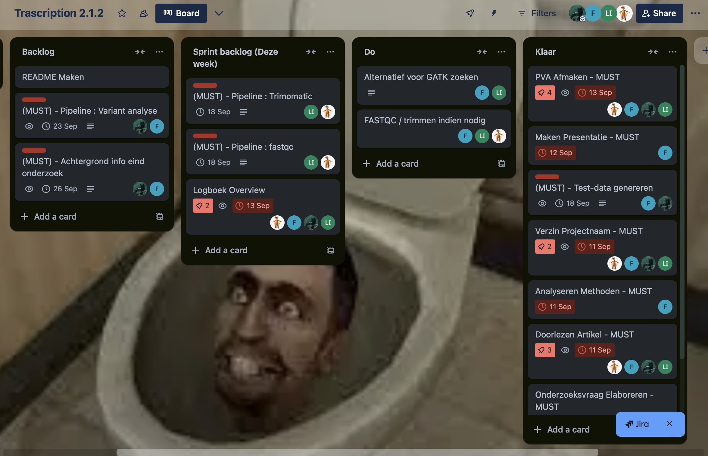{width=50%}


## Uitkiezen Onderzoek

Om een onderzoek met geschikte data voor ons vak te vinden zochten wij op het National Center for Biotechnology Information (NCBI) in de Gene Expression Omnibus (GEO) database. Onze opdrachtgevers gaven ons een template zoekopdracht die we moesten gebruiken om een geschikt artikel te vinden. Die zoekopdracht ziet er zo uit: "expression profiling by high throughput sequencing (Dataset Type) and genome variaton profiling by high throughput sequencing (Dataset Type)"

Door een woord met een onderwerp naar interesse toe te voegen, konden wij een interessant artikel vinden. In ons team hebben we kort besproken welke onderwerpen ons interesse heeft. Na er even over nagedacht te hebben kwamen wij uit op kanker gerelateerde onderzoeken, of onderzoeken over veroudering. Na een kleine discussie hadden we snel veroudering als ons onderwerp gekozen. Dit interesseert ons, omdat het hele lichaam, waaronder genexpressie, verandert naarmate een persoon ouder wordt. Dit verschilt per organisme en is een groot onderwerp waar veel onderzoek naar wordt gedaan.

Vervolgens hebben zijn wij op zoek gegaan naar interessante artikelen data van enige kwaliteit heeft. Na kort zoeken hadden wij een aantal artikelen gevonden:

### MiniCAFE, a CRISPR/Cas9-based compact and potent transcriptional activator, elicits gene expression in vivo

Dit onderzoek gaat over een nieuwe en veelbelovende manier om DNA te bewerken zonder de dubbele helix te breken door middel van CRIPR-bemiddelde gen activatie. Wij hadden veel interesse in dit onderwerp, maar hebben uiteindelijk niet voor dit artikel gekozen. Het artikel had slechts 2 replicaten beschikbaar terwijl ons minimum aantal 3 replicaten is, zoals is vastgesteld door de oprachtgevers. Hier volgt een link naar het volledig onderzoek: <https://www.ncbi.nlm.nih.gov/pmc/articles/PMC8053112/>

### Gene expressions associated with longer lifespan and aging exhibit similarity in mammals

Dit onderzoek gaat over een ontdekking van genexpressie geassocieerd met een langer maximum levensspan en de gelijkenis ervan tussen verschillende zoogdieren. Ook dit onderzoek trok onze aandacht, maar werd niet gekozen door onbeschikbare data. Hier volgt een link naar het volledig onderzoek: <https://www.ncbi.nlm.nih.gov/pmc/articles/PMC10415134/>

### Three-dimensional chromatin reorganization regulates B cell development during ageing

Dit onderzoek gaat over veranderingen in de 3d conformatie van chromatine die leiden tot verminderde expressie van het gen Ebf1. Dit arikel zag er eerst heel eng uit vanwege de nieuwe, onbekende, stof die in het artikel zat.Uiteindelijk hebben wij voor dit artikel gekozen, omdat het onderzoek voldoende data, waaronder vooral RNA data, bevat. Ook hebben wij het gekozen voor de uitdaging, omdat het onderzoek uit dit artikel recent is en nieuwe biologische bevindingen bevat. Hier volgt een link naar het volledig onderzoek: <https://pubmed.ncbi.nlm.nih.gov/38866970>


## Taken

De taken die ik voor deze week kreeg was om het gekozen artikel over 3d chromatine conformatie goed door te lezen en de gebruikte programma's en libraries te noteren. Deze materialen verzamelen wij zodat wij die ook kunnen gebruiken indien nodig. Daarnaast hebben we de materialen nodig nodig om ze te delen in onze presentatie van ons plan van aanpak.


## Gebruikte Programma's/Libraries
##### 03-09-2024

| Naam                             | Versie  | Uitleg                                                                                                                                                                                                                                                                                                                                                                                                                                                                                         | Gebruik                                                 | Link                                                                   |
|----------------------------------|---------|------------------------------------------------------------------------------------------------------------------------------------------------------------------------------------------------------------------------------------------------------------------------------------------------------------------------------------------------------------------------------------------------------------------------------------------------------------------------------------------------|---------------------------------------------------------|------------------------------------------------------------------------|
| Flowjo                           | -       | FlowJo is een platform voor single-cell flowcytometrieanalyse waarmee je gegevens snel en effectief kunt interpreteren met toegankelijke functies voor immunofenotypering, celcyclusanalyse, proliferatie, kinetische onderzoeken, kwantitatieve populatievergelijking, hoogdimensionale analyse en meer.                                                                                                                                                                                      | Data analyse                                            | https://www.flowjo.com/solutions/flowjo                                |
| STAR RNA sequence aligner        | v2.7.3a | STAR is een command-line tool bedoeld om RNA sequenties uit te lijnen.                                                                                                                                                                                                                                                                                                                                                                                                                         | RNA reads trimmen en mappen                             | https://github.com/alexdobin/STAR/releases                             |
| Cufflinks                        | v2.2.1  | Cufflinks verzamelt transcripties, schat hun overvloed en test op differentiële expressie en regulatie in RNA-Seq-monsters. Het accepteert uitgelijnde RNA-Seq-lezingen en voegt de uitlijningen samen tot een spaarzame reeks transcripties. Cufflinks schat vervolgens de relatieve hoeveelheden van deze transcripties op basis van het aantal lezingen dat ze ondersteunen, rekening houdend met vooroordelen in de protocollen voor bibliotheekvoorbereiding.                             | RNA sequenties kwantificeren                            | https://github.com/cole-trapnell-lab/cufflinks?tab=readme-ov-file      |
| IGV Intergrative Genomics Viewer | -       | IGV is een Bio Tool is een programma dat gebruikt wordt om genomische data te visualiseren.                                                                                                                                                                                                                                                                                                                                                                                                    | Genomische data visualiseren                            | https://igv.org                                                        |
| Bowtie2 sequence aligner         | v2.3.5  | Bowtie2 is een tool voor het alignen van sequencing reads tegenover lange referenties. Het is bijzonder goed in het uitlijnen van ongeveer 50 tot 100 of 1000 karakters, en bijzonder goed in het uitlijnen van relatief lange genomen. Bowtie 2 indexeert het genoom met een FM-index om de geheugenvoetafdruk klein te houden: voor het menselijk genoom bedraagt de geheugenvoetafdruk doorgaans ongeveer 3,2 GB. Bowtie 2 ondersteunt uitlijningsmodi met openingen, lokale en paired-end. | ChIP-seq reads tegenover het genoom van een muis leggen | https://github.com/BenLangmead/bowtie2                                 |
| deepTools quality checker        | v3.3.0  | deepTools is een reeks Python-tools die speciaal zijn ontwikkeld voor de efficiënte analyse van sequencing-gegevens met hoge doorvoer, zoals ChIP-seq, RNA-seq of MNase-seq.                                                                                                                                                                                                                                                                                                                   | Bigwig tracks en heatmaps genereren                     | https://github.com/deeptools/deepTools                                 |
| cLoops2                          | v0.0.2  | cLoops2 is een programma voor visualisatie. Van loop-calling op basis van aannamevrije clustering tot een volledige reeks analysehulpmiddelen voor 3D-genomische interactiegegevens. cLoops2 is specifiek aangepast voor gegevens zoals Hi-TrAC/Trac-looping/ChIA-PET/HiChIP, waarvoor interacties verrijkt over het genoom door middel van experimentele stappen.                                                                                                                             | Visualiseren en kwantificeren                           | https://github.com/YaqiangCao/cLoops2                                  |
| Cooler2                          | -       | Cooler is een library voor een schaars, gecomresseerd, binair persistent opslagformaat dat wordt gebruikt om genomische interactiegegevens op te slaan, zoals Hi-C-contactmatrices.                                                                                                                                                                                                                                                                                                            | Analyseren Virtual 4C                                   | https://github.com/open2c/cooler                                       |
| HTGTSrep                         | -       | HTGTS-Rep is een pijplijn voor uitgebreide analyse van HTGTS-Rep-seq.                                                                                                                                                                                                                                                                                                                                                                                                                          | Analyseren VDJ-sequenties                               | https://github.com/Yyx2626/HTGTSrep                                    |
| HiCUP                            | v0.7.2  | HiCUP is een pipeline/tool voor het mappen en uitvoeren van kwaliteitscontrole op Hi-C-data.                                                                                                                                                                                                                                                                                                                                                                                                   | Hi-C reads tegen het genoom van een muis leggen         | https://www.bioinformatics.babraham.ac.uk/projects/hicup/              |
| Juicer                           | v1.6.0  | Juicer is een platform voor het analyseren van Hi-C-gegevens met kilobase-resolutie.                                                                                                                                                                                                                                                                                                                                                                                                           | Verwerken Hi-C gegevens                                 | https://github.com/aidenlab/juicer                                     |
| hicPCA                           | v3.6    | hicPCA is een andere tool in de HIC explorer bedoeld voor het berekenen van PCA-eigenvectoren voor een Hi-C-matrix.                                                                                                                                                                                                                                                                                                                                                                            | Berekenen PCA-eigenvectoren voor een Hi-C-matrix        | https://hicexplorer.readthedocs.io/en/latest/content/tools/hicPCA.html |
| GraphPad                         | v.9.5.0 | GraphPad is een programma waarin je data kan visualiseren, analyseren en verwerken.                                                                                                                                                                                                                                                                                                                                                                                                            | Uitvoeren statistische toetsen                          | https://www.graphpad.com/features                                      |
| SciPy                            | -       |                                                                                                                                                                                                                                                                                                                                                                                                                                                                                                |                                                         | -                                                                      |
<small> *Figuur 2: Tabel met de gebruikte software/libraries* </small>


## Downloaden van de data

Om de genomics data te kunnen bewerken moeten we het eerst downloaden. Met de Sequence Run Archive (SRA) run selector van het NCBI is een selectie van SRA bestanden gemaakt die gedownload moeten worden. Om deze bestanden te kunnen downloaden moeten wij prefetch gebruiken. Prefetch is een tool in de SRA toolkit. Door prefetch kunnen wij de data sneller downloaden door de data in een cache te stoppen voordat het gebruikt wordt.

```{bash, eval=FALSE} 
prefetch $(</students/2024-2025/Thema05/3dconformatieChromatine/SRA/SraAccList.csv) --output-directory \ 

/students/2024-2025/Thema05/3dconformatieChromatine/SRA/ --max-size 200G 
```

Hierboven zie je het bash script voor het downloaden van de SRA bestanden.(WELKE SRA BESTANDEN, ZODAT ANDERE DIE OOK KAN VINDEN) Dit script is geschreven door Jarno. In de eerste regel wordt een SRA accesion lijst aangegeven in de vorm van een .csv bestand *(SraAccList.csv)*. Dit is een tekstbestand dat een lijst met de namen van de benodigde SRA bestanden bevat. Door deze lijst aan te geven wordt er op de NCBI database gezocht naar de bestanden die in het .csv bestand staat. In de volgende regel wordt de output locatie aangegeven. Wij zetten onze data op de assemblix server van school zodat iedereen van het team bij de data kan wanneer hij wilt. Als laatst wordt de maximum grootte van de data aangegeven. Als de data meer dan de aangegeven grootte, in ons geval 200GB, bevat, wordt de prefetch afgekapt. De standaard is maximum grootte is 20GB.


## Planning

Als planning voor onze weekdoelen hebben wij een gant chart gemaakt waarin wij onze weekdoelen vaststellen.

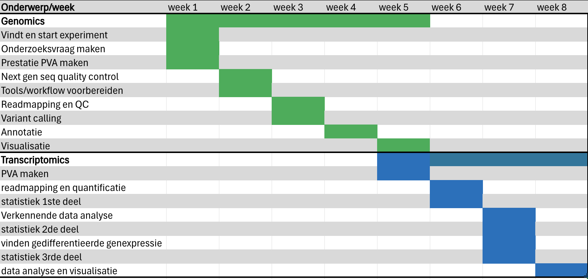{width=75%}

In de chart kan je in de rijen onze taken zien en de weken in de kolommen. De kleuren staan voor de onderwerpen: Groen staat voor alle genomics geralateerde taken en blauw voor de transcriptomics gerelateerde taken.

\
\

# Week 2 | Kwaliteitscontrole & Trimmen


## Presentatie
##### 9-9-2024

Wij begonnen deze week met het presenteren van het genomics gedeelte van onze plan van aanpak. Daarin heeft Floris verteld over het onderzoek in het artikel dat wij hebben gekozen. Daarbij heeft hij verteld wat de onderzoekers hebben gedaan in het onderzoek, de gebruikte materialen en methoden uitgelegd, en wat wij als team met dit onderzoek gaan doen. (LINK NAAR DE PRESENTATIE. BESTADN IN REPO)


## Uitpakken van de data

Om onze genomics data te kunnen bekijken en bewerken, moeten we het eerst uitpakken. De huidige vorm van onze data is een SRA bestand, wat een archief van sequence runs is. Om onze genomics data te kunnen bekijken moeten wij de SRA bestanden uitpakken en omzetten naar het .FASTQ format. Om dit te kunnen doen hebben wij fasterq dump gebruikt. Fasterq dump is een tool die FASTA of FASTQ extraheert uit een SRA bestand. In ons geval zijn het FASTQ bestanden.

```{bash, eval=FALSE}
find /students/2024-2025/Thema05/3dconformatieChromatine/SRA/ -name "*.sra" | \
  parallel fasterq-dump -O /students/2024-2025/Thema05/3dconformatieChromatine/fastq/ {}
```

Hierboven zie je de bash script gebruikt om de SRA bestanden met onze genomics data uit te pakken en naar het FASTQ formaat om te zetten. Dit script is geschreven door Jarno. In de eerste regel wordt de folder die de SRA bestanden bevat gekozen. Vervolgens wordt er een naam aangegeven, .sra, die wordt opgeslagen voor gebruik in de volgende regel. In de volgende regel spreken we fasterq dump aan om de .FASTQ bestanden in een andere map te zetten. Aan het einde van de regel zie je accolades ({}) staan. In die accolades staat de naam die we eerder hebben aangegeven opgeslagen. Deze naam wordt gebruikt om aan te geven naar welke extensie fasterq dump moet kijken. De extensie waar die naar moet kijken is .sra, omdat wij de SRA bestanden uit gaan pakken. Door deze accolades negeert fasterq dump alle bestanden die niet de .sra extensie hebben.


## Formuleren onderzoeksvraag

Na enige feedback uit de presentatie bleek het dat wij niet echt een onderzoeksvraag hadden voor ons genomics gedeelte. Een onderzoeksvraag hebben is natuurlijk belangrijk voor een onderzoek. Waar doe je anders onderzoek voor? Na een hele korte tijd brainstormen hebben wij een onderzoeksvraag kunnen formuleren: **Zijn er varianten aanwezig van PAX5 en Ebf1 in het genoom van de rag2(-/-) muizen die gebruikt zijn?**

Deze vraag is relevant bij het onderzoek, omdat er in het transcriptomics gedeelte van het onderzoek wordt gekeken naar verschillen in expressie van de genen PAX5 en Ebf1.

Als het blijkt dat er mutaties of varianten van de genen aanwezig zijn, kan het betekenen dat het verschil in expressie van PAX5 en Ebf1 in muizen in het onderzoek niet alleen veroorzaakt worden door de invloed van veroudering op genexpressie.


## Genereren testdata
16-09-2024

Om te voorkomen dat een van onze scripts na een lange tijd geïnterrumpeerd wordt of foute resultaten geeft, hebben Floris en Jarno testdata gemaakt met seqtk. Testdata is belangrijk, omdat wij onze test runs daarop kunnen uitvoeren zonder onze data te comprimeren.

Voor het genereren van de testdata, hebben Floris en Jarno seqkit gebruikt. Seqkit is een tool die veel gebruikt wordt voor het bewerken en analyseren van sequentiebestanden. Als input werkt seqkit met FASTA en FASTQ bestanden. Seqkit kan efficient door grote datasets lopen en biedt een verscheidenheid aan functies aan, waaronder filteren en splitsen van sequenties.

```{bash, eval=FALSE}

cd /run/media/floris/FLORIS_3/DATA_SETS/3D_Chromatine_Conformatie/DNA/SRA

seqkit head -n 1000000 SRR26980527_1.fastq > subset_SRR26980527_1.fastq
seqkit head -n 1000000 SRR26980527_2.fastq > subset_SRR26980527_2.fastq


```

Hierboven staat het script voor het creëren van de testdata. Met dit script zijn er 2 subsets aan testdata gegenereerd waarvan elke subset 100.000 reads bevat. De keuze om elke subset 100.000 reads gegeven is gemaakt na het advies van onze docent om die hoeveelheid in te stellen. Voor meer uitleg over dit proces kan je in het logboek van Jarno en Floris kijken. 


## Kwaliteitscontrole
##### 15-09-2024

Om fouten te voorkomen die veroorzaakt kunnen worden door data van slechte kwaliteit, hebben wij een kwaliteitscontole uitgevoerd op onze data. Hiervoor hebben wij fastqc en multiqc. Fastq is een programma dat zowel single- als paired-end data kan controleren op de kwaliteit. Als output geeft Fastqc verschillende bestanden: Een rawdata bestand waarin de gegevens van de kwaliteit in een textbestand staan, een html bestand waarin meerdere grafieken en tabellen staan van de kwaliteit van de data, en alle afbeeldingen uit de html los in een mapje. Uitleg van de rawdata bestand en grafieken uit de html kan je hieronder lezen.

### Uitleg Fastqc

**(ALLE DATA IN DE UITLEG IS NIET DATA DIE DOOR ONS IS GEBRUIKT. HET IS DATA DAT DIENT ALS VOORBEELD.)**

Dit is hoe de RawData bestanden eruit zien: 

```{r, eval=TRUE}
# lees de eerste 15 regels van het bestand
FastQC_RawData_44 <- readLines("Afbeeldingen/FastQC_on_data_44__Webpage/Sample1_0394321_L001_R1_001_fastq_gz_fastqc/fastqc_data.txt", n =15)

# laat de regels van het bestand zien
FastQC_RawData_44
```

Dit zijn de eerste 15 regels van het RawData bestand van het .fastq bestand met de forward reads, omdat de rest van de regels van het bestand eruit zien als de 14e en de 15e. Uit dit bestand kan ik een aantal dingen zien: 

* In de 1e regel is te zien dat wij FastQC versie 0.11.9 hebben gebruikt. 
* In de 2e regel is te zien dat de data voor alle basisstatistieken geslaagd is. 
* In de 4e regel staat de naam van het bestand dat we FastQC hebben gegeven, in dit geval is het *Sample1_0394321_L001_R1_001_fastq_gz.gz*. 
* In de 6e regel is te zien welke encoding is gebruikt op de data, in dit geval is het Sanger / Illumina 1.9. 
* In de 7e regel is te zien hoeveel sequenties er totaal in het bestand zitten, in dit geval zijn het er 1424257
* In de 8e regel is te zien hoeveel sequenties er gerapporteerd zijn voor slechte kwaliteit, in dit geval zijn het er 0
* In de 9e regel is de range te zien van de lengte van de sequenties, in dit geval is de lengte van de sequenties tussen de 32 en 151 baseparen
* In de 10e regel is het GC percentage te zien, in dit geval is het GC percentage 42%

Zoals hierboven te zien is geven de RawData bestanden wel nuttige informatie, maar de .HTML bestanden geven net wat meer data op een overzichtelijke manier. Dit zijn de grafieken die er in de .HTML bestanden zitten:

#### Basic Statistics

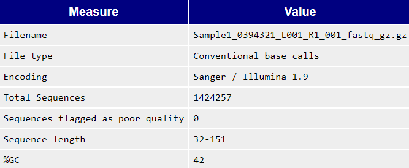{width=50%}

Hierboven zie je de tabel met de basic statistics van de data. Deze tabel geeft meerdere stukken aan informatie:

* **Filename** - Het naam van het bestand dat is geanalyseerd
* **File type** - Geeft aan of het bestand daadwerkelijke basecalls of colorspace data bevat die naar basecalls geconverteerd moesten worden
* **Encoding** - Geeft aan welke ASCII-codering van kwaliteitswaarden in het bestand is gevonden
* **Total Sequences** - Is een telling van het totale aantal verwerkte sequenties.
* **Sequences flagged as poor quality** - Geeft aan hoeveel sequenties in het bestand van slechtere kwaliteit is
* **Sequence length** - Geeft de lengte van de kortste en langste sequentie in de set. Als alle sequentie dezelfde lengte hebben, wordt er een waarde gerapporteerd.

#### Per Base Sequence Quality

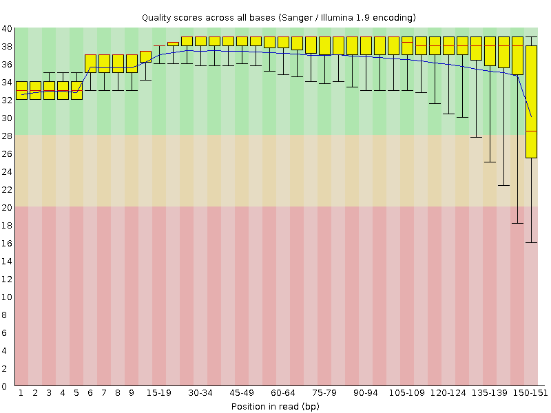{width=50%}

Hierboven zie je een grafiek van de per base sequence quality. Deze grafiek toont een overzicht van de range van de kwaliteit over alle basen op elke positie in het bestand. Voor elke positie in de grafiek is wordt een boxplot getekend. De elementen van de boxplot zijn:

* De centrale rode lijn is de mediaan
* Het gele vlak is de interkwartielafstand
* De bovenste en onderste horizontale lijn zijn de uiterste waarden
* De blauwe lijn geeft de gemiddelde kwaliteit weer

De y-as bestaat uit de kwaliteitsscores. De achtergrond van de grafiek geeft deelt de y-as op in 3 verschillende kwaliteitsgroepen:

* Goed (Groen) >28
* Redelijk (Oranje) >20 en <28
* Slecht (Rood) <20

FastQC geeft een waarschuwing op dit onderdeel als het onderste kwartiel voor een base lager is dan 10, of als de mediaan voor een base lager is dan 25. FastQC levert een fout op bij dit onderdeel als het onderste kwatiel voor een base kleiner is dan 5, of als de mediaan voor een base kleiner is dan 20.

#### Per Tile Sequence Quality

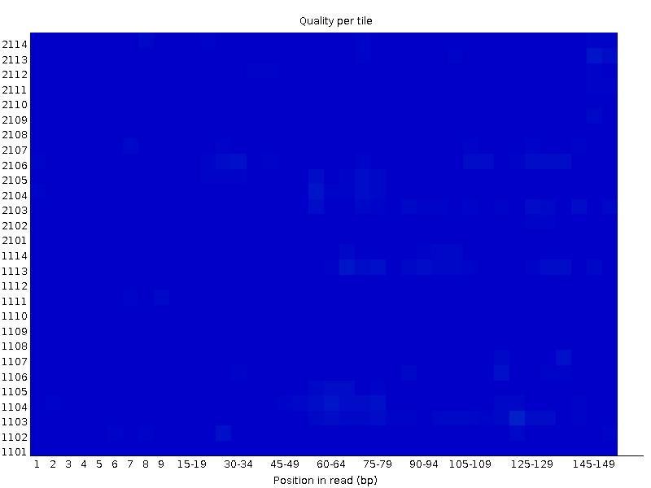{width=50%}

Hierboven zie je een grafiek voor de per tile sequence quality. Deze grafiek verschijnt alleen in de resultaten als er een illumina library is gebruikt die de oorspronkelijke sequentie identifiers behoudt. Hierin is de flowcelltegel gecodeerd waaruit elke read afkomstig is. In deze grafiek zijn de kwaliteitsscores van elke tegel op alle basen te bekijken om te zien of er sprake is van kwaliteitsverlies bij slechts een deel van de flowcell.

De grafiek geeft per tegel de afwijking van de gemiddelde kwaliteit per tegel gegeven. De kleuren bevinden zich op een koude tot warme schaal waarbij koude kleuren posities zijn waar de kwaliteit op of boven het gemiddelde lag voor die base in de sequentie. Warme kleuren geven aan dat een tegel slechtere kwaliteiten had dan andere tegels voor die base. Een goed plot moet overal blauw zijn.

FastQC geeft een waarschuwing bij dit onderdeel als een tegel een gemiddelde Phred schore vertoont die meer dan 2 lager is dan het gemiddelde voor die basis op alle tegels. FastQC levert een fout op al seen tegel een gemiddelde Phred schore vertoont die meer dan 5 lager is dan het gemiddelde voor die basis op alle tegels.

#### Per Sequence Quality Scores

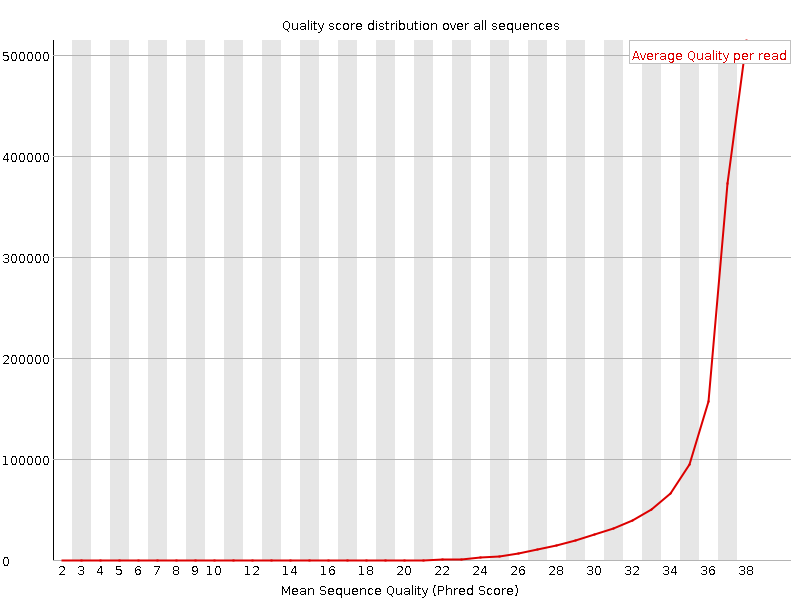{width=50%}

Hierboven zie je een grafiek van de per sequnce quality scores. Met deze grafiek laat zien of een subset van de sequenties universeel lage waarden hebben. Als een aanzienlijk deel van de sequenties in een run over het algemeen een lage kwaliteit heeft, kan dit wijzen op een systematisch probleem, mogelijk met slechts een deel van de run.

FastQC geeft een waarschuwing bij dit onderdeel als de meest waargenomen gemiddelde kwaliteit lager is dan 27. Dit komt neer op een foutenpercentage van 0.2%. FastQC levert een fout op al sde meest waargenomen gemiddelde kwaliteit lager is dan 20. Dit komt neer op een foutenpercentage van 1%.

#### Per Base Sequence Content

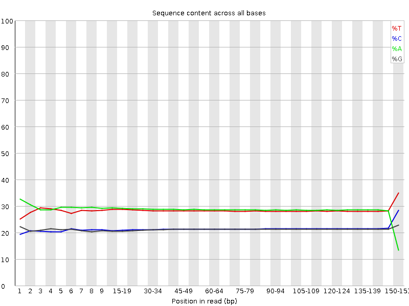{width=50%}

Hierboven zie je een grafiek van de per base sequence content. Deze grafiek toont de proportie van elke basepositie in een bestant waarvoor elk van de vier normale basen is opgeroepen.

FastQC geeft een waarschuwing bij dit onderdeel als het verschil tussen A en T, of G en C in welke positie dan ook groter is dan 10%. FastQC levert een fout op als het verschil tussen A en T, of G en C in welke positie dan ook groter is dan 20%.

#### Per Sequence GC Content

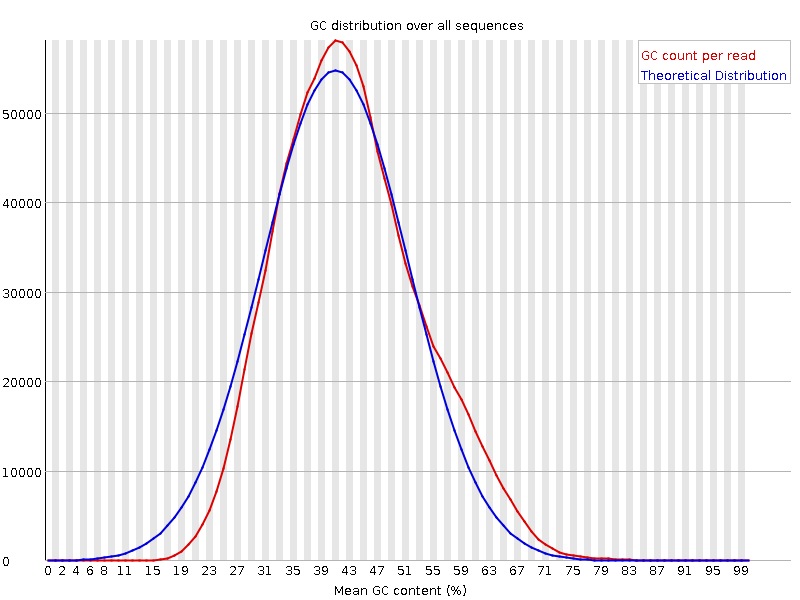{width=50%}

Hierboven zie je een grafiek van de per sequence GC content. Deze grafiek meet de GC-inhoud over de gehele lengte van elke sequentie in een bestand en vergelijkt deze met een gemodelleerde normale verdeling van de GC-inhoud.

FastQC geeft een waarschuwing bij dit onderdeel als de som van de afwijkingen van de normale verdeling meer dan 15% van de meetwaarden vertegenwoordigt. FastQC levert een fout op als de som van de afwijkingen van de normale verdeling meer dan 30% van de metingen vertegenwoordigt.

#### Per Base N Content

{width=50%}

Hierboven zie je een grafiek van de per base N content. Deze grafiek geeft het percentage base calls weer op elke positie waarvoor een N is opgeroepen.

Als een sequencer niet met voldoende vertrouwen een base call kan doen, zal hij normaal gesproken een N oproep vervangen in plaats van een normale base call.

FastQC geeft een waarschuwing bij dit onderdeel als een positie een N-gehalte van >5% vertoont. FastQC levert een fout op als een positie een N-gehalte van >20% vertoont.

#### Sequence Length Distribution

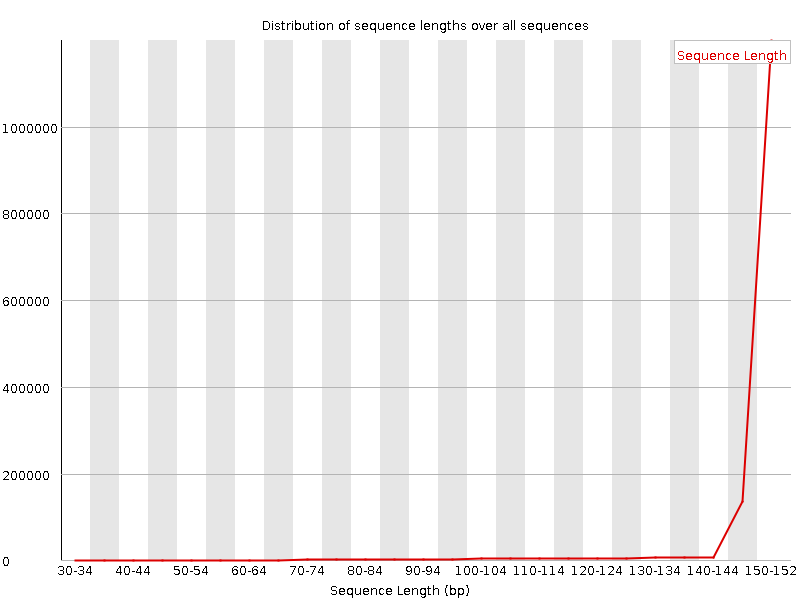{width=50%}

Hierboven zie je een grafiek van de sequence length distribution. Deze grafiek toont de verdeling van de fragmentgroottes in het geanalyseerd bestand.

FastQC geeft een waarschuwing bij dit onderdeel als niet alle sequenties dezelfde lengte hebben. FastQC levert een fout op als een van de sequenties een lengte van 0 heeft.

#### Sequence Duplication Levels

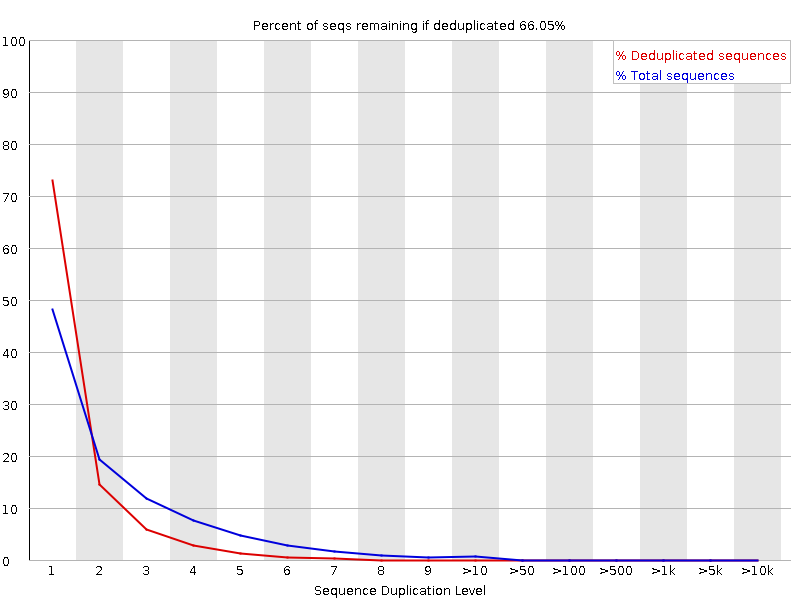{width=50%}

Hierboven zie je een grafiek van de sequence duplication levels. Deze grafiek laat het relatieve aantal sequenties zien met verschillende mate van duplicatie.

FastQC geeft een waarschuwing bij dit onderdeel als niet-unieke sequenties meer dan 20% van het totaal uitmaken. FastQC levert een fout op als niet-unieke sequenties meer dan 50% van het totaal uitmaken.

#### Overrepresented sequences

Dit onderdeel vermeldt alle sequenties die meer dan 0.1% van het totaal uitmaken.

FastQC geeft een waarschuwing bij dit onderdeel als een sequentie meer dan 0.1% van het totaal vertegenwoordigt. FastQC levert een fout op als een sequentie meer dan 1% van het totaal vertegenwoordigt.

#### Adapter Content

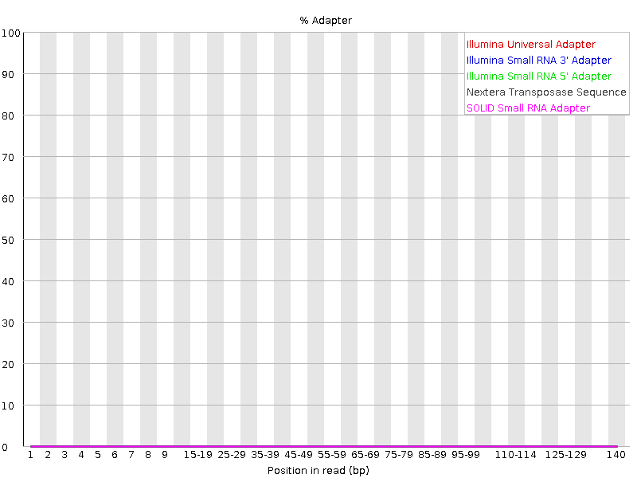{width=50%}

Hierboven zie je een grafiek van de adapter content. Deze grafiek toont een cumulatief percentage van het deel van de library dat elk van de adapter sequenties op elke positie heeft gezien. Zodra een sequentie tijdens het lezen is gezien, wordt deze geteld als aanwezig tot het einde van het lezen, zodat de percentages die je ziet alleen maar toenemen naarmate de leeslengte vordert.

FastQC geeft een waarschuwing bij dit onderdeel als een sequentie aanwezig is in meer dan 5% van alle metingen. FastQC levert een fout op als een sequentie aanwezig is in meer dan 10% van alle metingen.

### Uitvoeren Fastqc

Om FastQC op onze fastq bestanden met de genomics data uit te voeren is er geen moeilijk script vereist. Om fastq uit te kunnen voeren op onze data was het volgende script nodig:

```{r}
# zet de working directory naar de map met de fastq bestanden
setwd("/students/2024-2025/Thema05/3dconformatieChromatine/fastq")

(x = getwd())

# voer fastqc uit
fastqc(fq.dir = x, qc.dir = "/students/2024-2025/Thema05/3dconformatieChromatine/fastqc_output/", fastqc.path = "/usr/bin/fastqc", threads = 100)
```

Hierboven zie je het script om FastQC uit te voeren op onze fastq data. Hiervoor hebben wij een library in r, fastqcr, gebruikt. Fastqcr is een library die fastqc simpelweg aanspreekt via r. In de eerste regel zetten wij onze working directory naar de map die onze fastq bestanden bevat. Dit is nodig, omdat fastqc anders onze data niet kan vinden. In de volgende regel hebben wij huidige working directory opgeslagen in een variabele. Vervolgens voeren wij FastQC uit met de regel daarna. In het eerste argument geven wij aan waar onze fastq bestanden zich bevinden, in de opgeslagen variabele van onze huidige working directory. In het tweede argument geven wij aan in welke folder FastQC zijn output moet stoppen. Hiervoor hebben wij een nieuwe map gemaakt, omdat het wat overzichtelijker is. In de het derde argument geven wij aan waar fastqc zelf is. Dit is nodig, zodat fastqcr weet uit welke folder die fastqc moet aansturen. In het laatste argument geven wij aan hoeveel threads fastqc mag gebruiken. Wij lieten fastqc 100 threads gebruiken, zodat fastqc snel klaar zou zijn.


## Multiqc

Om de kwaliteit van alle fastq bestanden te bekijken, gaan we natuurlijk niet alleapparte fastqc rapporten kijken. Om dit makkelijk te bekijken gebruiken wij multiqc. Multiqc is een programma dat verschillende rapporten combineert tot één rapport met alle rapporten in een. Om multiqc uit te voeren, hebben wij het script hieronder uitgevoerd:

```{bash, eval=FALSE}
pwd
cd ../
cd fastqc_output
pwd
multiqc .
```

Het script hierboven is het script dat wij hebben gebruikt om multiqc uit te voeren. De pwd commando's zijn er om de huidige working directory te printen en zijn dus irrelevant. De folder waar wij uit werken is: /students/2024-2025/Thema05/3dconformatieChromatine/fastq. Vervolgens gaan wij met een paar cd commando's naar de folder waar de fastqc rapporten van de fastqc bestanden met onze genomics data zich bevinden. Vervolgens voeren wij multiqc uit. De punt staat daar om het uit te voeren in onze huidige working directory. Zonder punt zou het ook werken, maar om het zeker te weten gebruiken wij de punt wel.

Als output geeft multiqc een raport van alle fastq rapporten gecombineerd. Alle grafieken in de multiqc rapporten zijn hetzelfde als de grafieken in de fastqc rapporten. 


## Resultaten Kwaliteitscontrole

### Algemene Statistieken

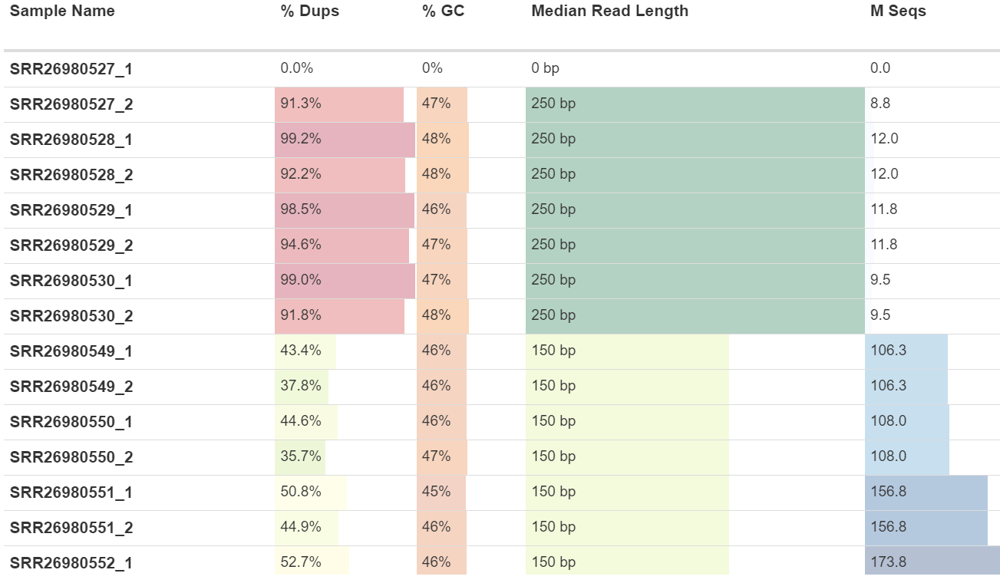{width=75%}

Hierboven zie je een tabel van de algemene statistieken van onze genomics data. Wat meteen opvalt is dat de eerste sample geen data bevat, dus die is waarschijnlijk gecomprimeerd tijdens het downloaden. Verder valt meteen op dat de samples in rij 2 tot en met 8 veel meer duplicaten bevatten dan de samples in tij 9 tot en met 15. Het aantal duplicaten van de samples in de eerste 8 rijen lopen wel op tot 99.2%, wat enorm veel is. 

Verder is te zien dat het GC% van de reads fluxueert tussen 45% en 48%. Op een pagina van het ncbi over het genoom van GRCm39 (<https://www.ncbi.nlm.nih.gov/datasets/genome/GCF_000001635.27/>) heb ik gekeken wat het gemiddelde GC% van mus musculus GRCm39 is. Volgens de ncbi pagina is het gemiddelde GC% van mus musculus GRCm39 41% waarbij chromosoom 11 het chromosoom is met de hoogste GC% van 44%. Chromosoom 11 is tevens het chromosoom waar het gen Ebf1 zich bevindt, waar naar wordt gekeken in het onderzoek. Met het gemiddelde GC% uit onze samples van 45.75% kunnen wij met enige zekerheid bevestigen dat het onderzoek geen whole genome onderzoek is, maar een selectie onderzoek waarbij ze chromosoom 11 hebben gekozen omdat Ebf1 zich op dat chromosoom bevindt. Dit zou ook meteen de hoeveelheid duplicaties in de reads kunnen verklaren.

Het laatse wat meteen opvalt uit de algemene statistieken is dat de samples die veel duplicaten bevatten een mediaan read lengte van 250 bp hebben, terwijl de samples met normale duplicatie niveaus een mediaan read lengte van 150bp hebben. Dit lengteverschil is op zichzelf geen probleem, maar zou een effect kunnen hebben op de kwaliteit van de reads.

### Gemiddelde Kwaliteit

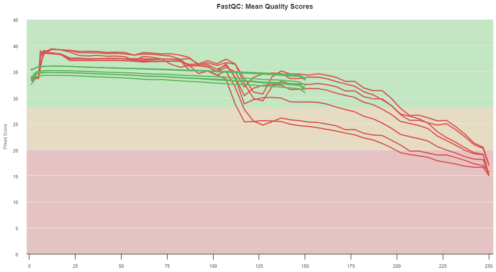{width=75%}

Hierboven zie je een grafiek met de gemiddelde kwaliteit per base van de reads. Uit de grafiek is meteen te identificeren welke lijn bij welke groep hoort door de lengte van de lijnen. De rode, langere lijnen behoren tot de samples met veel duplicaten en een lengte van 250bp. De groene, kortere lijnen behoren tot de samples met normale niveaus, waaronder een gemiddelde kwaliteit van >28. Wat meteen opvalt, is dat de samples met veel duplicaten niet passeren bij dit onderdeel. Een sample passeert niet bij dit deel als het onderste kwartiel voor een base kleiner is dan 5 of als de mediaan voor een base kleiner is dan 20. Bij de gefaalde samples zien wij in ieder geval dat de mediaan op een duur lager is dan 20. 

Wat nog meer opvalt bij deze grafiek, is dat de kwaliteit van de gefaalde samples plots een stuk dalen rond het 105bp tot 115bp gebied. Waardoor dit komt, is niet zeker te zeggen. Een mogelijke verklaring is dat het signaal van de sequencer op dat moment verzwakte, waardoor die minder goed de read af kan lezen. Dit kan veroorzaakt worden door afbrekende fluoforen die worden gebruikt om de base te bepalen, waardoor de proportie van het uitgezonden signaal met elke cyclus van het sequencen afneemt. Nog een mogelijke verklaring is phasing, waarbij de sequencer niet meer synchroon loopt met de reads. Dit resulteert in een dalende kwaliteit richting de 3'kant van een read. 

Verder lijkt het dat de 250bp reads van goede kwaliteit te zijn tot en met 100bp. De lagere kwaliteit in het begin van de reads van 250bp is te wel verklaren. Sequencers gebruiken de eerste baseparen van een read om te kalibreren, waardoor de kwaliteit van de eerste paar baseparen van een read een stuk lager kan liggen dan de rest van de read. Dit is volkomen normaal en ligt niet aan de reads zelf.

De samples met een lengte van 150bp lijken van goede kwaliteit te zijn en hebben op dit vlak geen verdere aandacht nodig.

### Aantal Sequenties

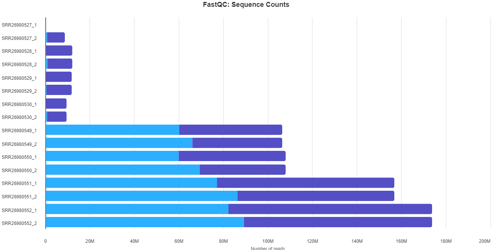{width=75%}

Hierboven zie je een grafiek waarin het aantal reads per sample te zien is. Het eerste en enige wat meteen opvalt is dat de samples met veel duplicaten aanzienlijk minder reads bevat dan de samples van normale kwaliteit. Dit is niet iets ergs, maar wel apart.

### Duplicatie Niveaus

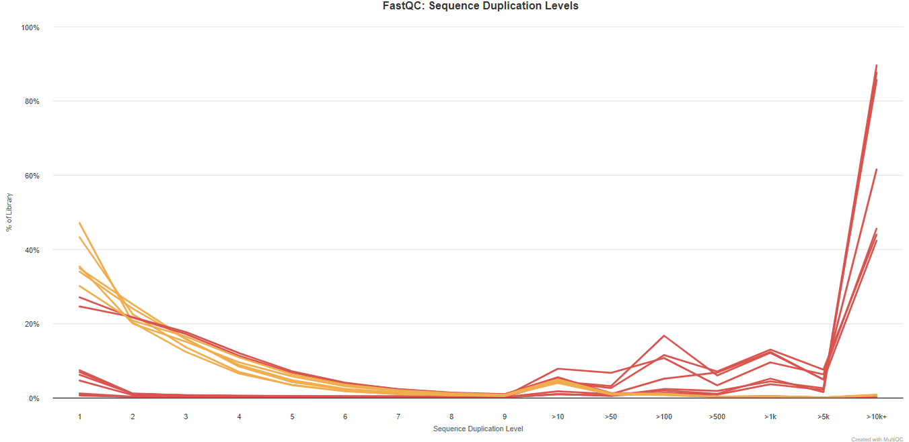{width=75%}

Hierboven zie je een grafiek van de duplicatie niveaus van onze genomics samples. Wat opvalt, is dat geen enkele sample is gepasseerd bij dit onderdeel. Een sample levert een waarschuwing op als de duplicaten meer dan 20% van het totaal uitmaken en levert een fout op als de duplicaten meer dan 50% van het totaal uitmaken. Over het algemeen zijn er twee mogelijke soorten duplicaten: technische duplicaten die voortkomen uit PCR-artefacten, of biologische duplicaten die natuurlijke botsingen zijn waarbij verschillende kopieën van exact dezelfde sequentie willekeurig worden geselecteerd. Op sequentieniveau is er geen manier om onderscheid te maken tussen deze twee typen en beide worden hier als duplicaten gerapporteerd. Om te achterhalen waardoor deze duplicatie niveaus komen, is niet mogelijk met alleen deze informatie.

### Overrepresentatieve Sequenties

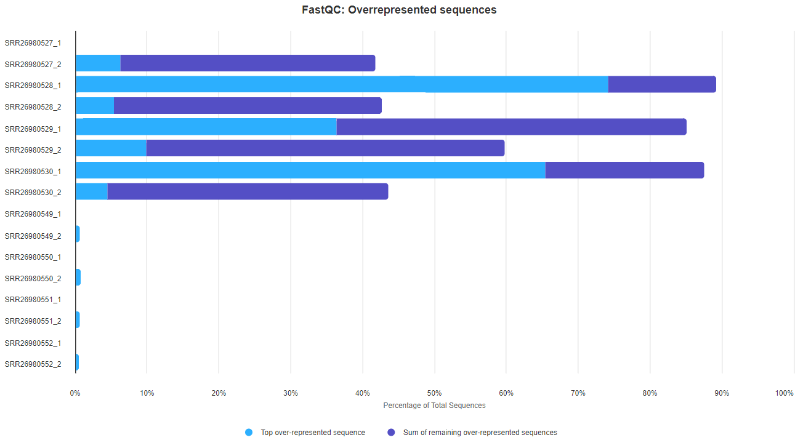{width=75%}

Hierboven zie je een grafiek met overrepresentatieve sequenties. Dit zijn sequenties die heel veel voorkomen in een sample. Hieruit is te zien dat samples SRR26980528_1	en SRR26980530_1 voor meer dan 65% bestaan uit een dezelfde sequentie. Als wij naar de Aparte Fastqc rapporten kijken van deze samples kunnen wij zien welke sequenties het precies zijn.

#### Overrepresentatieve sequenties SRR26980528_1

|                      Sequence                      |  Count  |      Percentage     |                  Possible Source                  |
|:--------------------------------------------------:|:-------:|:-------------------:|:-------------------------------------------------:|
| ACAGTGTGACATGGGGAGATCTGAGAATATCTTTTCCCGTTTCAGAATGG | 8937946 | 74.20470227196611   | No Hit                                            |
| ACAGTGTGACATGGGGAGATCGGAAGAGCGGTTCAGCAGGAATGCCGAGA | 653277  | 5.4236426675796885  | Illumina Paired End PCR Primer 2 (100% over 34bp) |
| ACAGTGTGACATGGGGCAAGCTGCTTGCCTTCCCTGTGGCGCATCCTCTG | 253510  | 2.104693189348663   | No Hit                                            |
| ACAGTGTGACATAGTCAGATCGGAAGAGCGGTTCAGCAGGAATGCCGAGA | 143107  | 1.1881043282242087  | Illumina Paired End PCR Primer 2 (100% over 34bp) |
| ACAGTGTGACATGGGGACATGCTAGATGGTATGGGGACATGCAAGGTGTC | 102444  | 0.8505115738615222  | No Hit                                            |
| ACAGTGTGACATGGGGAGATCCACGCGTGCCCTATAGTCAGATCGGAAGA | 78853   | 0.6546541440562903  | No Hit                                            |
| ACAGTGTGACATGGGGAGATCTGCCACGCGTGCCCTATAGTCAGATCGGA | 64108   | 0.5322380615469375  | No Hit                                            |
| ACAGTGTGACATGGGGAGATCCCACGCGTGCCCTATAGTCAGATCGGAAG | 58081   | 0.482200643487672   | No Hit                                            |
| ACAGTGTGACATGGTCAGATCGGAAGAGCGGTTCAGCAGGAATGCCGAGA | 47552   | 0.39478667721157995 | Illumina Paired End PCR Primer 2 (100% over 34bp) |
| ACAGTGTGACATGGGGAGATCTGAGACCACGCGTGCCCTATAGTCAGATC | 47306   | 0.3927443336173243  | No Hit                                            |
| ACAGTGTGACATGGGGAGATCTGAGCCACGCGTGCCCTATAGTCAGATCG | 46752   | 0.3881449094253825  | No Hit                                            |
| ACAGTGTGACATGCCCACGCGTGCCCTATAGTCAGATCGGAAGAGCGGTT | 45492   | 0.3776841251621214  | No Hit                                            |
| ACAGTGTGACATGGGGAGATCTGGAGGGGTGAGGGATGGGGACATTCTCT | 44372   | 0.3683856502614449  | No Hit                                            |
| ACAGTGTGACATGGGGAGATCTCCACGCGTGCCCTATAGTCAGATCGGAA | 32646   | 0.2710339389352549  | No Hit                                            |
| ACAGTGTGACATGGCCTCCTTCCTGTCTCCTGAACTAAAATGCTGGTATT | 30532   | 0.2534830675602279  | No Hit                                            |
| ACAGTGTGACATGGGGAGATCTGACCACGCGTGCCCTATAGTCAGATCGG | 25164   | 0.20891680571484267 | No Hit                                            |
| ACAGTGTGACATGGTGTGTGTGTATGTGTGATGTGATATGTGAGTGATGC | 24272   | 0.20151123463323248 | No Hit                                            |
| ACAGTGTGACATGGGGGCAGAGGCTGGGGAAAGGGCGCAGACTTGGGTTT | 23643   | 0.19628914471133463 | No Hit                                            |
| ACAGTGTGACATGGGGAGATCTGAGAATATCTTTCCCGTTTCAGAATGGA | 20055   | 0.16650081619023885 | No Hit                                            |
| ACAGTGTGACATGGGGCCACGCGTGCCCTATAGTCAGATCGGAAGAGCGG | 18352   | 0.1523621530153709  | No Hit                                            |
| ACAGTGTGACATGGGGAAATCTGAGAATATCTTTTCCCGTTTCAGAATGG | 13781   | 0.11441275232698485 | No Hit                                            |
| ACAGTGTGACATGGGGAGGGGGTAATTGTCTCTCCTGTTATTTGGCGACT | 13573   | 0.1126858927025735  | No Hit                                            |
| ACAGTGTGACATGGGGCCGGAGAAGGAGCTGAGAGTTCTCTACATTTGGA | 12749   | 0.10584487188279007 | No Hit                                            |
| ACAGTGTGACATGGGGAGATCAGAGGACAGCTAACACCAGTTGGTTCTTT | 12172   | 0.10105449686699511 | No Hit                                            |
<small> *Figuur 19: Overrepresentatieve sequenties SRR26980528_1* </small>

Hierboven zie je een tabel met de overrepresentatieve sequenties uit sample SRR26980528_1. Uit de tabel is te zien dat de sample voor 74.2% bestaat uit sequentie "ACAGTGTGACATGGGGAGATCTGAGAATATCTTTTCCCGTTTCAGAATGG". FastQC herkent deze sequentie niet als een adapter of andere sequentie, dus gaan we deze sequentie blasten om te kijken wat de sequentie is.

Verder heeft FastQC 2 verschillende primers gevonden: Illumina Paired End PCR Primer 2 (100% over 34bp) en Illumina Paired End PCR Primer 2 (100% over 34bp). Deze primers maken samen 6.6% uit van de sample. Deze zijn dus bij lange na niet zo overrepresentatief als de onbekende sequentie. Deze primers worden bij het trimmen verwijderd uit de samples.

#### Overrepresentatieve sequenties SRR26980530_1

|                      Sequence                      |  Count  |      Percentage     |                  Possible Source                  |
|:--------------------------------------------------:|:-------:|:-------------------:|:-------------------------------------------------:|
| ACTTGATGACATGGGGAGATCTGAGAATATCTTTTCCCGTTTCAGAATGG | 6243982 | 65.48228407563582   | No Hit                                            |
| ACTTGATGACATGGGGAGATCCACGCGTGCCCTATAGTCAGATCGGAAGA | 433973  | 4.551189171774663   | No Hit                                            |
| ACTTGATGACATGGGGAGATCGGAAGAGCGGTTCAGCAGGAATGCCGAGA | 289460  | 3.035643271959071   | Illumina Paired End PCR Primer 2 (100% over 34bp) |
| ACTTGATGACATGGGGAGATCTGAGACCACGCGTGCCCTATAGTCAGATC | 273913  | 2.8725977874391107  | No Hit                                            |
| ACTTGATGACATGGGGAGATCTGAGCCACGCGTGCCCTATAGTCAGATCG | 191342  | 2.006653958899995   | No Hit                                            |
| ACTTGATGACATGGGGAGATCTGCCACGCGTGCCCTATAGTCAGATCGGA | 149159  | 1.5642697257035276  | No Hit                                            |
| ACTTGATGACATGGGGAGATCTGACCACGCGTGCCCTATAGTCAGATCGG | 108956  | 1.142650274095117   | No Hit                                            |
| ACTTGATGACATGGGGAGATCTGGAGGGGTGAGGGATGGGGACATTCTCT | 93595   | 0.9815554205728226  | No Hit                                            |
| ACTTGATGACATGGGGAGATCTCCACGCGTGCCCTATAGTCAGATCGGAA | 90762   | 0.951845003280416   | No Hit                                            |
| ACTTGATGACATGGGGAGATCCCACGCGTGCCCTATAGTCAGATCGGAAG | 84568   | 0.8868868936054539  | No Hit                                            |
| ACTTGATGACATGGGGAGATCTGTGCAGCAATATGCACAGGTAAGGAAGC | 74671   | 0.7830944474554543  | No Hit                                            |
| ACTTGATGACATGGGGAGATCTGGCCAGAAAATTTTCTCCTGGGAAGCAC | 40948   | 0.42943246286250275 | No Hit                                            |
| ACTTGATGACATGGGGAGATCTGCCCACGCGTGCCCTATAGTCAGATCGG | 32483   | 0.34065777794184515 | No Hit                                            |
| ACTTGATGACATGGGGAGATCTGAGGAGCGGTGTGGCAGCAGTCCCAAGA | 32364   | 0.3394097935938761  | No Hit                                            |
| ACTTGATGACATGGGGAGATCTGGGTGGTGTGTTGGTAATATCCTCTTGA | 19509   | 0.2045960222229307  | No Hit                                            |
| ACTTGATGACATGGGGAGATCTGTTCTCCCACCACACAGCCACCTTCAAA | 19362   | 0.2030543944989689  | No Hit                                            |
| ACTTGATGACATGGGGAGATCACCACGCGTGCCCTATAGTCAGATCGGAA | 17001   | 0.17829396554472524 | No Hit                                            |
| ACTTGATGACATGGGGAGATCTTAGCAACACTGCCATTTACTGTGGGTTG | 15457   | 0.16210163081141216 | No Hit                                            |
| ACTTGATGACATGGGGAGATCTGTCCACGCGTGCCCTATAGTCAGATCGG | 15283   | 0.16027684697488595 | No Hit                                            |
| ACTTGATGACATGGGGAGATCTGAGAATATCTTTCCCGTTTCAGAATGGA | 14966   | 0.15695238446811116 | No Hit                                            |
| ACTTGATGACATGGGGAGATCTGGCCCTGGGATCATGAGAGTGGGAAATT | 13919   | 0.14597221965866894 | No Hit                                            |
| ACTTGATGACATGGGGAGATCTACCACGCGTGCCCTATAGTCAGATCGGA | 13702   | 0.14369648349472533 | No Hit                                            |
| ACTTGATGACATGGGGAGATCTAGAGCCTCATAGCCACAGATGAGAGACT | 12652   | 0.13268485689499815 | No Hit                                            |
| ACTTGATGACATGGGGAGATCCCCACGCGTGCCCTATAGTCAGATCGGAA | 12456   | 0.13062935326304909 | No Hit                                            |
| ACTTGATGACATGGGGAGATCTGAAAGGCTGTTCGAGAAAAGCTGTGGTG | 10807   | 0.1133358558697633  | No Hit                                            |
| ACTTGATGACATGGGGAGATCACACAGGTACAGAGTGTGAAGAACTCACA | 10755   | 0.11279051817149109 | No Hit                                            |
| ACTTGATGACATAGTCAGATCGGAAGAGCGGTTCAGCAGGAATGCCGAGA | 10287   | 0.10788247888704128 | Illumina Paired End PCR Primer 2 (100% over 34bp) |
| ACTTGATGACATGGGGAGATCTACGCGTGCCCTATAGTCAGATCGGAAGA | 10157   | 0.10651913464136077 | No Hit                                            |
| ACTTGATGACATGGGGAGGGGGTAATTGTCTCTCCTGTTATTTGGCGACT | 10022   | 0.1051033540785387  | No Hit                                            |
<small> *Figuur 20: Overrepresentatieve sequenties SRR26980530_1* </small>

Hierboven zie je een tabel van de overrepresentatieve sequenties uit sample SRR26980530_1. Uit deze tabel is te zien dat de sample voor 65.5% bestaat uit sequentie "ACTTGATGACATGGGGAGATCTGAGAATATCTTTTCCCGTTTCAGAATGG". Ook deze sequentie wordt niet door FastQC herkend als een adapter of andere sequentie, dus moeten wij deze sequentie ook blasten om te zien waar het vandaan komt.

Verder heeft FastQC één adapter gevonden: Illumina Paired End PCR Primer 2 (100% over 34bp). Deze adapter maakt 3% uit van de sample, veel minder dan de onbekende sequentie. Ook deze primer wordt tijdens het trimmen verwijderd uit de sample.

#### NCBI BLAST

De Basic Local Alignment Search Tool (BLAST) vindt gebieden met lokale gelijkenis tussen sequenties. Het programma vergelijkt nucleotide- of eiwitsequenties met sequentiedatabases en berekent de statistische significantie van overeenkomsten. BLAST kan worden gebruikt om functionele en evolutionaire relaties tussen sequenties af te leiden en om leden van genfamilies te helpen identificeren. Deze tool is te vinden op de website van het ncbi en gaan wij gebruiken om te achterhalen waar onze overrepresentatieve sequenties vandaan komen.

De settings die wij gebruiken zijn als volgt:

* Wij gebruiken de core nucleotide database
* Als organisme kiezen wij mus musculus (taxid:10090)

#### Blast resultaten SRR26980528_1

| Select for downloading or viewing reports |                                                                                                                                                                                                                                                                                Description                                                                                                                                                                                                                                                                                |     Scientific Name     | Max Score | Total Score | Query Cover | E value | Per. Ident | Acc. Len |  Accession  |
|:-----------------------------------------:|:-------------------------------------------------------------------------------------------------------------------------------------------------------------------------------------------------------------------------------------------------------------------------------------------------------------------------------------------------------------------------------------------------------------------------------------------------------------------------------------------------------------------------------------------------------------------------:|:-----------------------:|:---------:|:-----------:|:-----------:|:-------:|:----------:|:--------:|:-----------:|
| Select seq AC073553.5                     | Mus musculus strain C57BL/6J chromosome 12 clone RP23-270B12, complete sequence                                                                                                                                                                                                                                                                                                                                                                                                                                                                                           | Mus musculus            |    82.4   |     82.4    |     88%     |  2e-14  |   100.00%  |  187523  | AC073553.5  |
| Select seq X63164.1                       | M.musculus (A/J) DNA for Igh-J locus                                                                                                                                                                                                                                                                                                                                                                                                                                                                                                                                      | Mus musculus            |    82.4   |     82.4    |     88%     |  2e-14  |   100.00%  |   1342   | X63164.1    |
| Select seq AH004616.1                     | Mus musculus Ig VDJ=Ig heavy-Chain VDJ region {3' and 5' region, exon 1} [mice, B-lymphocyte, hybridoma 180.5g4, Genomic Mutant, 1444 nt 3 segments]                                                                                                                                                                                                                                                                                                                                                                                                                      | Mus musculus            |    82.4   |     82.4    |     88%     |  2e-14  |   100.00%  |   2001   | AH004616.1  |
| Select seq BK063712.1                     | TPA: Mus musculus strain C57BL/6J IGH gene locus                                                                                                                                                                                                                                                                                                                                                                                                                                                                                                                          | Mus musculus            |    82.4   |     82.4    |     88%     |  2e-14  |   100.00%  |  2771181 | BK063712.1  |
| Select seq V00770.1                       | Mouse germ line genes for the immunoglobulin heavy chain joining segments J1, J2, J3 and J4                                                                                                                                                                                                                                                                                                                                                                                                                                                                               | Mus musculus            |    82.4   |     82.4    |     88%     |  2e-14  |   100.00%  |   1440   | V00770.1    |
| Select seq NG_005838.1                    | Mus musculus immunoglobulin heavy chain complex (Igh) on chromosome 12                                                                                                                                                                                                                                                                                                                                                                                                                                                                                                    | Mus musculus            |    82.4   |     82.4    |     88%     |  2e-14  |   100.00%  |  2763358 | NG_005838.1 |
| Select seq AH005309.2                     | Mus musculus domesticus strain BALB/c immunoglobulin heavy chain (Igh), immunoglobulin mu chain (Igm), J1 region (Igh), immunoglobulin mu chain (Igm), and Ig mu chain, secreted form (Igm) genes, partial cds; immunoglobulin delta-chain (Igd) gene, partial cds, alternatively spliced; immunoglobulin gamma-chain (Igg), Ig gamma-1 chain C region membrane form (Igg), and Ig gamma-2b chain membrane (Igg) genes, partial cds; immunoglobulin gamma 2A chain (Igg) gene, partial cds, alternatively spliced; and immunoglobulin alpha-chain (Iga) gene, partial cds | Mus musculus domesticus |    82.4   |     82.4    |     88%     |  2e-14  |   100.00%  |   48457  | AH005309.2  |
| Select seq AB189968.1                     | Mus musculus JH1 gene for immunoglobulin H-chain V-region, partial cds, strain:C57BL/6                                                                                                                                                                                                                                                                                                                                                                                                                                                                                    | Mus musculus            |    82.4   |     153     |     88%     |  2e-14  |   100.00%  |    398   | AB189968.1  |
| Select seq X75229.1                       | M.musculus rearranged DNA for immunoglobulin heavy chain variable region                                                                                                                                                                                                                                                                                                                                                                                                                                                                                                  | Mus musculus            |    82.4   |     82.4    |     88%     |  2e-14  |   100.00%  |   1373   | X75229.1    |
| Select seq AJ240475.1                     | Mus musculus V186.2, DSP2.3 and Jh1 genes for partial immunoglobulin heavy chain variable region (V186.2-DSP2.3-Jh1), sequence S4-3                                                                                                                                                                                                                                                                                                                                                                                                                                       | Mus musculus            |    82.4   |     82.4    |     88%     |  2e-14  |   100.00%  |    723   | AJ240475.1  |
| Select seq X63170.1                       | M.musculus (CE) DNA for Igh-J locus                                                                                                                                                                                                                                                                                                                                                                                                                                                                                                                                       | Mus musculus            |    82.4   |     82.4    |     88%     |  2e-14  |   100.00%  |   1339   | X63170.1    |
| Select seq AJ240415.1                     | Mus musculus V23, DQ5.2 and Jh1 genes for partial immunoglobulin heavy chain variable region (V23-DQ5.2-Jh1), sequence l-5                                                                                                                                                                                                                                                                                                                                                                                                                                                | Mus musculus            |    82.4   |     82.4    |     88%     |  2e-14  |   100.00%  |    622   | AJ240415.1  |
| Select seq AJ240416.1                     | Mus musculus V248, DFL16.1 and Jh1 genes for partial immunoglobulin heavy chain variable region (V248-DFL16.1-Jh1), sequence l-6                                                                                                                                                                                                                                                                                                                                                                                                                                          | Mus musculus            |    82.4   |     82.4    |     88%     |  2e-14  |   100.00%  |    632   | AJ240416.1  |
| Select seq X63169.1                       | M.musculus (CBA) DNA for Igh-J locus                                                                                                                                                                                                                                                                                                                                                                                                                                                                                                                                      | Mus musculus            |    80.5   |     80.5    |     86%     |  6e-14  |   100.00%  |   1339   | X63169.1    |
| Select seq X63167.1                       | M.musculus (C57BL/10) DNA for Igh-J locus                                                                                                                                                                                                                                                                                                                                                                                                                                                                                                                                 | Mus musculus            |    80.5   |     80.5    |     86%     |  6e-14  |   100.00%  |   1338   | X63167.1    |
| Select seq X63175.1                       | M.musculus (SJL) DNA for Igh-J locus                                                                                                                                                                                                                                                                                                                                                                                                                                                                                                                                      | Mus musculus            |    80.5   |     80.5    |     86%     |  6e-14  |   100.00%  |   1338   | X63175.1    |
| Select seq AH006161.2                     | Mus musculus clone ChM167-alpha-10 immunoglobulin H-chain alpha (IgH) gene, partial cds                                                                                                                                                                                                                                                                                                                                                                                                                                                                                   | Mus musculus            |    76.8   |     76.8    |     88%     |  8e-13  |   97.73%   |   3463   | AH006161.2  |
| Select seq X63165.1                       | M.musculus (AKR) DNA for Igh-J locus                                                                                                                                                                                                                                                                                                                                                                                                                                                                                                                                      | Mus musculus            |    76.8   |     76.8    |     88%     |  8e-13  |   97.73%   |   1340   | X63165.1    |
| Select seq AH003512.2                     | Mus musculus domesticus clone ChM603-alpha-6 immunoglobulin heavy chain variable region V1 (Igha) gene, partial cds                                                                                                                                                                                                                                                                                                                                                                                                                                                       | Mus musculus domesticus |    76.8   |     76.8    |     88%     |  8e-13  |   97.73%   |   2398   | AH003512.2  |
| Select seq AJ851868.3                     | Mus musculus immunoglobulin heavy chain locus constant region and partial variable region, strain 129S1                                                                                                                                                                                                                                                                                                                                                                                                                                                                   | Mus musculus            |    76.8   |     76.8    |     88%     |  8e-13  |   97.73%   |  1593281 | AJ851868.3  |
| Select seq V00759.1                       | Part of mouse gene for immunoglobulin heavy chain J segments                                                                                                                                                                                                                                                                                                                                                                                                                                                                                                              | Mus musculus            |    76.8   |     76.8    |     88%     |  8e-13  |   97.73%   |    532   | V00759.1    |
| Select seq BK063714.1                     | TPA: Mus musculus strain DBA/2J IGH gene locus                                                                                                                                                                                                                                                                                                                                                                                                                                                                                                                            | Mus musculus            |    76.8   |     76.8    |     88%     |  8e-13  |   97.73%   |  3469247 | BK063714.1  |
| Select seq X63172.1                       | M.musculus (NZB) DNA for Igh-J locus                                                                                                                                                                                                                                                                                                                                                                                                                                                                                                                                      | Mus musculus            |    76.8   |     76.8    |     88%     |  8e-13  |   97.73%   |   1339   | X63172.1    |
| Select seq X75228.1                       | M.musculus rearranged DNA for immunoglobulin heavy chain variable region                                                                                                                                                                                                                                                                                                                                                                                                                                                                                                  | Mus musculus            |    76.8   |     76.8    |     88%     |  8e-13  |   97.73%   |   1373   | X75228.1    |
| Select seq X63173.1                       | M.musculus (RF) DNA for Igh-J locus                                                                                                                                                                                                                                                                                                                                                                                                                                                                                                                                       | Mus musculus            |    76.8   |     76.8    |     88%     |  8e-13  |   97.73%   |   1339   | X63173.1    |
| Select seq M65819.1                       | Mouse Ig germline heavy-chain intron J1-J3-C region, partial sequence                                                                                                                                                                                                                                                                                                                                                                                                                                                                                                     | Mus musculus            |    76.8   |     76.8    |     88%     |  8e-13  |   97.73%   |    749   | M65819.1    |
| Select seq M65816.1                       | Mouse Ig germline heavy-chain intron J1-J3-C region, partial sequence                                                                                                                                                                                                                                                                                                                                                                                                                                                                                                     | Mus musculus            |    76.8   |     76.8    |     88%     |  8e-13  |   97.73%   |    746   | M65816.1    |
| Select seq AH000024.3                     | Mus musculus anti-phosphorylcholine M167 alpha immunoglobulin heavy chain (Ig VH) gene, partial cds                                                                                                                                                                                                                                                                                                                                                                                                                                                                       | Mus musculus            |    76.8   |     76.8    |     88%     |  8e-13  |   97.73%   |   2880   | AH000024.3  |
| Select seq AJ240478.1                     | Mus musculus V186.2, DSP2.5 and Jh1 genes for partial immunoglobulin heavy chain variable region (V186.2-DSP2.5-Jh1), sequence S4-5                                                                                                                                                                                                                                                                                                                                                                                                                                       | Mus musculus            |    76.8   |     76.8    |     86%     |  8e-13  |   97.67%   |    640   | AJ240478.1  |
| Select seq X63168.1                       | M.musculus (C58) DNA for Igh-J locus                                                                                                                                                                                                                                                                                                                                                                                                                                                                                                                                      | Mus musculus            |    76.8   |     76.8    |     88%     |  8e-13  |   97.73%   |   1338   | X63168.1    |
| Select seq X63166.1                       | M.musculus (Balb/c) DNA for Igh-J locus                                                                                                                                                                                                                                                                                                                                                                                                                                                                                                                                   | Mus musculus            |    76.8   |     76.8    |     88%     |  8e-13  |   97.73%   |   1339   | X63166.1    |
| Select seq V00762.1                       | Mouse germ line sequence of two joining regions in immunoglobulin heavy chain genes (J-H1 and J-H2) and flanking regions                                                                                                                                                                                                                                                                                                                                                                                                                                                  | Mus musculus            |    76.8   |     76.8    |     88%     |  8e-13  |   97.73%   |   1395   | V00762.1    |
| Select seq BK063713.1                     | TPA: Mus musculus strain BALB/cJ IGH gene locus                                                                                                                                                                                                                                                                                                                                                                                                                                                                                                                           | Mus musculus            |    76.8   |     76.8    |     88%     |  8e-13  |   97.73%   |  4094543 | BK063713.1  |
| Select seq X53774.1                       | Mouse germline immunoglobulin variable region J-segments J(H)1 - J(H)4                                                                                                                                                                                                                                                                                                                                                                                                                                                                                                    | Mus musculus            |    76.8   |     76.8    |     88%     |  8e-13  |   97.73%   |   2552   | X53774.1    |
| Select seq X63171.1                       | M.musculus (DBA2) DNA for Igh-J locus                                                                                                                                                                                                                                                                                                                                                                                                                                                                                                                                     | Mus musculus            |    75.0   |     75.0    |     86%     |  3e-12  |   97.67%   |   1339   | X63171.1    |
| Select seq AJ240383.1                     | Mus musculus V186.2, DFL16.1 and Jh1 genes for partial immunoglobulin heavy chain variable region (V186.2-DFL16.1-Jh1), sequence i-12                                                                                                                                                                                                                                                                                                                                                                                                                                     | Mus musculus            |    73.1   |     73.1    |     88%     |  1e-11  |   95.65%   |    636   | AJ240383.1  |
<small> *Figuur 21: BLAST resultaten SRR26980528_1* </small>

Hierboven zie je een tabel van de blast resultaten van sample SRR26980528_1. Uit de resultaten lijkt het een sequentie van een Igh-J locus (Immuunoglobine heavy chain) van B-lymfocieten op chromosoom 12. Dit lijkt van een gezonde muis te zijn, wat kan betekenen dat dit sample wild type data bevat.

#### Blast resultaten SRR26980530_1

| Select for downloading or viewing reports |                                                                                                                                                                                                                                                                                Description                                                                                                                                                                                                                                                                                |     Scientific Name     | Max Score | Total Score | Query Cover | E value | Per. Ident | Acc. Len |  Accession  |
|:-----------------------------------------:|:-------------------------------------------------------------------------------------------------------------------------------------------------------------------------------------------------------------------------------------------------------------------------------------------------------------------------------------------------------------------------------------------------------------------------------------------------------------------------------------------------------------------------------------------------------------------------:|:-----------------------:|:---------:|:-----------:|:-----------:|:-------:|:----------:|:--------:|:-----------:|
| Select seq AC073553.5                     | Mus musculus strain C57BL/6J chromosome 12 clone RP23-270B12, complete sequence                                                                                                                                                                                                                                                                                                                                                                                                                                                                                           | Mus musculus            |    82.4   |     82.4    |     88%     |  2e-14  |   100.00%  |  187523  | AC073553.5  |
| Select seq X63164.1                       | M.musculus (A/J) DNA for Igh-J locus                                                                                                                                                                                                                                                                                                                                                                                                                                                                                                                                      | Mus musculus            |    82.4   |     82.4    |     88%     |  2e-14  |   100.00%  |   1342   | X63164.1    |
| Select seq AH004616.1                     | Mus musculus Ig VDJ=Ig heavy-Chain VDJ region {3' and 5' region, exon 1} [mice, B-lymphocyte, hybridoma 180.5g4, Genomic Mutant, 1444 nt 3 segments]                                                                                                                                                                                                                                                                                                                                                                                                                      | Mus musculus            |    82.4   |     82.4    |     88%     |  2e-14  |   100.00%  |   2001   | AH004616.1  |
| Select seq BK063712.1                     | TPA: Mus musculus strain C57BL/6J IGH gene locus                                                                                                                                                                                                                                                                                                                                                                                                                                                                                                                          | Mus musculus            |    82.4   |     82.4    |     88%     |  2e-14  |   100.00%  |  2771181 | BK063712.1  |
| Select seq V00770.1                       | Mouse germ line genes for the immunoglobulin heavy chain joining segments J1, J2, J3 and J4                                                                                                                                                                                                                                                                                                                                                                                                                                                                               | Mus musculus            |    82.4   |     82.4    |     88%     |  2e-14  |   100.00%  |   1440   | V00770.1    |
| Select seq NG_005838.1                    | Mus musculus immunoglobulin heavy chain complex (Igh) on chromosome 12                                                                                                                                                                                                                                                                                                                                                                                                                                                                                                    | Mus musculus            |    82.4   |     82.4    |     88%     |  2e-14  |   100.00%  |  2763358 | NG_005838.1 |
| Select seq AH005309.2                     | Mus musculus domesticus strain BALB/c immunoglobulin heavy chain (Igh), immunoglobulin mu chain (Igm), J1 region (Igh), immunoglobulin mu chain (Igm), and Ig mu chain, secreted form (Igm) genes, partial cds; immunoglobulin delta-chain (Igd) gene, partial cds, alternatively spliced; immunoglobulin gamma-chain (Igg), Ig gamma-1 chain C region membrane form (Igg), and Ig gamma-2b chain membrane (Igg) genes, partial cds; immunoglobulin gamma 2A chain (Igg) gene, partial cds, alternatively spliced; and immunoglobulin alpha-chain (Iga) gene, partial cds | Mus musculus domesticus |    82.4   |     82.4    |     88%     |  2e-14  |   100.00%  |   48457  | AH005309.2  |
| Select seq AB189968.1                     | Mus musculus JH1 gene for immunoglobulin H-chain V-region, partial cds, strain:C57BL/6                                                                                                                                                                                                                                                                                                                                                                                                                                                                                    | Mus musculus            |    82.4   |     153     |     88%     |  2e-14  |   100.00%  |    398   | AB189968.1  |
| Select seq X75229.1                       | M.musculus rearranged DNA for immunoglobulin heavy chain variable region                                                                                                                                                                                                                                                                                                                                                                                                                                                                                                  | Mus musculus            |    82.4   |     82.4    |     88%     |  2e-14  |   100.00%  |   1373   | X75229.1    |
| Select seq AJ240475.1                     | Mus musculus V186.2, DSP2.3 and Jh1 genes for partial immunoglobulin heavy chain variable region (V186.2-DSP2.3-Jh1), sequence S4-3                                                                                                                                                                                                                                                                                                                                                                                                                                       | Mus musculus            |    82.4   |     82.4    |     88%     |  2e-14  |   100.00%  |    723   | AJ240475.1  |
| Select seq X63170.1                       | M.musculus (CE) DNA for Igh-J locus                                                                                                                                                                                                                                                                                                                                                                                                                                                                                                                                       | Mus musculus            |    82.4   |     82.4    |     88%     |  2e-14  |   100.00%  |   1339   | X63170.1    |
| Select seq AJ240415.1                     | Mus musculus V23, DQ5.2 and Jh1 genes for partial immunoglobulin heavy chain variable region (V23-DQ5.2-Jh1), sequence l-5                                                                                                                                                                                                                                                                                                                                                                                                                                                | Mus musculus            |    82.4   |     82.4    |     88%     |  2e-14  |   100.00%  |    622   | AJ240415.1  |
| Select seq AJ240416.1                     | Mus musculus V248, DFL16.1 and Jh1 genes for partial immunoglobulin heavy chain variable region (V248-DFL16.1-Jh1), sequence l-6                                                                                                                                                                                                                                                                                                                                                                                                                                          | Mus musculus            |    82.4   |     82.4    |     88%     |  2e-14  |   100.00%  |    632   | AJ240416.1  |
| Select seq X63169.1                       | M.musculus (CBA) DNA for Igh-J locus                                                                                                                                                                                                                                                                                                                                                                                                                                                                                                                                      | Mus musculus            |    80.5   |     80.5    |     86%     |  6e-14  |   100.00%  |   1339   | X63169.1    |
| Select seq X63167.1                       | M.musculus (C57BL/10) DNA for Igh-J locus                                                                                                                                                                                                                                                                                                                                                                                                                                                                                                                                 | Mus musculus            |    80.5   |     80.5    |     86%     |  6e-14  |   100.00%  |   1338   | X63167.1    |
| Select seq X63175.1                       | M.musculus (SJL) DNA for Igh-J locus                                                                                                                                                                                                                                                                                                                                                                                                                                                                                                                                      | Mus musculus            |    80.5   |     80.5    |     86%     |  6e-14  |   100.00%  |   1338   | X63175.1    |
| Select seq AH006161.2                     | Mus musculus clone ChM167-alpha-10 immunoglobulin H-chain alpha (IgH) gene, partial cds                                                                                                                                                                                                                                                                                                                                                                                                                                                                                   | Mus musculus            |    76.8   |     76.8    |     88%     |  8e-13  |   97.73%   |   3463   | AH006161.2  |
| Select seq X63165.1                       | M.musculus (AKR) DNA for Igh-J locus                                                                                                                                                                                                                                                                                                                                                                                                                                                                                                                                      | Mus musculus            |    76.8   |     76.8    |     88%     |  8e-13  |   97.73%   |   1340   | X63165.1    |
| Select seq AH003512.2                     | Mus musculus domesticus clone ChM603-alpha-6 immunoglobulin heavy chain variable region V1 (Igha) gene, partial cds                                                                                                                                                                                                                                                                                                                                                                                                                                                       | Mus musculus domesticus |    76.8   |     76.8    |     88%     |  8e-13  |   97.73%   |   2398   | AH003512.2  |
| Select seq AJ851868.3                     | Mus musculus immunoglobulin heavy chain locus constant region and partial variable region, strain 129S1                                                                                                                                                                                                                                                                                                                                                                                                                                                                   | Mus musculus            |    76.8   |     76.8    |     88%     |  8e-13  |   97.73%   |  1593281 | AJ851868.3  |
| Select seq V00759.1                       | Part of mouse gene for immunoglobulin heavy chain J segments                                                                                                                                                                                                                                                                                                                                                                                                                                                                                                              | Mus musculus            |    76.8   |     76.8    |     88%     |  8e-13  |   97.73%   |    532   | V00759.1    |
| Select seq BK063714.1                     | TPA: Mus musculus strain DBA/2J IGH gene locus                                                                                                                                                                                                                                                                                                                                                                                                                                                                                                                            | Mus musculus            |    76.8   |     76.8    |     88%     |  8e-13  |   97.73%   |  3469247 | BK063714.1  |
| Select seq X63172.1                       | M.musculus (NZB) DNA for Igh-J locus                                                                                                                                                                                                                                                                                                                                                                                                                                                                                                                                      | Mus musculus            |    76.8   |     76.8    |     88%     |  8e-13  |   97.73%   |   1339   | X63172.1    |
| Select seq X75228.1                       | M.musculus rearranged DNA for immunoglobulin heavy chain variable region                                                                                                                                                                                                                                                                                                                                                                                                                                                                                                  | Mus musculus            |    76.8   |     76.8    |     88%     |  8e-13  |   97.73%   |   1373   | X75228.1    |
| Select seq X63173.1                       | M.musculus (RF) DNA for Igh-J locus                                                                                                                                                                                                                                                                                                                                                                                                                                                                                                                                       | Mus musculus            |    76.8   |     76.8    |     88%     |  8e-13  |   97.73%   |   1339   | X63173.1    |
| Select seq M65819.1                       | Mouse Ig germline heavy-chain intron J1-J3-C region, partial sequence                                                                                                                                                                                                                                                                                                                                                                                                                                                                                                     | Mus musculus            |    76.8   |     76.8    |     88%     |  8e-13  |   97.73%   |    749   | M65819.1    |
| Select seq M65816.1                       | Mouse Ig germline heavy-chain intron J1-J3-C region, partial sequence                                                                                                                                                                                                                                                                                                                                                                                                                                                                                                     | Mus musculus            |    76.8   |     76.8    |     88%     |  8e-13  |   97.73%   |    746   | M65816.1    |
| Select seq AH000024.3                     | Mus musculus anti-phosphorylcholine M167 alpha immunoglobulin heavy chain (Ig VH) gene, partial cds                                                                                                                                                                                                                                                                                                                                                                                                                                                                       | Mus musculus            |    76.8   |     76.8    |     88%     |  8e-13  |   97.73%   |   2880   | AH000024.3  |
| Select seq AJ240478.1                     | Mus musculus V186.2, DSP2.5 and Jh1 genes for partial immunoglobulin heavy chain variable region (V186.2-DSP2.5-Jh1), sequence S4-5                                                                                                                                                                                                                                                                                                                                                                                                                                       | Mus musculus            |    76.8   |     76.8    |     86%     |  8e-13  |   97.67%   |    640   | AJ240478.1  |
| Select seq X63168.1                       | M.musculus (C58) DNA for Igh-J locus                                                                                                                                                                                                                                                                                                                                                                                                                                                                                                                                      | Mus musculus            |    76.8   |     76.8    |     88%     |  8e-13  |   97.73%   |   1338   | X63168.1    |
| Select seq X63166.1                       | M.musculus (Balb/c) DNA for Igh-J locus                                                                                                                                                                                                                                                                                                                                                                                                                                                                                                                                   | Mus musculus            |    76.8   |     76.8    |     88%     |  8e-13  |   97.73%   |   1339   | X63166.1    |
| Select seq V00762.1                       | Mouse germ line sequence of two joining regions in immunoglobulin heavy chain genes (J-H1 and J-H2) and flanking regions                                                                                                                                                                                                                                                                                                                                                                                                                                                  | Mus musculus            |    76.8   |     76.8    |     88%     |  8e-13  |   97.73%   |   1395   | V00762.1    |
| Select seq BK063713.1                     | TPA: Mus musculus strain BALB/cJ IGH gene locus                                                                                                                                                                                                                                                                                                                                                                                                                                                                                                                           | Mus musculus            |    76.8   |     76.8    |     88%     |  8e-13  |   97.73%   |  4094543 | BK063713.1  |
| Select seq X53774.1                       | Mouse germline immunoglobulin variable region J-segments J(H)1 - J(H)4                                                                                                                                                                                                                                                                                                                                                                                                                                                                                                    | Mus musculus            |    76.8   |     76.8    |     88%     |  8e-13  |   97.73%   |   2552   | X53774.1    |
| Select seq X63171.1                       | M.musculus (DBA2) DNA for Igh-J locus                                                                                                                                                                                                                                                                                                                                                                                                                                                                                                                                     | Mus musculus            |    75.0   |     75.0    |     86%     |  3e-12  |   97.67%   |   1339   | X63171.1    |
| Select seq AJ240383.1                     | Mus musculus V186.2, DFL16.1 and Jh1 genes for partial immunoglobulin heavy chain variable region (V186.2-DFL16.1-Jh1), sequence i-12                                                                                                                                                                                                                                                                                                                                                                                                                                     | Mus musculus            |    73.1   |     73.1    |     88%     |  1e-11  |   95.65%   |    636   | AJ240383.1  |
<small> *Figuur 22: BLAST resultaten SRR26980530_1* </small>

Hierboven zie je een tabel van de blast resultaten van sample SRR26980530_1. Uit de blast resultaten lijkt de overrepresentatieve sequentie uit dit sample hetzelfde te zijn als de overrepresentatieve sequentie uit sample SRR26980528_1, een Igh-J locus (Immuunoglobine heavy chain) van B-lymfocieten op chromosoom 12.

### Conclusie eerste kwaliteitscontrole

Na het bekijken van onze genomics data hebben wij besloten dat wij de eerste 4 samples, de samples met veel duplicaten en lage kwalitei, niet verder gaan gebruiken vanwege de kwaliteit van de samples. De rest van onze samples lijken van goede kwaliteit en gaan wij verder gebruiken in het onderzoek. Wij hebben besloten de goede samples wel te trimmen, omdat het de kans op false uitkokmsten door de kwaliteit voorkomt.

## Indexeren & Alignen
##### 14-09-2024

De genomics data die wij gebruiken worden niet beschreven in het arikel waar wij het vandaan hebben. Met enkel een fastq bestand is ook niet te achterhalen waar in het genoom de reads uit deze fastq bestanden vandaan komen. Hier kunnen wij achter komen door middel van read mapping. Met read mapping worden reads uit de fastq bestanden van onze genomics data vergeleken met een bekend genoom, in ons geval het genoom van mus musculus GRCm39, zodat hun locatie in het genoom bekend wordt. Om hier achter te komen hebben wij BWA-mem2 gebruikt. 

De reden dat wij BWA-mem2 gebruiken en niet STAR, in tegenstelling tot het artikel, is dat BWA-mem2 aanzienlijk beter is in het mappen en alignen van DNA sequenties. STAR is een programma gespecialiseerd in RNA sequenties. 

BWA-mem2 is een nieuwere versie van het BWA-mem algoritme in BWA. Het produceert een uitlijning die identiek is aan bwa, maar doet het sneller dan de originele BWA-mem. 

BWA-mem2 heeft een geïndexeerde versie van het referentiegenoom nodig. Om deze te maken, gebruiken wij BWA-mem2 index. Indexeren is handig, omdat het aligning proces versnelt. 

Het referentiegenoom dat wij gebruiken is mm39 (GCF_000001635.27), deze hebben wij gedownload van het ncbi (<https://www.ncbi.nlm.nih.gov/datasets/genome/GCF_000001635.27/>). In het onderzoek wordt genoom mm10 gebruikt, maar wij gebruiken mm39 omdat het een nieuwer genoom is. In het gedownloade bestand zijn 2 referentiegenomen aanwezig: GCF_000001635.27 en GCA_000001635.9. GCF_000001635.27 is een genoom van Refseq en GCA_000001635.9 is een genoom van GeneBank. Wij gaan genoom GCF_000001635.27 gebruiken. De namen van de chromosomen uit dit genoom komen overeen met de namen in de database van Snpeff. Met dit bestand hebben wij met BWA-mem2 het referentiegenoom geïndexeerd en aligning uitgevoerd van onze fastq data op het geïndexeerde referentiegenoom.

```{bash, eval=FALSE}


cd /run/media/floris/FLORIS_3/DATA_SETS/3D_Chromatine_Conformatie/DNA/SRA


# het indexeren van het referentiegenoom met bwa-mem2. 
/students/2024-2025/Thema05/3dconformatieChromatine/bwa_mem2/bwa-mem2-2.2.1_x64-linux/bwa-mem2 index -p GCF_ref /students/2024-2025/Thema05/3dconformatieChromatine/Mapping_ref/ncbi_dataset/ncbi_dataset/data/GCF_000001635.27/GCF_000001635.27_GRCm39_genomic.fna

# voorbeeld aligning:
bwa-mem2 mem ref.fa read1.fq read2.fq > aln-pe.sam

# align sample SRR26980549_1.fastq (deel 1 en 2) met het referentiegenoom mm39 muis. 
./bwa_mem2/bwa-mem2-2.2.1_x64-linux/bwa-mem2 mem -t 50 GCF_ref fastq/SRR26980549_1.fastq fastq/SRR26980549_2.fastq > aligned_SRR26980549.sam &

# met parallel: 
cat /students/2024-2025/Thema05/3dconformatieChromatine/SRA/SraAccList.csv | parallel 'bwa_mem2/bwa-mem2-2.2.1_x64-linux/bwa-mem2 mem -t 50 GCF_ref fastq/{}_1.fastq fastq/{}_2.fastq > BWA_aligned_output/aligned_{}.sam' &

```

De code voor het indexeren van het genoom en het alignen van een sample is geschreven door Floris. De code voor het alignen van meerdere bestanden is geschreven door Jarno, Ivar en ik.

Uit het indexeren en alignen krijgen wij een .sam bestand. Dit bestand bevat de sequenties die tegenover het referentiegenoom zijn gelegd. Deze kunnen wij bekijken in IGV, maar gaan wij verder niet gebruiken. Wij moeten eerst onze data trimmen voordat wij onze data overnieuw gaan mappen. Dan kunnen wij verder met het bekijken van de data.


## Trimmen
##### 20-09-2024

Om onze data te trimmen gebruiken wij Trimmomatic. Trimmomatic is een snel, multithreaded programma waarmee Illumina (FASTQ)-data getrimmed kunnen worden en om adapters verwijderd kunnen worden. 

Trimmen is een belangrijke stap in het proces. Met Trimmen voorkom je fouten die ontstaan door slechte kwaliteit data. Sequence data bevat altijd een paar foutjes. Een genoom kan niet in zijn geheel gelezen worden door de technische beperkingen van de gebruikte sequencers. Hierdoor moet het genoom opgedeeld worden in kleine reads Vervolgens worden die kleine reads een voor een gelezen door de sequencer. Deze kleine reads zijn ook niet altijd even nauwkeurig, wederom door technische beperkingen. Naarmate een read langer wordt, wordt de kans dat technische fouten voorkomen groter. Om deze technische fouten recht te zetten, trimmen wij de data.

Er zijn twee versies van het programma: de paired-end (PE) en de single-end (SE). Wij gebruiken PE, omdat de data die wij hebben paired-end data is.

Hoe paired-end mode precies werkt, staat in de flowchart hieronder:

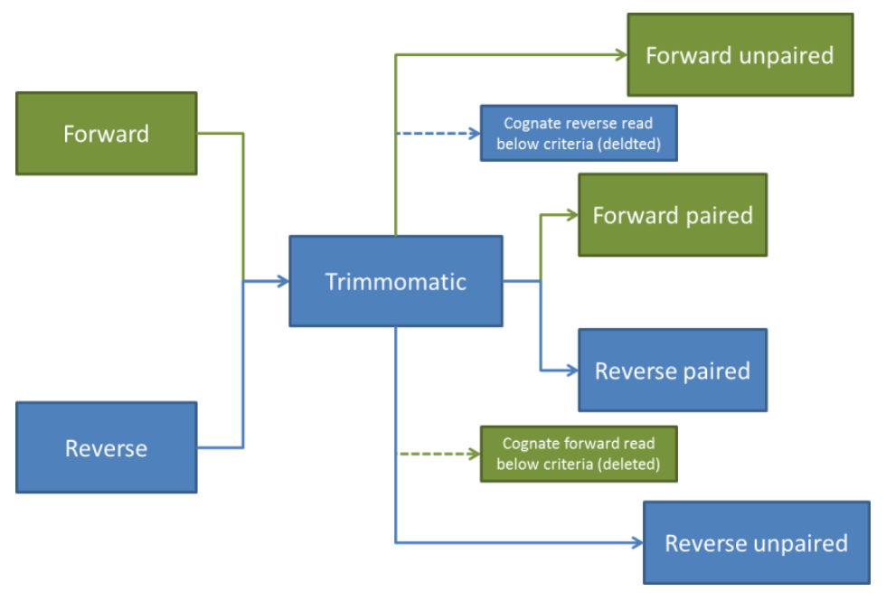{width=50%}

In paired-end mode bekijkt Trimmomatic naar twee bestanden: forward- en reverse reads. Als zowel de forward als de reverse read voldoen aan de eisen, worden ze behouden als paired reads. Als slechts een van de reads niet voeldoet aan de eisen, wordt die ene read laten vallen en de overlevende read als unpaired read bewaard. Na het trimmen geeft Trimmomatic 4 outputs: forward_paired, forward_unpaired, reverse_paired, reverse_unpaired.

Trimmomatic heeft ook een selectie aan opties die gebruikt kunnen worden bij het trimmen. De opties die gebruikt kunnen worden zijn als volgt:

| ILLUMINACLIP  | Verwijdert adapters en andere Illumina-specifieke sequenties van een read                                                                                                                |
|---------------|------------------------------------------------------------------------------------------------------------------------------------------------------------------------------------------|
| SLIDINGWINDOW | Voert een sliding window aanpak uit. Het begint met scannen aan de 5'kant. Als de gemiddelde kwaliteit binnen het vlak minder is dan de aangegeven kwaliteit wordt de read laten vallen  |
| MAXINFO       | Een trimmer die de lengte en het foutenpercentage in evenwicht houdt                                                                                                                     |
| LEADING       | Verwijdert basen aan het begin van de read als deze onder de gegeven kwaliteit is                                                                                                        |
| TRAILING      | Verwijdert basen aan het eind van de read als deze onder de gegeven kwaliteit is                                                                                                         |
| CROP          | Snijdt de read tot de gegeven lengte door basen aan het eind van de read te verwijderen                                                                                                  |
| HEADCROP      | Snijdt de read tot de gegeven lengte door basen te verwijderen aan het begin van een read                                                                                                |
| MINLEN        | Laat de read vallen als die onder de gegeven lengte zit                                                                                                                                  |
| AVGQUAL       | Laat de read vallen als de gemiddelde kwaliteit onder de gegeven hoeveelheid zit                                                                                                         |
| TOPHRED33     | Converteert de kwaliteitsscores naar Phred-33                                                                                                                                            |
| TOPHRED64     | Converteert de kwaliteitsscores naar Phred-64                                                                                                                                            |
<small> *Figuur 24: Opties Trimmomatic* </small>

De opties die wij hebben gebruikt zijn:  MINLEN:40 en SLIDINGWINDOW 4:20. Deze opties hebben wij gebruikt, omdat het de standaard opties zijn van Trimmomatic. Eerst hadden wij ook HEADCROP:10 gebruikt, omdat wij dachten dat het positief effect zou hebben op de data. Uitendelijk hebben wij die niet gebruikt, omdat het geen effect had op de data. Het script dat Ivar en ik hebben geschreven ziet er als volgt uit:

```{bash, eval=FALSE}
cat data/GSE149995_Sra_RunInfo.csv | \
  parallel 'TrimmomaticPE -threads 16 ' \
                  '/students/2024-2025/Thema05/3dconformatieChromatine/fastq/{}.fastq.gz ' \
                  '/students/2024-2025/Thema05/3dconformatieChromatine/fastq-trimmed/{}.trimmed.fastq.gz ' \
                  'ILLUMINACLIP:/students/2024-2025/Thema05/3dconformatieChromatineTrimmomatic/adapters/TruSeq3-SE.fa:2:30:10 ' \
                  'MINLEN:40 ' \
                  'SLIDINGWINDOW:4:20'
```

Als input geven wij Trimmomatic 2 bestanden: de forward- en de reverse-reads. Wij geven 2 input bestanden, omdat onze data paired-end data is. Als ouptput geeft Trimmomatic 4 .fastq bestanden: forward_paired, forward_unpaired, reverse_paired, reverse_unpaired. De ILLUMINACLIP geeft het pad aan naar een betand dat adapter sequenties bevat voor Illumina adapters.

\
\

# Week 3 | Mapping & Variant Calling


## Data Verwijderen
##### 23-39-2024

Na overleg hebben wij besloten om samples SRR26980527, SRR26980528, SRR26980529 en SRR26980530 verder niet meer te gebruiken. Deze bestanden bevatten wild type data. Deze gaan wij niet gebruiken, omdat wij alles vergelijken met een referentiegenoom en niet met de wild type data. Verder werken wij alleen nog met samples SRR26980549, SRR26980550, SRR26980551 en SRR26980552. Deze samples bevatten Rag2(-/-) knockout data.


## Kwaliteitscontrole Getrimde Data

Na het trimmen van de .fastq bestanden van onze genomics data gaan wij overnieuw kijken naar de kwaliteit ervan. Aan de hand daarvan gaan beslissen wij of wij verder gaan, of overnieuw willen trimmen. Hiervoor hebben wij overnieuw FastQC gebruikt om rapporten te maken van de trimmomatic output en MultiQC om de rapporten samen te voegen tot één rapport.

### Algemene statistieken

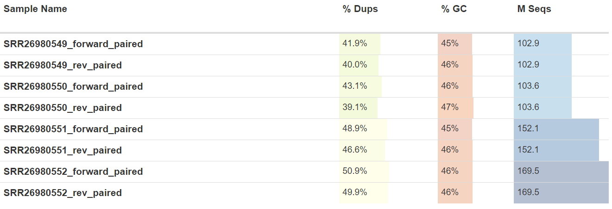{width=75%}

Hierboven zie je een tabel met de algemene statistieken van de getrimmde data. Het de GC% liggen met ongeveer 2% uit elkaar. Dit kan liggen aan het type cell waar de sample uit is genomen en hoeft geen probleem te zijn. Er valt verder niets op wat enige aandacht nodig heeft.

### Gemiddelde Kwaliteit

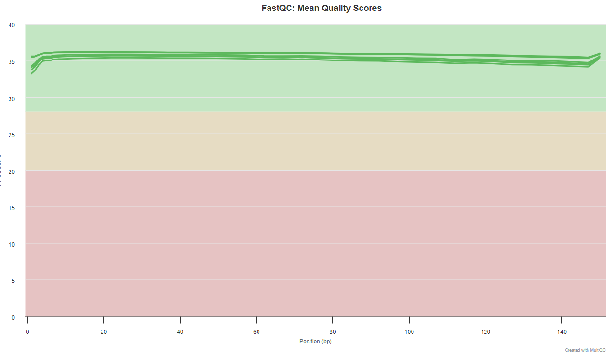{width=75%}

Hierboven zie je de gemiddelde kwaliteit per bp van de getrimde data. Wat opvalt is dat alle lijntjes zich ten aller tijden binnen het groene vlak bevinden. Dat betekent dat de gemiddelde kwaliteit per base goed is. Wel is er een kleine dip in kwaliteit in het begin, maar dat is te verklaren met phasing, wat ik eerder in dit logboek heb uitgelegd.

### Lengteverdeling

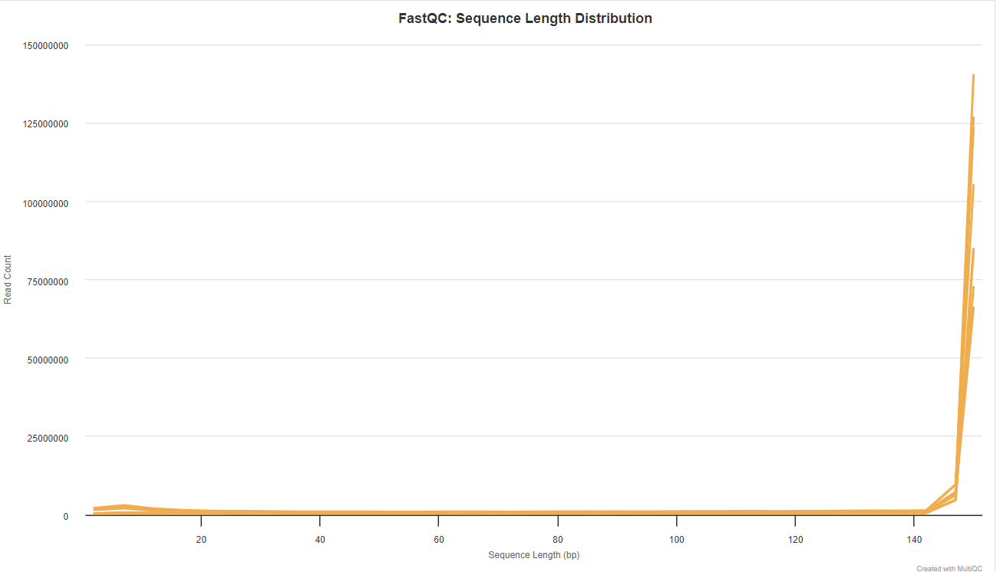{width=75%}

Hier is een grafiek te zien met de lengteverdeling van de reads uit de getrimde data. Wat opvalt, is de piek in het begin van de grafiek. Dit zou onmogelijk moeten zijn, omdat wij Trimmomatic een minimumlengte van 40 basen gaven. Trimmomatic leverde ook geen fout op, dus zou er wellicht een bug in het programma zitten. Verder valt er niets op aan deze grafiek.

### Overrepresentatieve sequenties

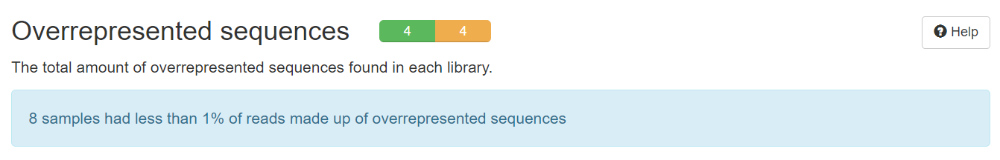{width=75%}

Hierboven zie je gegevens van overrepresentatieve sequenties in de getrimde bestanden. Zoals te zien is geeft dit onderdeel geen grafiek weer, maar wel 4 waarschuwingen. Die zijn makkelijk te bekijken. 

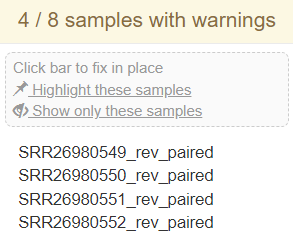{width=20%}

Uit de details van de waarschuwing is te zien dat de bestanden die de waarschuwing opleveren de reverse_paired bestanden zijn. Dit is vreemd en moet beter bekeken worden. Om de overrepresentatieve sequenties te zien kunnen we de aparte FastQC rapporten bekijken.

\

**SRR26980549_rev_paired**

|                      Sequence                      |  Count |      Percentage     | Possible Source |
|:--------------------------------------------------:|:------:|:-------------------:|:---------------:|
| GGGGGGGGGGGGGGGGGGGGGGGGGGGGGGGGGGGGGGGGGGGGGGGGGG | 183150 | 0.47417178641883984 | No Hit          |
| GGG                                                | 38838  | 0.10055082632233088 | No Hit          |
<small> *Figuur 30: Overrepresentatieve sequenties SRR26980549_rev_paired* </small>

\

**SRR26980550_rev_paired**

|                      Sequence                      |  Count |      Percentage     | Possible Source |
|:--------------------------------------------------:|:------:|:-------------------:|:---------------:|
| GGGGGGGGGGGGGGGGGGGGGGGGGGGGGGGGGGGGGGGGGGGGGGGGGG | 633063 | 0.6110172884855628  | No Hit          |
| GGG                                                | 120770 | 0.11656431971289022 | No Hit          |
| GG                                                 | 114301 | 0.11032059540865334 | No Hit          |
| GGGG                                               | 108451 | 0.10467431512116135 | No Hit          |
<small> *Figuur 31: Overrepresentatieve sequenties SRR26980550_rev_paired* </small>

\

**SRR26980551_rev_paired**

|                      Sequence                      |  Count |     Percentage     | Possible Source |
|:--------------------------------------------------:|:------:|:------------------:|:---------------:|
| GGGGGGGGGGGGGGGGGGGGGGGGGGGGGGGGGGGGGGGGGGGGGGGGGG | 795209 | 0.5228980941145684 | No Hit          |
<small> *Figuur 32: Overrepresentatieve sequenties SRR26980551_rev_paired* </small>

\

**SRR26980552_rev_paired**

|                      Sequence                      |  Count |      Percentage     | Possible Source |
|:--------------------------------------------------:|:------:|:-------------------:|:---------------:|
| GGGGGGGGGGGGGGGGGGGGGGGGGGGGGGGGGGGGGGGGGGGGGGGGGG | 664057 | 0.39178659233744184 | No Hit          |
<small> *Figuur 33: Overrepresentatieve sequenties SRR26980552_rev_paired* </small>

\

Hierboven zijn 4 tabellen te zien van de overrepresentatieve sequenties in de reverse_paired bestanden. Wat opvalt is dat alle overrepresentatieve sequenties uit alleen maar G's bestaan en van verschillende lengtes zijn. Waar deze sequenties vandaan komen is onbekend, dus gaan wij deze sequenties invoeren op ncbi BLAST.

#### BLAST Resultaten

Bij het blasten van de overrepresentatieve sequenties uit de reverse_paired bestanden. Gebruikten wij dezelfde instellingen als vorige keer:

* Core nucleotide database
* Genoom mus musculus (taxid:10090)

Na het invoeren van deze instellingen begonnen wij met de blast. Dit was de uitkomst:

{width=75%}

Zoals hierboven te zien is, kan ncbi BLAST de gegeven sequenties niet vinden. Na deze resultaten hebben wij een google search gedaan naar deze sequentie, maar wij kregen geen duidelijkheid over waar deze vandaan komt. Na erover nadenken hebben wij geconcludeerd dat dit wellicht een mechanische fout is.

### Conclusie kwaliteitscontrole getrimde data

Na het bekijken van de output van Trimmomatic hebben wij geconcludeerd dat deze data van voldoende kwaliteit is en wij verder gaan gebruiken in het onderzoek. Het enige wat opvalt aan de getrimde data zijn de overrepresentatieve sequenties waarvan wij niet kunnen achterhalen waar ze vandaan komen, maar wij verwachten dat die niet in onze weg gaan zitten.


## Mappen & Alignen Getrimde Data

Na het trimmen van de data heeft Floris BWA-mem2 overnieuw uitgevoerd op de output data van Trimmomatic. Hiervoor is het referentiegenoom dat eerder geïndexeerd was (GCF_000001635.27) overnieuw gebruikt.

*Dit script is geschreven door Floris*
```{bash, eval=FALSE}
cat /students/2024-2025/Thema05/3dconformatieChromatine/SRA/SraAccList.csv | parallel '/students/2024-2025/Thema05/3dconformatieChromatine/bwa_mem2/bwa-mem2-2.2.1_x64-linux/bwa-mem2 mem -t 50 testnaam /students/2024-2025/Thema05/3dconformatieChromatine/Trimmomatic_output/paired/{}_forward_paired.fastq /students/2024-2025/Thema05/3dconformatieChromatine/Trimmomatic_output/paired/{}_rev_paired.fastq > /students/2024-2025/Thema05/3dconformatieChromatine/mapping/{}.sam' &
```

Na het uitvoeren van het alignen hebben wij .SAM bestanden gekregen. Dit bestand bevat een header met alignments opgeslagen tegen het referentie genoom. Deze bestanden zijn echter niet georderd op positie in het genoom. Daarvoor moeten ze eerst omgezet worden naar een .BAM bestand. Hiervoor gebruiken wij Samtools.

Met samtools sort -n worden de .sam bestanden gesorteerd op read naam. Daarbij verandert de extensie van het bestand van .SAM naar .BAM. Met -O wordt het formaat aangegeven.

*Dit script is geschreven door Floris*
```{bash, eval=FALSE}
# Voor een enkel sample:
samtools sort -@40 -n -O BAM -o aligned_sorted_SRR26980549.bam aligned_SRR26980549.sam

# Met parallel:
cat /students/2024-2025/Thema05/3dconformatieChromatine/SRA/SraAccList.csv | parallel 'samtools sort -@40 -n -O BAM -o samtools_output/aligned_sorted_{}.bam BWA_aligned_output/aligned_{}.sam ' &

```

Met fixmate -m worden score tags toegevoegd die gebruikt worden door markdup om de beste reads te selecteren. Die worden behouden.

*Dit script is geschreven door Floris*
```{bash, eval=FALSE}
# Voor een enkel sample:
samtools fixmate -m --threads 40 aligned_sorted_SRR26980549.bam \ fixed_mates_aligned_sorted_SRR26980549.bam

# Met parallel:
cat /students/2024-2025/Thema05/3dconformatieChromatine/SRA/SraAccList.csv | parallel 'samtools fixmate -m --threads 40 samtools_output/aligned_sorted_{}.bam samtools_output/fixed_mates_aligned_sorted_{}.bam' &


```

Na het sorteren van de .SAM bestanden op naam, worden ze gesorteerd op coördinaten. Dit wordt ook gedaan met samtools.

*Dit script is geschreven door Floris*
```{bash, eval=FALSE}
# Voor een enkel sample:
samtools sort -@80 -o sorted_coordinates_SRR26980549.bam \ fixed_mates_aligned_sorted_SRR26980549.bam

# Met parallel:
cat /students/2024-2025/Thema05/3dconformatieChromatine/SRA/SraAccList.csv | parallel 'samtools sort -@80 -o samtools_output/sorted_coordinates_{}.bam samtools_output/fixed_mates_aligned_sorted_{}.bam' &
```

Vervolgens worden de duplicaten uit de .BAM bestanden hieruit gemarkeerd. Met -r worden de duplicated verwijderd en met -s krijgen wij statistieken over de data.

*Dit script is geschreven door Floris*
```{bash, eval=FALSE}
# Voor een enkel sample:
samtools markdup -r -s sorted_coordinates_SRR26980549.bam dedup_SRR26980549.bam

# Met parallel:
cat /students/2024-2025/Thema05/3dconformatieChromatine/SRA/SraAccList.csv | parallel  'samtools markdup -@80 -r -s samtools_output/sorted_coordinates_{}.bam samtools_output/dedup_{}.bam' &
```

Met samtools index wordt er een index besand gemaakt, dit is in de vorm van een .bai index.

*Dit script is geschreven door Floris*
```{bash, eval=FALSE}
# Voor een enkel sample:
samtools index -@80 dedup_SRR26980549.bam dedup_SRR26980549.bai  &

# Met parallel:
cat /students/2024-2025/Thema05/3dconformatieChromatine/SRA/SraAccList.csv | parallel 'samtools index -@80 samtools_output/dedup_{}.bam samtools_output/dedup_{}.bai' &

```

Voor een duidelijker en uitgebreider uitleg over deze stap, kan je in het logboek van Floris kijken.


## Variant Calling

Met de gemapte reads verkregen uit samtools kunnen wij beginnen met variant calling. Met variant calling kunnen verschillende mutaties of varianten gedetecteert worden. Dit is te doen door de Intergrated Genome Browser (IGV) te gebruiken, maar dit duurt lang en er zijn betere manieren om dit te doen. 

Voor variant calling, wordt freebayes gebruikt. Freebayes is een genetische varianten detector gemaakt om kleine veranderingen, zoals inserties of deleties, te herkennen.

*Dit script is geschreven door Floris*
```{bash freebayes_test, eval=FALSE}
/students/2024-2025/Thema05/3dconformatieChromatine/freebayes/freebayes-1.3.6-linux-amd64-static -f GCA_000001635.9_GRCm39_genomic.fna \ /students/2024-2025/Thema05/3dconformatieChromatine/aligned_sorted_SRR26980549.bam > \ /students/2024-2025/Thema05/3dconformatieChromatine/variant_calling/SRR26980549_test.vcf
```

In het script hierboven staat een script dat werd gebruikt om freebayes te testen. Hieruit kregen wij de gewenste .vcf bestanden met de varianten en mutaties, maar wij willen ze ook filteren op kwaliteit.


## Filteren Varianten

Om met enige zekerheid te kunnen zeggen dat er ergens een variant zit, moeten wij de data die wij kregen uit het variant calling filteren. Om dit te doen, wordt vcfilter gebruikt. Met vcfilter kan een gebruiker VCF-bestanden filteren. Bijvoorbeeld op sample diepte en/of totale diepte. Het kan ook worden gebruikt om de referentie calls en/of het minimumaantal sample passages uit te filteren.

Met --minQualScore wordt gefilterd op de waarschijnlijkheid dat de variant er daadwerkelijk is. Ervoor gekozen is om een score van 30 te gebruiken. Een score van 30 zou betekenen dat er met 99.999% zekerheid een variant zit.

*Dit script is geschreven door Floris*
```{bash, eval=FALSE}
cat /students/2024-2025/Thema05/3dconformatieChromatine/SRA/SraAccList.csv | parallel 'java -jar /students/2024-2025/Thema05/3dconformatieChromatine/vcffilter/vcffilter-assembly-0.2.jar -I variant_calling/variants{}.vcf --minQualScore 30 --outputVcf variant_calling/filterd_variant_{}.vcf'
```


## Variant Annotation

Na het variant calling hebben wij nu bestanden die het verschil tussen onze samples en het gebruikt referentiegenoom (mm39) aantoont. 

Om verdere vragen te kunnen beantwoorden, zoals "Zit een mutatie op een exon?", moeten wij de verkregen .vcf bestanden annoteren. Hiervoor is SnpEff gebruikt. Met SnpEff kunnen onze .vcf bestanden met een referentiedatabase geannoteerd worden. Hierbij worden genen geannoteerd zodat ze leesbaarder zijn. Zo wordt gen SRR26980549.46263152/2 naar Ebf1 veranderd. 

Om de .vcf bestanden te annoteren heeft Floris dit script geschreven:

```{bash, eval=FALSE}
# Test:
/students/2024-2025/Thema05/3dconformatieChromatine/snpEff/snpEff.jar mm39 filtered_variants.vcf > annotated_variants.vcf

# Voor alle .vcf bestanden:
cat /students/2024-2025/Thema05/3dconformatieChromatine/SRA/SraAccList.csv | parallel 'java -jar \ /students/2024-2025/Thema05/3dconformatieChromatine/snpEff/snpEff.jar mm39 /students/2024-2025/Thema05/3dconformatieChromatine/variant_calling/filterd_variant_{}.vcf > /students/2024-2025/Thema05/3dconformatieChromatine/annotated_variants_{}.vcf'

# Alleen het isec .vcf bestand:
java -jar /students/2024-2025/Thema05/3dconformatieChromatine/snpEff/snpEff/snpEff.jar mm39 /students/2024-2025/Thema05/3dconformatieChromatine/variant_calling/isec.vcf > /students/2024-2025/Thema05/3dconformatieChromatine/annotated_isec.vcf

```

Bij het annoteren van de .vcf bestanden hebben wij het genoom mm39 aangegeven. Hierbij gaf SnpEff een foutmelding waarbij het programma genoom mm39 niet kan downloaden. Dit komt door de sourceforge van de databases. De laatste versie komt uit 2018, voordat genoom mm39 bestond. Om dit op te lossen kunnen wij genoom mm10 gebruikten, die verouderd is vergeleken met mm39, of zelf een database bouwen voor SnpEff. Uiteindelijk hebben wij ervoor gekozen om een database te downloaden, omdat wij voor alle voorgaande stappen ook mm39 hebben gebruikt. 

### Database Bouwen SnpEff

Om de database voor genoom mm39 te bouwen zijn de instructies van de SnpEff website gevolgd: <https://pcingola.github.io/SnpEff/snpeff/build_db/>

*Dit script is geschreven door Floris*
```{bash, eval=FALSE}
# Navigeer naar de directory waar de databases opgeslagen worden. 
cd snpEff/snpEff/data/

# Download het .gff bestand:
wget https://ftp.ncbi.nlm.nih.gov/genomes/all/GCF/000/001/635/GCF_000001635.27_GRCm39/GCF_000001635.27_GRCm39_genomic.gff.gz

```

Met het script hierboven is een database voor SnpEff gemaakt. Met deze database kunnen wij verder met het annoteren van onze .vcf bestanden verkregen bij het variant calling.

Bij het proces van het maken van de database zijn een aantal problemen geweest. Om die te zien, kan je in het logboek van Floris kijken.

### Hernoemen Chromosomen

De namen van de chromosomen uit onze .vcf bestanden staan in de Genebank namen, terwijl SnpEff RefSeq namen verwacht. Om de namen te veranderen van de Genebank naar de RefSeq namen, hebben wij bcftools gebruikt. Om bcftools te gebruiken moeten de bestanden eerst gecompresserc worden met bgzip:

*Dit script is geschreven door Floris*
```{bash gzip, eval=FALSE}
bgzip -c /students/2024-2025/Thema05/3dconformatieChromatine/variant_calling/isec.vcf > /students/2024-2025/Thema05/3dconformatieChromatine/variant_calling/isec.vcf.gz

```

Na het compresseren van de .vcf bestanden kunnen wij de .vcf bestanden indexeren en met bcftools de chromosoomnamen veranderen naar de RefSeq namen.

*Dit script is geschreven door Floris*
```{bash, eval=FALSE}
tabix -p vcf /students/2024-2025/Thema05/3dconformatieChromatine/variant_calling/isec.vcf.gz
```

*Dit script is geschreven door Floris*
```{bash, eval=FALSE}
cat /students/2024-2025/Thema05/3dconformatieChromatine/SRA/SraAccList.csv | parallel \
'bcftools annotate --rename-chrs /students/2024-2025/Thema05/3dconformatieChromatine/variant_calling/names.txt /students/2024-2025/Thema05/3dconformatieChromatine/variant_calling/filterd_variant_{}.vcf.gz > /students/2024-2025/Thema05/3dconformatieChromatine/variant_calling/hernoemd_{}.vcf'
```

Nu de chromosoomnamen naar de RefSeq namen zijn veranderd kunnen wij verder met het annoteren van de .vcf bestanden.

### Annoteren .vcf bestanden

*Dit script is geschreven door Floris*
```{bash, eval=FALSE}
java -jar /students/2024-2025/Thema05/3dconformatieChromatine/snpEff/snpEff/snpEff.jar -v -stats /students/2024-2025/Thema05/3dconformatieChromatine/variant_calling/SRR26980549_annotatie.html mm39 /students/2024-2025/Thema05/3dconformatieChromatine/variant_calling/hernoemd_SRR26980549.vcf > /students/2024-2025/Thema05/3dconformatieChromatine/annotated_SRR26980549.vcf

```

*Dit script is geschreven door Floris*
```{bash, eval=FALSE}
cat /students/2024-2025/Thema05/3dconformatieChromatine/SRA/SraAccList.csv | parallel \
'java -Xmx80G -jar /students/2024-2025/Thema05/3dconformatieChromatine/snpEff/snpEff/snpEff.jar -v -stats /students/2024-2025/Thema05/3dconformatieChromatine/variant_calling/{}_annotatie.html mm39 /students/2024-2025/Thema05/3dconformatieChromatine/variant_calling/hernoemd_{}.vcf -threads 50 > /students/2024-2025/Thema05/3dconformatieChromatine/variant_calling/annotated_{}.vcf'

```

Hierboven staan de scripts gebruikt voor het annoteren van de .vcf bestanden. Hierbij worden ook .html bestanden gegenereerd met statistieken over de annotatie.

Nu we de geannoteerde .vcf bestanden hebben, kunnen wij er verdere analyses op uitvoeren.

\
\

# Week 4 | Variant Filtering & Visualisatie

## Filteren .vcf op .bed

Variant filtering is een stap die bestaat uit het identificeren van zeer betrouwbare varianten en het verwijderen van varianten die incorrect worden aangeroepen. De variant filtering werd vroeger meestal buiten beschouwing gelaten bij diepere tests, ook al is aangetoond dat deze de nauwkeurigheid van variantoproepen aanzienlijk verbetert.

Er zijn verschillende factoren waarop varianten gefilterd worden, zoals betrouwbaarheid of gelijkenis. Op deze factoren kunnen gefilterd worden om verschillende vragen te beantwoorden, zoals "Welke varianten worden gedeeld over verschillende samples". Deze vraag ga ik beantwoorden door de varianten te filteren op gelijkenis, met doel om alleen de varianten over te houden die alle 4 van onze samples delen. Hiervoor heb ik r gebruikt, omdat r een goed programma is om data in te bekijken en bewerken. Ook omdat ik enige ervaring heb in r.

Om deze taak te kunnen voltooien heb ik gebruik gemaakt van de library GenomicRanges. Dit is een library die behoort tot de bioconductor biblioheek. Met GenomicRanges kan een class gemaakt worden die ranges van coördinaten op en genomische schaal bevatten. Ook bevat de library methoden om GenomicRanges te verwerken.

Hieronder staat de code die geschreven is voor het filteren van een enkel bestand:

```{r}
# lees het .vcf bestand in
variants49 <- read.delim("/students/2024-2025/Thema05/3dconformatieChromatine/variant_calling/annotated_SRR26980549.vcf",
                       header = TRUE, 
                       # zet de seperator op \t zodat de kolommen juist opgesplitst worden
                       sep = "\t",
                       stringsAsFactors = FALSE,
                       # sla de header over
                       skip = 129)
```

Meestal worden bestanden gesplit op "," of ";", maar de opmaak van vcf v4.2 is zo opgezet dat je op "\t" moet splitsen voor de info over ranges, en ";" voor extra informatie.

Hier een klein voorbeeld van de twee seperators op een .vcf bestand:

---

```{r, eval=TRUE}
# lees het .vcf bestand in
variants_demo <- read.delim("Data/variant_filter_demo.vcf",
                       header = TRUE, 
                       # zet de seperator op \t zodat de kolommen juist opgesplitst worden
                       sep = "\t",
                       stringsAsFactors = FALSE,
                       # sla de header over
                       skip = 129)

# laat alleen de eerste 10 regels van het bestand zien
head(variants_demo[1:7], n=10)
```

---

Hierboven zie je de vorm van een .vcf (V4.2) bestand gesplit op "/t". Er zijn 8 verschillende kolommen die belangrijk kunnen zijn bij het filteren. Hieronder een tabel waarin staat wat de kolommen betekenen:

| Kolom   | Informatie                                                                                                                                                                                                                     |
|---------|--------------------------------------------------------------------------------------------------------------------------------------------------------------------------------------------------------------------------------|
| X.CHROM | De naam van de sequentie (meestal een chromosoom) waarop de variant wordt aangeroepen. Deze sequentie staat gewoonlijk bekend als 'de referentiesequentie', dat wil zeggen de sequentie waartegen het gegeven sample varieert. |
| POS     | De positie van de variatie op de gegeven sequentie.                                                                                                                                                                            |
| REF     | De referentiebasis (of basen in het geval van een indel) op de gegeven positie op de gegeven referentie sequentie.                                                                                                             |
| ALT     | De lijst met alternatieve allelen op deze positie.                                                                                                                                                                             |
| ID      | De identificatie van de variant, bijvoorbeeld een dbSNP rs-identificator, of, indien onbekend, een ".". Meerdere ID's worden gesplit op ";".                                                                                   |
| QUAL    | Een kwaliteitsscore die verband houdt met de gevolgtrekking van de gegeven allelen.                                                                                                                                            |
| FILTER  | Een flag die aangeeft welke van een bepaalde set filters de variatie heeft gefaald of PASS als alle filters met succes zijn geslaagd.                                                                                          |
| INFO    | Een uitbreidbare lijst met key-value pairs (velden) die de variatie beschrijven. Meerdere velden worden gescheiden door puntkomma's met optionele waarden in de notatie: <key>=<data>[,data].                                  |
<small> *Figuur 35: Uitleg kolommen .vcf bestand* </small>

Met de informatie uit deze kolommen kan je een GRange object maken. Daarom heb ik "/t" als seperator gebruikt.

\

Ook is ";" te gebruiken als seperator. Hierdoor krijg je de kolommen met overige informatie te zien. 

---

```{r, eval=TRUE}
# lees het .vcf bestand in
variants_demo_slecht <- read.delim("Data/variant_filter_demo.vcf",
                       header = FALSE, 
                       # zet de seperator op ; zodat de kolommen onjuist opgesplitst worden
                       sep = ";",
                       stringsAsFactors = FALSE,
                       # sla de header over
                       skip = 129)

# laat alleen de eerste 10 regels van het bestand zien
head(variants_demo_slecht[1:12], n=10)
```

---

Zoals je kan zien, zijn er heel veel kolommen aan overige informatie. Hiermee zijn verschillende dingen te bereiken, bijvoorbeeld filteren van varianten op berouwbaarheid door de allelfrequentie te gebruiken. Het filteren op betrouwbaarheid zijn in deze .vcf bestanden al gedaan, dus zijn deze kolommen verder niet meer nodig.

Na het inladen van de data, maak een GRange object van de .vcf bestanden. Dat doe ik door het eerst in een IRange object te veranderen. Dat doe ik door de positie die in de POS kolom van elk .vcf bestand mee te geven aan zowel de start als end parameter. Wanneer het in een Irange object verandert, kan je de begin- en eindranges zien van de rijen in het bestand. Dat ziet er zo uit:

---

```{r, eval=TRUE}
# maak een IRanges object van de .vcf data
variants_demo_ranges <- IRanges(start = variants_demo$POS,
                  end = variants_demo$POS,)

variants_demo_ranges
```

---

Om meer informatie te krijgen, zoals gennaam of locatie (chromosoom), moeten we het IRanges object veranderen in een GRanges object. Hierbij zijn niet allen de ranges, net zoals bij een IRanges object, te zien, maar ook de naam van het gen waar de ranges bij horen en op welk chromosoom het zit. Dat ziet er zo uit:

---

```{r, eval=TRUE}
# maak een GRanges object van de .vcf data
variants_demo_granges <- GRanges(seqnames = variants_demo$X.CHROM,
                   ranges = variants_demo_ranges)

variants_demo_granges
```

---

Hieronder maak ik IRanges en GRanges in een chunk, omdat ik de IRanges niet apart nodig heb voor iets anders.

```{r}
# maak een IRanges object van de .vcf data
variants49_ranges <- IRanges(start = variants49$POS,
                  end = variants49$POS,)

# maak een GRanges object van de .vcf data
variant49_granges <- GRanges(seqnames = variants49$X.CHROM,
                   ranges = variants49_ranges)
```

Nu we de GRanges van het .vcf bestand hebben, doen we hetzelfde voor het .bed bestand. Met de GRanges van beide bestanden kunnen we ze later vergelijken.

```{r}
# lees het .bed bestand in
bed49 <- read.delim("/students/2024-2025/Thema05/3dconformatieChromatine/samtools_output/dedeup_SRR26980549.bed", 
                       header = FALSE, 
                       stringsAsFactors = FALSE, 
                       col.names = c("ID", "Begin", "End", "File", "Count", "Strand"))
```

```{r}
# maak een IRanges object van de .bed data
iranges_bed49 <- IRanges(start = bed49$Begin,
                         end = bed49$End)

# maak een GRanges object van de .bed data
granges_bed49 <- GRanges(seqnames = bed49$ID,
                      ranges = iranges_bed49)
```

Nu we beide het .bed en het .vcf bestand in een GRanges object hebben, kunnen we ze met elkaar vergelijken. Hiermee kunnen wij kijken welke varianten in beide bestanden zitten. Varianten die niet in beide bestanden zitten worden eruit gefilterd, omdat die niet gedeeld worden door alle 4 de samples. Hier maak ik gebruik van findOverlaps() om overlappende varianten tussen het .bed en .vcf bestand te vinden. Hieruit krijgen we een dataframe met regels uit de bestanden die met elkaar overlappen. Met deze regels 

```{r}
# zoekt naar overlappende granges tussen de .vcf en .bed bestanden
overlaps49 <- data.frame(findOverlaps(variant49_granges, granges_bed49))
```

De dataframe verkregen uit de vorige stap bestaat uit twee kolommen: Queryhits en Subjecthits. In de queryhits kolom staan de regelnummers van de overlappende varianten tussen het .vcf en .bed bestand. Met deze regelnummers kunnen wij de varianten gedeeld door alle 4 verschillende samples halen. Dit doen wij door de regels met de overap in een nieuw bestand te schrijven.

```{r}
# pak de kolom met rijnummers van overlappende granges
# tel 130 rijen bij de rijnummers op om de header over te slaan
queryhits49 <- overlaps49$queryHits + 130
```

```{r}
# lees het bestand in als tekst
vcf49_tekst <- readLines("/students/2024-2025/Thema05/3dconformatieChromatine/variant_calling/annotated_SRR26980549.vcf")

# lees alleen de header in
vcf49_header <- readLines("/students/2024-2025/Thema05/3dconformatieChromatine/variant_calling/annotated_SRR26980549.vcf", n=130)
```

Hierboven lees ik het .vcf bestand van sample SRR26980549 in met readLines(). Hier kan ik de overlappende regels uit halen.

```{r}
setwd("/students/2024-2025/Thema05/3dconformatieChromatine/vcf_gedeelde_varianten")
write(vcf49_header, "gefilterd_SRR26980549.vcf")
write(vcf49_tekst, "gefilterd_SRR26980549.vcf", append = TRUE)
```

Hierboven maak ik een nieuw .vcf bestand aan die ik opvul met overlappende regels. De header was opgeslagen in een ander variabel en voeg ik voor de overlappende regels toe aan het nieuw bestand.

Nu hebben we de varianten gedeeld door alle 4 van onze samples in een .vcf bestand. Maar dit moeten wij voor alle bestanden doen. Dit kan door deze stap 4 keer te halen, maar ik heb de code hierboven omgeschreven in een for-loop. Die ziet er zo uit:

```{r}
# maak een lijst met namen
AccList <- list("SRR26980549", "SRR26980550", "SRR26980551", "SRR26980552")
```

```{r}
for (name in AccList){
  
  path_vcf <- paste0("/students/2024-2025/Thema05/3dconformatieChromatine/variant_calling/annotated_", name, ".vcf")
  
  # lees het .vcf bestand in
variants <- read.delim( path_vcf,
                       header = TRUE, 
                       # zet de seperator op \t zodat de kolommen juist opgesplitst worden
                       sep = "\t",
                       stringsAsFactors = FALSE,
                       # sla de header over
                       skip = 129)
  
  # maak een IRanges object van de .vcf data
variants_ranges <- IRanges(start = variants$POS,
                  end = variants$POS,)

# maak een GRanges object van de .vcf data
variant_granges <- GRanges(seqnames = variants$X.CHROM,
                   ranges = variants_ranges)
  
  

path_bed <- paste0("/students/2024-2025/Thema05/3dconformatieChromatine/samtools_output/dedeup_", name, ".bed")

# lees het .bed bestand in
bed <- read.delim(path_bed, 
                       header = FALSE, 
                       stringsAsFactors = FALSE, 
                       col.names = c("ID", "Begin", "End", "File", "Count", "Strand"))
  
  # maak een IRanges object van de .bed data
iranges_bed <- IRanges(start = bed$Begin,
                         end = bed$End)

# maak een GRanges object van de .bed data
granges_bed <- GRanges(seqnames = bed$ID,
                      ranges = iranges_bed)
  
  
  
# zoekt naar overlappende granges tussen de .vcf en .bed bestanden
overlaps <- DataFrame(findOverlaps(variant_granges, granges_bed))

# pak de kolom met rijnummers van overlappende granges
# tel 130 rijen bij de rijnummers op om de header over te slaan
queryhits <- overlaps$queryHits + 130

# lees het bestand in als tekst
vcf_tekst <- readLines(path_vcf)

# lees alleen de header in
vcf_header <- readLines(path_vcf, n=130)


name_output <- paste0("gefilterd_", name, ".vcf")

setwd("/students/2024-2025/Thema05/3dconformatieChromatine/vcf_gedeelde_varianten")
write(vcf_header, name_output)
write(vcf_tekst, name_output, append = TRUE)
}
```

Hierboven zie je de code gebruikt om de gedeelde varianten van onze 4 samples omgeschreven in een for-loop zodat alle 4 de samples in een keer worden bewerkt.

Om ervoor te zorgen dat het proces 4 keer gebeurd en op alle samples, heb ik een lijst aangemaakt met de namen van onze samples. Vervolgens maak ik met het paste0 een pad naar de map waar de .vcf bestanden van onze samples zich bevinden. Bij het naam van het bestand geef ik de naam aan van de lijst, zodat het na elke iteratie van de for-loop verandert. Hiervoor is paste0 handiger dan paste, omdat paste0 geen spaties tussen de verschillende argumenten plaatst. Bij paste ontstaat er wel een witregel tussen de verschillende argumenten, wat ervoor zorgt dat het pad verandert waardoor het .vcf bestand van onze samples niet gevonden kan worden.

Vervolgens verlopen alle stappen precies hetzelfde als de code gebruikt voor 1 sample. Bij het specificeren van de naam van output heb ik ook paste0 gebruikt om de correcte naam van de sample toe te wijzen aan de output .vcf. De namen van de output bestanden zijn: "gefilterd_SRR26980549.vcf", "gefilterd_SRR26980550.vcf", "gefilterd_SRR26980551.vcf", "gefilterd_SRR26980552.vcf".

\
\

# Referenties

MultiQC: Summarize analysis results for multiple tools and samples in a single report
Philip Ewels, Måns Magnusson, Sverker Lundin and Max Käller
Bioinformatics (2016)
doi: 10.1093/bioinformatics/btw354
PMID: 27312411

(MAAK EEN REFERENTIELIJST MET EEN .BIB FILE)